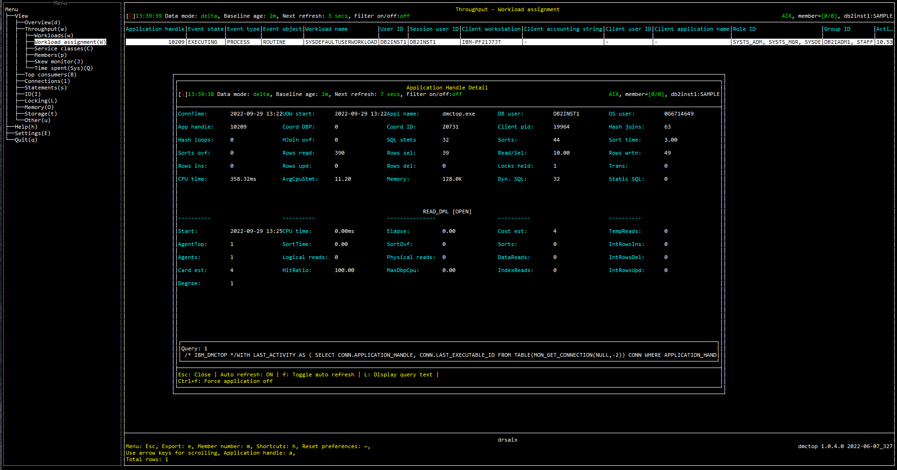
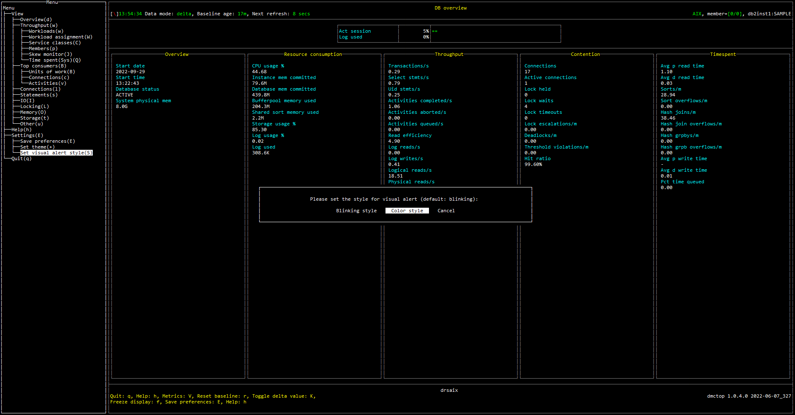
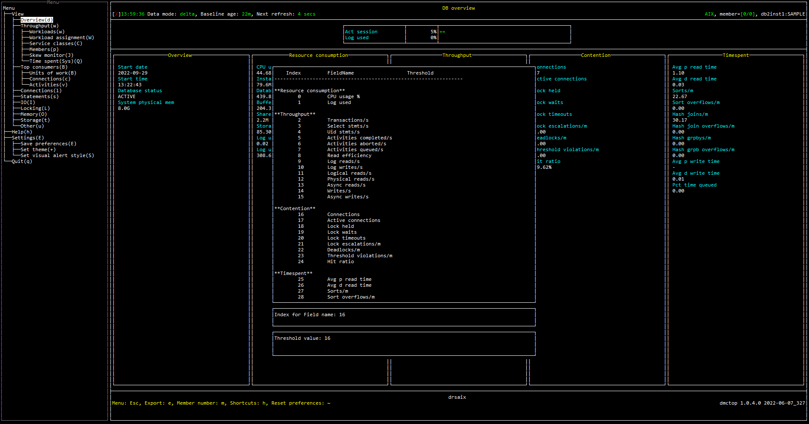
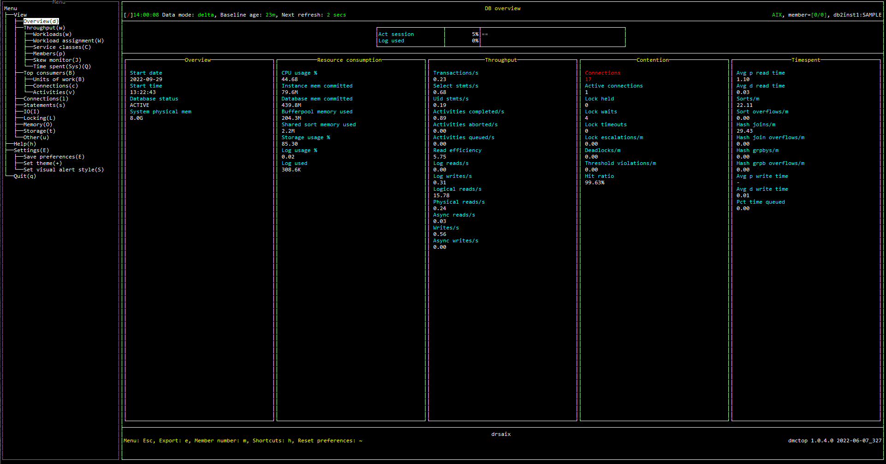

The purpose of dmctop hot key is to provide additional interaction for each view such as filtering row and sorting by columns. 

Hot keys could be different depending on whether the focus is on left or right panel and which view dmctop is currently at. The current available hot keys can be checked by pressing `h`.

# Application handle detail

Application handle detail module is available for all the views that have `Application handle` column in the table. It can be launched either by pressing `a` and input the application handle value or pressing `Enter` to open the page for the highlighted row in the table. This page could be used to check which SQL queries the application is currently running or recently run as well as its performance.

## Screenshot

# Threshold

Thresholds could be used to provide visual alerts. It can be set by pressing `<` and cleared by pressing `CTRL + R`. 

There are two alert styles, blinking style and color style. The default alert style is blinking style but it is not available on Windows system. Therefore, in order to see the alert, for Windows the style needs to be change to color style. 

## Screenshot

