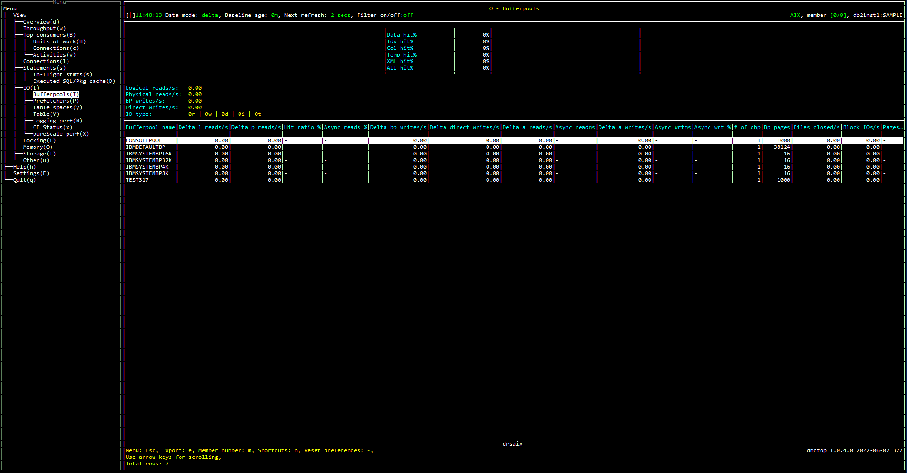

# Purpose

Buffer pool hit ratios are one of the most fundamental metrics for measuring database performance.  They provide an important overall measure of how effectively the system is exploiting memory to avoid disk IO.  This view shows hit ratios for all buffer pools and for various data types.


# Screenshot


# Metric shown

## Gauge


<hr />

### Data hit%

Data page hit ratio. [Formulas for calculating buffer pool hit ratios](https://www.ibm.com/docs/en/db2/11.5?topic=management-formulas-calculating-buffer-pool-hit-ratios)

= DATA_HIT_NUMERATOR / DATA_HIT_DENOMINATOR 

**Source:** 

DATA_HIT_NUMERATOR = [MON_GET_BUFFERPOOL](https://www.ibm.com/docs/en/db2/11.5?topic=functions-mon-get-bufferpool-get-buffer-pool-metrics)(NULL, #MEMBER#).SUM([POOL_DATA_LBP_PAGES_FOUND](https://www.ibm.com/docs/en/db2/11.5?topic=reference-p#r0056487) - [POOL_ASYNC_DATA_LBP_PAGES_FOUND](https://www.ibm.com/docs/en/db2/11.5?topic=reference-p#r0056493))

DATA_HIT_DENOMINATOR = [MON_GET_BUFFERPOOL](https://www.ibm.com/docs/en/db2/11.5?topic=functions-mon-get-bufferpool-get-buffer-pool-metrics)(NULL, #MEMBER#).SUM([POOL_DATA_L_READS](https://www.ibm.com/docs/en/db2/11.5?topic=reference-p#r0001235) + [POOL_TEMP_DATA_L_READS](https://www.ibm.com/docs/en/db2/11.5?topic=reference-p#r0011302))


<hr />

### Idx hit%

Index page hit ratio. [Formulas for calculating buffer pool hit ratios](https://www.ibm.com/docs/en/db2/11.5?topic=management-formulas-calculating-buffer-pool-hit-ratios)


= IDX_HIT_NUMERATOR / IDX_HIT_DENOMINATOR 

**Source:** 

IDX_HIT_NUMERATOR = [MON_GET_BUFFERPOOL](https://www.ibm.com/docs/en/db2/11.5?topic=functions-mon-get-bufferpool-get-buffer-pool-metrics)(NULL, #MEMBER#).SUM([POOL_INDEX_LBP_PAGES_FOUND](https://www.ibm.com/docs/en/db2/11.5?topic=reference-p#r0056243) - [POOL_ASYNC_INDEX_LBP_PAGES_FOUND](https://www.ibm.com/docs/en/db2/11.5?topic=reference-p#r0056496))

IDX_HIT_DENOMINATOR = [MON_GET_BUFFERPOOL](https://www.ibm.com/docs/en/db2/11.5?topic=functions-mon-get-bufferpool-get-buffer-pool-metrics)(NULL, #MEMBER#).SUM([POOL_INDEX_L_READS](https://www.ibm.com/docs/en/db2/11.5?topic=reference-p#r0011303) + [POOL_TEMP_INDEX_L_READS](https://www.ibm.com/docs/en/db2/11.5?topic=reference-p#r0011303))


<hr />

### Col hit%

Column-organized page hit ratio. [Formulas for calculating buffer pool hit ratios](https://www.ibm.com/docs/en/db2/11.5?topic=management-formulas-calculating-buffer-pool-hit-ratios)


= COL_HIT_NUMERATOR / COL_HIT_DENOMINATOR

**Source:** 

COL_HIT_NUMERATOR = [MON_GET_BUFFERPOOL](https://www.ibm.com/docs/en/db2/11.5?topic=functions-mon-get-bufferpool-get-buffer-pool-metrics)(NULL, #MEMBER#).SUM([POOL_COL_LBP_PAGES_FOUND](https://www.ibm.com/docs/en/db2/11.5?topic=reference-p#r0060857) - [POOL_ASYNC_COL_LBP_PAGES_FOUND](https://www.ibm.com/docs/en/db2/11.5?topic=reference-p#r0060850))

COL_HIT_DENOMINATOR = [MON_GET_BUFFERPOOL](https://www.ibm.com/docs/en/db2/11.5?topic=functions-mon-get-bufferpool-get-buffer-pool-metrics)(NULL, #MEMBER#).SUM([POOL_COL_L_READS](https://www.ibm.com/docs/en/db2/11.5?topic=reference-p#r0060763) + [POOL_TEMP_COL_L_READS](https://www.ibm.com/docs/en/db2/11.5?topic=reference-p#r0060873))


<hr />

### Temp hit%

Page hit ratio in temporary table spaces.

= TEMP_HIT_NUMERATOR / TEMP_HIT_DENOMINATOR

**Source:** 

TEMP_HIT_NUMERATOR = [MON_GET_BUFFERPOOL](https://www.ibm.com/docs/en/db2/11.5?topic=functions-mon-get-bufferpool-get-buffer-pool-metrics)(NULL, #MEMBER#).(SUM([POOL_TEMP_DATA_L_READS](https://www.ibm.com/docs/en/db2/11.5?topic=reference-p#r0011302) + [POOL_TEMP_INDEX_L_READS](https://www.ibm.com/docs/en/db2/11.5?topic=reference-p#r0011303) + [POOL_TEMP_XDA_L_READS](https://www.ibm.com/docs/en/db2/11.5?topic=reference-p#r0022738) + [POOL_TEMP_COL_L_READS](https://www.ibm.com/docs/en/db2/11.5?topic=reference-p#r0060873)))-(SUM([POOL_TEMP_DATA_P_READS](https://www.ibm.com/docs/en/db2/11.5?topic=reference-p#r0011300) + [POOL_TEMP_INDEX_P_READS](https://www.ibm.com/docs/en/db2/11.5?topic=reference-p#r0011301) + [POOL_TEMP_XDA_P_READS](https://www.ibm.com/docs/en/db2/11.5?topic=reference-p#r0022739) + [POOL_TEMP_COL_P_READS](https://www.ibm.com/docs/en/db2/11.5?topic=reference-p#r0060874)))

TEMP_HIT_DENOMINATOR = [MON_GET_BUFFERPOOL](https://www.ibm.com/docs/en/db2/11.5?topic=functions-mon-get-bufferpool-get-buffer-pool-metrics)(NULL, #MEMBER#).SUM([POOL_TEMP_DATA_L_READS](https://www.ibm.com/docs/en/db2/11.5?topic=reference-p#r0011302) + [POOL_TEMP_INDEX_L_READS](https://www.ibm.com/docs/en/db2/11.5?topic=reference-p#r0011303) + [POOL_TEMP_XDA_L_READS](https://www.ibm.com/docs/en/db2/11.5?topic=reference-p#r0022738) + [POOL_TEMP_COL_L_READS](https://www.ibm.com/docs/en/db2/11.5?topic=reference-p#r0060873))


<hr />

### XML hit%

XML storage object (XDA) page hit ratio. [Formulas for calculating buffer pool hit ratios](https://www.ibm.com/docs/en/db2/11.5?topic=management-formulas-calculating-buffer-pool-hit-ratios)


= XDA_HIT_NUMERATOR / XDA_HIT_DENOMINATOR

**Source:** 

XDA_HIT_NUMERATOR = [MON_GET_BUFFERPOOL](https://www.ibm.com/docs/en/db2/11.5?topic=functions-mon-get-bufferpool-get-buffer-pool-metrics)(NULL, #MEMBER#).SUM([POOL_XDA_LBP_PAGES_FOUND](https://www.ibm.com/docs/en/db2/11.5?topic=reference-p#r0058666) - [POOL_ASYNC_XDA_LBP_PAGES_FOUND](https://www.ibm.com/docs/en/db2/11.5?topic=reference-p#r0058670))

XDA_HIT_DENOMINATOR = [MON_GET_BUFFERPOOL](https://www.ibm.com/docs/en/db2/11.5?topic=functions-mon-get-bufferpool-get-buffer-pool-metrics)(NULL, #MEMBER#).SUM([POOL_XDA_L_READS](https://www.ibm.com/docs/en/db2/11.5?topic=reference-p#r0022731) + [POOL_TEMP_XDA_L_READS](https://www.ibm.com/docs/en/db2/11.5?topic=reference-p#r0022738))


<hr />

### All hit%

Overall hit ratio. [Formulas for calculating buffer pool hit ratios](https://www.ibm.com/docs/en/db2/11.5?topic=management-formulas-calculating-buffer-pool-hit-ratios)


= ALL_HIT_RATIO_NUMERATOR / ALL_HIT_RATIO_DENOMINATOR

**Source:** 

ALL_HIT_RATIO_NUMERATOR = [MON_GET_BUFFERPOOL](https://www.ibm.com/docs/en/db2/11.5?topic=functions-mon-get-bufferpool-get-buffer-pool-metrics)(NULL, #MEMBER#).SUM([POOL_DATA_LBP_PAGES_FOUND](https://www.ibm.com/docs/en/db2/11.5?topic=reference-p#r0056487) + [POOL_INDEX_LBP_PAGES_FOUND](https://www.ibm.com/docs/en/db2/11.5?topic=reference-p#r0056243) + [POOL_XDA_LBP_PAGES_FOUND](https://www.ibm.com/docs/en/db2/11.5?topic=reference-p#r0058666) + [POOL_COL_LBP_PAGES_FOUND](https://www.ibm.com/docs/en/db2/11.5?topic=reference-p#r0060857) - [POOL_ASYNC_DATA_LBP_PAGES_FOUND](https://www.ibm.com/docs/en/db2/11.5?topic=reference-p#r0056493) - [POOL_ASYNC_INDEX_LBP_PAGES_FOUND](https://www.ibm.com/docs/en/db2/11.5?topic=reference-p#r0056496) - [POOL_ASYNC_XDA_LBP_PAGES_FOUND](https://www.ibm.com/docs/en/db2/11.5?topic=reference-p#r0058670) - [POOL_ASYNC_COL_LBP_PAGES_FOUND](https://www.ibm.com/docs/en/db2/11.5?topic=reference-p#r0060850))

ALL_HIT_RATIO_DENOMINATOR = [MON_GET_BUFFERPOOL](https://www.ibm.com/docs/en/db2/11.5?topic=functions-mon-get-bufferpool-get-buffer-pool-metrics)(NULL, #MEMBER#).SUM([POOL_DATA_L_READS](https://www.ibm.com/docs/en/db2/11.5?topic=reference-p#r0001235) + [POOL_INDEX_L_READS](https://www.ibm.com/docs/en/db2/11.5?topic=reference-p#r0011303) + [POOL_XDA_L_READS](https://www.ibm.com/docs/en/db2/11.5?topic=reference-p#r0022731) + [POOL_COL_L_READS](https://www.ibm.com/docs/en/db2/11.5?topic=reference-p#r0060763) + [POOL_TEMP_DATA_L_READS](https://www.ibm.com/docs/en/db2/11.5?topic=reference-p#r0011302) + [POOL_TEMP_XDA_L_READS](https://www.ibm.com/docs/en/db2/11.5?topic=reference-p#r0022738) + [POOL_TEMP_INDEX_L_READS](https://www.ibm.com/docs/en/db2/11.5?topic=reference-p#r0011303) + [POOL_TEMP_COL_L_READS](https://www.ibm.com/docs/en/db2/11.5?topic=reference-p#r0060873))


## Grid


<hr />

### Logical reads

The number of pages read from the local buffer pool (logical).

**Source:**  [MON_GET_BUFFERPOOL](https://www.ibm.com/docs/en/db2/11.5?topic=functions-mon-get-bufferpool-get-buffer-pool-metrics)(NULL, #MEMBER#).(SUM([POOL_DATA_L_READS](https://www.ibm.com/docs/en/db2/11.5?topic=reference-p#r0001235)) + SUM([POOL_INDEX_L_READS](https://www.ibm.com/docs/en/db2/11.5?topic=reference-p#r0011303)) + SUM([POOL_XDA_L_READS](https://www.ibm.com/docs/en/db2/11.5?topic=reference-p#r0022731)) + SUM([POOL_COL_L_READS](https://www.ibm.com/docs/en/db2/11.5?topic=reference-p#r0060763) + SUM([POOL_TEMP_DATA_L_READS](https://www.ibm.com/docs/en/db2/11.5?topic=reference-p#r0011302)) + SUM([POOL_TEMP_INDEX_L_READS](https://www.ibm.com/docs/en/db2/11.5?topic=reference-p#r0011303)) + SUM([POOL_TEMP_XDA_L_READS](https://www.ibm.com/docs/en/db2/11.5?topic=reference-p#r0022738)) + SUM([POOL_TEMP_COL_L_READS](https://www.ibm.com/docs/en/db2/11.5?topic=reference-p#r0060873)))


<hr />

### Physical reads

The number of pages read in from the table space containers (physical).

**Source:**  [MON_GET_BUFFERPOOL](https://www.ibm.com/docs/en/db2/11.5?topic=functions-mon-get-bufferpool-get-buffer-pool-metrics)(NULL, #MEMBER#).(SUM([POOL_DATA_P_READS](https://www.ibm.com/docs/en/db2/11.5?topic=reference-p#r0001236)) + SUM([POOL_INDEX_P_READS](https://www.ibm.com/docs/en/db2/11.5?topic=reference-p#r0001239)) + SUM([POOL_XDA_P_READS](https://www.ibm.com/docs/en/db2/11.5?topic=reference-p#r0022730)) + SUM([POOL_COL_P_READS](https://www.ibm.com/docs/en/db2/11.5?topic=reference-p#r0060858)) + SUM([POOL_TEMP_DATA_P_READS](https://www.ibm.com/docs/en/db2/11.5?topic=reference-p#r0011300)) + SUM([POOL_TEMP_INDEX_P_READS](https://www.ibm.com/docs/en/db2/11.5?topic=reference-p#r0011301)) + SUM([POOL_TEMP_XDA_P_READS](https://www.ibm.com/docs/en/db2/11.5?topic=reference-p#r0022739)) + SUM([POOL_TEMP_COL_P_READS](https://www.ibm.com/docs/en/db2/11.5?topic=reference-p#r0060874)))


<hr />

### BP writes

The number of times a buffer pool page was physically written to disk.

**Source:**  [MON_GET_BUFFERPOOL](https://www.ibm.com/docs/en/db2/11.5?topic=functions-mon-get-bufferpool-get-buffer-pool-metrics)(NULL, #MEMBER#).(SUM([POOL_DATA_WRITES](https://www.ibm.com/docs/en/db2/11.5?topic=reference-p#r0001237)) + SUM([POOL_INDEX_WRITES](https://www.ibm.com/docs/en/db2/11.5?topic=reference-p#r0001240)) + SUM([POOL_XDA_WRITES](https://www.ibm.com/docs/en/db2/11.5?topic=reference-p#r0022732)) + SUM([POOL_COL_WRITES](https://www.ibm.com/docs/en/db2/11.5?topic=reference-p#r0060859)))


<hr />

### Direct writes

The number of write operations that do not use the buffer pool.

**Source:**  [MON_GET_BUFFERPOOL](https://www.ibm.com/docs/en/db2/11.5?topic=functions-mon-get-bufferpool-get-buffer-pool-metrics)(NULL, #MEMBER#).SUM([DIRECT_WRITES](https://www.ibm.com/docs/en/db2/11.5?topic=reference-d#r0001261))


<hr />

### IO type

The ratio of different type of page read and write.

= <IO_TYPE_R / IO_TOTAL>r | <IO_TYPE_W / IO_TOTAL >w | <IO_TYPE_D / IO_TOTAL >d | <IO_TYPE_I / IO_TOTAL >i | <IO_TYPE_T / IO_TOTAL >t
IO_TOTAL = IO_TYPE_R  + IO_TYPE_W  + IO_TYPE_D  + IO_TYPE_I + IO_TYPE_T 

**Source:**


IO_TYPE_R = [MON_GET_BUFFERPOOL](https://www.ibm.com/docs/en/db2/11.5?topic=functions-mon-get-bufferpool-get-buffer-pool-metrics)(NULL, #MEMBER#).SUM([POOL_DATA_P_READS](https://www.ibm.com/docs/en/db2/11.5?topic=reference-p#r0001236) + [POOL_INDEX_P_READS](https://www.ibm.com/docs/en/db2/11.5?topic=reference-p#r0001239) + [POOL_TEMP_DATA_P_READS](https://www.ibm.com/docs/en/db2/11.5?topic=reference-p#r0011300) + [POOL_TEMP_INDEX_P_READS](https://www.ibm.com/docs/en/db2/11.5?topic=reference-p#r0011301) + [POOL_XDA_P_READS](https://www.ibm.com/docs/en/db2/11.5?topic=reference-p#r0022730) + [POOL_TEMP_XDA_P_READS](https://www.ibm.com/docs/en/db2/11.5?topic=reference-p#r0022739) + [POOL_COL_P_READS](https://www.ibm.com/docs/en/db2/11.5?topic=reference-p#r0060858) + [POOL_TEMP_COL_P_READS](https://www.ibm.com/docs/en/db2/11.5?topic=reference-p#r0060874) + [DIRECT_READS](https://www.ibm.com/docs/en/db2/11.5?topic=reference-d#r0001260))

IO_TYPE_W = [MON_GET_BUFFERPOOL](https://www.ibm.com/docs/en/db2/11.5?topic=functions-mon-get-bufferpool-get-buffer-pool-metrics)(NULL, #MEMBER#).SUM([POOL_DATA_WRITES](https://www.ibm.com/docs/en/db2/11.5?topic=reference-p#r0001237) + [POOL_INDEX_WRITES](https://www.ibm.com/docs/en/db2/11.5?topic=reference-p#r0001240) + [POOL_XDA_WRITES](https://www.ibm.com/docs/en/db2/11.5?topic=reference-p#r0022732) + [POOL_COL_WRITES](https://www.ibm.com/docs/en/db2/11.5?topic=reference-p#r0060859) + [DIRECT_WRITES](https://www.ibm.com/docs/en/db2/11.5?topic=reference-d#r0001261))

IO_TYPE_D = [MON_GET_BUFFERPOOL](https://www.ibm.com/docs/en/db2/11.5?topic=functions-mon-get-bufferpool-get-buffer-pool-metrics)(NULL, #MEMBER#).SUM([POOL_DATA_L_READS](https://www.ibm.com/docs/en/db2/11.5?topic=reference-p#r0001235))


IO_TYPE_I = [MON_GET_BUFFERPOOL](https://www.ibm.com/docs/en/db2/11.5?topic=functions-mon-get-bufferpool-get-buffer-pool-metrics)(NULL, #MEMBER#).SUM([POOL_INDEX_L_READS](https://www.ibm.com/docs/en/db2/11.5?topic=reference-p#r0011303))

IO_TYPE_T = [MON_GET_BUFFERPOOL](https://www.ibm.com/docs/en/db2/11.5?topic=functions-mon-get-bufferpool-get-buffer-pool-metrics)(NULL, #MEMBER#).SUM([POOL_TEMP_DATA_L_READS](https://www.ibm.com/docs/en/db2/11.5?topic=reference-p#r0011302) + [POOL_TEMP_INDEX_L_READS](https://www.ibm.com/docs/en/db2/11.5?topic=reference-p#r0011303) + [POOL_TEMP_XDA_L_READS](https://www.ibm.com/docs/en/db2/11.5?topic=reference-p#r0022738) + [POOL_TEMP_COL_L_READS](https://www.ibm.com/docs/en/db2/11.5?topic=reference-p#r0060873))


## Table


<hr />

### Bufferpool name

 The buffer pool identifier for the buffer pool that is being monitored.

**Source:** [MON_GET_BUFFERPOOL](https://www.ibm.com/docs/en/db2/11.5?topic=functions-mon-get-bufferpool-get-buffer-pool-metrics)('', #MEMBER#).[BP_NAME](https://www.ibm.com/docs/en/db2/11.5?topic=reference-b#r0002256)


<hr />

### Actual l_reads

The number of pages read by agents from the buffer pool (logical).


**Source:**  [MON_GET_BUFFERPOOL](https://www.ibm.com/docs/en/db2/11.5?topic=functions-mon-get-bufferpool-get-buffer-pool-metrics)('', #MEMBER#).(SUM([POOL_DATA_L_READS](https://www.ibm.com/docs/en/db2/11.5?topic=reference-p#r0001235)) + SUM([POOL_INDEX_L_READS](https://www.ibm.com/docs/en/db2/11.5?topic=reference-p#r0011303)) + SUM([POOL_XDA_L_READS](https://www.ibm.com/docs/en/db2/11.5?topic=reference-p#r0022731)) + SUM([POOL_COL_L_READS](https://www.ibm.com/docs/en/db2/11.5?topic=reference-p#r0060763)) + SUM([POOL_TEMP_DATA_L_READS](https://www.ibm.com/docs/en/db2/11.5?topic=reference-p#r0011302)) + SUM([POOL_TEMP_INDEX_L_READS](https://www.ibm.com/docs/en/db2/11.5?topic=reference-p#r0011303)) + SUM([POOL_TEMP_XDA_L_READS](https://www.ibm.com/docs/en/db2/11.5?topic=reference-p#r0022738)) + SUM([POOL_TEMP_COL_L_READS](https://www.ibm.com/docs/en/db2/11.5?topic=reference-p#r0060873)))


<hr />

### Actual p_reads

The number of pages read in from the table space containers (physical).

**Source:**  [MON_GET_BUFFERPOOL](https://www.ibm.com/docs/en/db2/11.5?topic=functions-mon-get-bufferpool-get-buffer-pool-metrics)('', #MEMBER#).(SUM([POOL_DATA_P_READS](https://www.ibm.com/docs/en/db2/11.5?topic=reference-p#r0001236)) + SUM([POOL_INDEX_P_READS](https://www.ibm.com/docs/en/db2/11.5?topic=reference-p#r0001239)) + SUM([POOL_XDA_P_READS](https://www.ibm.com/docs/en/db2/11.5?topic=reference-p#r0022730)) + SUM([POOL_COL_P_READS](https://www.ibm.com/docs/en/db2/11.5?topic=reference-p#r0060858)) + SUM([POOL_TEMP_DATA_P_READS](https://www.ibm.com/docs/en/db2/11.5?topic=reference-p#r0011300)) + SUM([POOL_TEMP_INDEX_P_READS](https://www.ibm.com/docs/en/db2/11.5?topic=reference-p#r0011301)) + SUM([POOL_TEMP_XDA_P_READS](https://www.ibm.com/docs/en/db2/11.5?topic=reference-p#r0022739)) + SUM([POOL_TEMP_COL_P_READS](https://www.ibm.com/docs/en/db2/11.5?topic=reference-p#r0060874)))


<hr />

### Hit ratio % 

Overall hit ratio. [Formulas for calculating buffer pool hit ratios](https://www.ibm.com/docs/en/db2/11.5?topic=management-formulas-calculating-buffer-pool-hit-ratios)

= (LBP_PAGES_FOUND - ASYNC_LBP_PAGES_FOUND) / L_READS 

**Source:**

LBP_PAGES_FOUND = [MON_GET_BUFFERPOOL](https://www.ibm.com/docs/en/db2/11.5?topic=functions-mon-get-bufferpool-get-buffer-pool-metrics)('', #MEMBER#).(SUM([POOL_DATA_LBP_PAGES_FOUND](https://www.ibm.com/docs/en/db2/11.5?topic=reference-p#r0056487)) + SUM([POOL_INDEX_LBP_PAGES_FOUND](https://www.ibm.com/docs/en/db2/11.5?topic=reference-p#r0056243)) + SUM([POOL_XDA_LBP_PAGES_FOUND](https://www.ibm.com/docs/en/db2/11.5?topic=reference-p#r0058666)) + SUM([POOL_COL_LBP_PAGES_FOUND](https://www.ibm.com/docs/en/db2/11.5?topic=reference-p#r0060857)))

ASYNC_LBP_PAGES_FOUND = [MON_GET_BUFFERPOOL](https://www.ibm.com/docs/en/db2/11.5?topic=functions-mon-get-bufferpool-get-buffer-pool-metrics)('', #MEMBER#).(SUM([POOL_ASYNC_DATA_LBP_PAGES_FOUND](https://www.ibm.com/docs/en/db2/11.5?topic=reference-p#r0056493)) + SUM([POOL_ASYNC_INDEX_LBP_PAGES_FOUND](https://www.ibm.com/docs/en/db2/11.5?topic=reference-p#r0056496)) + SUM([POOL_ASYNC_XDA_LBP_PAGES_FOUND](https://www.ibm.com/docs/en/db2/11.5?topic=reference-p#r0058670)) + SUM([POOL_ASYNC_COL_LBP_PAGES_FOUND](https://www.ibm.com/docs/en/db2/11.5?topic=reference-p#r0060850)))

L_READS = [MON_GET_BUFFERPOOL](https://www.ibm.com/docs/en/db2/11.5?topic=functions-mon-get-bufferpool-get-buffer-pool-metrics)('', #MEMBER#).(SUM([POOL_DATA_L_READS](https://www.ibm.com/docs/en/db2/11.5?topic=reference-p#r0001235)) + SUM([POOL_INDEX_L_READS](https://www.ibm.com/docs/en/db2/11.5?topic=reference-p#r0011303)) + SUM([POOL_XDA_L_READS](https://www.ibm.com/docs/en/db2/11.5?topic=reference-p#r0022731)) + SUM([POOL_COL_L_READS](https://www.ibm.com/docs/en/db2/11.5?topic=reference-p#r0060763)) + SUM([POOL_TEMP_DATA_L_READS](https://www.ibm.com/docs/en/db2/11.5?topic=reference-p#r0011302)) + SUM([POOL_TEMP_INDEX_L_READS](https://www.ibm.com/docs/en/db2/11.5?topic=reference-p#r0011303)) + SUM([POOL_TEMP_XDA_L_READS](https://www.ibm.com/docs/en/db2/11.5?topic=reference-p#r0022738)) + SUM([POOL_TEMP_COL_L_READS](https://www.ibm.com/docs/en/db2/11.5?topic=reference-p#r0060873)))


<hr />

### Async reads %

The percentage of pages which have been asynchronously read from the table space containers (physical).

= ASYNC_READS / P_READS 

**Source:**

ASYNC_READS = [MON_GET_BUFFERPOOL](https://www.ibm.com/docs/en/db2/11.5?topic=functions-mon-get-bufferpool-get-buffer-pool-metrics)('', #MEMBER#).(SUM([POOL_ASYNC_DATA_READS](https://www.ibm.com/docs/en/db2/11.5?topic=reference-p#r0001244)) + SUM([POOL_ASYNC_INDEX_READS](https://www.ibm.com/docs/en/db2/11.5?topic=reference-p#r0001247)) + SUM([POOL_ASYNC_XDA_READS](https://www.ibm.com/docs/en/db2/11.5?topic=reference-p#r0022733)) + SUM([POOL_ASYNC_COL_READS](https://www.ibm.com/docs/en/db2/11.5?topic=reference-p#r0060851)))

P_READS = [MON_GET_BUFFERPOOL](https://www.ibm.com/docs/en/db2/11.5?topic=functions-mon-get-bufferpool-get-buffer-pool-metrics)('', #MEMBER#).(SUM([POOL_DATA_P_READS](https://www.ibm.com/docs/en/db2/11.5?topic=reference-p#r0001236)) + SUM([POOL_INDEX_P_READS](https://www.ibm.com/docs/en/db2/11.5?topic=reference-p#r0001239)) + SUM([POOL_XDA_P_READS](https://www.ibm.com/docs/en/db2/11.5?topic=reference-p#r0022730)) + SUM([POOL_COL_P_READS](https://www.ibm.com/docs/en/db2/11.5?topic=reference-p#r0060858)) + SUM([POOL_TEMP_DATA_P_READS](https://www.ibm.com/docs/en/db2/11.5?topic=reference-p#r0011300)) + SUM([POOL_TEMP_INDEX_P_READS](https://www.ibm.com/docs/en/db2/11.5?topic=reference-p#r0011301)) + SUM([POOL_TEMP_XDA_P_READS](https://www.ibm.com/docs/en/db2/11.5?topic=reference-p#r0022739)) + SUM([POOL_TEMP_COL_P_READS](https://www.ibm.com/docs/en/db2/11.5?topic=reference-p#r0060874)))


<hr />

### Actual bp writes

The number of times a buffer pool page was physically written to disk.

**Source:**  [MON_GET_BUFFERPOOL](https://www.ibm.com/docs/en/db2/11.5?topic=functions-mon-get-bufferpool-get-buffer-pool-metrics)('', #MEMBER#).(SUM([POOL_DATA_WRITES](https://www.ibm.com/docs/en/db2/11.5?topic=reference-p#r0001237)) + SUM([POOL_INDEX_WRITES](https://www.ibm.com/docs/en/db2/11.5?topic=reference-p#r0001240)) + SUM([POOL_XDA_WRITES](https://www.ibm.com/docs/en/db2/11.5?topic=reference-p#r0022732)) + SUM([POOL_COL_WRITES](https://www.ibm.com/docs/en/db2/11.5?topic=reference-p#r0060859)))


<hr />

### Actual direct writes

The number of write operations that do not use the buffer pool.

**Source:**  [MON_GET_BUFFERPOOL](https://www.ibm.com/docs/en/db2/11.5?topic=functions-mon-get-bufferpool-get-buffer-pool-metrics)('', #MEMBER#).SUM([DIRECT_WRITES](https://www.ibm.com/docs/en/db2/11.5?topic=reference-d#r0001261))


<hr />

### Actual a_reads

The number of pages which have been asynchronously read from the table space containers (physical).

**Source:**  [MON_GET_BUFFERPOOL](https://www.ibm.com/docs/en/db2/11.5?topic=functions-mon-get-bufferpool-get-buffer-pool-metrics)('', #MEMBER#).(SUM([POOL_ASYNC_DATA_READS](https://www.ibm.com/docs/en/db2/11.5?topic=reference-p#r0001244)) + SUM([POOL_ASYNC_INDEX_READS](https://www.ibm.com/docs/en/db2/11.5?topic=reference-p#r0001247)) + SUM([POOL_ASYNC_XDA_READS](https://www.ibm.com/docs/en/db2/11.5?topic=reference-p#r0022733)) + SUM([POOL_ASYNC_COL_READS](https://www.ibm.com/docs/en/db2/11.5?topic=reference-p#r0060851)))


<hr />

### Async readms

The average time spent reading in data and index pages from the table space containers (physical) by asynchronous engine dispatchable units (EDUs) for all types of table spaces.

= ASYNC_READ_TIME / ASYNC_READS 

**Source:** 

ASYNC_READ_TIME = [MON_GET_BUFFERPOOL](https://www.ibm.com/docs/en/db2/11.5?topic=functions-mon-get-bufferpool-get-buffer-pool-metrics)('', #MEMBER#).SUM([POOL_ASYNC_READ_TIME](https://www.ibm.com/docs/en/db2/11.5?topic=reference-p#r0001248))

ASYNC_READS = [MON_GET_BUFFERPOOL](https://www.ibm.com/docs/en/db2/11.5?topic=functions-mon-get-bufferpool-get-buffer-pool-metrics)('', #MEMBER#).(SUM([POOL_ASYNC_DATA_READS](https://www.ibm.com/docs/en/db2/11.5?topic=reference-p#r0001244)) + SUM([POOL_ASYNC_INDEX_READS](https://www.ibm.com/docs/en/db2/11.5?topic=reference-p#r0001247)) + SUM([POOL_ASYNC_XDA_READS](https://www.ibm.com/docs/en/db2/11.5?topic=reference-p#r0022733)) + SUM([POOL_ASYNC_COL_READS](https://www.ibm.com/docs/en/db2/11.5?topic=reference-p#r0060851)))


<hr />

### Actual a_writes 

The number of times a page was physically written to disk by either an asynchronous page cleaner, or a prefetcher. 

**Source:** [MON_GET_BUFFERPOOL](https://www.ibm.com/docs/en/db2/11.5?topic=functions-mon-get-bufferpool-get-buffer-pool-metrics)('', #MEMBER#).(SUM([POOL_ASYNC_DATA_WRITES](https://www.ibm.com/docs/en/db2/11.5?topic=reference-p#r0001245)) + SUM([POOL_ASYNC_INDEX_WRITES](https://www.ibm.com/docs/en/db2/11.5?topic=reference-p#r0001246)) + SUM([POOL_ASYNC_XDA_WRITES](https://www.ibm.com/docs/en/db2/11.5?topic=reference-p#r0022734)) + SUM([POOL_ASYNC_COL_WRITES](https://www.ibm.com/docs/en/db2/11.5?topic=reference-p#r0060893)))


<hr />

### Async wrtms

The average elapsed time for each asynchronous write to complete.

= ASYNC_WRITE_TIME / ASYNC_WRITES 

**Source:**

ASYNC_WRITE_TIME = [MON_GET_BUFFERPOOL](https://www.ibm.com/docs/en/db2/11.5?topic=functions-mon-get-bufferpool-get-buffer-pool-metrics)('', #MEMBER#).SUM([POOL_ASYNC_WRITE_TIME](https://www.ibm.com/docs/en/db2/11.5?topic=reference-p#r0001249))

ASYNC_WRITES = [MON_GET_BUFFERPOOL](https://www.ibm.com/docs/en/db2/11.5?topic=functions-mon-get-bufferpool-get-buffer-pool-metrics)('', #MEMBER#).(SUM([POOL_ASYNC_DATA_WRITES](https://www.ibm.com/docs/en/db2/11.5?topic=reference-p#r0001245)) + SUM([POOL_ASYNC_INDEX_WRITES](https://www.ibm.com/docs/en/db2/11.5?topic=reference-p#r0001246)) + SUM([POOL_ASYNC_XDA_WRITES](https://www.ibm.com/docs/en/db2/11.5?topic=reference-p#r0022734)) + SUM([POOL_ASYNC_COL_WRITES](https://www.ibm.com/docs/en/db2/11.5?topic=reference-p#r0060893)))


<hr />

### Async wrt %

The percentage of times a page was physically written to disk by either an asynchronous page cleaner, or a prefetcher. 


= ASYNC_WRITES / (POOL_WRITES + DIRECT_WRITES)

**Source:**

ASYNC_WRITES = [MON_GET_BUFFERPOOL](https://www.ibm.com/docs/en/db2/11.5?topic=functions-mon-get-bufferpool-get-buffer-pool-metrics)('', #MEMBER#).(SUM([POOL_ASYNC_DATA_WRITES](https://www.ibm.com/docs/en/db2/11.5?topic=reference-p#r0001245)) + SUM([POOL_ASYNC_INDEX_WRITES](https://www.ibm.com/docs/en/db2/11.5?topic=reference-p#r0001246)) + SUM([POOL_ASYNC_XDA_WRITES](https://www.ibm.com/docs/en/db2/11.5?topic=reference-p#r0022734)) + SUM([POOL_ASYNC_COL_WRITES](https://www.ibm.com/docs/en/db2/11.5?topic=reference-p#r0060893)))

POOL_WRITES = [MON_GET_BUFFERPOOL](https://www.ibm.com/docs/en/db2/11.5?topic=functions-mon-get-bufferpool-get-buffer-pool-metrics)('', #MEMBER#).(SUM([POOL_DATA_WRITES](https://www.ibm.com/docs/en/db2/11.5?topic=reference-p#r0001237)) + SUM([POOL_INDEX_WRITES](https://www.ibm.com/docs/en/db2/11.5?topic=reference-p#r0001240)) + SUM([POOL_XDA_WRITES](https://www.ibm.com/docs/en/db2/11.5?topic=reference-p#r0022732)) + SUM([POOL_COL_WRITES](https://www.ibm.com/docs/en/db2/11.5?topic=reference-p#r0060859)))

DIRECT_WRITES = [MON_GET_BUFFERPOOL](https://www.ibm.com/docs/en/db2/11.5?topic=functions-mon-get-bufferpool-get-buffer-pool-metrics)(NULL, #MEMBER#).SUM([DIRECT_WRITES](https://www.ibm.com/docs/en/db2/11.5?topic=reference-d#r0001261))


<hr />

### # of dbp

The number of buffer pool that is being monitored.

```
SELECT COUNT(*) AS NUMBER_OF_DBP
FROM TABLE(
  MON_GET_BUFFERPOOL(
	'', 
	#MEMBER#)) MGB
GROUP BY MGB.BP_NAME
```

**Source:** [MON_GET_BUFFERPOOL](https://www.ibm.com/docs/en/db2/11.5?topic=functions-mon-get-bufferpool-get-buffer-pool-metrics)('', #MEMBER#).[BP_NAME](https://www.ibm.com/docs/en/db2/11.5?topic=reference-b#r0002256)


<hr />

### Bp pages

The current buffer pool size.

**Source:** [MON_GET_BUFFERPOOL](https://www.ibm.com/docs/en/db2/11.5?topic=functions-mon-get-bufferpool-get-buffer-pool-metrics)('', #MEMBER#).SUM([BP_CUR_BUFFSZ](https://www.ibm.com/docs/en/db2/11.5?topic=reference-b#r0009820))


<hr />

### Files closed

The total number of database files closed.

**Source:** [MON_GET_BUFFERPOOL](https://www.ibm.com/docs/en/db2/11.5?topic=functions-mon-get-bufferpool-get-buffer-pool-metrics)('', #MEMBER#).SUM([FILES_CLOSED](https://www.ibm.com/docs/en/db2/11.5?topic=reference-f#r0001243))


<hr />

### Block IOs

The number of block I/O requests.

**Source:** [MON_GET_BUFFERPOOL](https://www.ibm.com/docs/en/db2/11.5?topic=functions-mon-get-bufferpool-get-buffer-pool-metrics)('', #MEMBER#).SUM([BLOCK_IOS](https://www.ibm.com/docs/en/db2/11.5?topic=reference-b#r0007530))


<hr />

### Pages blkIOs

The total number of pages read by block I/O into the block area of the buffer pool.

**Source:** [MON_GET_BUFFERPOOL](https://www.ibm.com/docs/en/db2/11.5?topic=functions-mon-get-bufferpool-get-buffer-pool-metrics)('', #MEMBER#).SUM([PAGES_FROM_BLOCK_IOS](https://www.ibm.com/docs/en/db2/11.5?topic=reference-p#r0007531))


<hr />

### Vectored IOs

The number of vectored I/O requests. 

**Source:** [MON_GET_BUFFERPOOL](https://www.ibm.com/docs/en/db2/11.5?topic=functions-mon-get-bufferpool-get-buffer-pool-metrics)('', #MEMBER#).SUM([VECTORED_IOS](https://www.ibm.com/docs/en/db2/11.5?topic=reference-v#r0007528))


<hr />

### Pages vctIOs

The total number of pages read by vectored I/O into the page area of the buffer pool.

**Source:** [MON_GET_BUFFERPOOL](https://www.ibm.com/docs/en/db2/11.5?topic=functions-mon-get-bufferpool-get-buffer-pool-metrics)('', #MEMBER#).SUM([PAGES_FROM_VECTORED_IOS](https://www.ibm.com/docs/en/db2/11.5?topic=reference-p#r0007529))


<hr />

### Victim pages

The number of times an agent did not have a preselected victim buffer available.


**Source:** [MON_GET_BUFFERPOOL](https://www.ibm.com/docs/en/db2/11.5?topic=functions-mon-get-bufferpool-get-buffer-pool-metrics)('', #MEMBER#).SUM([POOL_NO_VICTIM_BUFFER](https://www.ibm.com/docs/en/db2/11.5?topic=reference-p#r0011313))


<hr />

### Unread pref pages

The number of pages that the prefetcher read into the bufferpool that were never used.

**Source:** [MON_GET_BUFFERPOOL](https://www.ibm.com/docs/en/db2/11.5?topic=functions-mon-get-bufferpool-get-buffer-pool-metrics)('', #MEMBER#).SUM([UNREAD_PREFETCH_PAGES](https://www.ibm.com/docs/en/db2/11.5?topic=reference-u#r0010414))


<hr />

### %unread pref pages

The percentage of pages that the prefetcher read into the bufferpool that were never used.

= UNREAD_PREFETCH_PAGES / ASYNC_WRITES 

**Source:**

UNREAD_PREFETCH_PAGES = [MON_GET_BUFFERPOOL](https://www.ibm.com/docs/en/db2/11.5?topic=functions-mon-get-bufferpool-get-buffer-pool-metrics)('', #MEMBER#).SUM([UNREAD_PREFETCH_PAGES](https://www.ibm.com/docs/en/db2/11.5?topic=reference-u#r0010414))

ASYNC_WRITES = [MON_GET_BUFFERPOOL](https://www.ibm.com/docs/en/db2/11.5?topic=functions-mon-get-bufferpool-get-buffer-pool-metrics)('', #MEMBER#).(SUM([POOL_ASYNC_DATA_WRITES](https://www.ibm.com/docs/en/db2/11.5?topic=reference-p#r0001245)) + SUM([POOL_ASYNC_INDEX_WRITES](https://www.ibm.com/docs/en/db2/11.5?topic=reference-p#r0001246)) + SUM([POOL_ASYNC_XDA_WRITES](https://www.ibm.com/docs/en/db2/11.5?topic=reference-p#r0022734)) + SUM([POOL_ASYNC_COL_WRITES](https://www.ibm.com/docs/en/db2/11.5?topic=reference-p#r0060893)))


<hr />

### Xda l_reads

The number of pages for XML storage objects (XDAs) read from the buffer pool (logical).

**Source:** [MON_GET_BUFFERPOOL](https://www.ibm.com/docs/en/db2/11.5?topic=functions-mon-get-bufferpool-get-buffer-pool-metrics)('', #MEMBER#).(SUM([POOL_XDA_L_READS](https://www.ibm.com/docs/en/db2/11.5?topic=reference-p#r0022731)) + SUM([POOL_TEMP_XDA_L_READS](https://www.ibm.com/docs/en/db2/11.5?topic=reference-p#r0022738)))


<hr />

### Xda p_reads

The number of pages for XML storage objects (XDAs) which have read from the table space containers (physical).

**Source:** [MON_GET_BUFFERPOOL](https://www.ibm.com/docs/en/db2/11.5?topic=functions-mon-get-bufferpool-get-buffer-pool-metrics)('', #MEMBER#).(SUM([POOL_XDA_P_READS](https://www.ibm.com/docs/en/db2/11.5?topic=reference-p#r0022730)) + SUM([POOL_TEMP_XDA_P_READS](https://www.ibm.com/docs/en/db2/11.5?topic=reference-p#r0022739)))


<hr />

### Xda writes

The number of times a buffer pool data page for an XML storage object (XDA) was physically written to disk.

**Source:** [MON_GET_BUFFERPOOL](https://www.ibm.com/docs/en/db2/11.5?topic=functions-mon-get-bufferpool-get-buffer-pool-metrics)('', #MEMBER#).SUM([POOL_XDA_WRITES](https://www.ibm.com/docs/en/db2/11.5?topic=reference-p#r0022732))


<hr />

### Avg direct reads

The average number of read operations that do not use the buffer pool per request.


= DIRECT_READS / DIRECT_READ_REQS 

**Source:** 

DIRECT_READS = [MON_GET_BUFFERPOOL](https://www.ibm.com/docs/en/db2/11.5?topic=functions-mon-get-bufferpool-get-buffer-pool-metrics)('', #MEMBER#).SUM([DIRECT_READS](https://www.ibm.com/docs/en/db2/11.5?topic=reference-d#r0001260))


DIRECT_READ_REQS = [MON_GET_BUFFERPOOL](https://www.ibm.com/docs/en/db2/11.5?topic=functions-mon-get-bufferpool-get-buffer-pool-metrics)('', #MEMBER#).SUM([DIRECT_READ_REQS](https://www.ibm.com/docs/en/db2/11.5?topic=reference-d#r0001262))
