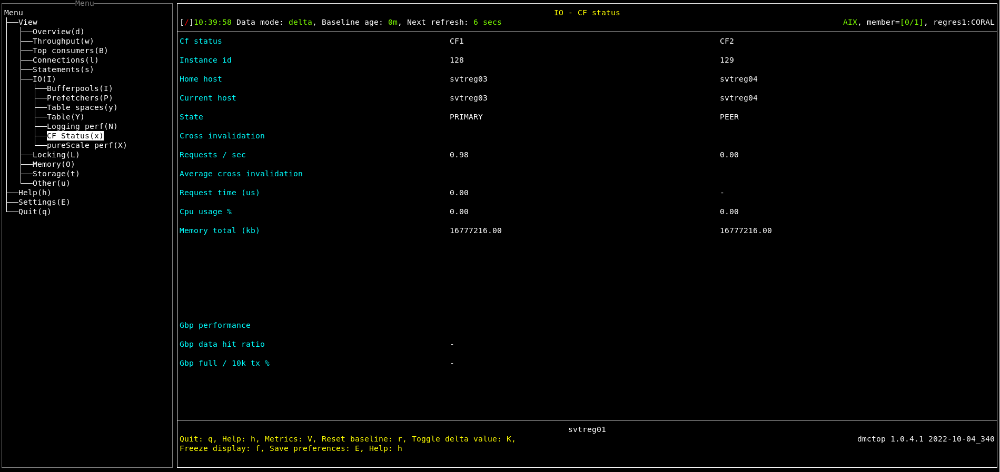

# Purpose

Show the current status of the cluster caching facility (CF).  A few items about the global buffer pool are also shown here.

There are normally 2 CFs, the current primary and a peer.  It is possible, but not recommended, to run with a single CF. 

The purpose of the peer CF is for high availability.  If the primary CF fails, then the peer can take over.  The "State" property tracks failover and other HA type events with values such as BECOMING_PRIMARY and CATCHUP.

The global buffer pool (GBP) is part of the CF, so a few metrics about it are shown here.  There is only one GBP even if two CFs have been configured.  So items for the GBP are shown in a separate section at the bottom.

This view is populated only if the monitored database is pureScale.  For non pureScale databases, dmctop opens a pop-up with the message "Available only for pureScale".


# Screenshot



# Metric shown

Metrics are presented in two columns, one for each CF.  The name of each CF is shown at the top of its column.  There is a small separate section at the bottom with two metrics for the global buffer pool.

<hr />

### Instance id

The instance ID is a member number, except that CF members are special purpose members that don’t show up in most of the monitoring.


**Source:** [DB2_GET_INSTANCE_INFO](https://www.ibm.com/docs/en/db2/11.5?topic=dpiirv-db2-member-db2-cf-administrative-views-db2-get-instance-info-table-function)(NULL, NULL, NULL, NULL, NULL).[ID](https://www.ibm.com/docs/en/db2/11.5?topic=reference-i#r0056210)

<hr />

### Home host 

The machine which was associated with the member when it was first added to the instance.

**Source:** [DB2_GET_INSTANCE_INFO](https://www.ibm.com/docs/en/db2/11.5?topic=dpiirv-db2-member-db2-cf-administrative-views-db2-get-instance-info-table-function)(NULL, NULL, NULL, NULL, NULL).[HOME_HOST](https://www.ibm.com/docs/en/db2/11.5?topic=dpiirv-db2-member-db2-cf-administrative-views-db2-get-instance-info-table-function)

<hr />

### Current host

The machine name on which the member is currently running.

**Source:** [DB2_GET_INSTANCE_INFO](https://www.ibm.com/docs/en/db2/11.5?topic=dpiirv-db2-member-db2-cf-administrative-views-db2-get-instance-info-table-function)(NULL, NULL, NULL, NULL, NULL).[CURRENT_HOST](https://www.ibm.com/docs/en/db2/11.5?topic=dpiirv-db2-member-db2-cf-administrative-views-db2-get-instance-info-table-function)


<hr />

### State 

The state of the member or cluster caching facility. Normally one CF will be PRIMARY and one PEER.

Possible values are

* STOPPED
* RESTARTING
* BECOMING_PRIMARY
* PRIMARY
* CATCHUP1
* PEER, ERROR
* UNKNOWN

**Source:** [DB2_GET_INSTANCE_INFO](https://www.ibm.com/docs/en/db2/11.5?topic=dpiirv-db2-member-db2-cf-administrative-views-db2-get-instance-info-table-function)(NULL, NULL, NULL, NULL, NULL).[STATE](https://www.ibm.com/docs/en/db2/11.5?topic=dpiirv-db2-member-db2-cf-administrative-views-db2-get-instance-info-table-function)

## Cross invalidation 

<hr />

### Requests / sec

The total number of requests in the CF for this command per second.

```
SELECT TOTAL_CF_REQUESTS
FROM TABLE(MON_GET_CF_CMD(NULL)) 
WHERE CF_CMD_NAME = 'CrossInvalidate'
```

**Source:** 

[MON_GET_CF_CMD](https://www.ibm.com/docs/en/db2/11.5?topic=mpf-mon-get-cf-cmd-get-processing-times-cluster-caching-facility-commands)(NULL).[TOTAL_CF_REQUESTS](https://www.ibm.com/docs/en/db2/11.5?topic=mpf-mon-get-cf-cmd-get-processing-times-cluster-caching-facility-commands)

[MON_GET_CF_CMD](https://www.ibm.com/docs/en/db2/11.5?topic=mpf-mon-get-cf-cmd-get-processing-times-cluster-caching-facility-commands)(NULL).[CF_CMD_NAME](https://www.ibm.com/docs/en/db2/11.5?topic=mpf-mon-get-cf-cmd-get-processing-times-cluster-caching-facility-commands)


## Average cross invalidation

<hr />

### Request time (us)

The average processing time in the CF per request for cross invalidation command. This should be less than 10 us, more than 20 us indicates a bottleneck.

= TOTAL_CF_CMD_TIME_MICRO / TOTAL_CF_REQUESTS

```
SELECT TOTAL_CF_CMD_TIME_MICRO, TOTAL_CF_REQUESTS
FROM TABLE(MON_GET_CF_CMD(NULL)) 
WHERE CF_CMD_NAME = 'CrossInvalidate'
```

**Source:**

[MON_GET_CF_CMD](https://www.ibm.com/docs/en/db2/11.5?topic=mpf-mon-get-cf-cmd-get-processing-times-cluster-caching-facility-commands)(NULL).[TOTAL_CF_CMD_TIME_MICRO](https://www.ibm.com/docs/en/db2/11.5?topic=mpf-mon-get-cf-cmd-get-processing-times-cluster-caching-facility-commands)

[MON_GET_CF_CMD](https://www.ibm.com/docs/en/db2/11.5?topic=mpf-mon-get-cf-cmd-get-processing-times-cluster-caching-facility-commands)(NULL).[TOTAL_CF_REQUESTS](https://www.ibm.com/docs/en/db2/11.5?topic=mpf-mon-get-cf-cmd-get-processing-times-cluster-caching-facility-commands)

[MON_GET_CF_CMD](https://www.ibm.com/docs/en/db2/11.5?topic=mpf-mon-get-cf-cmd-get-processing-times-cluster-caching-facility-commands)(NULL).[CF_CMD_NAME](https://www.ibm.com/docs/en/db2/11.5?topic=mpf-mon-get-cf-cmd-get-processing-times-cluster-caching-facility-commands)


<hr />

### Cpu usage % 

The percentage of time the CF workers are busy doing work when the CF is bound to its own set of CPUs

**Source:** [SYSIBMADM.ENV_CF_SYS_RESOURCES ](https://www.ibm.com/docs/en/db2/11.5?topic=erv-env-cf-sys-resources-get-cluster-caching-facility-system-resource-information).[CPU_USAGE_TOTAL](https://www.ibm.com/docs/en/db2/11.5?topic=erv-env-cf-sys-resources-get-cluster-caching-facility-system-resource-information)

<hr />

### Memory total (kb)

The total size of physical memory.

**Source:** [SYSIBMADM.ENV_CF_SYS_RESOURCES ](https://www.ibm.com/docs/en/db2/11.5?topic=erv-env-cf-sys-resources-get-cluster-caching-facility-system-resource-information).[MEMORY_TOTAL](https://www.ibm.com/docs/en/db2/11.5?topic=erv-env-cf-sys-resources-get-cluster-caching-facility-system-resource-information)


## Gbp performance

<hr />

### Gbp data hit ratio

Times a requested page was found in the group bufferpool.

= 1 - POOL_DATA_GBP_P_READS / POOL_DATA_GBP_L_READS 

**Source:** 

POOL_DATA_GBP_P_READS = [MON_GET_SERVICE_SUBCLASS](https://www.ibm.com/docs/en/db2/11.5?topic=mpf-mon-get-service-subclass-get-service-subclass-metrics)(NULL, NULL, #MEMBER#).[POOL_DATA_GBP_P_READS](https://www.ibm.com/docs/en/db2/11.5?topic=reference-p#r0056486)

POOL_DATA_GBP_L_READS = [MON_GET_SERVICE_SUBCLASS](https://www.ibm.com/docs/en/db2/11.5?topic=mpf-mon-get-service-subclass-get-service-subclass-metrics)(NULL, NULL, #MEMBER#).[POOL_DATA_GBP_L_READS](https://www.ibm.com/docs/en/db2/11.5?topic=reference-p#r0056485)


<hr />

### Gbp full / 10k tx % 

Ideally, this is zero.  Up to about 5 is acceptable.  Higher values indicate possible configuration problems, including:

* GBP configured too small
* Too few castout engines configured
* SOFTMAX set too high

= NUM_GBP_FULL / TOTAL_APP_COMMITS 

**Source:** 

NUM_GBP_FULL = [MON_GET_GROUP_BUFFERPOOL](https://www.ibm.com/docs/en/db2/11.5?topic=mpf-mon-get-group-bufferpool-get-group-buffer-pool-metrics)(#MEMBER#).[NUM_GBP_FULL](https://www.ibm.com/docs/en/db2/11.5?topic=mpf-mon-get-group-bufferpool-get-group-buffer-pool-metrics)


TOTAL_APP_COMMITS = [MON_GET_SERVICE_SUBCLASS](https://www.ibm.com/docs/en/db2/11.5?topic=mpf-mon-get-service-subclass-get-service-subclass-metrics)(NULL, NULL, #MEMBER#).[TOTAL_APP_COMMITS](https://www.ibm.com/docs/en/db2/11.5?topic=reference-t#r0056527)


