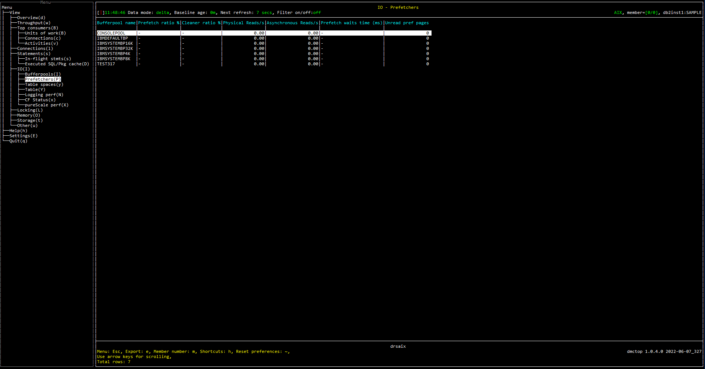

# Purpose

Prefetchers view shows the usage and performance of prefetchers.

The purpose of [prefetching system](https://www.ibm.com/support/pages/db2-prefetching-understanding-configuring-monitoring-tuning) is to retrieve data from physical storage to have it available at the time it is required by tasks running in the database. It depends on prefetchers to read data from the I/O subsystem. 

# Screenshot

# Metric shown

### Bufferpool name

 The buffer pool identifier for the buffer pool that is being monitored.

**Source:** [MON_GET_BUFFERPOOL](https://www.ibm.com/docs/en/db2/11.5?topic=functions-mon-get-bufferpool-get-buffer-pool-metrics)('', #MEMBER#).[BP_NAME](https://www.ibm.com/docs/en/db2/11.5?topic=reference-b#r0002256)

### Prefetch ratio %

The percentage of pages which have been asynchronously read from the table space containers (physical).

= ASYNC_READS / P_READS 

**Source:**

ASYNC_READS = [MON_GET_BUFFERPOOL](https://www.ibm.com/docs/en/db2/11.5?topic=functions-mon-get-bufferpool-get-buffer-pool-metrics)('', #MEMBER#).(SUM([POOL_ASYNC_DATA_READS](https://www.ibm.com/docs/en/db2/11.5?topic=reference-p#r0001244)) + SUM([POOL_ASYNC_INDEX_READS](https://www.ibm.com/docs/en/db2/11.5?topic=reference-p#r0001247)) + SUM([POOL_ASYNC_XDA_READS](https://www.ibm.com/docs/en/db2/11.5?topic=reference-p#r0022733)) + SUM([POOL_ASYNC_COL_READS](https://www.ibm.com/docs/en/db2/11.5?topic=reference-p#r0060851)))

P_READS = [MON_GET_BUFFERPOOL](https://www.ibm.com/docs/en/db2/11.5?topic=functions-mon-get-bufferpool-get-buffer-pool-metrics)('', #MEMBER#).(SUM([POOL_DATA_P_READS](https://www.ibm.com/docs/en/db2/11.5?topic=reference-p#r0001236)) + SUM([POOL_INDEX_P_READS](https://www.ibm.com/docs/en/db2/11.5?topic=reference-p#r0001239)) + SUM([POOL_XDA_P_READS](https://www.ibm.com/docs/en/db2/11.5?topic=reference-p#r0022730)) + SUM([POOL_COL_P_READS](https://www.ibm.com/docs/en/db2/11.5?topic=reference-p#r0060858)) + SUM([POOL_TEMP_DATA_P_READS](https://www.ibm.com/docs/en/db2/11.5?topic=reference-p#r0011300)) + SUM([POOL_TEMP_INDEX_P_READS](https://www.ibm.com/docs/en/db2/11.5?topic=reference-p#r0011301)) + SUM([POOL_TEMP_XDA_P_READS](https://www.ibm.com/docs/en/db2/11.5?topic=reference-p#r0022739)) + SUM([POOL_TEMP_COL_P_READS](https://www.ibm.com/docs/en/db2/11.5?topic=reference-p#r0060874)))

### Cleaner ratio %

The percentage of times a page was physically written to disk by either an asynchronous page cleaner, or a prefetcher. 

= ASYNC_WRITES / POOL_WRITES 

**Source:**

ASYNC_WRITES = [MON_GET_BUFFERPOOL](https://www.ibm.com/docs/en/db2/11.5?topic=functions-mon-get-bufferpool-get-buffer-pool-metrics)('', #MEMBER#).(SUM([POOL_ASYNC_DATA_WRITES](https://www.ibm.com/docs/en/db2/11.5?topic=reference-p#r0001245)) + SUM([POOL_ASYNC_INDEX_WRITES](https://www.ibm.com/docs/en/db2/11.5?topic=reference-p#r0001246)) + SUM([POOL_ASYNC_XDA_WRITES](https://www.ibm.com/docs/en/db2/11.5?topic=reference-p#r0022734)) + SUM([POOL_ASYNC_COL_WRITES](https://www.ibm.com/docs/en/db2/11.5?topic=reference-p#r0060893)))

POOL_WRITES = [MON_GET_BUFFERPOOL](https://www.ibm.com/docs/en/db2/11.5?topic=functions-mon-get-bufferpool-get-buffer-pool-metrics)('', #MEMBER#).(SUM([POOL_DATA_WRITES](https://www.ibm.com/docs/en/db2/11.5?topic=reference-p#r0001237)) + SUM([POOL_INDEX_WRITES](https://www.ibm.com/docs/en/db2/11.5?topic=reference-p#r0001240)) + SUM([POOL_XDA_WRITES](https://www.ibm.com/docs/en/db2/11.5?topic=reference-p#r0022732)) + SUM([POOL_COL_WRITES](https://www.ibm.com/docs/en/db2/11.5?topic=reference-p#r0060859)))

### Physical reads

The number of pages read in from the table space containers (physical).

**Source:**  [MON_GET_BUFFERPOOL](https://www.ibm.com/docs/en/db2/11.5?topic=functions-mon-get-bufferpool-get-buffer-pool-metrics)(NULL, #MEMBER#).(SUM([POOL_DATA_P_READS](https://www.ibm.com/docs/en/db2/11.5?topic=reference-p#r0001236)) + SUM([POOL_INDEX_P_READS](https://www.ibm.com/docs/en/db2/11.5?topic=reference-p#r0001239)) + SUM([POOL_XDA_P_READS](https://www.ibm.com/docs/en/db2/11.5?topic=reference-p#r0022730)) + SUM([POOL_COL_P_READS](https://www.ibm.com/docs/en/db2/11.5?topic=reference-p#r0060858)) + SUM([POOL_TEMP_DATA_P_READS](https://www.ibm.com/docs/en/db2/11.5?topic=reference-p#r0011300)) + SUM([POOL_TEMP_INDEX_P_READS](https://www.ibm.com/docs/en/db2/11.5?topic=reference-p#r0011301)) + SUM([POOL_TEMP_XDA_P_READS](https://www.ibm.com/docs/en/db2/11.5?topic=reference-p#r0022739)) + SUM([POOL_TEMP_COL_P_READS](https://www.ibm.com/docs/en/db2/11.5?topic=reference-p#r0060874)))

### Asynchronous reads

The number of pages which have been asynchronously read from the table space containers (physical).

**Source:**  [MON_GET_BUFFERPOOL](https://www.ibm.com/docs/en/db2/11.5?topic=functions-mon-get-bufferpool-get-buffer-pool-metrics)('', #MEMBER#).(SUM([POOL_ASYNC_DATA_READS](https://www.ibm.com/docs/en/db2/11.5?topic=reference-p#r0001244)) + SUM([POOL_ASYNC_INDEX_READS](https://www.ibm.com/docs/en/db2/11.5?topic=reference-p#r0001247)) + SUM([POOL_ASYNC_XDA_READS](https://www.ibm.com/docs/en/db2/11.5?topic=reference-p#r0022733)) + SUM([POOL_ASYNC_COL_READS](https://www.ibm.com/docs/en/db2/11.5?topic=reference-p#r0060851)))

### Prefetch waits time

The average time an application spent waiting for an I/O server (prefetcher) to finish loading pages into the buffer pool.

= PREFETCH_WAIT_TIME / PREFETCH_WAITS 

**Source:**

PREFETCH_WAIT_TIME = [MON_GET_BUFFERPOOL](https://www.ibm.com/docs/en/db2/11.5?topic=functions-mon-get-bufferpool-get-buffer-pool-metrics)('', #MEMBER#).SUM([PREFETCH_WAIT_TIME](https://www.ibm.com/docs/en/db2/11.5?topic=reference-p#r0001255))

PREFETCH_WAITS = [MON_GET_BUFFERPOOL](https://www.ibm.com/docs/en/db2/11.5?topic=functions-mon-get-bufferpool-get-buffer-pool-metrics)('', #MEMBER#).SUM([PREFETCH_WAITS](https://www.ibm.com/docs/en/db2/11.5?topic=reference-p#r0059565))

### Unread pref pages

The number of pages that the prefetcher read into the bufferpool that were never used.

**Source:** [MON_GET_BUFFERPOOL](https://www.ibm.com/docs/en/db2/11.5?topic=functions-mon-get-bufferpool-get-buffer-pool-metrics)('', #MEMBER#).SUM([UNREAD_PREFETCH_PAGES](https://www.ibm.com/docs/en/db2/11.5?topic=reference-u#r0010414))

