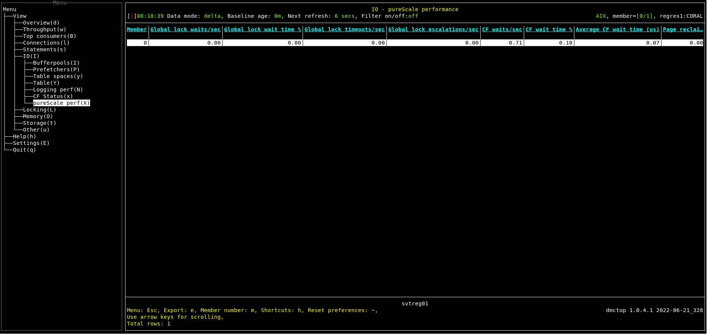

# Purpose

Purescale performance shows PureScale performance metrics and cache facility state.

This view is populated only if the monitored database is pureScale. For non pureScale databases, dmctop opens a pop-up with the message "Available only for pureScale".

# Screenshot

# Metric shown

### Member

Identifier for the database member.

**Source:** [MON_GET_SERVICE_SUBCLASS](https://www.ibm.com/docs/en/db2/11.5?topic=mpf-mon-get-service-subclass-get-service-subclass-metrics)(NULL, NULL, #MEMBER#).[MEMBER](https://www.ibm.com/docs/en/db2/11.5?topic=reference-m#r0054432)

### Global lock waits

The number of lock waits due to the application holding the lock being on a remote member.

**Source:**  [MON_GET_SERVICE_SUBCLASS](https://www.ibm.com/docs/en/db2/11.5?topic=mpf-mon-get-service-subclass-get-service-subclass-metrics)(NULL, NULL, #MEMBER#).SUM([LOCK_WAITS_GLOBAL](https://www.ibm.com/docs/en/db2/11.5?topic=reference-l#r0056233))

### Global lock wait time %

The percentage of time spent on global lock waits over the time spent on requests.

= LOCK_WAIT_TIME_GLOBAL / TOTAL_RQST_TIME 

**Source:**  

LOCK_WAIT_TIME_GLOBAL = [MON_GET_SERVICE_SUBCLASS](https://www.ibm.com/docs/en/db2/11.5?topic=mpf-mon-get-service-subclass-get-service-subclass-metrics)(NULL, NULL, #MEMBER#).SUM([LOCK_WAIT_TIME_GLOBAL](https://www.ibm.com/docs/en/db2/11.5?topic=reference-l#r0056234))

TOTAL_RQST_TIME = [MON_GET_SERVICE_SUBCLASS](https://www.ibm.com/docs/en/db2/11.5?topic=mpf-mon-get-service-subclass-get-service-subclass-metrics)(NULL, NULL, #MEMBER#).SUM([TOTAL_RQST_TIME](https://www.ibm.com/docs/en/db2/11.5?topic=reference-t#r0054060))

### Global lock timeouts

The number of lock timeouts.

**Source:**  [MON_GET_SERVICE_SUBCLASS](https://www.ibm.com/docs/en/db2/11.5?topic=mpf-mon-get-service-subclass-get-service-subclass-metrics)(NULL, NULL, #MEMBER#).SUM([LOCK_TIMEOUTS_GLOBAL](https://www.ibm.com/docs/en/db2/11.5?topic=reference-l#r0056235))

### Global lock escalations

The number of lock escalations on a global lock.

**Source:**  [MON_GET_SERVICE_SUBCLASS](https://www.ibm.com/docs/en/db2/11.5?topic=mpf-mon-get-service-subclass-get-service-subclass-metrics)(NULL, NULL, #MEMBER#).SUM([LOCK_ESCALS_GLOBAL](https://www.ibm.com/docs/en/db2/11.5?topic=reference-l#r0056238))

### CF waits

The number of times that the database system waited while it communicated with a cluster caching facility.

**Source:**  [MON_GET_SERVICE_SUBCLASS](https://www.ibm.com/docs/en/db2/11.5?topic=mpf-mon-get-service-subclass-get-service-subclass-metrics)(NULL, NULL, #MEMBER#).SUM([CF_WAITS](https://www.ibm.com/docs/en/db2/11.5?topic=reference-c#r0056239))

### CF wait time %

The percentage of time spent on communicating with the cluster caching facility over the time spent on requests.

= CF_WAIT_TIME / TOTAL_RQST_TIME 

**Source:**  

CF_WAIT_TIME = [MON_GET_SERVICE_SUBCLASS](https://www.ibm.com/docs/en/db2/11.5?topic=mpf-mon-get-service-subclass-get-service-subclass-metrics)(NULL, NULL, #MEMBER#).SUM([CF_WAIT_TIME](https://www.ibm.com/docs/en/db2/11.5?topic=reference-c#r0056240))

TOTAL_RQST_TIME = [MON_GET_SERVICE_SUBCLASS](https://www.ibm.com/docs/en/db2/11.5?topic=mpf-mon-get-service-subclass-get-service-subclass-metrics)(NULL, NULL, #MEMBER#).SUM([TOTAL_RQST_TIME](https://www.ibm.com/docs/en/db2/11.5?topic=reference-t#r0054060))

### Average CF wait time (us)

The average time spent on communicating with the cluster caching facility.

= CF_WAIT_TIME / CF_WAITS 

**Source:**  

CF_WAIT_TIME = [MON_GET_SERVICE_SUBCLASS](https://www.ibm.com/docs/en/db2/11.5?topic=mpf-mon-get-service-subclass-get-service-subclass-metrics)(NULL, NULL, #MEMBER#).SUM([CF_WAIT_TIME](https://www.ibm.com/docs/en/db2/11.5?topic=reference-c#r0056240))

CF_WAITS = [MON_GET_SERVICE_SUBCLASS](https://www.ibm.com/docs/en/db2/11.5?topic=mpf-mon-get-service-subclass-get-service-subclass-metrics)(NULL, NULL, #MEMBER#).SUM([CF_WAITS](https://www.ibm.com/docs/en/db2/11.5?topic=reference-c#r0056239))

### Page reclaims (exclusive)

The number of times a page related to the object was reclaimed by another member in the Db2® pureScale® instance before its planned release, where the member that reclaimed the page required exclusive access.

**Source:**  [MON_GET_PAGE_ACCESS_INFO](https://www.ibm.com/docs/en/db2/11.5?topic=mpf-mon-get-page-access-info-get-bufferpool-page-waiting-information)(NULL, NULL, #MEMBER#).SUM([PAGE_RECLAIMS_X](https://www.ibm.com/docs/en/db2/11.5?topic=reference-p#r0056223))

### Page reclaims (shared)

The number of times a page related to the object was reclaimed by another member in the Db2 pureScale instance before its planned release, where the member that reclaimed the page required shared access.

**Source:**  [MON_GET_PAGE_ACCESS_INFO](https://www.ibm.com/docs/en/db2/11.5?topic=mpf-mon-get-page-access-info-get-bufferpool-page-waiting-information)(NULL, NULL, #MEMBER#).SUM([PAGE_RECLAIMS_S](https://www.ibm.com/docs/en/db2/11.5?topic=reference-p#r0056224))

### Reclaim wait time %

The percentage of time spent on waiting on page locks, where the lock request caused a page to be reclaimed, over the time spent on requests.

= RECLAIM_WAIT_TIME / TOTAL_RQST_TIME 

**Source:**

RECLAIM_WAIT_TIME = [MON_GET_SERVICE_SUBCLASS](https://www.ibm.com/docs/en/db2/11.5?topic=mpf-mon-get-service-subclass-get-service-subclass-metrics)(NULL, NULL, #MEMBER#).SUM([RECLAIM_WAIT_TIME](https://www.ibm.com/docs/en/db2/11.5?topic=reference-r#r0056231))

TOTAL_RQST_TIME = [MON_GET_SERVICE_SUBCLASS](https://www.ibm.com/docs/en/db2/11.5?topic=mpf-mon-get-service-subclass-get-service-subclass-metrics)(NULL, NULL, #MEMBER#).SUM([TOTAL_RQST_TIME](https://www.ibm.com/docs/en/db2/11.5?topic=reference-t#r0054060))

