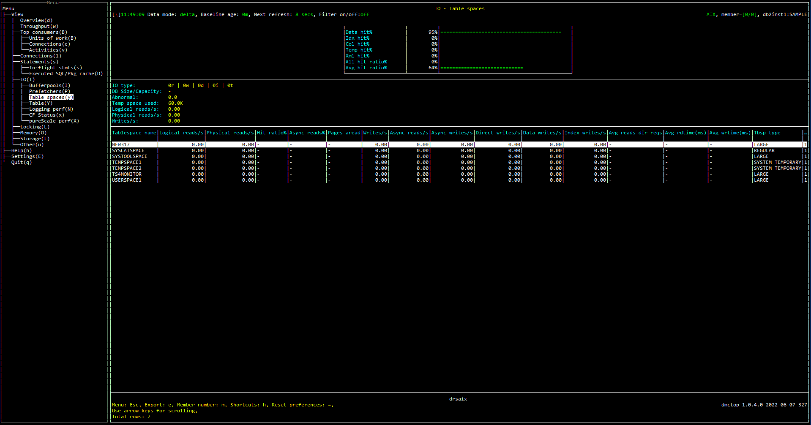

# Purpose

Table spaces view shows the performance of I/O operations for each table space including hit ratios and number of pages read and written for all buffer pools and for various data types and database usage.


# Screenshot



# Metric shown

## Gauge


<hr />

### Data hit%

Data page hit ratio. [Formulas for calculating buffer pool hit ratios](https://www.ibm.com/docs/en/db2/11.5?topic=management-formulas-calculating-buffer-pool-hit-ratios)

= DATA_HIT_RATIO_NUMER / DATA_HIT_RATIO_DENOM 

**Source:** 

DATA_HIT_RATIO_NUMER = [MON_GET_TABLESPACE](https://www.ibm.com/docs/en/db2/11.5?topic=functions-mon-get-tablespace-get-table-space-metrics)(NULL,#MEMBER#).SUM([POOL_DATA_LBP_PAGES_FOUND](https://www.ibm.com/docs/en/db2/11.5?topic=reference-p#r0056487) - [POOL_ASYNC_DATA_LBP_PAGES_FOUND](https://www.ibm.com/docs/en/db2/11.5?topic=reference-p#r0056493))


DATA_HIT_RATIO_DENOM = [MON_GET_TABLESPACE](https://www.ibm.com/docs/en/db2/11.5?topic=functions-mon-get-tablespace-get-table-space-metrics)(NULL,#MEMBER#).SUM([POOL_DATA_L_READS](https://www.ibm.com/docs/en/db2/11.5?topic=reference-p#r0001235) + [POOL_TEMP_DATA_L_READS](https://www.ibm.com/docs/en/db2/11.5?topic=reference-p#r0011302))


<hr />

### Idx hit%


Index page hit ratio. [Formulas for calculating buffer pool hit ratios](https://www.ibm.com/docs/en/db2/11.5?topic=management-formulas-calculating-buffer-pool-hit-ratios)


= IDX_HIT_RATIO_NUMER / IDX_HIT_RATIO_NUMER 

**Source:** 

IDX_HIT_RATIO_NUMER = [MON_GET_TABLESPACE](https://www.ibm.com/docs/en/db2/11.5?topic=functions-mon-get-tablespace-get-table-space-metrics)(NULL,#MEMBER#).SUM([POOL_INDEX_LBP_PAGES_FOUND](https://www.ibm.com/docs/en/db2/11.5?topic=reference-p#r0056243) - [POOL_ASYNC_INDEX_LBP_PAGES_FOUND](https://www.ibm.com/docs/en/db2/11.5?topic=reference-p#r0056496))


IDX_HIT_RATIO_DENOM = [MON_GET_TABLESPACE](https://www.ibm.com/docs/en/db2/11.5?topic=functions-mon-get-tablespace-get-table-space-metrics)(NULL,#MEMBER#).SUM([POOL_INDEX_L_READS](https://www.ibm.com/docs/en/db2/11.5?topic=reference-p#r0011303) + [POOL_TEMP_INDEX_L_READS](https://www.ibm.com/docs/en/db2/11.5?topic=reference-p#r0011303))


<hr />

### Col hit%

Column-organized page hit ratio. [Formulas for calculating buffer pool hit ratios](https://www.ibm.com/docs/en/db2/11.5?topic=management-formulas-calculating-buffer-pool-hit-ratios)

= COL_HIT_NUMERATOR / COL_HIT_DENOMINATOR 

**Source:** 

COL_HIT_NUMERATOR = [MON_GET_TABLESPACE](https://www.ibm.com/docs/en/db2/11.5?topic=functions-mon-get-tablespace-get-table-space-metrics)(NULL,#MEMBER#).SUM([POOL_COL_LBP_PAGES_FOUND](https://www.ibm.com/docs/en/db2/11.5?topic=reference-p#r0060857) - [POOL_ASYNC_COL_LBP_PAGES_FOUND](https://www.ibm.com/docs/en/db2/11.5?topic=reference-p#r0060850))

COL_HIT_DENOMINATOR = [MON_GET_TABLESPACE](https://www.ibm.com/docs/en/db2/11.5?topic=functions-mon-get-tablespace-get-table-space-metrics)(NULL,#MEMBER#).SUM([POOL_COL_L_READS](https://www.ibm.com/docs/en/db2/11.5?topic=reference-p#r0060763) + [POOL_TEMP_COL_L_READS](https://www.ibm.com/docs/en/db2/11.5?topic=reference-p#r0060873))


<hr />

### Temp hit%

Page hit ratio in temporary table spaces.


= TEMP_HIT_RATIO_NUMER / TEMP_HIT_RATIO_DENOM 

**Source:** 

TEMP_HIT_RATIO_NUMER = [MON_GET_TABLESPACE](https://www.ibm.com/docs/en/db2/11.5?topic=functions-mon-get-tablespace-get-table-space-metrics)(NULL,#MEMBER#).SUM(SUM([POOL_TEMP_DATA_L_READS](https://www.ibm.com/docs/en/db2/11.5?topic=reference-p#r0011302) + [POOL_TEMP_INDEX_L_READS](https://www.ibm.com/docs/en/db2/11.5?topic=reference-p#r0011303) + [POOL_TEMP_XDA_L_READS](https://www.ibm.com/docs/en/db2/11.5?topic=reference-p#r0022738) + [POOL_TEMP_COL_L_READS](https://www.ibm.com/docs/en/db2/11.5?topic=reference-p#r0060873)))-(SUM([POOL_TEMP_DATA_P_READS](https://www.ibm.com/docs/en/db2/11.5?topic=reference-p#r0011300) + [POOL_TEMP_INDEX_P_READS](https://www.ibm.com/docs/en/db2/11.5?topic=reference-p#r0011301) + [POOL_TEMP_XDA_P_READS](https://www.ibm.com/docs/en/db2/11.5?topic=reference-p#r0022739) + [POOL_TEMP_COL_P_READS](https://www.ibm.com/docs/en/db2/11.5?topic=reference-p#r0060874)))


TEMP_HIT_RATIO_DENOM = [MON_GET_TABLESPACE](https://www.ibm.com/docs/en/db2/11.5?topic=functions-mon-get-tablespace-get-table-space-metrics)(NULL,#MEMBER#).SUM([POOL_TEMP_DATA_L_READS](https://www.ibm.com/docs/en/db2/11.5?topic=reference-p#r0011302) + [POOL_TEMP_INDEX_L_READS](https://www.ibm.com/docs/en/db2/11.5?topic=reference-p#r0011303) + [POOL_TEMP_XDA_L_READS](https://www.ibm.com/docs/en/db2/11.5?topic=reference-p#r0022738) + [POOL_TEMP_COL_L_READS](https://www.ibm.com/docs/en/db2/11.5?topic=reference-p#r0060873))


<hr />

### XML hit%

XML storage object (XDA) page hit ratio. [Formulas for calculating buffer pool hit ratios](https://www.ibm.com/docs/en/db2/11.5?topic=management-formulas-calculating-buffer-pool-hit-ratios)


= XDA_HIT_NUMERATOR / XDA_HIT_DENOMINATOR 

**Source:** 

XDA_HIT_NUMERATOR = [MON_GET_TABLESPACE](https://www.ibm.com/docs/en/db2/11.5?topic=functions-mon-get-tablespace-get-table-space-metrics)(NULL,#MEMBER#).SUM([POOL_XDA_LBP_PAGES_FOUND](https://www.ibm.com/docs/en/db2/11.5?topic=reference-p#r0058666) - [POOL_ASYNC_XDA_LBP_PAGES_FOUND](https://www.ibm.com/docs/en/db2/11.5?topic=reference-p#r0058670))

XDA_HIT_DENOMINATOR = [MON_GET_TABLESPACE](https://www.ibm.com/docs/en/db2/11.5?topic=functions-mon-get-tablespace-get-table-space-metrics)(NULL,#MEMBER#).SUM([POOL_XDA_L_READS](https://www.ibm.com/docs/en/db2/11.5?topic=reference-p#r0022731) + [POOL_TEMP_XDA_L_READS](https://www.ibm.com/docs/en/db2/11.5?topic=reference-p#r0022738))


<hr />

### All hit ratio%

Overall hit ratio. [Formulas for calculating buffer pool hit ratios](https://www.ibm.com/docs/en/db2/11.5?topic=management-formulas-calculating-buffer-pool-hit-ratios)


= ALL_HIT_RATIO_NUMER / POOL_L_READS 

**Source:** 

ALL_HIT_RATIO_NUMER = [MON_GET_TABLESPACE](https://www.ibm.com/docs/en/db2/11.5?topic=functions-mon-get-tablespace-get-table-space-metrics)(NULL,#MEMBER#).SUM([POOL_DATA_LBP_PAGES_FOUND](https://www.ibm.com/docs/en/db2/11.5?topic=reference-p#r0056487) + [POOL_INDEX_LBP_PAGES_FOUND](https://www.ibm.com/docs/en/db2/11.5?topic=reference-p#r0056243) + [POOL_XDA_LBP_PAGES_FOUND](https://www.ibm.com/docs/en/db2/11.5?topic=reference-p#r0058666) + [POOL_COL_LBP_PAGES_FOUND](https://www.ibm.com/docs/en/db2/11.5?topic=reference-p#r0060857) - [POOL_ASYNC_DATA_LBP_PAGES_FOUND](https://www.ibm.com/docs/en/db2/11.5?topic=reference-p#r0056493) - [POOL_ASYNC_INDEX_LBP_PAGES_FOUND](https://www.ibm.com/docs/en/db2/11.5?topic=reference-p#r0056496) - [POOL_ASYNC_XDA_LBP_PAGES_FOUND](https://www.ibm.com/docs/en/db2/11.5?topic=reference-p#r0058670) - [POOL_ASYNC_COL_LBP_PAGES_FOUND](https://www.ibm.com/docs/en/db2/11.5?topic=reference-p#r0060850))

POOL_L_READS = [MON_GET_TABLESPACE](https://www.ibm.com/docs/en/db2/11.5?topic=functions-mon-get-tablespace-get-table-space-metrics)(NULL,#MEMBER#).SUM([POOL_DATA_L_READS](https://www.ibm.com/docs/en/db2/11.5?topic=reference-p#r0001235) + [POOL_INDEX_L_READS](https://www.ibm.com/docs/en/db2/11.5?topic=reference-p#r0011303) + [POOL_XDA_L_READS](https://www.ibm.com/docs/en/db2/11.5?topic=reference-p#r0022731) + [POOL_COL_L_READS](https://www.ibm.com/docs/en/db2/11.5?topic=reference-p#r0060763) + [POOL_TEMP_DATA_L_READS](https://www.ibm.com/docs/en/db2/11.5?topic=reference-p#r0011302) + [POOL_TEMP_XDA_L_READS](https://www.ibm.com/docs/en/db2/11.5?topic=reference-p#r0022738) + [POOL_TEMP_INDEX_L_READS](https://www.ibm.com/docs/en/db2/11.5?topic=reference-p#r0011303) + [POOL_TEMP_COL_L_READS](https://www.ibm.com/docs/en/db2/11.5?topic=reference-p#r0060873))


<hr />

### Avg hit ratio%

= Average overall hit ratio. [Formulas for calculating buffer pool hit ratios](https://www.ibm.com/docs/en/db2/11.5?topic=management-formulas-calculating-buffer-pool-hit-ratios)

= AVG_HIT_RATIO_NUMER / AVG_HIT_RATIO_DENOM 

**Source:** 


AVG_HIT_RATIO_NUMER = [MON_GET_TABLESPACE](https://www.ibm.com/docs/en/db2/11.5?topic=functions-mon-get-tablespace-get-table-space-metrics)(NULL,#MEMBER#).SUM(([POOL_DATA_LBP_PAGES_FOUND](https://www.ibm.com/docs/en/db2/11.5?topic=reference-p#r0056487) + [POOL_INDEX_LBP_PAGES_FOUND](https://www.ibm.com/docs/en/db2/11.5?topic=reference-p#r0056243) + [POOL_XDA_LBP_PAGES_FOUND](https://www.ibm.com/docs/en/db2/11.5?topic=reference-p#r0058666) + [POOL_COL_LBP_PAGES_FOUND](https://www.ibm.com/docs/en/db2/11.5?topic=reference-p#r0060857) - [POOL_ASYNC_DATA_LBP_PAGES_FOUND](https://www.ibm.com/docs/en/db2/11.5?topic=reference-p#r0056493) - [POOL_ASYNC_INDEX_LBP_PAGES_FOUND](https://www.ibm.com/docs/en/db2/11.5?topic=reference-p#r0056496) - [POOL_ASYNC_XDA_LBP_PAGES_FOUND](https://www.ibm.com/docs/en/db2/11.5?topic=reference-p#r0058670) - [POOL_ASYNC_COL_LBP_PAGES_FOUND](https://www.ibm.com/docs/en/db2/11.5?topic=reference-p#r0060850)) / ([POOL_DATA_L_READS](https://www.ibm.com/docs/en/db2/11.5?topic=reference-p#r0001235) + [POOL_INDEX_L_READS](https://www.ibm.com/docs/en/db2/11.5?topic=reference-p#r0011303) + [POOL_XDA_L_READS](https://www.ibm.com/docs/en/db2/11.5?topic=reference-p#r0022731) + [POOL_COL_L_READS](https://www.ibm.com/docs/en/db2/11.5?topic=reference-p#r0060763) + [POOL_TEMP_DATA_L_READS](https://www.ibm.com/docs/en/db2/11.5?topic=reference-p#r0011302) + [POOL_TEMP_XDA_L_READS](https://www.ibm.com/docs/en/db2/11.5?topic=reference-p#r0022738) + [POOL_TEMP_INDEX_L_READS](https://www.ibm.com/docs/en/db2/11.5?topic=reference-p#r0011303) + [POOL_TEMP_COL_L_READS](https://www.ibm.com/docs/en/db2/11.5?topic=reference-p#r0060873)))

AVG_HIT_RATIO_DENOM = 1

## Grid


<hr />

### IO type

The ratio of different type of page read and write.

= <IO_TYPE_R / IO_TOTAL>r | <IO_TYPE_W / IO_TOTAL >w | <IO_TYPE_D / IO_TOTAL >d | <IO_TYPE_I / IO_TOTAL >i | <IO_TYPE_T / IO_TOTAL >t
IO_TOTAL = IO_TYPE_R  + IO_TYPE_W  + IO_TYPE_D  + IO_TYPE_I + IO_TYPE_T 

**Source:**


IO_TYPE_R = [MON_GET_TABLESPACE](https://www.ibm.com/docs/en/db2/11.5?topic=functions-mon-get-tablespace-get-table-space-metrics)(NULL,#MEMBER#).SUM([POOL_DATA_P_READS](https://www.ibm.com/docs/en/db2/11.5?topic=reference-p#r0001236) + [POOL_INDEX_P_READS](https://www.ibm.com/docs/en/db2/11.5?topic=reference-p#r0001239) + [POOL_TEMP_DATA_P_READS](https://www.ibm.com/docs/en/db2/11.5?topic=reference-p#r0011300) + [POOL_TEMP_INDEX_P_READS](https://www.ibm.com/docs/en/db2/11.5?topic=reference-p#r0011301) + [POOL_XDA_P_READS](https://www.ibm.com/docs/en/db2/11.5?topic=reference-p#r0022730) + [POOL_TEMP_XDA_P_READS](https://www.ibm.com/docs/en/db2/11.5?topic=reference-p#r0022739) + [POOL_COL_P_READS](https://www.ibm.com/docs/en/db2/11.5?topic=reference-p#r0060858) + [POOL_TEMP_COL_P_READS](https://www.ibm.com/docs/en/db2/11.5?topic=reference-p#r0060874) + [DIRECT_READS](https://www.ibm.com/docs/en/db2/11.5?topic=reference-d#r0001260))

IO_TYPE_W = [MON_GET_TABLESPACE](https://www.ibm.com/docs/en/db2/11.5?topic=functions-mon-get-tablespace-get-table-space-metrics)(NULL,#MEMBER#).SUM([POOL_DATA_WRITES](https://www.ibm.com/docs/en/db2/11.5?topic=reference-p#r0001237) + [POOL_INDEX_WRITES](https://www.ibm.com/docs/en/db2/11.5?topic=reference-p#r0001240) + [POOL_XDA_WRITES](https://www.ibm.com/docs/en/db2/11.5?topic=reference-p#r0022732) + [POOL_COL_WRITES](https://www.ibm.com/docs/en/db2/11.5?topic=reference-p#r0060859) + [DIRECT_WRITES](https://www.ibm.com/docs/en/db2/11.5?topic=reference-d#r0001261))

IO_TYPE_D = [MON_GET_TABLESPACE](https://www.ibm.com/docs/en/db2/11.5?topic=functions-mon-get-tablespace-get-table-space-metrics)(NULL,#MEMBER#).SUM([POOL_DATA_L_READS](https://www.ibm.com/docs/en/db2/11.5?topic=reference-p#r0001235))


IO_TYPE_I = [MON_GET_TABLESPACE](https://www.ibm.com/docs/en/db2/11.5?topic=functions-mon-get-tablespace-get-table-space-metrics)(NULL,#MEMBER#).SUM([POOL_INDEX_L_READS](https://www.ibm.com/docs/en/db2/11.5?topic=reference-p#r0011303))

IO_TYPE_T = [MON_GET_TABLESPACE](https://www.ibm.com/docs/en/db2/11.5?topic=functions-mon-get-tablespace-get-table-space-metrics)(NULL,#MEMBER#).SUM([POOL_TEMP_DATA_L_READS](https://www.ibm.com/docs/en/db2/11.5?topic=reference-p#r0011302) + [POOL_TEMP_INDEX_L_READS](https://www.ibm.com/docs/en/db2/11.5?topic=reference-p#r0011303) + [POOL_TEMP_XDA_L_READS](https://www.ibm.com/docs/en/db2/11.5?topic=reference-p#r0022738) + [POOL_TEMP_COL_L_READS](https://www.ibm.com/docs/en/db2/11.5?topic=reference-p#r0060873))


<hr />

### DB Size/Capacity

The percentage of database usage.

= <DB_SIZE> / <DB_CAPACITY>

**Source:**

DB_SIZE = [SYSTOOLS.STMG_DBSIZE_INFO](https://www.ibm.com/docs/en/db2/11.5?topic=views-get-dbsize-info-database-size-capacity).[DB_SIZE](https://www.ibm.com/docs/en/db2/11.5?topic=views-get-dbsize-info-database-size-capacity)

DB_CAPACITY = [SYSTOOLS.STMG_DBSIZE_INFO](https://www.ibm.com/docs/en/db2/11.5?topic=views-get-dbsize-info-database-size-capacity).[DB_CAPACITY](https://www.ibm.com/docs/en/db2/11.5?topic=views-get-dbsize-info-database-size-capacity)


<hr />

### Abnormal

The number of abnormal tablespace.

```
SELECT COUNT(*) AS ABNORMAL_TOTAL
FROM   TABLE(MON_GET_TABLESPACE(NULL,#MEMBER#))
WHERE  TBSP_STATE <> 'NORMAL'
```

**Source:**  [MON_GET_TABLESPACE](https://www.ibm.com/docs/en/db2/11.5?topic=functions-mon-get-tablespace-get-table-space-metrics)(NULL,#MEMBER#).[TBSP_STATE ](https://www.ibm.com/docs/en/db2/11.5?topic=reference-t#r0007533)


<hr />

### Temp space used

The total space page size that are currently used in table spaces.

**Source:**  [MON_GET_TABLESPACE](https://www.ibm.com/docs/en/db2/11.5?topic=functions-mon-get-tablespace-get-table-space-metrics)(NULL,#MEMBER#).SUM([TBSP_USED_PAGES](https://www.ibm.com/docs/en/db2/11.5?topic=reference-t#r0007541) * [TBSP_PAGE_SIZE](https://www.ibm.com/docs/en/db2/11.5?topic=reference-t#r0007534))


<hr />

### Logical reads

The number of pages read from the local buffer pool (logical).

**Source:** [MON_GET_TABLESPACE](https://www.ibm.com/docs/en/db2/11.5?topic=functions-mon-get-tablespace-get-table-space-metrics)(NULL,#MEMBER#).SUM([POOL_DATA_L_READS](https://www.ibm.com/docs/en/db2/11.5?topic=reference-p#r0001235) + [POOL_INDEX_L_READS](https://www.ibm.com/docs/en/db2/11.5?topic=reference-p#r0011303) + [POOL_XDA_L_READS](https://www.ibm.com/docs/en/db2/11.5?topic=reference-p#r0022731) + [POOL_COL_L_READS](https://www.ibm.com/docs/en/db2/11.5?topic=reference-p#r0060763) + [POOL_TEMP_DATA_L_READS](https://www.ibm.com/docs/en/db2/11.5?topic=reference-p#r0011302) + [POOL_TEMP_XDA_L_READS](https://www.ibm.com/docs/en/db2/11.5?topic=reference-p#r0022738) + [POOL_TEMP_INDEX_L_READS](https://www.ibm.com/docs/en/db2/11.5?topic=reference-p#r0011303) + [POOL_TEMP_COL_L_READS](https://www.ibm.com/docs/en/db2/11.5?topic=reference-p#r0060873))


<hr />

### Physical reads

The number of pages read in from the table space containers (physical).

**Source:** [MON_GET_TABLESPACE](https://www.ibm.com/docs/en/db2/11.5?topic=functions-mon-get-tablespace-get-table-space-metrics)(NULL,#MEMBER#).SUM([POOL_DATA_P_READS](https://www.ibm.com/docs/en/db2/11.5?topic=reference-p#r0001236) + [POOL_INDEX_P_READS](https://www.ibm.com/docs/en/db2/11.5?topic=reference-p#r0001239) + [POOL_TEMP_DATA_P_READS](https://www.ibm.com/docs/en/db2/11.5?topic=reference-p#r0011300) + [POOL_TEMP_INDEX_P_READS](https://www.ibm.com/docs/en/db2/11.5?topic=reference-p#r0011301) + [POOL_XDA_P_READS](https://www.ibm.com/docs/en/db2/11.5?topic=reference-p#r0022730) + [POOL_TEMP_XDA_P_READS](https://www.ibm.com/docs/en/db2/11.5?topic=reference-p#r0022739) + [POOL_COL_P_READS](https://www.ibm.com/docs/en/db2/11.5?topic=reference-p#r0060858) + [POOL_TEMP_COL_P_READS](https://www.ibm.com/docs/en/db2/11.5?topic=reference-p#r0060874))


<hr />

### Write

The total number of write operations.


**Source:** [MON_GET_TABLESPACE](https://www.ibm.com/docs/en/db2/11.5?topic=functions-mon-get-tablespace-get-table-space-metrics)(NULL,#MEMBER#).SUM([POOL_DATA_WRITES](https://www.ibm.com/docs/en/db2/11.5?topic=reference-p#r0001237) + [POOL_INDEX_WRITES](https://www.ibm.com/docs/en/db2/11.5?topic=reference-p#r0001240) + [POOL_XDA_WRITES](https://www.ibm.com/docs/en/db2/11.5?topic=reference-p#r0022732) + [POOL_COL_WRITES](https://www.ibm.com/docs/en/db2/11.5?topic=reference-p#r0060859) + [DIRECT_WRITES](https://www.ibm.com/docs/en/db2/11.5?topic=reference-d#r0001261))

## Table


<hr />

### Tablespace name

The name of a table space.

**Source:**  [MON_GET_TABLESPACE](https://www.ibm.com/docs/en/db2/11.5?topic=functions-mon-get-tablespace-get-table-space-metrics)(NULL,#MEMBER#).[TBSP_NAME](https://www.ibm.com/docs/en/db2/11.5?topic=reference-t#r0001295)


<hr />

### Logical reads

The number of pages read from the local buffer pool (logical).


**Source:** [MON_GET_TABLESPACE](https://www.ibm.com/docs/en/db2/11.5?topic=functions-mon-get-tablespace-get-table-space-metrics)(NULL,#MEMBER#).SUM([POOL_DATA_L_READS](https://www.ibm.com/docs/en/db2/11.5?topic=reference-p#r0001235) + [POOL_INDEX_L_READS](https://www.ibm.com/docs/en/db2/11.5?topic=reference-p#r0011303) + [POOL_XDA_L_READS](https://www.ibm.com/docs/en/db2/11.5?topic=reference-p#r0022731) + [POOL_COL_L_READS](https://www.ibm.com/docs/en/db2/11.5?topic=reference-p#r0060763) + [POOL_TEMP_DATA_L_READS](https://www.ibm.com/docs/en/db2/11.5?topic=reference-p#r0011302) + [POOL_TEMP_XDA_L_READS](https://www.ibm.com/docs/en/db2/11.5?topic=reference-p#r0022738) + [POOL_TEMP_INDEX_L_READS](https://www.ibm.com/docs/en/db2/11.5?topic=reference-p#r0011303) + [POOL_TEMP_COL_L_READS](https://www.ibm.com/docs/en/db2/11.5?topic=reference-p#r0060873))


<hr />

### Physical reads

The number of pages read in from the table space containers (physical).

**Source:** [MON_GET_TABLESPACE](https://www.ibm.com/docs/en/db2/11.5?topic=functions-mon-get-tablespace-get-table-space-metrics)(NULL,#MEMBER#).SUM([POOL_DATA_P_READS](https://www.ibm.com/docs/en/db2/11.5?topic=reference-p#r0001236) + [POOL_INDEX_P_READS](https://www.ibm.com/docs/en/db2/11.5?topic=reference-p#r0001239) + [POOL_TEMP_DATA_P_READS](https://www.ibm.com/docs/en/db2/11.5?topic=reference-p#r0011300) + [POOL_TEMP_INDEX_P_READS](https://www.ibm.com/docs/en/db2/11.5?topic=reference-p#r0011301) + [POOL_XDA_P_READS](https://www.ibm.com/docs/en/db2/11.5?topic=reference-p#r0022730) + [POOL_TEMP_XDA_P_READS](https://www.ibm.com/docs/en/db2/11.5?topic=reference-p#r0022739) + [POOL_COL_P_READS](https://www.ibm.com/docs/en/db2/11.5?topic=reference-p#r0060858) + [POOL_TEMP_COL_P_READS](https://www.ibm.com/docs/en/db2/11.5?topic=reference-p#r0060874))


<hr />

### Hit ratio%

Overall hit ratio. [Formulas for calculating buffer pool hit ratios](https://www.ibm.com/docs/en/db2/11.5?topic=management-formulas-calculating-buffer-pool-hit-ratios)


= ALL_HIT_RATIO_NUMER / POOL_L_READS 

**Source:** 

ALL_HIT_RATIO_NUMER = [MON_GET_TABLESPACE](https://www.ibm.com/docs/en/db2/11.5?topic=functions-mon-get-tablespace-get-table-space-metrics)(NULL,#MEMBER#).SUM([POOL_DATA_LBP_PAGES_FOUND](https://www.ibm.com/docs/en/db2/11.5?topic=reference-p#r0056487) + [POOL_INDEX_LBP_PAGES_FOUND](https://www.ibm.com/docs/en/db2/11.5?topic=reference-p#r0056243) + [POOL_XDA_LBP_PAGES_FOUND](https://www.ibm.com/docs/en/db2/11.5?topic=reference-p#r0058666) + [POOL_COL_LBP_PAGES_FOUND](https://www.ibm.com/docs/en/db2/11.5?topic=reference-p#r0060857) - [POOL_ASYNC_DATA_LBP_PAGES_FOUND](https://www.ibm.com/docs/en/db2/11.5?topic=reference-p#r0056493) - [POOL_ASYNC_INDEX_LBP_PAGES_FOUND](https://www.ibm.com/docs/en/db2/11.5?topic=reference-p#r0056496) - [POOL_ASYNC_XDA_LBP_PAGES_FOUND](https://www.ibm.com/docs/en/db2/11.5?topic=reference-p#r0058670) - [POOL_ASYNC_COL_LBP_PAGES_FOUND](https://www.ibm.com/docs/en/db2/11.5?topic=reference-p#r0060850))

POOL_L_READS = [MON_GET_TABLESPACE](https://www.ibm.com/docs/en/db2/11.5?topic=functions-mon-get-tablespace-get-table-space-metrics)(NULL,#MEMBER#).SUM([POOL_DATA_L_READS](https://www.ibm.com/docs/en/db2/11.5?topic=reference-p#r0001235) + [POOL_INDEX_L_READS](https://www.ibm.com/docs/en/db2/11.5?topic=reference-p#r0011303) + [POOL_XDA_L_READS](https://www.ibm.com/docs/en/db2/11.5?topic=reference-p#r0022731) + [POOL_COL_L_READS](https://www.ibm.com/docs/en/db2/11.5?topic=reference-p#r0060763) + [POOL_TEMP_DATA_L_READS](https://www.ibm.com/docs/en/db2/11.5?topic=reference-p#r0011302) + [POOL_TEMP_XDA_L_READS](https://www.ibm.com/docs/en/db2/11.5?topic=reference-p#r0022738) + [POOL_TEMP_INDEX_L_READS](https://www.ibm.com/docs/en/db2/11.5?topic=reference-p#r0011303) + [POOL_TEMP_COL_L_READS](https://www.ibm.com/docs/en/db2/11.5?topic=reference-p#r0060873))


<hr />

### Async reads%

The percentage of pages which have been asynchronously read from the table space containers (physical).


= ASYNC_READS / POOL_L_READS 

**Source:** 

ASYNC_READS = [MON_GET_TABLESPACE](https://www.ibm.com/docs/en/db2/11.5?topic=functions-mon-get-tablespace-get-table-space-metrics)(NULL,#MEMBER#).SUM([POOL_ASYNC_DATA_READS](https://www.ibm.com/docs/en/db2/11.5?topic=reference-p#r0001244) + [POOL_ASYNC_INDEX_READS](https://www.ibm.com/docs/en/db2/11.5?topic=reference-p#r0001247) + [POOL_ASYNC_XDA_READS](https://www.ibm.com/docs/en/db2/11.5?topic=reference-p#r0022733) + [POOL_ASYNC_COL_READS](https://www.ibm.com/docs/en/db2/11.5?topic=reference-p#r0060851))


POOL_L_READS = [MON_GET_TABLESPACE](https://www.ibm.com/docs/en/db2/11.5?topic=functions-mon-get-tablespace-get-table-space-metrics)(NULL,#MEMBER#).SUM([POOL_DATA_L_READS](https://www.ibm.com/docs/en/db2/11.5?topic=reference-p#r0001235) + [POOL_INDEX_L_READS](https://www.ibm.com/docs/en/db2/11.5?topic=reference-p#r0011303) + [POOL_XDA_L_READS](https://www.ibm.com/docs/en/db2/11.5?topic=reference-p#r0022731) + [POOL_COL_L_READS](https://www.ibm.com/docs/en/db2/11.5?topic=reference-p#r0060763) + [POOL_TEMP_DATA_L_READS](https://www.ibm.com/docs/en/db2/11.5?topic=reference-p#r0011302) + [POOL_TEMP_XDA_L_READS](https://www.ibm.com/docs/en/db2/11.5?topic=reference-p#r0022738) + [POOL_TEMP_INDEX_L_READS](https://www.ibm.com/docs/en/db2/11.5?topic=reference-p#r0011303) + [POOL_TEMP_COL_L_READS](https://www.ibm.com/docs/en/db2/11.5?topic=reference-p#r0060873))


<hr />

### Pages aread

The average number of asynchronous read per request.

= ASYNC_READS / ASYNC_READ_REQ 


**Source:** 

ASYNC_READS = [MON_GET_TABLESPACE](https://www.ibm.com/docs/en/db2/11.5?topic=functions-mon-get-tablespace-get-table-space-metrics)(NULL,#MEMBER#).SUM([POOL_ASYNC_DATA_READS](https://www.ibm.com/docs/en/db2/11.5?topic=reference-p#r0001244) + [POOL_ASYNC_INDEX_READS](https://www.ibm.com/docs/en/db2/11.5?topic=reference-p#r0001247) + [POOL_ASYNC_XDA_READS](https://www.ibm.com/docs/en/db2/11.5?topic=reference-p#r0022733) + [POOL_ASYNC_COL_READS](https://www.ibm.com/docs/en/db2/11.5?topic=reference-p#r0060851))


ASYNC_READ_REQ = [MON_GET_TABLESPACE](https://www.ibm.com/docs/en/db2/11.5?topic=functions-mon-get-tablespace-get-table-space-metrics)(NULL,#MEMBER#).SUM([POOL_ASYNC_DATA_READ_REQS](https://www.ibm.com/docs/en/db2/11.5?topic=reference-p#r0001250) + [POOL_ASYNC_INDEX_READ_REQS](https://www.ibm.com/docs/en/db2/11.5?topic=reference-p#r0010879) + [POOL_ASYNC_XDA_READ_REQS](https://www.ibm.com/docs/en/db2/11.5?topic=reference-p#r0022735) + [POOL_ASYNC_COL_READ_REQS](https://www.ibm.com/docs/en/db2/11.5?topic=reference-p#r0060852))


<hr />

### Writes

The total number of write operations.


**Source:** [MON_GET_TABLESPACE](https://www.ibm.com/docs/en/db2/11.5?topic=functions-mon-get-tablespace-get-table-space-metrics)(NULL,#MEMBER#).SUM([POOL_DATA_WRITES](https://www.ibm.com/docs/en/db2/11.5?topic=reference-p#r0001237) + [POOL_INDEX_WRITES](https://www.ibm.com/docs/en/db2/11.5?topic=reference-p#r0001240) + [POOL_XDA_WRITES](https://www.ibm.com/docs/en/db2/11.5?topic=reference-p#r0022732) + [POOL_COL_WRITES](https://www.ibm.com/docs/en/db2/11.5?topic=reference-p#r0060859) + [DIRECT_WRITES](https://www.ibm.com/docs/en/db2/11.5?topic=reference-d#r0001261))


<hr />

### Async reads

The total number of pages which have been asynchronously read from the table space containers (physical).


**Source:** [MON_GET_TABLESPACE](https://www.ibm.com/docs/en/db2/11.5?topic=functions-mon-get-tablespace-get-table-space-metrics)(NULL,#MEMBER#).SUM([POOL_ASYNC_DATA_READS](https://www.ibm.com/docs/en/db2/11.5?topic=reference-p#r0001244) + [POOL_ASYNC_INDEX_READS](https://www.ibm.com/docs/en/db2/11.5?topic=reference-p#r0001247) + [POOL_ASYNC_XDA_READS](https://www.ibm.com/docs/en/db2/11.5?topic=reference-p#r0022733) + [POOL_ASYNC_COL_READS](https://www.ibm.com/docs/en/db2/11.5?topic=reference-p#r0060851))


<hr />

### Async writes

The number of times a page was physically written to disk by either an asynchronous page cleaner, or a prefetcher. 

**Source:** [MON_GET_TABLESPACE](https://www.ibm.com/docs/en/db2/11.5?topic=functions-mon-get-tablespace-get-table-space-metrics)(NULL,#MEMBER#).SUM([POOL_ASYNC_DATA_WRITES](https://www.ibm.com/docs/en/db2/11.5?topic=reference-p#r0001245) + [POOL_ASYNC_INDEX_WRITES](https://www.ibm.com/docs/en/db2/11.5?topic=reference-p#r0001246) + [POOL_ASYNC_XDA_WRITES](https://www.ibm.com/docs/en/db2/11.5?topic=reference-p#r0022734) + [POOL_ASYNC_COL_WRITES](https://www.ibm.com/docs/en/db2/11.5?topic=reference-p#r0060893))


<hr />

### Direct writes


The number of write operations that do not use the buffer pool.

**Source:** [MON_GET_TABLESPACE](https://www.ibm.com/docs/en/db2/11.5?topic=functions-mon-get-tablespace-get-table-space-metrics)(NULL,#MEMBER#).SUM([DIRECT_WRITES](https://www.ibm.com/docs/en/db2/11.5?topic=reference-d#r0001261))


<hr />

### Data writes

The number of times a buffer pool data page was physically written to disk.

**Source:** [MON_GET_TABLESPACE](https://www.ibm.com/docs/en/db2/11.5?topic=functions-mon-get-tablespace-get-table-space-metrics)(NULL,#MEMBER#).SUM([POOL_DATA_WRITES](https://www.ibm.com/docs/en/db2/11.5?topic=reference-p#r0001237))


<hr />

### Index writes

The number of times a buffer pool index page was physically written to disk.

**Source:** [MON_GET_TABLESPACE](https://www.ibm.com/docs/en/db2/11.5?topic=functions-mon-get-tablespace-get-table-space-metrics)(NULL,#MEMBER#).SUM([POOL_INDEX_WRITES](https://www.ibm.com/docs/en/db2/11.5?topic=reference-p#r0001240))


<hr />

### Avg_reads dir_reqs

The average number of  read operations that do not use the buffer pool per request.

= DIRECT_READS / DIRECT_READ_REQS 

**Source:**

DIRECT_READS = [MON_GET_TABLESPACE](https://www.ibm.com/docs/en/db2/11.5?topic=functions-mon-get-tablespace-get-table-space-metrics)(NULL,#MEMBER#).SUM([DIRECT_READS](https://www.ibm.com/docs/en/db2/11.5?topic=reference-d#r0001260))

DIRECT_READ_REQS = [MON_GET_TABLESPACE](https://www.ibm.com/docs/en/db2/11.5?topic=functions-mon-get-tablespace-get-table-space-metrics)(NULL,#MEMBER#).SUM([DIRECT_READ_REQS](https://www.ibm.com/docs/en/db2/11.5?topic=reference-d#r0001262))


<hr />

### Avg rdtime

The average amount of time spent for read operations.

= READ_TIME_MS / TOTAL_READS 

**Source:**

READ_TIME_MS = [MON_GET_TABLESPACE](https://www.ibm.com/docs/en/db2/11.5?topic=functions-mon-get-tablespace-get-table-space-metrics)(NULL,#MEMBER#).SUM([POOL_READ_TIME](https://www.ibm.com/docs/en/db2/11.5?topic=reference-p#r0001241) + [DIRECT_READ_TIME](https://www.ibm.com/docs/en/db2/11.5?topic=reference-d#r0001264))

TOTAL_READS = [MON_GET_TABLESPACE](https://www.ibm.com/docs/en/db2/11.5?topic=functions-mon-get-tablespace-get-table-space-metrics)(NULL,#MEMBER#).SUM([POOL_DATA_P_READS](https://www.ibm.com/docs/en/db2/11.5?topic=reference-p#r0001236) + [POOL_INDEX_P_READS](https://www.ibm.com/docs/en/db2/11.5?topic=reference-p#r0001239) + [POOL_TEMP_DATA_P_READS](https://www.ibm.com/docs/en/db2/11.5?topic=reference-p#r0011300) + [POOL_TEMP_INDEX_P_READS](https://www.ibm.com/docs/en/db2/11.5?topic=reference-p#r0011301) +  [DIRECT_READS](https://www.ibm.com/docs/en/db2/11.5?topic=reference-d#r0001260))


<hr />

### Avg wrtime

The average amount of time spent for write operations.

= WRITE_TIME_MS / TOTAL_WRITES 

**Source:**

WRITE_TIME_MS = [MON_GET_TABLESPACE](https://www.ibm.com/docs/en/db2/11.5?topic=functions-mon-get-tablespace-get-table-space-metrics)(NULL,#MEMBER#).SUM([POOL_WRITE_TIME](https://www.ibm.com/docs/en/db2/11.5?topic=reference-p#r0001242) + [DIRECT_WRITE_TIME](https://www.ibm.com/docs/en/db2/11.5?topic=reference-d#r0001265))

TOTAL_WRITES = [MON_GET_TABLESPACE](https://www.ibm.com/docs/en/db2/11.5?topic=functions-mon-get-tablespace-get-table-space-metrics)(NULL,#MEMBER#).SUM([DIRECT_WRITES](https://www.ibm.com/docs/en/db2/11.5?topic=reference-d#r0001261) + [POOL_DATA_WRITES](https://www.ibm.com/docs/en/db2/11.5?topic=reference-p#r0001237) + [POOL_INDEX_WRITES](https://www.ibm.com/docs/en/db2/11.5?topic=reference-p#r0001240))


<hr />

### Tbsp type

Table space content type. A text identifier based on defines in sqlmon.h, and is one of:
* ANY
* LARGE
* SYSTEMP
* USRTEMP

**Source:** [MON_GET_TABLESPACE](https://www.ibm.com/docs/en/db2/11.5?topic=functions-mon-get-tablespace-get-table-space-metrics)(NULL,#MEMBER#).[TBSP_CONTENT_TYPE](https://www.ibm.com/docs/en/db2/11.5?topic=functions-mon-get-tablespace-get-table-space-metrics))


<hr />

### # of dbp

The number of buffer pool that is being monitored.

```
SELECT COUNT(*) AS NUM_DBP
FROM TABLE(
  MON_GET_TABLESPACE(
	NULL, 
	#MEMBER#)) AS MTSP
LEFT OUTER JOIN SYSCAT.BUFFERPOOLS AS BP ON MTSP.TBSP_CUR_POOL_ID = BP.BUFFERPOOLID 
LEFT OUTER JOIN TABLE(
	  MON_GET_BUFFERPOOL(
		NULL, 
		#MEMBER#)) AS MBP ON BP.BPNAME=MBP.BP_NAME
		AND MTSP.MEMBER = MBP.MEMBER 
GROUP BY 
   TBSP_NAME, 
   TBSP_CONTENT_TYPE, 
   TBSP_STATE
```


<hr />

### Avg prefsize

The average size of pages which have been asynchronously read from the table space containers (physical) per request.


= READ_BYTES / ASYNC_READ_REQ 

**Source:**

READ_BYTES = [MON_GET_TABLESPACE](https://www.ibm.com/docs/en/db2/11.5?topic=functions-mon-get-tablespace-get-table-space-metrics)(NULL,#MEMBER#).SUM([TBSP_PAGE_SIZE](https://www.ibm.com/docs/en/db2/11.5?topic=reference-t#r0007534) * ([POOL_ASYNC_DATA_READS](https://www.ibm.com/docs/en/db2/11.5?topic=reference-p#r0001244) + [POOL_ASYNC_INDEX_READS](https://www.ibm.com/docs/en/db2/11.5?topic=reference-p#r0001247) + [POOL_ASYNC_XDA_READS](https://www.ibm.com/docs/en/db2/11.5?topic=reference-p#r0022733) + [POOL_ASYNC_COL_READS](https://www.ibm.com/docs/en/db2/11.5?topic=reference-p#r0060851)))

ASYNC_READ_REQ =  [MON_GET_TABLESPACE](https://www.ibm.com/docs/en/db2/11.5?topic=functions-mon-get-tablespace-get-table-space-metrics)(NULL,#MEMBER#).SUM([POOL_ASYNC_DATA_READ_REQS](https://www.ibm.com/docs/en/db2/11.5?topic=reference-p#r0001250) + [POOL_ASYNC_INDEX_READ_REQS](https://www.ibm.com/docs/en/db2/11.5?topic=reference-p#r0010879) + [POOL_ASYNC_XDA_READ_REQS](https://www.ibm.com/docs/en/db2/11.5?topic=reference-p#r0022735) + [POOL_ASYNC_COL_READ_REQS](https://www.ibm.com/docs/en/db2/11.5?topic=reference-p#r0060852))


<hr />

### I/o skew

The I/O skew from average.

= 1 - AVG(POOL_L_READS)/MAX(POOL_L_READS)

**Source:**


POOL_L_READS = [MON_GET_TABLESPACE](https://www.ibm.com/docs/en/db2/11.5?topic=functions-mon-get-tablespace-get-table-space-metrics)(NULL,#MEMBER#).([POOL_DATA_L_READS](https://www.ibm.com/docs/en/db2/11.5?topic=reference-p#r0001235) + [POOL_INDEX_L_READS](https://www.ibm.com/docs/en/db2/11.5?topic=reference-p#r0011303) + [POOL_XDA_L_READS](https://www.ibm.com/docs/en/db2/11.5?topic=reference-p#r0022731) + [POOL_COL_L_READS](https://www.ibm.com/docs/en/db2/11.5?topic=reference-p#r0060763) + [POOL_TEMP_DATA_L_READS](https://www.ibm.com/docs/en/db2/11.5?topic=reference-p#r0011302) + [POOL_TEMP_XDA_L_READS](https://www.ibm.com/docs/en/db2/11.5?topic=reference-p#r0022738) + [POOL_TEMP_INDEX_L_READS](https://www.ibm.com/docs/en/db2/11.5?topic=reference-p#r0011303) + [POOL_TEMP_COL_L_READS](https://www.ibm.com/docs/en/db2/11.5?topic=reference-p#r0060873))


<hr />

### Tbspace status

The current state of a table space.

**Source:**  [MON_GET_TABLESPACE](https://www.ibm.com/docs/en/db2/11.5?topic=functions-mon-get-tablespace-get-table-space-metrics)(NULL,#MEMBER#).[TBSP_STATE](https://www.ibm.com/docs/en/db2/11.5?topic=reference-t#r0007533)


<hr />

### Tbspace type

Table space type. A text identifier based on defines in sqlutil.h, and is one of:
* DMS
* SMS

**Source:**  [MON_GET_TABLESPACE](https://www.ibm.com/docs/en/db2/11.5?topic=functions-mon-get-tablespace-get-table-space-metrics)(NULL,#MEMBER#).[TBSP_TYPE](https://www.ibm.com/docs/en/db2/11.5?topic=functions-mon-get-tablespace-get-table-space-metrics)


<hr />

### Fsc on

Indicate whether file system caching is intended for a table space.


If MAX(FS_CACHING) = 0, then 'YES', else 'NO'

**Source:**

FS_CACHING = [MON_GET_TABLESPACE](https://www.ibm.com/docs/en/db2/11.5?topic=functions-mon-get-tablespace-get-table-space-metrics)(NULL,#MEMBER#).[FS_CACHING](https://www.ibm.com/docs/en/db2/11.5?topic=reference-f#r0011690)


<hr />

### File closed

The total number of database files closed.

**Source:**  [MON_GET_TABLESPACE](https://www.ibm.com/docs/en/db2/11.5?topic=functions-mon-get-tablespace-get-table-space-metrics)(NULL,#MEMBER#).SUM([FILES_CLOSED](https://www.ibm.com/docs/en/db2/11.5?topic=reference-f#r0001243))


<hr />

### Victim buffers

The number of times an agent did not have a preselected victim buffer available.


**Source:** [MON_GET_BUFFERPOOL](https://www.ibm.com/docs/en/db2/11.5?topic=functions-mon-get-bufferpool-get-buffer-pool-metrics)(NULL, #MEMBER#).SUM([POOL_NO_VICTIM_BUFFER](https://www.ibm.com/docs/en/db2/11.5?topic=reference-p#r0011313))


<hr />

### Unread prefpages

The number of pages that the prefetcher read into the bufferpool that were never used.

**Source:**  [MON_GET_TABLESPACE](https://www.ibm.com/docs/en/db2/11.5?topic=functions-mon-get-tablespace-get-table-space-metrics)(NULL,#MEMBER#).SUM([UNREAD_PREFETCH_PAGES](https://www.ibm.com/docs/en/db2/11.5?topic=reference-u#r0010414))


<hr />

### Xda l_reads

The number of pages for XML storage objects (XDAs) read from the buffer pool (logical).

**Source:**  [MON_GET_TABLESPACE](https://www.ibm.com/docs/en/db2/11.5?topic=functions-mon-get-tablespace-get-table-space-metrics)(NULL,#MEMBER#).SUM([POOL_XDA_L_READS](https://www.ibm.com/docs/en/db2/11.5?topic=reference-p#r0022731) + ([POOL_TEMP_XDA_L_READS](https://www.ibm.com/docs/en/db2/11.5?topic=reference-p#r0022738))


<hr />

### Xda p_reads


The number of pages for XML storage objects (XDAs) which have read from the table space containers (physical).

**Source:**  [MON_GET_TABLESPACE](https://www.ibm.com/docs/en/db2/11.5?topic=functions-mon-get-tablespace-get-table-space-metrics)(NULL,#MEMBER#).SUM([POOL_XDA_P_READS](https://www.ibm.com/docs/en/db2/11.5?topic=reference-p#r0022730) + [POOL_TEMP_XDA_P_READS](https://www.ibm.com/docs/en/db2/11.5?topic=reference-p#r0022739))


<hr />

### Xda l_writes

The number of times a buffer pool data page for an XML storage object (XDA) was physically written to disk.

**Source:**  [MON_GET_TABLESPACE](https://www.ibm.com/docs/en/db2/11.5?topic=functions-mon-get-tablespace-get-table-space-metrics)(NULL,#MEMBER#).SUM([POOL_XDA_WRITES](https://www.ibm.com/docs/en/db2/11.5?topic=reference-p#r0022732))


<hr />

### Prefetch size

The total page size the prefetcher gets from the disk at a time.

**Source:**  [MON_GET_TABLESPACE](https://www.ibm.com/docs/en/db2/11.5?topic=functions-mon-get-tablespace-get-table-space-metrics)(NULL,#MEMBER#).SUM([TBSP_PAGE_SIZE](https://www.ibm.com/docs/en/db2/11.5?topic=reference-t#r0007534) * [TBSP_PREFETCH_SIZE](https://www.ibm.com/docs/en/db2/11.5?topic=reference-t#r0007536))


<hr />

### Io

The total number of IO operations.

**Source:**  [MON_GET_TABLESPACE](https://www.ibm.com/docs/en/db2/11.5?topic=functions-mon-get-tablespace-get-table-space-metrics)(NULL,#MEMBER#).SUM([POOL_DATA_WRITES](https://www.ibm.com/docs/en/db2/11.5?topic=reference-p#r0001237) + [POOL_INDEX_WRITES](https://www.ibm.com/docs/en/db2/11.5?topic=reference-p#r0001240) + [POOL_XDA_WRITES](https://www.ibm.com/docs/en/db2/11.5?topic=reference-p#r0022732) + [POOL_COL_WRITES](https://www.ibm.com/docs/en/db2/11.5?topic=reference-p#r0060859) + [DIRECT_WRITES](https://www.ibm.com/docs/en/db2/11.5?topic=reference-d#r0001261) + [POOL_DATA_L_READS](https://www.ibm.com/docs/en/db2/11.5?topic=reference-p#r0001235) + [POOL_INDEX_L_READS](https://www.ibm.com/docs/en/db2/11.5?topic=reference-p#r0011303) + [POOL_TEMP_DATA_L_READS](https://www.ibm.com/docs/en/db2/11.5?topic=reference-p#r0011302) + [POOL_TEMP_INDEX_L_READS](https://www.ibm.com/docs/en/db2/11.5?topic=reference-p#r0011303) + [POOL_XDA_L_READS](https://www.ibm.com/docs/en/db2/11.5?topic=reference-p#r0022731) + [POOL_TEMP_XDA_L_READS](https://www.ibm.com/docs/en/db2/11.5?topic=reference-p#r0022738) + [POOL_TEMP_COL_L_READS](https://www.ibm.com/docs/en/db2/11.5?topic=reference-p#r0060873) + [POOL_COL_L_READS](https://www.ibm.com/docs/en/db2/11.5?topic=reference-p#r0060763)) 

