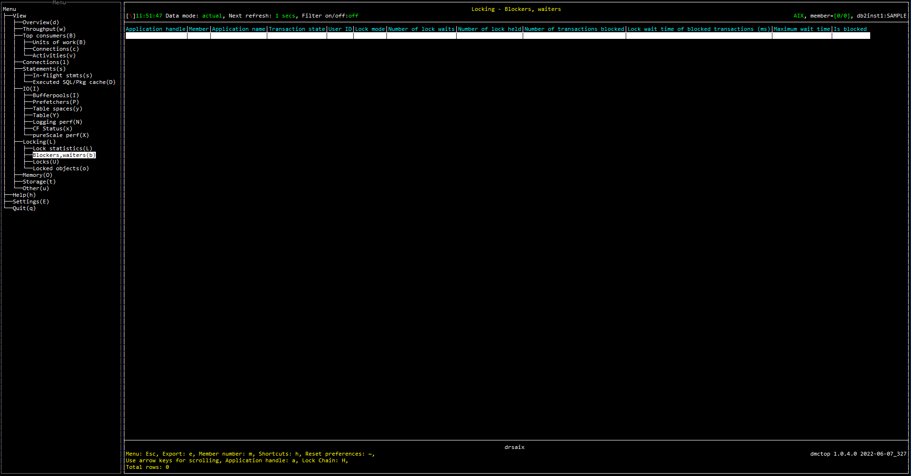

# Purpose

# Screenshot

# Metric shown

### Application handle

A system-wide unique ID for the application.

**Source:** [MON_GET_LOCKS](https://www.ibm.com/docs/en/db2/11.5?topic=mpf-mon-get-locks-table-function-list-all-locks-in-currently-connected-database)(NULL, #MEMBER#).[APPLICATION_HANDLE](https://www.ibm.com/docs/en/db2/11.5?topic=reference-#r0054410)

### Member

The identifier for the database member from which the data was retrieved for this result record.

**Source:** [MON_GET_LOCKS](https://www.ibm.com/docs/en/db2/11.5?topic=mpf-mon-get-locks-table-function-list-all-locks-in-currently-connected-database)(NULL, #MEMBER#).[MEMBER](https://www.ibm.com/docs/en/db2/11.5?topic=reference-m#r0054432)

### Application name

The name of the application running at the client, as known to the database or Db2 Connect server.

**Source:** [WLM_GET_SERVICE_CLASS_WORKLOAD_OCCURRENCES](https://www.ibm.com/docs/en/db2woc?topic=wmr-wlm-get-service-class-workload-occurrences-table-function-list-workload-occurrences)(NULL, NULL, #MEMBER#).[APPLICATION_NAME](https://www.ibm.com/docs/en/db2woc?topic=reference-#r0001165)

### Transaction state

The state of the workload occurrence.

**Source:** [MON_GET_UNIT_OF_WORK](https://www.ibm.com/docs/en/db2/11.5?topic=mpf-mon-get-unit-work-get-unit-work-metrics)([MON_GET_LOCKS](https://www.ibm.com/docs/en/db2/11.5?topic=mpf-mon-get-locks-table-function-list-all-locks-in-currently-connected-database)(NULL, #MEMBER#).[APPLICATION_HANDLE](https://www.ibm.com/docs/en/db2/11.5?topic=reference-#r0054410), [MON_GET_LOCKS](https://www.ibm.com/docs/en/db2/11.5?topic=mpf-mon-get-locks-table-function-list-all-locks-in-currently-connected-database)(NULL, #MEMBER#).[MEMBER](https://www.ibm.com/docs/en/db2/11.5?topic=reference-m#r0054432)).[WORKLOAD_OCCURRENCE_STATE](https://www.ibm.com/docs/en/db2/11.5?topic=reference-w#r0054064)

### User ID

The current authorization ID for the session being used by this application.

**Source:** [WLM_GET_SERVICE_CLASS_WORKLOAD_OCCURRENCES](https://www.ibm.com/docs/en/db2woc?topic=wmr-wlm-get-service-class-workload-occurrences-table-function-list-workload-occurrences)(NULL, NULL, #MEMBER#).[SESSION_AUTH_ID](https://www.ibm.com/docs/en/db2woc?topic=reference-s#r0010880)

### Lock mode

The type of lock being held. 

**Source:** [MON_GET_LOCKS](https://www.ibm.com/docs/en/db2/11.5?topic=mpf-mon-get-locks-table-function-list-all-locks-in-currently-connected-database)(NULL, #MEMBER#).[LOCK_MODE](https://www.ibm.com/docs/en/db2/11.5?topic=reference-l#r0001286)

### Number of lock waits

The total number of times that applications or connections waited for locks.

**Source:** [MON_GET_UNIT_OF_WORK](https://www.ibm.com/docs/en/db2/11.5?topic=mpf-mon-get-unit-work-get-unit-work-metrics)([MON_GET_LOCKS](https://www.ibm.com/docs/en/db2/11.5?topic=mpf-mon-get-locks-table-function-list-all-locks-in-currently-connected-database)(NULL, #MEMBER#).[APPLICATION_HANDLE](https://www.ibm.com/docs/en/db2/11.5?topic=reference-#r0054410), [MON_GET_LOCKS](https://www.ibm.com/docs/en/db2/11.5?topic=mpf-mon-get-locks-table-function-list-all-locks-in-currently-connected-database)(NULL, #MEMBER#).[MEMBER](https://www.ibm.com/docs/en/db2/11.5?topic=reference-m#r0054432)).SUM([LOCK_WAITS](https://www.ibm.com/docs/en/db2/11.5?topic=reference-l#r0001293))

### Number of lock held

The number of locks currently held.

**Source:** [MON_GET_UNIT_OF_WORK](https://www.ibm.com/docs/en/db2/11.5?topic=mpf-mon-get-unit-work-get-unit-work-metrics)([MON_GET_LOCKS](https://www.ibm.com/docs/en/db2/11.5?topic=mpf-mon-get-locks-table-function-list-all-locks-in-currently-connected-database)(NULL, #MEMBER#).[APPLICATION_HANDLE](https://www.ibm.com/docs/en/db2/11.5?topic=reference-#r0054410), [MON_GET_LOCKS](https://www.ibm.com/docs/en/db2/11.5?topic=mpf-mon-get-locks-table-function-list-all-locks-in-currently-connected-database)(NULL, #MEMBER#).[MEMBER](https://www.ibm.com/docs/en/db2/11.5?topic=reference-m#r0054432)).SUM([NUM_LOCKS_HELD](https://www.ibm.com/docs/en/db2/11.5?topic=reference-l#r0001281))

### Number of transactions blocked

The number of other transactions that are currently waiting on this lock (i.e. blocked by this transaction).

### Lock wait time of blocked transactions

The total time spent waiting on locks for all transactions currently waiting on this lock.

This time includes time previously spent waiting on other locks.

**Source:** [MON_GET_UNIT_OF_WORK](https://www.ibm.com/docs/en/db2/11.5?topic=mpf-mon-get-unit-work-get-unit-work-metrics)([MON_GET_LOCKS](https://www.ibm.com/docs/en/db2/11.5?topic=mpf-mon-get-locks-table-function-list-all-locks-in-currently-connected-database)(NULL, #MEMBER#).[APPLICATION_HANDLE](https://www.ibm.com/docs/en/db2/11.5?topic=reference-#r0054410), [MON_GET_LOCKS](https://www.ibm.com/docs/en/db2/11.5?topic=mpf-mon-get-locks-table-function-list-all-locks-in-currently-connected-database)(NULL, #MEMBER#).[MEMBER](https://www.ibm.com/docs/en/db2/11.5?topic=reference-m#r0054432)).SUM([LOCK_WAIT_TIME](https://www.ibm.com/docs/en/db2/11.5?topic=reference-l#r0001294))

### Maximum wait time

The largest value for total time spent waiting on locks for a transaction blocked by this lock.

This time includes time previously spent waiting on other locks.

**Source:** [MON_GET_UNIT_OF_WORK](https://www.ibm.com/docs/en/db2/11.5?topic=mpf-mon-get-unit-work-get-unit-work-metrics)([MON_GET_LOCKS](https://www.ibm.com/docs/en/db2/11.5?topic=mpf-mon-get-locks-table-function-list-all-locks-in-currently-connected-database)(NULL, #MEMBER#).[APPLICATION_HANDLE](https://www.ibm.com/docs/en/db2/11.5?topic=reference-#r0054410), [MON_GET_LOCKS](https://www.ibm.com/docs/en/db2/11.5?topic=mpf-mon-get-locks-table-function-list-all-locks-in-currently-connected-database)(NULL, #MEMBER#).[MEMBER](https://www.ibm.com/docs/en/db2/11.5?topic=reference-m#r0054432)).MAX([LOCK_WAIT_TIME](https://www.ibm.com/docs/en/db2/11.5?topic=reference-l#r0001294))

### Is blocked

Flag (Yes or No) indicating whether the transaction holding this lock is itself blocked waiting on another lock.

