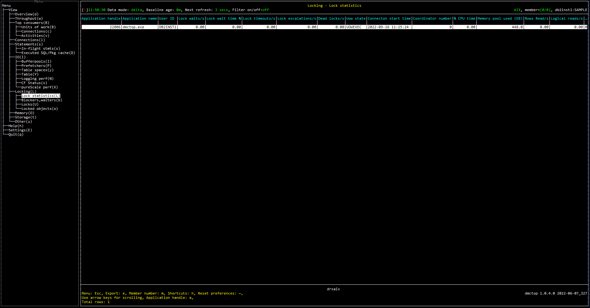

# Purpose

# Screenshot

# Metric shown

### Application handle

A system-wide unique ID for the application.

**Source:** [MON_GET_CONNECTION](https://www.ibm.com/docs/en/db2/11.5?topic=functions-mon-get-connection-get-connection-metrics)(NULL, #MEMBER#).[APPLICATION_HANDLE](https://www.ibm.com/docs/en/db2/11.5?topic=reference-#r0054410)

### Application name

The name of the application running at the client, as known to the database or Db2 Connect server.

**Source:** [MON_GET_CONNECTION](https://www.ibm.com/docs/en/db2/11.5?topic=functions-mon-get-connection-get-connection-metrics)(NULL, #MEMBER#).[APPLICATION_NAME](https://www.ibm.com/docs/en/db2/11.5?topic=reference-#r0001165)

### User ID

The current authorization ID for the session being used by this application.

**Source:** [MON_GET_CONNECTION](https://www.ibm.com/docs/en/db2/11.5?topic=functions-mon-get-connection-get-connection-metrics)(NULL, #MEMBER#).[SESSION_AUTH_ID](https://www.ibm.com/docs/en/db2/11.5?topic=reference-s#r0010880)

### Lock waits

The total number of times that applications or connections waited for locks.

**Source:** [MON_GET_CONNECTION](https://www.ibm.com/docs/en/db2/11.5?topic=functions-mon-get-connection-get-connection-metrics)(NULL, #MEMBER#).SUM([LOCK_WAITS](https://www.ibm.com/docs/en/db2/11.5?topic=reference-l#r0001293))

### Lock wait time

The total elapsed time spent waiting for locks.

**Source:** [MON_GET_CONNECTION](https://www.ibm.com/docs/en/db2/11.5?topic=functions-mon-get-connection-get-connection-metrics)(NULL, #MEMBER#).SUM([LOCK_WAIT_TIME](https://www.ibm.com/docs/en/db2/11.5?topic=reference-l#r0001294))

### Lock timeouts

The number of times that a request to lock an object timed out instead of being granted.

**Source:** [MON_GET_CONNECTION](https://www.ibm.com/docs/en/db2/11.5?topic=functions-mon-get-connection-get-connection-metrics)(NULL, #MEMBER#).SUM([LOCK_TIMEOUTS](https://www.ibm.com/docs/en/db2/11.5?topic=reference-l#r0001290))

### Lock escalations

The number of times that locks have been escalated from several row locks to a table lock.

**Source:** [MON_GET_CONNECTION](https://www.ibm.com/docs/en/db2/11.5?topic=functions-mon-get-connection-get-connection-metrics)(NULL, #MEMBER#).SUM([LOCK_ESCALS](https://www.ibm.com/docs/en/db2/11.5?topic=reference-l#r0001284))

### Dead locks

The total number of deadlocks that have occurred.

**Source:** [MON_GET_CONNECTION](https://www.ibm.com/docs/en/db2/11.5?topic=functions-mon-get-connection-get-connection-metrics)(NULL, #MEMBER#).SUM([DEADLOCKS](https://www.ibm.com/docs/en/db2/11.5?topic=reference-d#r0001283))

### Uow state

The state of the workload occurrence.

**Source:** [MON_GET_UNIT_OF_WORK](https://www.ibm.com/docs/en/db2/11.5?topic=mpf-mon-get-unit-work-get-unit-work-metrics)([MON_GET_CONNECTION](https://www.ibm.com/docs/en/db2/11.5?topic=functions-mon-get-connection-get-connection-metrics)(NULL, #MEMBER#).[APPLICATION_HANDLE](https://www.ibm.com/docs/en/db2/11.5?topic=reference-#r0054410), [MON_GET_CONNECTION](https://www.ibm.com/docs/en/db2/11.5?topic=functions-mon-get-connection-get-connection-metrics)(NULL, #MEMBER#).[COORD_MEMBER](https://www.ibm.com/docs/en/db2/11.5?topic=reference-c#r0055426)).MAX([WORKLOAD_OCCURRENCE_STATE](https://www.ibm.com/docs/en/db2/11.5?topic=reference-w#r0054064))

### Connecton start time

The time at which the connection was established with the database server.

**Source:** [MON_GET_CONNECTION](https://www.ibm.com/docs/en/db2/11.5?topic=functions-mon-get-connection-get-connection-metrics)(NULL, #MEMBER#).MIN([CONNECTION_START_TIME](https://www.ibm.com/docs/en/db2/11.5?topic=reference-c#r0056524))

### Coordinator number

The coordinating member for an application.

**Source:** [MON_GET_CONNECTION](https://www.ibm.com/docs/en/db2/11.5?topic=functions-mon-get-connection-get-connection-metrics)(NULL, #MEMBER#).[COORD_MEMBER](https://www.ibm.com/docs/en/db2/11.5?topic=reference-c#r0055426))

### Total cpu time

The total amount of CPU time used while within the database system.

**Source:** [MON_GET_CONNECTION](https://www.ibm.com/docs/en/db2/11.5?topic=functions-mon-get-connection-get-connection-metrics)(NULL, #MEMBER#).SUM([TOTAL_CPU_TIME](https://www.ibm.com/docs/en/db2/11.5?topic=reference-t#r0054057))

### Memory pool used

The amount of committed memory in use by this memory pool.

**Source:** [MON_GET_MEMORY_POOL](https://www.ibm.com/docs/en/db2/11.5?topic=mpf-mon-get-memory-pool-get-memory-pool-information)
(NULL, [CURRENT_SERVER](https://www.ibm.com/docs/en/db2-for-zos/11?topic=registers-current-server), #MEMBER#).SUM([MEMORY_POOL_USED](https://www.ibm.com/docs/en/db2/11.5?topic=reference-m#r0059534))

### Rows read

The number of rows read from the table.

**Source:** [MON_GET_CONNECTION](https://www.ibm.com/docs/en/db2/11.5?topic=functions-mon-get-connection-get-connection-metrics)(NULL, #MEMBER#).SUM([ROWS_READ](https://www.ibm.com/docs/en/db2/11.5?topic=reference-r#r0001317))

### Logical reads

Indicates the number of pages read from the buffer pool (logical).

**Source:** [MON_GET_CONNECTION](https://www.ibm.com/docs/en/db2/11.5?topic=functions-mon-get-connection-get-connection-metrics)(NULL, #MEMBER#).SUM([POOL_DATA_L_READS](https://www.ibm.com/docs/en/db2/11.5?topic=reference-p#r0001235) + [POOL_INDEX_L_READS](https://www.ibm.com/docs/en/db2/11.5?topic=reference-p#r0001238) + [POOL_TEMP_DATA_L_READS](https://www.ibm.com/docs/en/db2/11.5?topic=reference-p#r0011302) + [POOL_TEMP_INDEX_L_READS](https://www.ibm.com/docs/en/db2/11.5?topic=reference-p#r0011303) + [POOL_XDA_L_READS](https://www.ibm.com/docs/en/db2/11.5?topic=reference-p#r0022731) + [POOL_TEMP_XDA_L_READS](https://www.ibm.com/docs/en/db2/11.5?topic=reference-p#r0022738))

### Locks held

The number of locks currently held.

**Source:** [MON_GET_UNIT_OF_WORK](https://www.ibm.com/docs/en/db2/11.5?topic=mpf-mon-get-unit-work-get-unit-work-metrics)(NULL, #MEMBER#).SUM([NUM_LOCKS_HELD](https://www.ibm.com/docs/en/db2/11.5?topic=reference-l#r0001281))

### Log Used

The amount of log space used in the current unit of work of the monitored application.

**Source:** [MON_GET_UNIT_OF_WORK](https://www.ibm.com/docs/en/db2/11.5?topic=mpf-mon-get-unit-work-get-unit-work-metrics)(NULL, #MEMBER#).SUM([UOW_LOG_SPACE_USED](https://www.ibm.com/docs/en/db2/11.5?topic=reference-u#r0001280))

### Idle time

The elapsed time from last time that the event, being processed by the agent, was changed.

**Source:**

[CURRENT TIMESTAMP](https://www.ibm.com/docs/en/db2-for-zos/11?topic=registers-current-timestamp)

[WLM_GET_SERVICE_CLASS_AGENTS](https://www.ibm.com/docs/en/db2/11.5?topic=views-wlm-get-service-class-agents-v97)(NULL, NULL, [APPLICATION_HANDLE](https://www.ibm.com/docs/en/db2/11.5?topic=reference-#r0054410), [COORD_MEMBER](https://www.ibm.com/docs/en/db2/11.5?topic=reference-c#r0055426)).
[AGENT_STATE_LAST_UPDATE_TIME](https://www.ibm.com/docs/en/db2/11.5?topic=views-wlm-get-service-class-agents-v97)

### Workload name

The name of the workload.

**Source:** [MON_GET_UNIT_OF_WORK](https://www.ibm.com/docs/en/db2/11.5?topic=mpf-mon-get-unit-work-get-unit-work-metrics)(NULL, #MEMBER#).MIN([WORKLOAD_NAME](https://www.ibm.com/docs/en/db2/11.5?topic=reference-w#r0051600))

