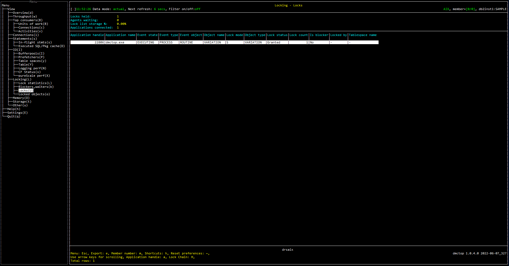

# Purpose

Locks view shows the list of locks in the currently connected database. 


# Screenshot



# Metric shown

## Grid


<hr />

### Locks held

The number of locks in the currently connected database.

```
SELECT COUNT(*) AS LOCKS_HELD 
FROM   TABLE(MON_GET_LOCKS(NULL, #MEMBER#))
```

**Source:** [MON_GET_LOCKS](https://www.ibm.com/docs/en/db2/11.5?topic=mpf-mon-get-locks-table-function-list-all-locks-in-currently-connected-database)


<hr />

### Agents waiting

The number of locks that each application's agents (that are connected to the current database) are waiting to acquire.

```
SELECT COUNT(*) AS LOCKS_WAIT 
FROM   TABLE(MON_GET_APPL_LOCKWAIT(NULL, #MEMBER#))
```

**Source:** [MON_GET_APPL_LOCKWAIT](https://www.ibm.com/docs/en/db2woc?topic=mpf-mon-get-appl-lockwait-table-function-get-information-about-locks-which-application-is-waiting)


<hr />

### Lock list storage %

The average number of locks per byte.

= LOCKS_HELD / LOCK_LIST_IN_USE_BYTES 

LOCKS_HELD = 
```
SELECT COUNT(*) AS LOCKS_HELD 
FROM   TABLE(MON_GET_LOCKS(NULL, #MEMBER#))
```


**Source:** 

LOCK_LIST_IN_USE_BYTES = [MON_GET_DATABASE](https://www.ibm.com/docs/en/db2/11.5?topic=functions-mon-get-database-get-database-metrics)(#MEMBER#).SUM([LOCK_LIST_IN_USE](https://www.ibm.com/docs/en/db2/11.5?topic=reference-l#r0001282))

[MON_GET_LOCKS](https://www.ibm.com/docs/en/db2/11.5?topic=mpf-mon-get-locks-table-function-list-all-locks-in-currently-connected-database)


<hr />

### Applications connected

The number of connections from the given database member.

```
SELECT COUNT(*) AS APPL_CONNECTED 
FROM   TABLE(MON_GET_CONNECTION(NULL, #MEMBER#))
```

**Source:** [MON_GET_CONNECTION](https://www.ibm.com/docs/en/db2/11.5?topic=functions-mon-get-connection-get-connection-metrics)


## Table


<hr />

### Application handle

A system-wide unique ID for the application. 

**Source:** [MON_GET_LOCKS](https://www.ibm.com/docs/en/db2/11.5?topic=mpf-mon-get-locks-table-function-list-all-locks-in-currently-connected-database)(NULL,#MEMBER#).[APPLICATION_HANDLE](https://www.ibm.com/docs/en/db2/11.5?topic=reference-#r0054410)


<hr />

### Application name

The name of the application running at the client.

**Source:** [MON_GET_AGENT](https://www.ibm.com/docs/en/db2/10.5?topic=mpf-mon-get-agent-list-agents-running-in-service-class)(NULL,NULL,NULL,#MEMBER#).[APPLICATION_NAME](https://www.ibm.com/docs/en/db2/10.5?topic=reference-#r0001165)


<hr />

### Event state

State of the event last processed by this agent. The possible values are as follows:
* EXECUTING
* IDLE

**Source:** [MON_GET_AGENT](https://www.ibm.com/docs/en/db2/10.5?topic=mpf-mon-get-agent-list-agents-running-in-service-class)(NULL,NULL,NULL,#MEMBER#).[EVENT_STATE](https://www.ibm.com/docs/en/db2/10.5?topic=mpf-mon-get-agent-list-agents-running-in-service-class)


<hr />

### Event type

Type of event last processed by this agent. The possible values are as follows:
* ACQUIRE
* PROCESS
* WAIT

**Source:** [MON_GET_AGENT](https://www.ibm.com/docs/en/db2/10.5?topic=mpf-mon-get-agent-list-agents-running-in-service-class)(NULL,NULL,NULL,#MEMBER#).[EVENT_TYPE](https://www.ibm.com/docs/en/db2/10.5?topic=mpf-mon-get-agent-list-agents-running-in-service-class)


<hr />

### Event object

Object of the event last processed by this agent. The possible values are as follows:
* COMPRESSION_DICTIONARY_BUILD
* IMPLICIT_REBIND
* INDEX_RECREATE
* LOCK
* LOCK_ESCALATION
* QP_QUEUE
* REMOTE_REQUEST
* REQUEST
* ROUTINE
* WLM_QUEUE


**Source:** [MON_GET_AGENT](https://www.ibm.com/docs/en/db2/10.5?topic=mpf-mon-get-agent-list-agents-running-in-service-class)(NULL,NULL,NULL,#MEMBER#).[EVENT_OBJECT](https://www.ibm.com/docs/en/db2/10.5?topic=mpf-mon-get-agent-list-agents-running-in-service-class)


<hr />

### Object name

The name of event object.

= `<TABSCHEMA>.<TABNAME>`

**Source:** 

TABSCHEMA = [MON_GET_TABLE](https://www.ibm.com/docs/en/db2/11.5?topic=functions-mon-get-table-get-table-metrics)(NULL,NULL, #MEMBER#).[TABSCHEMA](https://www.ibm.com/docs/en/db2/11.5?topic=reference-t#r0001311)

TABNAME = [MON_GET_TABLE](https://www.ibm.com/docs/en/db2/11.5?topic=functions-mon-get-table-get-table-metrics)(NULL,NULL, #MEMBER#).[TABNAME](https://www.ibm.com/docs/en/db2/11.5?topic=reference-t#r0001310)


<hr />

### Lock mode

The type of lock being held.

**Source:** [MON_GET_LOCKS](https://www.ibm.com/docs/en/db2/11.5?topic=mpf-mon-get-locks-table-function-list-all-locks-in-currently-connected-database)(NULL,#MEMBER#).[LOCK_MODE](https://www.ibm.com/docs/en/db2/11.5?topic=reference-l#r0001286)


<hr />

### Object type

The type of object against which the application holds a lock (for object-lock-level information), or the type of object for which the application is waiting to obtain a lock (for application-level and deadlock-level information).

**Source:** [MON_GET_LOCKS](https://www.ibm.com/docs/en/db2/11.5?topic=mpf-mon-get-locks-table-function-list-all-locks-in-currently-connected-database)(NULL,#MEMBER#).[LOCK_OBJECT_TYPE](https://www.ibm.com/docs/en/db2/11.5?topic=reference-l#r0001288)


<hr />

### Lock status

The internal status of the lock.

**Source:** [MON_GET_LOCKS](https://www.ibm.com/docs/en/db2/11.5?topic=mpf-mon-get-locks-table-function-list-all-locks-in-currently-connected-database)(NULL,#MEMBER#).[LOCK_STATUS](https://www.ibm.com/docs/en/db2/11.5?topic=reference-l#r0001287)


<hr />

### Lock count

The number of locks currently held.

**Source:** [MON_GET_LOCKS](https://www.ibm.com/docs/en/db2/11.5?topic=mpf-mon-get-locks-table-function-list-all-locks-in-currently-connected-database)(NULL,#MEMBER#).[LOCK_COUNT](https://www.ibm.com/docs/en/db2/11.5?topic=reference-l#r0009815)


<hr />

### Is blocker

Flag (Yes or No) indicating whether the transaction holding this lock is itself blocked waiting on another lock.


<hr />

### Locked by

The application that is holding the lock.

If the LOCK_STATUS column is W or C, then get the application handle id of the first object from the lock list with LOCK_STATUS equals to G with given LOCK_NAME.

**Source:**

LOCK_STATUS  = [MON_GET_LOCKS](https://www.ibm.com/docs/en/db2/11.5?topic=mpf-mon-get-locks-table-function-list-all-locks-in-currently-connected-database)(NULL,#MEMBER#).[LOCK_STATUS](https://www.ibm.com/docs/en/db2/11.5?topic=reference-l#r0001287)

LOCK_NAME = [MON_GET_LOCKS](https://www.ibm.com/docs/en/db2/11.5?topic=mpf-mon-get-locks-table-function-list-all-locks-in-currently-connected-database)(NULL,#MEMBER#).[LOCK_NAME](https://www.ibm.com/docs/en/db2/11.5?topic=reference-l#r0009819)


<hr />

### Tablespace name

The name of a table space.

**Source:** [MON_GET_TABLESPACE](https://www.ibm.com/docs/en/db2oc?topic=functions-mon-get-tablespace-get-table-space-metrics).[TBSP_NAME](https://www.ibm.com/docs/en/db2oc?topic=reference-t#r0001295)

