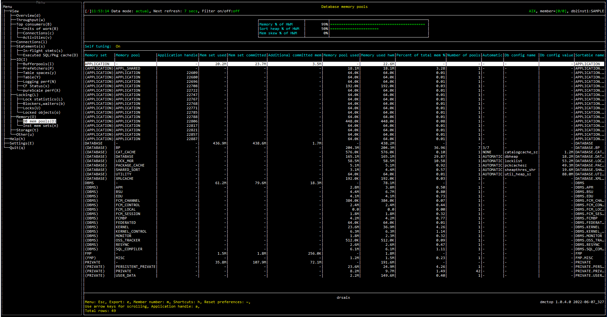

# Purpose

Database memory pools view shows the list of memory pools. This view is helpful to visualize the usage of memory pool of each memory set.


# Screenshot



# Metric shown

## Gauge


<hr />

### Memory % of HWM

The percentage of the highest amount of memory assigned to this pool since it was created over total amount of committed memory.

= MEMORY_POOL_USED_HWM / MEMORY_POOL_USED 

**Source:**

MEMORY_POOL_USED_HWM = [MON_GET_MEMORY_POOL](https://www.ibm.com/docs/en/db2/11.5?topic=mpf-mon-get-memory-pool-get-memory-pool-information)('DATABASE', NULL, #MEMBER#).SUM([MEMORY_POOL_USED_HWM](https://www.ibm.com/docs/en/db2/11.5?topic=reference-m#r0059453))

MEMORY_POOL_USED = [MON_GET_MEMORY_POOL](https://www.ibm.com/docs/en/db2/11.5?topic=mpf-mon-get-memory-pool-get-memory-pool-information)('DATABASE', NULL, #MEMBER#).SUM([MEMORY_POOL_USED](https://www.ibm.com/docs/en/db2/11.5?topic=reference-m#r0059534))


<hr />

### Sort heap % of HWM

The percentage of the highest amount of shared sort memory assigned to this pool since it was created over total amount of committed shared sort memory.


= SHARED_SORT_MEMORY_USED_HWM / SHARED_SORT_MEMORY_USED

**Source:**

SHARED_SORT_MEMORY_USED_HWM = [MON_GET_MEMORY_POOL](https://www.ibm.com/docs/en/db2/11.5?topic=mpf-mon-get-memory-pool-get-memory-pool-information)('DATABASE', NULL, #MEMBER#).SUM([MEMORY_POOL_USED_HWM](https://www.ibm.com/docs/en/db2/11.5?topic=reference-m#r0059453)) WHERE MEMORY_POOL_TYPE = 'SHARED_SORT'

SHARED_SORT_MEMORY_USED = [MON_GET_MEMORY_POOL](https://www.ibm.com/docs/en/db2/11.5?topic=mpf-mon-get-memory-pool-get-memory-pool-information)('DATABASE', NULL, #MEMBER#).SUM([MEMORY_POOL_USED](https://www.ibm.com/docs/en/db2/11.5?topic=reference-m#r0059534)) WHERE MEMORY_POOL_TYPE = 'SHARED_SORT'

MEMORY_POOL_TYPE = [MON_GET_MEMORY_POOL](https://www.ibm.com/docs/en/db2/11.5?topic=mpf-mon-get-memory-pool-get-memory-pool-information)('DATABASE', NULL, #MEMBER#).[MEMORY_POOL_TYPE](https://www.ibm.com/docs/en/db2/11.5?topic=reference-m#r0059451)


<hr />

### Sort heap % of HWM

The percentage of max amount of committed memory skewed from average.

= (MAX(SUM_MEMORY) - AVG(SUM_MEMORY)) / MAX(SUM_MEMORY)

**Source:**

SUM_MEMORY = [MON_GET_MEMORY_POOL](https://www.ibm.com/docs/en/db2/11.5?topic=mpf-mon-get-memory-pool-get-memory-pool-information)('DATABASE', NULL, #MEMBER#).[MEMORY_POOL_USED](https://www.ibm.com/docs/en/db2/11.5?topic=reference-m#r0059534)

## Grid


<hr />

### Self tuning

Whether self tuning is on or off.

```
SELECT (CASE WHEN SUBSTR(VALUE,1, 2) = 'ON' then 'On' ELSE 'Off' END) 
FROM SYSIBMADM.DBCFG
WHERE NAME = 'self_tuning_mem' and MEMBER= 0
```
**Source:** [SYSIBMADM.DBCFG](https://www.ibm.com/docs/en/db2/11.5?topic=views-dbcfg-database-configuration-parameter-information)


## Table


<hr />

### Memory set

The type of memory set.

= `(<MEMORY_SET_TYPE>)`

**Source:** [MON_GET_MEMORY_POOL](https://www.ibm.com/docs/en/db2/11.5?topic=mpf-mon-get-memory-pool-get-memory-pool-information)(NULL, [CURRENT_SERVER](https://www.ibm.com/docs/en/db2-for-zos/11?topic=registers-current-server), #MEMBER#).[MEMORY_SET_TYPE](https://www.ibm.com/docs/en/db2/11.5?topic=reference-m#r0059444)


<hr />

### Memory pool

The name of the memory pool.

**Source:** [MON_GET_MEMORY_POOL](https://www.ibm.com/docs/en/db2/11.5?topic=mpf-mon-get-memory-pool-get-memory-pool-information)(NULL, [CURRENT_SERVER](https://www.ibm.com/docs/en/db2-for-zos/11?topic=registers-current-server), #MEMBER#).[MEMORY_POOL_TYPE](https://www.ibm.com/docs/en/db2/11.5?topic=reference-m#r0059451)


<hr />

### Application handle

A system-wide unique ID for the application. Only applicable to APPLICATION, STATISTICS, STATEMENT, and SORT_PRIVATE memory pool types. Otherwise, the value is NULL.

**Source:** [MON_GET_MEMORY_POOL](https://www.ibm.com/docs/en/db2/11.5?topic=mpf-mon-get-memory-pool-get-memory-pool-information)(NULL, [CURRENT_SERVER](https://www.ibm.com/docs/en/db2-for-zos/11?topic=registers-current-server), #MEMBER#).[APPLICATION_HANDLE](https://www.ibm.com/docs/en/db2/11.5?topic=reference-#r0054410)


<hr />

### Mem set used

The amount of memory from this set that has been assigned to memory pools.

**Source:** [MON_GET_MEMORY_SET](https://www.ibm.com/docs/en/db2/11.5?topic=mpf-mon-get-memory-set-get-memory-set-information)(NULL, [CURRENT_SERVER](https://www.ibm.com/docs/en/db2-for-zos/11?topic=registers-current-server), #MEMBER#).[MEMORY_SET_USED](https://www.ibm.com/docs/en/db2/11.5?topic=reference-m#r0059449)


<hr />

### Mem set committed

The amount of memory currently committed to this memory set.

**Source:** [MON_GET_MEMORY_SET](https://www.ibm.com/docs/en/db2/11.5?topic=mpf-mon-get-memory-set-get-memory-set-information)(NULL, [CURRENT_SERVER](https://www.ibm.com/docs/en/db2-for-zos/11?topic=registers-current-server), #MEMBER#).[MEMORY_SET_COMMITTED](https://www.ibm.com/docs/en/db2/11.5?topic=reference-m#r0059448)


<hr />

### Additional committed mem

The amount of memory currently committed to this memory set but has not been assigned to memory pools.


= MEMORY_SET_COMMITTED - MEMORY_SET_USED

**Source:** 

MEMORY_SET_COMMITTED = [MON_GET_MEMORY_SET](https://www.ibm.com/docs/en/db2/11.5?topic=mpf-mon-get-memory-set-get-memory-set-information)(NULL, [CURRENT_SERVER](https://www.ibm.com/docs/en/db2-for-zos/11?topic=registers-current-server), #MEMBER#).[MEMORY_SET_COMMITTED](https://www.ibm.com/docs/en/db2/11.5?topic=reference-m#r0059448)

MEMORY_SET_USED = [MON_GET_MEMORY_SET](https://www.ibm.com/docs/en/db2/11.5?topic=mpf-mon-get-memory-set-get-memory-set-information)(NULL, [CURRENT_SERVER](https://www.ibm.com/docs/en/db2-for-zos/11?topic=registers-current-server), #MEMBER#).[MEMORY_SET_USED](https://www.ibm.com/docs/en/db2/11.5?topic=reference-m#r0059449)


<hr />

### Memory pool used

Amount of committed memory in use by this memory pool.

**Source:** [MON_GET_MEMORY_POOL](https://www.ibm.com/docs/en/db2/11.5?topic=mpf-mon-get-memory-pool-get-memory-pool-information)(NULL, [CURRENT_SERVER](https://www.ibm.com/docs/en/db2-for-zos/11?topic=registers-current-server),#MEMBER#).[MEMORY_POOL_USED](https://www.ibm.com/docs/en/db2/11.5?topic=reference-m#r0059534)


<hr />

### Memory used hwm

The highest amount of memory assigned to this pool since it was created.

**Source:** [MON_GET_MEMORY_POOL](https://www.ibm.com/docs/en/db2/11.5?topic=mpf-mon-get-memory-pool-get-memory-pool-information)(NULL, [CURRENT_SERVER](https://www.ibm.com/docs/en/db2-for-zos/11?topic=registers-current-server),#MEMBER#).[MEMORY_POOL_USED_HWM](https://www.ibm.com/docs/en/db2/11.5?topic=reference-m#r0059453)


<hr />

### Percent of total mem %

The percentage of the amount of committed memory in use by this memory pool.

= MEMORY_POOL_USED / SUM(MEMORY_POOL_USED)

**Source:** MEMORY_POOL_USED = [MON_GET_MEMORY_POOL](https://www.ibm.com/docs/en/db2/11.5?topic=mpf-mon-get-memory-pool-get-memory-pool-information)(NULL, [CURRENT_SERVER](https://www.ibm.com/docs/en/db2-for-zos/11?topic=registers-current-server),#MEMBER#).[MEMORY_POOL_USED](https://www.ibm.com/docs/en/db2/11.5?topic=reference-m#r0059534)


<hr />

### Number of pools

The total number of memory pools. 


<hr />

### Automatic

Provides specific information for the configuration parameter current value. Valid values are:
* NONE - no additional information
* AUTOMATIC - the configuration parameter has been set to automatic
* COMPUTED - the configuration parameter has been set to a computed value


**Source:** [SYSIBMADM.DBCFG](https://www.ibm.com/docs/en/db2/11.5?topic=views-dbcfg-database-configuration-parameter-information).MIN([VALUE_FLAGS](https://www.ibm.com/docs/en/db2/11.5?topic=views-dbcfg-database-configuration-parameter-information))


<hr />

### Db config name

DB configuration parameter name.

**Source:** [SYSIBMADM.DBCFG](https://www.ibm.com/docs/en/db2/11.5?topic=views-dbcfg-database-configuration-parameter-information).[NAME](https://www.ibm.com/docs/en/db2/11.5?topic=views-dbcfg-database-configuration-parameter-information)


<hr />

### Db config value 

The current value of the configuration parameter stored in memory.

**Source:** [SYSIBMADM.DBCFG](https://www.ibm.com/docs/en/db2/11.5?topic=views-dbcfg-database-configuration-parameter-information).[VALUE](https://www.ibm.com/docs/en/db2/11.5?topic=views-dbcfg-database-configuration-parameter-information)


<hr />

### Sortable name

The string to sort the memory pool.

= `<MEMORY_SET_TYPE >.<MEMORY_POOL_TYPE >`

**Source:** 

MEMORY_SET_TYPE = [MON_GET_MEMORY_POOL](https://www.ibm.com/docs/en/db2/11.5?topic=mpf-mon-get-memory-pool-get-memory-pool-information)(NULL, [CURRENT_SERVER](https://www.ibm.com/docs/en/db2-for-zos/11?topic=registers-current-server),#MEMBER#).[MEMORY_SET_TYPE](https://www.ibm.com/docs/en/db2/11.5?topic=reference-m#r0059444)

MEMORY_POOL_TYPE = [MON_GET_MEMORY_POOL](https://www.ibm.com/docs/en/db2/11.5?topic=mpf-mon-get-memory-pool-get-memory-pool-information)(NULL, [CURRENT_SERVER](https://www.ibm.com/docs/en/db2-for-zos/11?topic=registers-current-server), #MEMBER#).[MEMORY_POOL_TYPE](https://www.ibm.com/docs/en/db2/11.5?topic=reference-m#r0059451)


