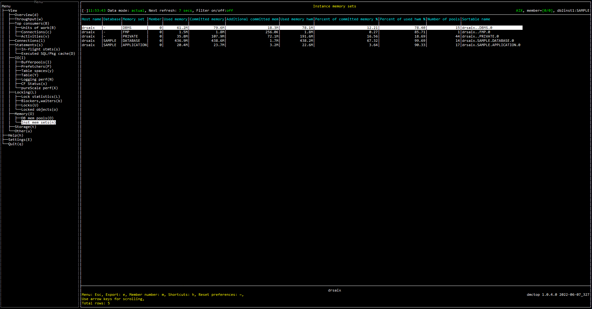

# Purpose

Instance memory sets view shows the list of memory sets. This view is helpful to visualize the usage of each memory set.

# Screenshot

# Metric shown

### Host name

The name of the host on which the cluster caching facility process resides.

**Source:** [MON_GET_MEMORY_SET](https://www.ibm.com/docs/en/db2/11.5?topic=mpf-mon-get-memory-set-get-memory-set-information)(NULL, NULL, #MEMBER#).[HOST_NAME](https://www.ibm.com/docs/en/db2/11.5?topic=reference-h#r0056209)

### Database

The real name of the database for which information is collected or to which the application is connected. 

**Source:** [MON_GET_MEMORY_SET](https://www.ibm.com/docs/en/db2/11.5?topic=mpf-mon-get-memory-set-get-memory-set-information)(NULL, NULL, #MEMBER#).[DB_NAME](https://www.ibm.com/docs/en/db2/11.5?topic=reference-d#r0001152)

### Memory set

The type of memory set.

**Source:** [MON_GET_MEMORY_SET](https://www.ibm.com/docs/en/db2/11.5?topic=mpf-mon-get-memory-set-get-memory-set-information)(NULL, NULL, #MEMBER#).[MEMORY_SET_TYPE](https://www.ibm.com/docs/en/db2/11.5?topic=reference-m#r0059444)

### Member

The numeric identifier for the database member from which the data was retrieved for this result record.

**Source:** [MON_GET_MEMORY_SET](https://www.ibm.com/docs/en/db2/11.5?topic=mpf-mon-get-memory-set-get-memory-set-information)(NULL, NULL, #MEMBER#).[MEMBER](https://www.ibm.com/docs/en/db2/11.5?topic=reference-m#r0054432)

### Used memory

The amount of memory from this set that has been assigned to memory pools.

**Source:** [MON_GET_MEMORY_SET](https://www.ibm.com/docs/en/db2/11.5?topic=mpf-mon-get-memory-set-get-memory-set-information)(NULL, NULL, #MEMBER#).[MEMORY_SET_USED](https://www.ibm.com/docs/en/db2/11.5?topic=reference-m#r0059449)

### Committed memory

The amount of memory currently committed to this memory set.

**Source:** [MON_GET_MEMORY_SET](https://www.ibm.com/docs/en/db2/11.5?topic=mpf-mon-get-memory-set-get-memory-set-information)(NULL, NULL, #MEMBER#).[MEMORY_SET_COMMITTED](https://www.ibm.com/docs/en/db2/11.5?topic=reference-m#r0059448)

### Additional committed mem

The amount of memory currently committed to this memory set but has not been assigned to memory pools.

= MEMORY_SET_COMMITTED - MEMORY_SET_USED

**Source:**

MEMORY_SET_COMMITTED = [MON_GET_MEMORY_SET](https://www.ibm.com/docs/en/db2/11.5?topic=mpf-mon-get-memory-set-get-memory-set-information)(NULL, NULL, #MEMBER#).[MEMORY_SET_COMMITTED](https://www.ibm.com/docs/en/db2/11.5?topic=reference-m#r0059448)

MEMORY_SET_USED = [MON_GET_MEMORY_SET](https://www.ibm.com/docs/en/db2/11.5?topic=mpf-mon-get-memory-set-get-memory-set-information)(NULL, NULL, #MEMBER#).[MEMORY_SET_USED](https://www.ibm.com/docs/en/db2/11.5?topic=reference-m#r0059449)

### Used memory hwm

The highest amount of memory assigned to memory pools from this set since the memory set was created.

**Source:** [MON_GET_MEMORY_SET](https://www.ibm.com/docs/en/db2/11.5?topic=mpf-mon-get-memory-set-get-memory-set-information)(NULL, NULL, #MEMBER#).[MEMORY_SET_USED_HWM](https://www.ibm.com/docs/en/db2/11.5?topic=reference-m#r0059450)

### Percent of committed memory % 

The percentage of the amount of memory currently committed to this memory set.

= MEMORY_SET_COMMITTED / SUM(MEMORY_SET_COMMITTED)

**Source:**

MEMORY_SET_COMMITTED = [MON_GET_MEMORY_SET](https://www.ibm.com/docs/en/db2/11.5?topic=mpf-mon-get-memory-set-get-memory-set-information)(NULL, NULL, #MEMBER#).[MEMORY_SET_COMMITTED](https://www.ibm.com/docs/en/db2/11.5?topic=reference-m#r0059448)

### Percent of used hwm %

The amount of memory from this set that has been assigned to memory pools over the highest amount of memory assigned to memory pools from this set since the memory set was created.

= MEMORY_SET_USED / MEMORY_SET_USED_HWM

**Source:**

MEMORY_SET_USED = [MON_GET_MEMORY_SET](https://www.ibm.com/docs/en/db2/11.5?topic=mpf-mon-get-memory-set-get-memory-set-information)(NULL, NULL, #MEMBER#).[MEMORY_SET_USED](https://www.ibm.com/docs/en/db2/11.5?topic=reference-m#r0059449)

MEMORY_SET_USED_HWM = [MON_GET_MEMORY_SET](https://www.ibm.com/docs/en/db2/11.5?topic=mpf-mon-get-memory-set-get-memory-set-information)(NULL, NULL, #MEMBER#).[MEMORY_SET_USED_HWM](https://www.ibm.com/docs/en/db2/11.5?topic=reference-m#r0059450)

### Number of pools

The total number of memory pools. 

### Sortable name

The string to sort the memory set.

= `<HOST_NAME>.<DB_NAME>.<MEMORY_SET_TYPE>`

**Source:**

HOST_NAME = [MON_GET_MEMORY_SET](https://www.ibm.com/docs/en/db2/11.5?topic=mpf-mon-get-memory-set-get-memory-set-information)(NULL, NULL, #MEMBER#).[HOST_NAME](https://www.ibm.com/docs/en/db2/11.5?topic=reference-h#r0056209)

DB_NAME = [MON_GET_MEMORY_SET](https://www.ibm.com/docs/en/db2/11.5?topic=mpf-mon-get-memory-set-get-memory-set-information)(NULL, NULL, #MEMBER#).[DB_NAME](https://www.ibm.com/docs/en/db2/11.5?topic=reference-d#r0001152)

MEMORY_SET_TYPE = [MON_GET_MEMORY_SET](https://www.ibm.com/docs/en/db2/11.5?topic=mpf-mon-get-memory-set-get-memory-set-information)(NULL, NULL, #MEMBER#).[MEMORY_SET_TYPE](https://www.ibm.com/docs/en/db2/11.5?topic=reference-m#r0059444)

