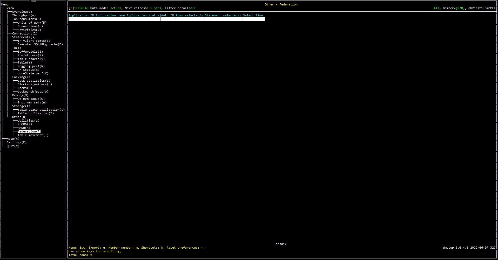

# Purpose

View federated activity for the federated database.

# Screenshot

# Metric shown

### Application ID

 Application ID.

**Source: **[MON_GET_CONNECTION](https://www.ibm.com/docs/en/db2/11.5?topic=functions-mon-get-connection-get-connection-metrics)(NULL, -2).[APPLICATION_ID](https://www.ibm.com/docs/en/db2/11.5?topic=reference-#r0001166)

### Application name

The name of the application running at the client.

**Source: **[MON_GET_CONNECTION](https://www.ibm.com/docs/en/db2/11.5?topic=functions-mon-get-connection-get-connection-metrics)(NULL, -2).[APPLICATION_NAME](https://www.ibm.com/docs/en/db2/11.5?topic=reference-#r0001165)

### Application status

The status of the unit of work and how it stopped.

**Source: **[MON_GET_CONNECTION](https://www.ibm.com/docs/en/db2/11.5?topic=functions-mon-get-connection-get-connection-metrics)(NULL, -2).[UOW_COMP_STATUS](https://www.ibm.com/docs/en/db2/11.5?topic=reference-u#r0001191)

### Auth ID 

The system authorization id for the connection.

**Source: **[MON_GET_CONNECTION](https://www.ibm.com/docs/en/db2/11.5?topic=functions-mon-get-connection-get-connection-metrics)(NULL, -2).[SYSTEM_AUTH_ID](https://www.ibm.com/docs/en/db2/11.5?topic=reference-s#r0056526)

### Rows selected/s

Indicates the number of rows read from a remote database by a federation system statement.

**Source: **[MON_GET_CONNECTION](https://www.ibm.com/docs/en/db2/11.5?topic=functions-mon-get-connection-get-connection-metrics)(NULL, -2).[FED_ROWS_READ](https://www.ibm.com/docs/en/db2/11.5?topic=reference-f#r0070142)

### Statement selected/s

The number of SQL SELECT statements that were executed.

**Source: **[MON_GET_CONNECTION](https://www.ibm.com/docs/en/db2/11.5?topic=functions-mon-get-connection-get-connection-metrics)(NULL, -2).[SELECT_SQL_STMTS](https://www.ibm.com/docs/en/db2/11.5?topic=reference-s#r0001334)

### Select time

Indicates the total number of times that a federation server ran statements and received results from a remote data source.

**Source: **[MON_GET_CONNECTION](https://www.ibm.com/docs/en/db2/11.5?topic=functions-mon-get-connection-get-connection-metrics)(NULL, -2).[FED_WAITS_TOTAL](https://www.ibm.com/docs/en/db2/11.5?topic=reference-f#r0070144)

