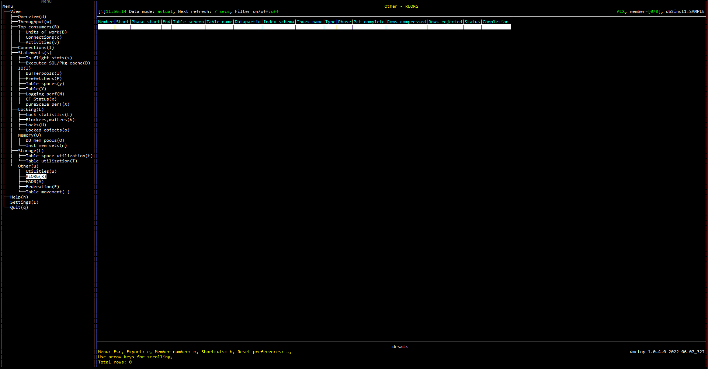

# Purpose

REORG view shows the information of table reorganization. If no tables have been reorganized, the list will be empty. This view could be used to check the progress and status of table reoriganization.

# Screenshot

# Metric shown

### Member

In a partitioned database environment, this is the numeric identifier for the database member. For Db2 Enterprise Server Edition and in a Db2 pureScale environment, this value is 0.

**Source** [SNAP_GET_TAB_REORG](https://www.ibm.com/docs/en/db2/11.5?topic=views-snap-get-tab-reorg-table-reorganization-snapshot)([CURRENT_SERVER](https://www.ibm.com/docs/en/db2-for-zos/11?topic=registers-current-server), 0).[DBPARTITIONNUM](https://www.ibm.com/docs/en/db2/11.5?topic=reference-d#r0056242)

### Start

The start time of a table reorganization including a reorganization to reclaim extents from a multidimensional clustering (MDC) or insert time clustering (ITC) table.

**Source** [SNAP_GET_TAB_REORG](https://www.ibm.com/docs/en/db2/11.5?topic=views-snap-get-tab-reorg-table-reorganization-snapshot)([CURRENT_SERVER](https://www.ibm.com/docs/en/db2-for-zos/11?topic=registers-current-server), 0).[REORG_START](https://www.ibm.com/docs/en/db2/11.5?topic=reference-r#r0007561)

### Phase start

The start time of a phase of table reorganization or reclaim reorganization. 

**Source** [SNAP_GET_TAB_REORG](https://www.ibm.com/docs/en/db2/11.5?topic=views-snap-get-tab-reorg-table-reorganization-snapshot)([CURRENT_SERVER](https://www.ibm.com/docs/en/db2-for-zos/11?topic=registers-current-server), 0).[REORG_PHASE_START](https://www.ibm.com/docs/en/db2/11.5?topic=reference-r#r0007563)

### End

The end time of a table reorganization including a reorganization to reclaim extents from a multidimensional clustering (MDC) or insert time clustering (ITC) table.

**Source** [SNAP_GET_TAB_REORG](https://www.ibm.com/docs/en/db2/11.5?topic=views-snap-get-tab-reorg-table-reorganization-snapshot)([CURRENT_SERVER](https://www.ibm.com/docs/en/db2-for-zos/11?topic=registers-current-server), 0).[REORG_END](https://www.ibm.com/docs/en/db2/11.5?topic=reference-r#r0007562)

### Table schema

The schema of the table.

**Source** [SNAP_GET_TAB_REORG](https://www.ibm.com/docs/en/db2/11.5?topic=views-snap-get-tab-reorg-table-reorganization-snapshot)([CURRENT_SERVER](https://www.ibm.com/docs/en/db2-for-zos/11?topic=registers-current-server), 0).[TABSCHEMA](https://www.ibm.com/docs/en/db2/11.5?topic=reference-t#r0001311)

### Table name

The name of the table.

**Source** [SNAP_GET_TAB_REORG](https://www.ibm.com/docs/en/db2/11.5?topic=views-snap-get-tab-reorg-table-reorganization-snapshot)([CURRENT_SERVER](https://www.ibm.com/docs/en/db2-for-zos/11?topic=registers-current-server), 0).[TABNAME](https://www.ibm.com/docs/en/db2/11.5?topic=reference-t#r0001310)

### Datapartid

The identifier of the data partition for which information is returned.

**Source** [SNAP_GET_TAB_REORG](https://www.ibm.com/docs/en/db2/11.5?topic=views-snap-get-tab-reorg-table-reorganization-snapshot)([CURRENT_SERVER](https://www.ibm.com/docs/en/db2-for-zos/11?topic=registers-current-server), 0).[DATA_PARTITION_ID](https://www.ibm.com/docs/en/db2/11.5?topic=reference-d#r0021132)

### Index schema

The schema name of the index.

**Source** [SYSCAT.INDEXES](https://www.ibm.com/docs/en/db2/11.5?topic=views-syscatindexes)([CURRENT_SERVER](https://www.ibm.com/docs/en/db2-for-zos/11?topic=registers-current-server), 0).[INDSCHEMA](https://www.ibm.com/docs/en/db2/11.5?topic=views-syscatindexes)

### Index name

Unqualified name of the index.

**Source** [SYSCAT.INDEXES](https://www.ibm.com/docs/en/db2/11.5?topic=views-syscatindexes)([CURRENT_SERVER](https://www.ibm.com/docs/en/db2-for-zos/11?topic=registers-current-server), 0).[INDNAME](https://www.ibm.com/docs/en/db2/11.5?topic=views-syscatindexes)

### Type

Table reorganize attribute settings.

**Source** [SNAP_GET_TAB_REORG](https://www.ibm.com/docs/en/db2/11.5?topic=views-snap-get-tab-reorg-table-reorganization-snapshot)([CURRENT_SERVER](https://www.ibm.com/docs/en/db2-for-zos/11?topic=registers-current-server), 0).[REORG_TYPE](https://www.ibm.com/docs/en/db2/11.5?topic=reference-r#r0007566)

### Phase

Indicates the reorganization phase of the table. 

This interface returns a text identifier based on defines in sqlmon.h and is one of:
* BUILD
* DICT_SAMPLE
* INDEX_RECREATE
* REPLACE
* SORT
* SCAN
* DRAIN
* RELEASE
* SORT+DICT_SAMPLE.

**Source** [SNAP_GET_TAB_REORG](https://www.ibm.com/docs/en/db2/11.5?topic=views-snap-get-tab-reorg-table-reorganization-snapshot)([CURRENT_SERVER](https://www.ibm.com/docs/en/db2-for-zos/11?topic=registers-current-server), 0).[REORG_PHASE](https://www.ibm.com/docs/en/db2/11.5?topic=reference-r#r0007933)

### Pct complete

Indicate the percentage of reorganization that has been completed.

If REORG_STATUS equals 'COMPLETED, the value is 100;
Otherwise, the value is REORG_CURRENT_COUNTER / REORG_MAX_COUNTER.

**Source**

REORG_STATUS = [SNAP_GET_TAB_REORG](https://www.ibm.com/docs/en/db2/11.5?topic=views-snap-get-tab-reorg-table-reorganization-snapshot)([CURRENT_SERVER](https://www.ibm.com/docs/en/db2-for-zos/11?topic=registers-current-server), 0).[REORG_STATUS](https://www.ibm.com/docs/en/db2/11.5?topic=reference-r#r0007568)

REORG_CURRENT_COUNTER = [SNAP_GET_TAB_REORG](https://www.ibm.com/docs/en/db2/11.5?topic=views-snap-get-tab-reorg-table-reorganization-snapshot)([CURRENT_SERVER](https://www.ibm.com/docs/en/db2-for-zos/11?topic=registers-current-server), 0).[REORG_CURRENT_COUNTER](https://www.ibm.com/docs/en/db2/11.5?topic=reference-r#r0007564)

REORG_MAX_COUNTER = [SNAP_GET_TAB_REORG](https://www.ibm.com/docs/en/db2/11.5?topic=views-snap-get-tab-reorg-table-reorganization-snapshot)([CURRENT_SERVER](https://www.ibm.com/docs/en/db2-for-zos/11?topic=registers-current-server), 0).[REORG_MAX_COUNTER](https://www.ibm.com/docs/en/db2/11.5?topic=reference-r#r0007565)

### Rows compressed

The number of rows compressed in the table during reorganization.

**Source** [SNAP_GET_TAB_REORG](https://www.ibm.com/docs/en/db2/11.5?topic=views-snap-get-tab-reorg-table-reorganization-snapshot)([CURRENT_SERVER](https://www.ibm.com/docs/en/db2-for-zos/11?topic=registers-current-server), 0).[REORG_ROWSCOMPRESSED](https://www.ibm.com/docs/en/db2/11.5?topic=reference-r#r0022767)

### Rows rejected

The number of rows that were not compressed during reorganization due to the record length being less than or equal to the minimum record length.

**Source** [SNAP_GET_TAB_REORG](https://www.ibm.com/docs/en/db2/11.5?topic=views-snap-get-tab-reorg-table-reorganization-snapshot)([CURRENT_SERVER](https://www.ibm.com/docs/en/db2-for-zos/11?topic=registers-current-server), 0).[REORG_ROWSREJECTED](https://www.ibm.com/docs/en/db2/11.5?topic=reference-r#r0022768)

### Status

The status of an in-place (online) table or a data partition level reorganization. 

**Source** [SNAP_GET_TAB_REORG](https://www.ibm.com/docs/en/db2/11.5?topic=views-snap-get-tab-reorg-table-reorganization-snapshot)([CURRENT_SERVER](https://www.ibm.com/docs/en/db2-for-zos/11?topic=registers-current-server), 0).[REORG_STATUS](https://www.ibm.com/docs/en/db2/11.5?topic=reference-r#r0007568)

### Completion

Indicate table reorganization success.

If REORG_END is NULL, then the value is NULL;
Otherwise, the value is REORG_COMPLETION.

**Source**

REORG_END = [SNAP_GET_TAB_REORG](https://www.ibm.com/docs/en/db2/11.5?topic=views-snap-get-tab-reorg-table-reorganization-snapshot)([CURRENT_SERVER](https://www.ibm.com/docs/en/db2-for-zos/11?topic=registers-current-server), 0).[REORG_END](https://www.ibm.com/docs/en/db2/11.5?topic=reference-r#r0007562)

REORG_COMPLETION = [SNAP_GET_TAB_REORG](https://www.ibm.com/docs/en/db2/11.5?topic=views-snap-get-tab-reorg-table-reorganization-snapshot)([CURRENT_SERVER](https://www.ibm.com/docs/en/db2-for-zos/11?topic=registers-current-server), 0).[REORG_COMPLETION](https://www.ibm.com/docs/en/db2/11.5?topic=reference-r#r0007569)

