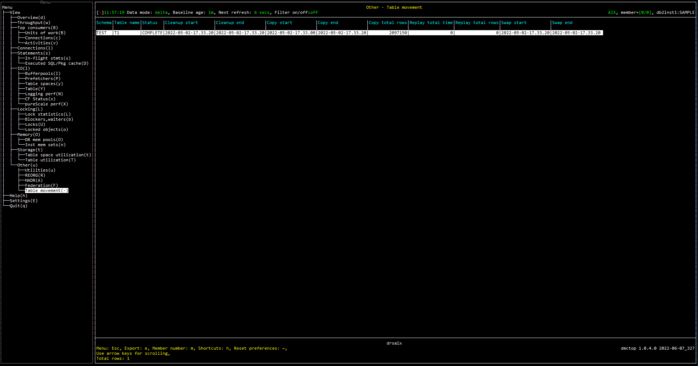

# Purpose

Table movement view shows the procedue information of table movement. This view could be used to check the status information and configuration options related to the table to be moved.

# Screenshot

# Metric shown

### Schema

The schema of the table.

**Source:** [SYSTOOLS.ADMIN_MOVE_TABLE](https://www.ibm.com/docs/en/db2/11.5?topic=procedure-admin-move-table-move-tables-online).[TABSCHEMA](https://www.ibm.com/docs/en/db2/11.5?topic=reference-t#r0001311)

### Table name

The name of the table.

**Source:** [SYSTOOLS.ADMIN_MOVE_TABLE](https://www.ibm.com/docs/en/db2/11.5?topic=procedure-admin-move-table-move-tables-online).[TABNAME](https://www.ibm.com/docs/en/db2/11.5?topic=reference-t#r0001310)

### Status

Displays the current status of the online table move:
* INIT: INIT is in progress
* COPY: COPY is in progress or is possible
* REPLAY: REPLAY is in progress or REPLAY and SWAP are possible
* CLEANUP: MOVE is complete, but cleanup has not finished or CLEANUP is possible
* CANCEL: CANCEL is in progress, but cancel has not finished or CANCEL is possible
* COMPLETE: MOVE and CLEANUP are complete
* COMPLETE_WITH_WARNINGS: MOVE and CLEANUP are complete, however there are warnings (listed under the WARNINGS key).

**Source:** [SYSTOOLS.ADMIN_MOVE_TABLE](https://www.ibm.com/docs/en/db2/11.5?topic=procedure-admin-move-table-move-tables-online).[STATUS](https://www.ibm.com/docs/en/db2/11.5?topic=procedure-admin-move-table-move-tables-online)

### Cleanup start

Displays the CLEANUP phase start time.

**Source:** [SYSTOOLS.ADMIN_MOVE_TABLE](https://www.ibm.com/docs/en/db2/11.5?topic=procedure-admin-move-table-move-tables-online).[CLEANUP_START](https://www.ibm.com/docs/en/db2/11.5?topic=procedure-admin-move-table-move-tables-online)

### Cleanup end

Displays the CLEANUP phase end time.

**Source:** [SYSTOOLS.ADMIN_MOVE_TABLE](https://www.ibm.com/docs/en/db2/11.5?topic=procedure-admin-move-table-move-tables-online).[CLEANUP_END](https://www.ibm.com/docs/en/db2/11.5?topic=procedure-admin-move-table-move-tables-online)

### Copy start

Displays the COPY phase start time.

**Source:** [SYSTOOLS.ADMIN_MOVE_TABLE](https://www.ibm.com/docs/en/db2/11.5?topic=procedure-admin-move-table-move-tables-online).[COPY_START](https://www.ibm.com/docs/en/db2/11.5?topic=procedure-admin-move-table-move-tables-online)

### Copy end

Displays the COPY phase end time.

**Source:** [SYSTOOLS.ADMIN_MOVE_TABLE](https://www.ibm.com/docs/en/db2/11.5?topic=procedure-admin-move-table-move-tables-online).[COPY_END](https://www.ibm.com/docs/en/db2/11.5?topic=procedure-admin-move-table-move-tables-online)

### Copy total rows

Displays the total number of rows copied during the COPY phase.

**Source:** [SYSTOOLS.ADMIN_MOVE_TABLE](https://www.ibm.com/docs/en/db2/11.5?topic=procedure-admin-move-table-move-tables-online).[COPY_TOTAL_ROWS](https://www.ibm.com/docs/en/db2/11.5?topic=procedure-admin-move-table-move-tables-online)

### Replay total time

Displays the accumulated time in seconds used for replaying rows.

**Source:** [SYSTOOLS.ADMIN_MOVE_TABLE](https://www.ibm.com/docs/en/db2/11.5?topic=procedure-admin-move-table-move-tables-online).[REPLAY_TOTAL_TIME](https://www.ibm.com/docs/en/db2/11.5?topic=procedure-admin-move-table-move-tables-online)

### Replay total rows

Displays the accumulated number of replayed rows.

**Source:** [SYSTOOLS.ADMIN_MOVE_TABLE](https://www.ibm.com/docs/en/db2/11.5?topic=procedure-admin-move-table-move-tables-online).[REPLAY_TOTAL_ROWS](https://www.ibm.com/docs/en/db2/11.5?topic=procedure-admin-move-table-move-tables-online)

### Swap start

Displays the SWAP phase start time.

**Source:** [SYSTOOLS.ADMIN_MOVE_TABLE](https://www.ibm.com/docs/en/db2/11.5?topic=procedure-admin-move-table-move-tables-online).[SWAP_START](https://www.ibm.com/docs/en/db2/11.5?topic=procedure-admin-move-table-move-tables-online)

### Swap end

Displays the SWAP phase end time.

**Source:** [SYSTOOLS.ADMIN_MOVE_TABLE](https://www.ibm.com/docs/en/db2/11.5?topic=procedure-admin-move-table-move-tables-online).[SWAP_END](https://www.ibm.com/docs/en/db2/11.5?topic=procedure-admin-move-table-move-tables-online)

