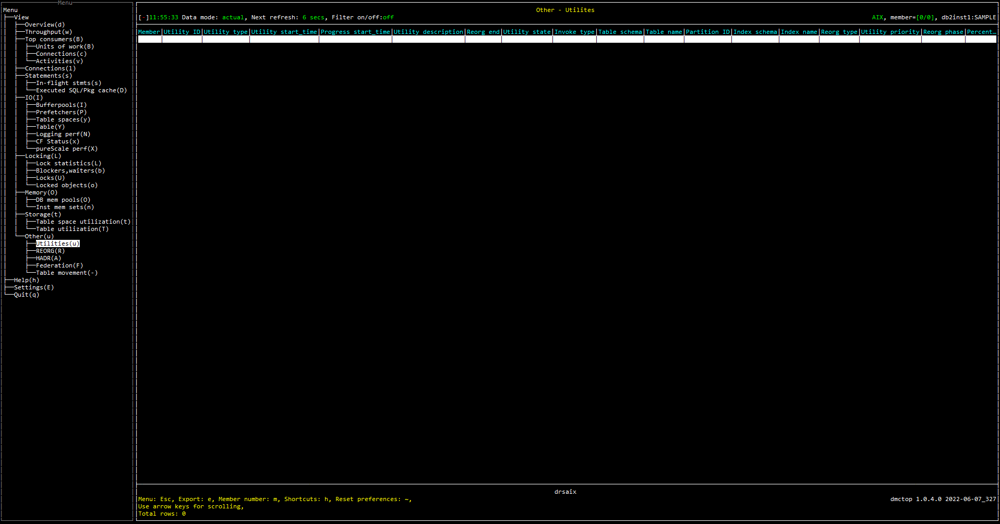

# Purpose

Utility view shows the list of utilites. This view could be used to check the progress and state of each utility.

# Screenshot

# Metric shown

### Member

In a partitioned database environment, this is the numeric identifier for the database member. For Db2 Enterprise Server Edition and in a Db2 pureScale environment, this value is 0.

**Source:** [SYSIBMADM.SNAPUTIL](https://www.ibm.com/docs/en/db2/11.5?topic=views-snap-get-util).[DBPARTITIONNUM](https://www.ibm.com/docs/en/db2/11.5?topic=reference-d#r0056242)

### Utility ID

The unique identifier corresponding to the utility invocation.

**Source:** [SYSIBMADM.SNAPUTIL](https://www.ibm.com/docs/en/db2/11.5?topic=views-snap-get-util).[UTILITY_ID](https://www.ibm.com/docs/en/db2/11.5?topic=reference-u#r0010882)

### Utility type

The class of utility.

**Source:** [SYSIBMADM.SNAPUTIL](https://www.ibm.com/docs/en/db2/11.5?topic=views-snap-get-util).[UTILITY_TYPE](https://www.ibm.com/docs/en/db2/11.5?topic=reference-u#r0010883)

### Utility start_time

The date and time when the current utility was originally invoked.

**Source:** 

[SYSIBMADM.SNAPUTIL](https://www.ibm.com/docs/en/db2/11.5?topic=views-snap-get-util).[UTILITY_START_TIME](https://www.ibm.com/docs/en/db2/11.5?topic=reference-u#r0010885)

[SNAP_GET_TAB_REORG](https://www.ibm.com/docs/en/db2/11.5?topic=views-snap-get-tab-reorg-table-reorganization-snapshot)([CURRENT_SERVER](https://www.ibm.com/docs/en/db2-for-zos/11?topic=registers-current-server), 0).[REORG_START](https://www.ibm.com/docs/en/db2/11.5?topic=reference-r#r0007561)

### Progress start_time

A timestamp representing the start of the phase.

**Source:** 

[SYSIBMADM.SNAPUTIL_PROGRESS](https://www.ibm.com/docs/en/db2/11.5?topic=views-snap-get-util-progress-progress-snapshot).[PROGRESS_START_TIME](https://www.ibm.com/docs/en/db2/11.5?topic=reference-p#r0011407)

[SNAP_GET_TAB_REORG](https://www.ibm.com/docs/en/db2/11.5?topic=views-snap-get-tab-reorg-table-reorganization-snapshot)([CURRENT_SERVER](https://www.ibm.com/docs/en/db2-for-zos/11?topic=registers-current-server), 0).[REORG_PHASE_START](https://www.ibm.com/docs/en/db2/11.5?topic=reference-r#r0007563)

### Utility description

A brief description of the work a utility is performing.

**Source:** [SYSIBMADM.SNAPUTIL](https://www.ibm.com/docs/en/db2/11.5?topic=views-snap-get-util).[UTILITY_DESCRIPTION](https://www.ibm.com/docs/en/db2/11.5?topic=reference-u#r0010886)

### Reorg end

The end time of a table or data partition reorganization.

**Source:** [SNAP_GET_TAB_REORG](https://www.ibm.com/docs/en/db2/11.5?topic=views-snap-get-tab-reorg-table-reorganization-snapshot)([CURRENT_SERVER](https://www.ibm.com/docs/en/db2-for-zos/11?topic=registers-current-server), 0).[REORG_END](https://www.ibm.com/docs/en/db2/11.5?topic=reference-r#r0007562)

### Utility state

The state of a utility.

**Source:** 

[SYSIBMADM.SNAPUTIL_PROGRESS](https://www.ibm.com/docs/en/db2/11.5?topic=views-snap-get-util-progress-progress-snapshot).[UTILITY_STATE](https://www.ibm.com/docs/en/db2/11.5?topic=reference-u#r0022313)

[SNAP_GET_TAB_REORG](https://www.ibm.com/docs/en/db2/11.5?topic=views-snap-get-tab-reorg-table-reorganization-snapshot)([CURRENT_SERVER](https://www.ibm.com/docs/en/db2-for-zos/11?topic=registers-current-server), 0).[REORG_STATUS](https://www.ibm.com/docs/en/db2/11.5?topic=reference-r#r0007568)

### Invoke type

Describes how a utility was invoked.

**Source:** [SYSIBMADM.SNAPUTIL_PROGRESS](https://www.ibm.com/docs/en/db2/11.5?topic=views-snap-get-util-progress-progress-snapshot).[UTILITY_INVOKER_TYPE](https://www.ibm.com/docs/en/db2/11.5?topic=reference-u#r0022314)

### Table schema

The schema of the table.

**Source:** [SNAP_GET_TAB_REORG](https://www.ibm.com/docs/en/db2/11.5?topic=views-snap-get-tab-reorg-table-reorganization-snapshot)([CURRENT_SERVER](https://www.ibm.com/docs/en/db2-for-zos/11?topic=registers-current-server), 0).[TABSCHEMA](https://www.ibm.com/docs/en/db2/11.5?topic=reference-t#r0001311)

### Table name

The name of the table.

**Source:** [SNAP_GET_TAB_REORG](https://www.ibm.com/docs/en/db2/11.5?topic=views-snap-get-tab-reorg-table-reorganization-snapshot)([CURRENT_SERVER](https://www.ibm.com/docs/en/db2-for-zos/11?topic=registers-current-server), 0).[TABNAME](https://www.ibm.com/docs/en/db2/11.5?topic=reference-t#r0001310)

### Partition ID

The identifier of the data partition for which information is returned.

**Source:** [SNAP_GET_TAB_REORG](https://www.ibm.com/docs/en/db2/11.5?topic=views-snap-get-tab-reorg-table-reorganization-snapshot)([CURRENT_SERVER](https://www.ibm.com/docs/en/db2-for-zos/11?topic=registers-current-server), 0).[DATA_PARTITION_ID](https://www.ibm.com/docs/en/db2/11.5?topic=reference-d#r0021132)

### Index schema

Schema name of the index.

**Source:** [SYSCAT.INDEXES](https://www.ibm.com/docs/en/db2/11.5?topic=views-syscatindexes).[INDSCHEMA](https://www.ibm.com/docs/en/db2/11.5?topic=views-syscatindexes)

### Index name

Unqualified name of the index.

**Source:** [SYSCAT.INDEXES](https://www.ibm.com/docs/en/db2/11.5?topic=views-syscatindexes).[INDNAME](https://www.ibm.com/docs/en/db2/11.5?topic=views-syscatindexes)

### Reorg type

Table reorganize attribute settings.

**Source:** [SNAP_GET_TAB_REORG](https://www.ibm.com/docs/en/db2/11.5?topic=views-snap-get-tab-reorg-table-reorganization-snapshot)([CURRENT_SERVER](https://www.ibm.com/docs/en/db2-for-zos/11?topic=registers-current-server), 0).[REORG_TYPE](https://www.ibm.com/docs/en/db2/11.5?topic=reference-r#r0007566)

### Utility priority

The amount of relative importance of a throttled utility with respect to its throttled peers.

**Source:** [SYSIBMADM.SNAPUTIL](https://www.ibm.com/docs/en/db2/11.5?topic=views-snap-get-util).[UTILITY_PRIORITY](https://www.ibm.com/docs/en/db2/11.5?topic=reference-u#r0010884)

### Reorg phase

Indicates the reorganization phase of the table. 

**Source:** [SNAP_GET_TAB_REORG](https://www.ibm.com/docs/en/db2/11.5?topic=views-snap-get-tab-reorg-table-reorganization-snapshot)([CURRENT_SERVER](https://www.ibm.com/docs/en/db2-for-zos/11?topic=registers-current-server), 0).[REORG_PHASE](https://www.ibm.com/docs/en/db2/11.5?topic=reference-r#r0007933)

### Percentage complete

The percentage of work units for the current phase which have been completed.

If UTILITY_TYPE does not equal to 'REORG', the value is PROGRESS_TOTAL_UNITS / PROGRESS_COMPLETED_UNITS;
If UTILITY_TYPE equals to 'REORG' and REORG_STATUS equals to 'COMPLETED', then the value is 100;
For all the rest cases, the value is REORG_CURRENT_COUNTER / REORG_MAX_COUNTER.

**Source:**

UTILITY_TYPE = [SYSIBMADM.SNAPUTIL](https://www.ibm.com/docs/en/db2/11.5?topic=views-snap-get-util).[UTILITY_TYPE](https://www.ibm.com/docs/en/db2/11.5?topic=reference-u#r0010883)

REORG_STATUS = [SNAP_GET_TAB_REORG](https://www.ibm.com/docs/en/db2/11.5?topic=views-snap-get-tab-reorg-table-reorganization-snapshot)([CURRENT_SERVER](https://www.ibm.com/docs/en/db2-for-zos/11?topic=registers-current-server), 0).[REORG_STATUS](https://www.ibm.com/docs/en/db2/11.5?topic=reference-r#r0007568)

PROGRESS_TOTAL_UNITS = [SYSIBMADM.SNAPUTIL_PROGRESS](https://www.ibm.com/docs/en/db2/11.5?topic=views-snap-get-util-progress-progress-snapshot).[PROGRESS_TOTAL_UNITS](https://www.ibm.com/docs/en/db2/11.5?topic=reference-p#r0011409)

PROGRESS_COMPLETED_UNITS = [SYSIBMADM.SNAPUTIL_PROGRESS](https://www.ibm.com/docs/en/db2/11.5?topic=views-snap-get-util-progress-progress-snapshot).[PROGRESS_COMPLETED_UNITS ](https://www.ibm.com/docs/en/db2/11.5?topic=reference-p#r0011410)

REORG_CURRENT_COUNTER = [SNAP_GET_TAB_REORG](https://www.ibm.com/docs/en/db2/11.5?topic=views-snap-get-tab-reorg-table-reorganization-snapshot)([CURRENT_SERVER](https://www.ibm.com/docs/en/db2-for-zos/11?topic=registers-current-server), 0).[REORG_CURRENT_COUNTER](https://www.ibm.com/docs/en/db2/11.5?topic=reference-r#r0007564)

REORG_MAX_COUNTER = [SNAP_GET_TAB_REORG](https://www.ibm.com/docs/en/db2/11.5?topic=views-snap-get-tab-reorg-table-reorganization-snapshot)([CURRENT_SERVER](https://www.ibm.com/docs/en/db2-for-zos/11?topic=registers-current-server), 0).[REORG_MAX_COUNTER](https://www.ibm.com/docs/en/db2/11.5?topic=reference-r#r0007565)

### Progress complete unit

The number of work units for the current phase which have been completed.

**Source:** [SYSIBMADM.SNAPUTIL_PROGRESS](https://www.ibm.com/docs/en/db2/11.5?topic=views-snap-get-util-progress-progress-snapshot).[PROGRESS_COMPLETED_UNITS](https://www.ibm.com/docs/en/db2/11.5?topic=reference-p#r0011410)

### Reorg rows compressed

The number of rows compressed in the table during reorganization.

**Source:**  [SNAP_GET_TAB_REORG](https://www.ibm.com/docs/en/db2/11.5?topic=views-snap-get-tab-reorg-table-reorganization-snapshot)([CURRENT_SERVER](https://www.ibm.com/docs/en/db2-for-zos/11?topic=registers-current-server), 0).[REORG_ROWSCOMPRESSED](https://www.ibm.com/docs/en/db2/11.5?topic=reference-r#r0022767)

### Reorg rows rejected 

The number of rows that were not compressed during reorganization due to the record length being less than or equal to the minimum record length.

**Source:**  [SNAP_GET_TAB_REORG](https://www.ibm.com/docs/en/db2/11.5?topic=views-snap-get-tab-reorg-table-reorganization-snapshot)([CURRENT_SERVER](https://www.ibm.com/docs/en/db2-for-zos/11?topic=registers-current-server), 0).[REORG_ROWSREJECTED](https://www.ibm.com/docs/en/db2/11.5?topic=reference-r#r0022768)

### Reorg completion

Indicator for table reorganization success.

If REORG_END is not NULL, then the value is REORG_COMPLETION;
Otherwise, the value is NULL

**Source:**

REORG_END = [SNAP_GET_TAB_REORG](https://www.ibm.com/docs/en/db2/11.5?topic=views-snap-get-tab-reorg-table-reorganization-snapshot)([CURRENT_SERVER](https://www.ibm.com/docs/en/db2-for-zos/11?topic=registers-current-server), 0).[REORG_END](https://www.ibm.com/docs/en/db2/11.5?topic=reference-r#r0007562)

REORG_COMPLETION = [SNAP_GET_TAB_REORG](https://www.ibm.com/docs/en/db2/11.5?topic=views-snap-get-tab-reorg-table-reorganization-snapshot)([CURRENT_SERVER](https://www.ibm.com/docs/en/db2-for-zos/11?topic=registers-current-server), 0).[REORG_COMPLETION](https://www.ibm.com/docs/en/db2/11.5?topic=reference-r#r0007569)

### Progress total units

The total amount of work to perform in order for the phase to be complete.

**Source:** [SYSIBMADM.SNAPUTIL_PROGRESS](https://www.ibm.com/docs/en/db2/11.5?topic=views-snap-get-util-progress-progress-snapshot).[PROGRESS_TOTAL_UNITS](https://www.ibm.com/docs/en/db2/11.5?topic=reference-p#r0011409)

### Progress description

Describes the phase of work.

**Source:** [SYSIBMADM.SNAPUTIL_PROGRESS](https://www.ibm.com/docs/en/db2/11.5?topic=views-snap-get-util-progress-progress-snapshot).[PROGRESS_DESCRIPTION](https://www.ibm.com/docs/en/db2/11.5?topic=reference-p#r0011406)

### Progress work metric

The metric for interpreting the PROGRESS_TOTAL_UNITS and PROGRESS_COMPLETED_UNITS elements.

= PROGRESS_WORK_METRIC 

**Source:** 

PROGRESS_WORK_METRIC = [SYSIBMADM.SNAPUTIL_PROGRESS](https://www.ibm.com/docs/en/db2/11.5?topic=views-snap-get-util-progress-progress-snapshot).[PROGRESS_WORK_METRIC](https://www.ibm.com/docs/en/db2/11.5?topic=reference-p#r0011408)

PROGRESS_TOTAL_UNITS = [SYSIBMADM.SNAPUTIL_PROGRESS](https://www.ibm.com/docs/en/db2/11.5?topic=views-snap-get-util-progress-progress-snapshot).[PROGRESS_TOTAL_UNITS](https://www.ibm.com/docs/en/db2/11.5?topic=reference-p#r0011409)

PROGRESS_COMPLETED_UNITS = [SYSIBMADM.SNAPUTIL_PROGRESS](https://www.ibm.com/docs/en/db2/11.5?topic=views-snap-get-util-progress-progress-snapshot).[PROGRESS_COMPLETED_UNITS ](https://www.ibm.com/docs/en/db2/11.5?topic=reference-p#r0011410)

### Progress seq num

Phase number.

**Source:** [SYSIBMADM.SNAPUTIL_PROGRESS](https://www.ibm.com/docs/en/db2/11.5?topic=views-snap-get-util-progress-progress-snapshot).[PROGRESS_SEQ_NUM](https://www.ibm.com/docs/en/db2/11.5?topic=reference-p#r0011405)

### Progress list cur seq num

This element describes how to interpret a list of progress elements.

**Source:** [SYSIBMADM.SNAPUTIL](https://www.ibm.com/docs/en/db2/11.5?topic=views-snap-get-util).[PROGRESS_LIST_ATTR](https://www.ibm.com/docs/en/db2/11.5?topic=reference-p#r0023541)

