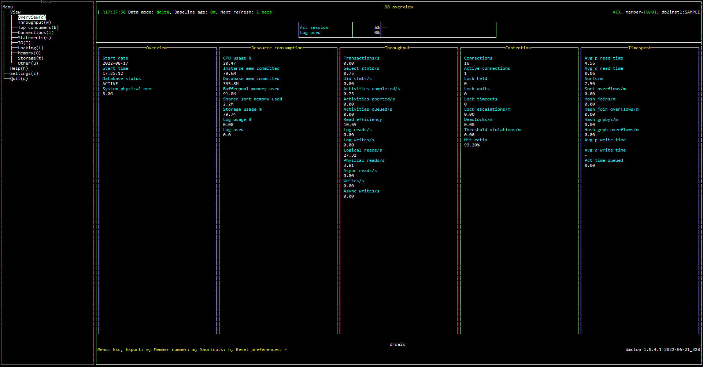

export const Title = () => (
  <span>
    DB overview
  </span>
);

# Purpose
The overview tells you at a glance how busy the monitored database is.  It provides basic information about the current level of activity.  For example:

* Number of connections
* Memory consumption
* I/O efficiency
* Indicators of contention such as high lock wait time, lock escalations or deadlocks.

# Screenshot


# Metric shown

## Gauge

### Act session

The percentage of active connections.

= ACTIVE_CONN / TOTAL_CONN 

TOTAL_CONN = 

```
 SELECT COUNT(*) AS TOTAL_CONN 
         FROM   AGENT_TAB
```

ACTIVE_CONN =
```
SELECT COUNT(*) AS ACTIVE_CONN 
         FROM   AGENT_TAB 
         WHERE  EVENT_STATE='EXECUTING' 
         AND    EVENT_TYPE='PROCESS' 
         AND    IDLE_DURATION < 15
```


AGENT_TAB = 
```
SELECT EVENT_STATE , 
                EVENT_TYPE , 
                CAST(((CAST(JULIAN_DAY(CURRENT TIMESTAMP) AS DECFLOAT(34)) * 86400 + EXTRACT(HOUR FROM CURRENT TIMESTAMP) * 60 * 60 + EXTRACT(MINUTE FROM CURRENT TIMESTAMP) * 60 + EXTRACT(SECOND FROM CURRENT TIMESTAMP) - (CAST(JULIAN_DAY(AGENT_STATE_LAST_UPDATE_TIME) AS DECFLOAT(34)) * 86400 + EXTRACT(HOUR FROM AGENT_STATE_LAST_UPDATE_TIME) * 60 * 60 + EXTRACT(MINUTE FROM AGENT_STATE_LAST_UPDATE_TIME) * 60 + EXTRACT(SECOND FROM AGENT_STATE_LAST_UPDATE_TIME)))) AS DOUBLE) AS IDLE_DURATION
         FROM   TABLE(MON_GET_AGENT(NULL,NULL,NULL,#MEMBER#)) 
         WHERE  APPLICATION_HANDLE<>0 
         AND    AGENT_STATE = 'ACTIVE' 
```


**Source:**  

[MON_GET_AGENT](https://www.ibm.com/docs/en/db2/11.5?topic=mpf-mon-get-agent-list-agents-fenced-mode-processes-system-entities-database)(NULL,NULL,NULL,#MEMBER#).[AGENT_STATE_LAST_UPDATE_TIME](https://www.ibm.com/docs/en/db2/11.5?topic=mpf-mon-get-agent-list-agents-fenced-mode-processes-system-entities-database)

[CURRENT TIMESTAMP](https://www.ibm.com/docs/en/db2/11.5?topic=registers-current-timestamp)


### Log used

The percentage of amount of active log space currently used in the database. 

= TOTAL_LOG_USED / TOTAL_LOG


**Source:** 

TOTAL_LOG_USED = [MON_GET_TRANSACTION_LOG](https://www.ibm.com/docs/en/db2/11.5?topic=mpf-mon-get-transaction-log-table-function-get-log-information)(#MEMBER#).SUM([TOTAL_LOG_USED](https://www.ibm.com/docs/en/db2/11.5?topic=reference-t#r0002530))

TOTAL_LOG= [MON_GET_TRANSACTION_LOG](https://www.ibm.com/docs/en/db2/11.5?topic=mpf-mon-get-transaction-log-table-function-get-log-information)(#MEMBER#).SUM([TOTAL_LOG_USED](https://www.ibm.com/docs/en/db2/11.5?topic=reference-t#r0002530) + [TOTAL_LOG_AVAILABLE](https://www.ibm.com/docs/en/db2/11.5?topic=reference-t#r0002531))
## Overview
### Start date

The date of the connection to the database (at the database level, this is the first connection to the database), or when the activate database was issued. 

**Source:** [MON_GET_DATABASE](https://www.ibm.com/docs/en/db2/11.5?topic=functions-mon-get-database-get-database-metrics)(#MEMBER#).MIN([DB_CONN_TIME](https://www.ibm.com/docs/en/db2/11.5?topic=reference-d#r0001154))
### Start time

The time the monitored database was activated.

**Source:** [CURRENT TIMESTAMP](https://www.ibm.com/docs/en/db2/11.5?topic=registers-current-timestamp)

### Database status

The current status of the database. According to the Knowledge Center, the possible values for this field are:

- ACTIVE
- QUIESCE_PEND
- QUIESCED
- ROLLFWD
- ACTIVE_STANDBY
- STANDBY


**Source:** [MON_GET_DATABASE](https://www.ibm.com/docs/en/db2/11.5?topic=functions-mon-get-database-get-database-metrics)(#MEMBER#).MAX([DB_STATUS](https://www.ibm.com/docs/en/db2/11.5?topic=reference-d#r0001156))

### System physical mem

The total amount of physical memory on this host

**Source:** [SYSPROC.ENV_GET_SYSTEM_RESOURCES](https://www.ibm.com/docs/en/db2/11.5?topic=erv-env-get-system-resources-table-function-return-system-information)().[MEMORY_TOTAL](https://www.ibm.com/docs/en/db2/11.5?topic=reference-m#r0060193)

## Resource consumption
### CPU usage %

The total cpu usage over the system.

= System CPU utilization * DB2 CPU utilization

System CPU utilization = (CPU_USER_TOTAL + CPU_SYSTEM_TOTAL)/(CPU_USER_TOTAL + CPU_SYSTEM_TOTAL + CPU_IDLE_TOTAL + CPU_IOWAIT_TOTAL)

DB2 CPU utilization = (DB2_CPU_USER_TOTAL  + DB2_CPU_SYSTEM_TOTAL)/(CPU_USER_TOTAL + CPU_SYSTEM_TOTAL)

**Source:** 

DB2_CPU_USER_TOTAL = [ENV_GET_DB2_SYSTEM_RESOURCES](https://www.ibm.com/docs/en/db2/11.5?topic=erv-env-get-db2-system-resources-return-database-system-information)(#MEMBER#).SUM([CPU_USER](https://www.ibm.com/docs/en/db2/11.5?topic=reference-c#r0060207))


DB2_CPU_SYSTEM_TOTAL = [ENV_GET_DB2_SYSTEM_RESOURCES](https://www.ibm.com/docs/en/db2/11.5?topic=erv-env-get-db2-system-resources-return-database-system-information)(#MEMBER#).SUM([CPU_SYSTEM](https://www.ibm.com/docs/en/db2/11.5?topic=reference-c#r0060210))

CPU_USER_TOTAL = [SYSPROC.ENV_GET_SYSTEM_RESOURCES](https://www.ibm.com/docs/en/db2/11.5?topic=erv-env-get-system-resources-table-function-return-system-information)().[CPU_USER](https://www.ibm.com/docs/en/db2/11.5?topic=reference-c#r0060207)


CPU_SYSTEM_TOTAL = [SYSPROC.ENV_GET_SYSTEM_RESOURCES](https://www.ibm.com/docs/en/db2/11.5?topic=erv-env-get-system-resources-table-function-return-system-information)().[CPU_SYSTEM](https://www.ibm.com/docs/en/db2/11.5?topic=reference-c#r0060210)


CPU_IDLE_TOTAL = [SYSPROC.ENV_GET_SYSTEM_RESOURCES](https://www.ibm.com/docs/en/db2/11.5?topic=erv-env-get-system-resources-table-function-return-system-information)().[CPU_IDLE](https://www.ibm.com/docs/en/db2/11.5?topic=reference-c#r0060208)


CPU_IOWAIT_TOTAL = [SYSPROC.ENV_GET_SYSTEM_RESOURCES](https://www.ibm.com/docs/en/db2/11.5?topic=erv-env-get-system-resources-table-function-return-system-information)().[CPU_IOWAIT](https://www.ibm.com/docs/en/db2/11.5?topic=reference-c#r0060209)


### Instance mem committed

Memory committed, as opposed to used, is a better measure of the memory footprint of DB2.  That is, how much memory is committed by the OS for use by DB2 and hence unavailable for other processes.

**Source:** [MON_GET_MEMORY_SET](https://www.ibm.com/docs/en/db2/11.5?topic=mpf-mon-get-memory-set-get-memory-set-information)('DBMS', [CURRENT_SERVER](https://www.ibm.com/docs/en/db2-for-zos/11?topic=registers-current-server), #MEMBER#).SUM([MEMORY_SET_COMMITTED](https://www.ibm.com/docs/en/db2/11.5?topic=reference-m#r0059448))

### Database mem committed

The portion of memory committed for just this database, as opposed to the whole instance.

**Source:** [MON_GET_MEMORY_SET](https://www.ibm.com/docs/en/db2/11.5?topic=mpf-mon-get-memory-set-get-memory-set-information)('DATABASE', [CURRENT_SERVER](https://www.ibm.com/docs/en/db2-for-zos/11?topic=registers-current-server), #MEMBER#).SUM([MEMORY_SET_COMMITTED](https://www.ibm.com/docs/en/db2/11.5?topic=reference-m#r0059448))


### Bufferpool memory used

Buffer pool memory is typically the largest component of memory usage by DB2.  So it is broken out separately here.

**Source:** [MON_GET_MEMORY_POOL](https://www.ibm.com/docs/en/db2/11.5?topic=mpf-mon-get-memory-pool-get-memory-pool-information)('DATABASE',NULL, #MEMBER#).SUM([MEMORY_POOL_USED](https://www.ibm.com/docs/en/db2/11.5?topic=reference-m#r0059534)) WHERE  MEMORY_POOL_TYPE='BP'


### Shared sort memory used

Shared sort memory committed in use by this memory pool

**Source:** [MON_GET_MEMORY_POOL](https://www.ibm.com/docs/en/db2/11.5?topic=mpf-mon-get-memory-pool-get-memory-pool-information)('DATABASE',NULL, #MEMBER#).SUM([MEMORY_POOL_USED](https://www.ibm.com/docs/en/db2/11.5?topic=reference-m#r0059534)) WHERE  MEMORY_POOL_TYPE='SHARED_SORT'

### Storage usage %

The percentage of space used on a file system pointed to by a storage path or container.

= FS_USED_SIZE / FS_TOTAL_SIZE

**Source:** 

FS_USED_SIZE = [MON_GET_CONTAINER](https://www.ibm.com/docs/en/db2woc?topic=mpf-mon-get-container-get-table-space-container-metrics)('', #MEMBER#).[FS_USED_SIZE](https://www.ibm.com/docs/en/db2woc?topic=reference-f#r0022295)

FS_TOTAL_SIZE = [MON_GET_CONTAINER](https://www.ibm.com/docs/en/db2woc?topic=mpf-mon-get-container-get-table-space-container-metrics)('', #MEMBER#).[FS_TOTAL_SIZE ](https://www.ibm.com/docs/en/db2woc?topic=reference-f#r0022296)


### Log usage %

The percentage of amount of active log space currently used in the database. 

= TOTAL_LOG_USED / TOTAL_LOG


**Source:** 

TOTAL_LOG_USED = [MON_GET_TRANSACTION_LOG](https://www.ibm.com/docs/en/db2/11.5?topic=mpf-mon-get-transaction-log-table-function-get-log-information)(#MEMBER#).SUM([TOTAL_LOG_USED](https://www.ibm.com/docs/en/db2/11.5?topic=reference-t#r0002530))

TOTAL_LOG= [MON_GET_TRANSACTION_LOG](https://www.ibm.com/docs/en/db2/11.5?topic=mpf-mon-get-transaction-log-table-function-get-log-information)(#MEMBER#).SUM([TOTAL_LOG_USED](https://www.ibm.com/docs/en/db2/11.5?topic=reference-t#r0002530) + [TOTAL_LOG_AVAILABLE](https://www.ibm.com/docs/en/db2/11.5?topic=reference-t#r0002531))


* Log used

The  amount of active log space currently used in the database. 

**Source:** TOTAL_LOG_USED = [MON_GET_TRANSACTION_LOG](https://www.ibm.com/docs/en/db2/11.5?topic=mpf-mon-get-transaction-log-table-function-get-log-information)(#MEMBER#).SUM([TOTAL_LOG_USED](https://www.ibm.com/docs/en/db2/11.5?topic=reference-t#r0002530))

## Throughput
### Transactions

The total number of commit and rollback statements issued by the client application.


**Source:** [MON_GET_DATABASE](https://www.ibm.com/docs/en/db2/11.5?topic=functions-mon-get-database-get-database-metrics)(#MEMBER#).SUM([TOTAL_APP_COMMITS](https://www.ibm.com/docs/en/db2/11.5?topic=reference-t#r0056527) + [TOTAL_APP_ROLLBACKS](https://www.ibm.com/docs/en/db2/11.5?topic=reference-t#r0056528))

### Select stmts

The number of SQL SELECT statements that were executed. 


**Source:** [MON_GET_DATABASE](https://www.ibm.com/docs/en/db2/11.5?topic=functions-mon-get-database-get-database-metrics)(#MEMBER#).SUM([SELECT_SQL_STMTS](https://www.ibm.com/docs/en/db2/11.5?topic=reference-s#r0001334))

### Uid stmts

The number of UPDATE, INSERT, MERGE and DELETE statements that were executed. 

**Source:** [MON_GET_DATABASE](https://www.ibm.com/docs/en/db2/11.5?topic=functions-mon-get-database-get-database-metrics)(#MEMBER#).SUM([UID_SQL_STMTS](https://www.ibm.com/docs/en/db2/11.5?topic=reference-u#r0001335))

### Activities aborted

The total number of coordinator activities that completed with errors.


**Source:** [MON_GET_SERVICE_SUBCLASS](https://www.ibm.com/docs/en/db2/11.5?topic=mpf-mon-get-service-subclass-get-service-subclass-metrics)(NULL,NULL,#MEMBER#).SUM([ACT_ABORTED_TOTAL](https://www.ibm.com/docs/en/db2/11.5?topic=reference-#r0054006))

### Activities queued

The number of times that activities or connections have been queued by a WLM threshold.

**Source:** [MON_GET_SERVICE_SUBCLASS](https://www.ibm.com/docs/en/db2/11.5?topic=mpf-mon-get-service-subclass-get-service-subclass-metrics)(NULL,NULL,#MEMBER#).SUM([WLM_QUEUE_ASSIGNMENTS_TOTAL](https://www.ibm.com/docs/en/db2/11.5?topic=reference-w#r0054062))


### Read efficiency

The percentage of the number of rows that have been read after they are selected and returned to the application.

= ROWS_READ/ROWS_RETURNED

**Source:** 

ROWS_READ = [MON_GET_SERVICE_SUBCLASS](https://www.ibm.com/docs/en/db2/11.5?topic=mpf-mon-get-service-subclass-get-service-subclass-metrics)(NULL,NULL,#MEMBER#).SUM([ROWS_READ](https://www.ibm.com/docs/en/db2/11.5?topic=reference-r#r0001317))

ROWS_RETURNED = [MON_GET_SERVICE_SUBCLASS](https://www.ibm.com/docs/en/db2/11.5?topic=mpf-mon-get-service-subclass-get-service-subclass-metrics)(NULL,NULL,#MEMBER#).SUM([ROWS_RETURNED](https://www.ibm.com/docs/en/db2/11.5?topic=reference-r#r0051569))

### Log reads

The number of log pages read from disk by the logger. 

**Source:** [MON_GET_TRANSACTION_LOG](https://www.ibm.com/docs/en/db2/11.5?topic=mpf-mon-get-transaction-log-table-function-get-log-information)(#MEMBER#).SUM([LOG_READS](https://www.ibm.com/docs/en/db2/11.5?topic=reference-l#r0001278))

### Log writes

The number of log pages written to disk by the logger. 

**Source:** [MON_GET_TRANSACTION_LOG](https://www.ibm.com/docs/en/db2/11.5?topic=mpf-mon-get-transaction-log-table-function-get-log-information)(#MEMBER#).SUM([LOG_WRITES](https://www.ibm.com/docs/en/db2/11.5?topic=reference-l#r0001279))

### Logical reads

Indicates the number of data, index, and column-organized pages which have been requested  from the buffer pool (logical) for regular, large and temporary table spaces.

**Source:**  [MON_GET_SERVICE_SUBCLASS](https://www.ibm.com/docs/en/db2/11.5?topic=mpf-mon-get-service-subclass-get-service-subclass-metrics)(NULL,NULL,#MEMBER#).SUM([POOL_DATA_L_READS](https://www.ibm.com/docs/en/db2/11.5?topic=reference-p#r0001235) + [POOL_INDEX_L_READS](https://www.ibm.com/docs/en/db2/11.5?topic=reference-p#r0001238) + [POOL_XDA_L_READS](https://www.ibm.com/docs/en/db2/11.5?topic=reference-p#r0022731) + [POOL_TEMP_DATA_L_READS](https://www.ibm.com/docs/en/db2/11.5?topic=reference-p#r0011302) + [POOL_TEMP_INDEX_L_READS](https://www.ibm.com/docs/en/db2/11.5?topic=reference-p#r0011303) + [POOL_TEMP_XDA_L_READS](https://www.ibm.com/docs/en/db2/11.5?topic=reference-p#r0022738) + [POOL_COL_L_READS](https://www.ibm.com/docs/en/db2/11.5?topic=reference-p#r0060763) + [POOL_TEMP_COL_L_READS](https://www.ibm.com/docs/en/db2/11.5?topic=reference-p#r0060873))

### Physical reads

Indicates the number of data, index, and column-organized pages which have been requested from the table space containers (physical) for regular, large and temporary table spaces.


**Source:** [MON_GET_SERVICE_SUBCLASS](https://www.ibm.com/docs/en/db2/11.5?topic=mpf-mon-get-service-subclass-get-service-subclass-metrics)(NULL,NULL,#MEMBER#).SUM([POOL_DATA_P_READS](https://www.ibm.com/docs/en/db2/11.5?topic=reference-p#r0001236) + [POOL_INDEX_P_READS](https://www.ibm.com/docs/en/db2/11.5?topic=reference-p#r0001239) + [POOL_XDA_P_READS](https://www.ibm.com/docs/en/db2/11.5?topic=reference-p#r0022730) + [POOL_TEMP_DATA_P_READS](https://www.ibm.com/docs/en/db2/11.5?topic=reference-p#r0011300) + [POOL_TEMP_INDEX_P_READS](https://www.ibm.com/docs/en/db2/11.5?topic=reference-p#r0011301) + [POOL_TEMP_XDA_P_READS](https://www.ibm.com/docs/en/db2/11.5?topic=reference-p#r0022739) + [POOL_COL_P_READS](https://www.ibm.com/docs/en/db2/11.5?topic=reference-p#r0060858) + [POOL_TEMP_COL_P_READS](https://www.ibm.com/docs/en/db2/11.5?topic=reference-p#r0060874))

### Async reads

Indicates the number of data, index, and column-organized pages which have been requested from the table space containers (physical) for  all types of table spaces

**Source:** [MON_GET_DATABASE](https://www.ibm.com/docs/en/db2/11.5?topic=functions-mon-get-database-get-database-metrics)(#MEMBER#).SUM([POOL_ASYNC_DATA_READS](https://www.ibm.com/docs/en/SSEPGG_11.5.0/com.ibm.db2.luw.admin.mon.doc/doc/monitor-elements-p.html#r0001244) + [POOL_ASYNC_INDEX_READS](https://www.ibm.com/docs/en/db2/11.5?topic=reference-p#r0001247) + [POOL_ASYNC_XDA_READS](https://www.ibm.com/docs/en/db2/11.5?topic=reference-p#r0022733) + [POOL_ASYNC_COL_READS](https://www.ibm.com/docs/en/db2/11.5?topic=reference-p#r0060851))

### Writes

The number of write operations that do not use the buffer pool. 

**Source:** [MON_GET_SERVICE_SUBCLASS](https://www.ibm.com/docs/en/db2/11.5?topic=mpf-mon-get-service-subclass-get-service-subclass-metrics)(NULL,NULL,#MEMBER#).SUM([DIRECT_WRITES](https://www.ibm.com/docs/en/db2/11.5?topic=reference-d#r0001261))

### Async writes

The number of times a buffer pool data, index, and column-organized pages was physically written to disk by either an asynchronous page cleaner, or a prefetcher. A prefetcher might have written dirty pages to disk to make space for the pages being prefetched. 


**Source:** [MON_GET_DATABASE](https://www.ibm.com/docs/en/db2/11.5?topic=functions-mon-get-database-get-database-metrics)(#MEMBER#).SUM([POOL_ASYNC_DATA_WRITES](https://www.ibm.com/docs/en/db2/11.5?topic=reference-p#r0001245) + [POOL_ASYNC_INDEX_WRITES](POOL_ASYNC_INDEX_WRITES) + [POOL_ASYNC_XDA_WRITES](https://www.ibm.com/docs/en/db2/11.5?topic=reference-p#r0022734) + [POOL_ASYNC_COL_WRITES](https://www.ibm.com/docs/en/db2/11.5?topic=reference-p#r0060893))

## Contention

### Connections

The number of active agents.

= 

```
 SELECT COUNT(*) AS TOTAL_CONN 
         FROM   AGENT_TAB
```

AGENT_TAB = 
```
SELECT EVENT_STATE , 
                EVENT_TYPE , 
                CAST(((CAST(JULIAN_DAY(CURRENT TIMESTAMP) AS DECFLOAT(34)) * 86400 + EXTRACT(HOUR FROM CURRENT TIMESTAMP) * 60 * 60 + EXTRACT(MINUTE FROM CURRENT TIMESTAMP) * 60 + EXTRACT(SECOND FROM CURRENT TIMESTAMP) - (CAST(JULIAN_DAY(AGENT_STATE_LAST_UPDATE_TIME) AS DECFLOAT(34)) * 86400 + EXTRACT(HOUR FROM AGENT_STATE_LAST_UPDATE_TIME) * 60 * 60 + EXTRACT(MINUTE FROM AGENT_STATE_LAST_UPDATE_TIME) * 60 + EXTRACT(SECOND FROM AGENT_STATE_LAST_UPDATE_TIME)))) AS DOUBLE) AS IDLE_DURATION
         FROM   TABLE(MON_GET_AGENT(NULL,NULL,NULL,#MEMBER#)) 
         WHERE  APPLICATION_HANDLE<>0 
         AND    AGENT_STATE = 'ACTIVE' 
```


**Source:**  

[MON_GET_AGENT](https://www.ibm.com/docs/en/db2/11.5?topic=mpf-mon-get-agent-list-agents-fenced-mode-processes-system-entities-database)(NULL,NULL,NULL,#MEMBER#).[AGENT_STATE_LAST_UPDATE_TIME](https://www.ibm.com/docs/en/db2/11.5?topic=mpf-mon-get-agent-list-agents-fenced-mode-processes-system-entities-database)

[CURRENT TIMESTAMP](https://www.ibm.com/docs/en/db2/11.5?topic=registers-current-timestamp)


### Active connections

The number of active connections.


=
```
SELECT COUNT(*) AS ACTIVE_CONN 
         FROM   AGENT_TAB 
         WHERE  EVENT_STATE='EXECUTING' 
         AND    EVENT_TYPE='PROCESS' 
         AND    IDLE_DURATION < 15
```

AGENT_TAB = 
```
SELECT EVENT_STATE , 
                EVENT_TYPE , 
                CAST(((CAST(JULIAN_DAY(CURRENT TIMESTAMP) AS DECFLOAT(34)) * 86400 + EXTRACT(HOUR FROM CURRENT TIMESTAMP) * 60 * 60 + EXTRACT(MINUTE FROM CURRENT TIMESTAMP) * 60 + EXTRACT(SECOND FROM CURRENT TIMESTAMP) - (CAST(JULIAN_DAY(AGENT_STATE_LAST_UPDATE_TIME) AS DECFLOAT(34)) * 86400 + EXTRACT(HOUR FROM AGENT_STATE_LAST_UPDATE_TIME) * 60 * 60 + EXTRACT(MINUTE FROM AGENT_STATE_LAST_UPDATE_TIME) * 60 + EXTRACT(SECOND FROM AGENT_STATE_LAST_UPDATE_TIME)))) AS DOUBLE) AS IDLE_DURATION
         FROM   TABLE(MON_GET_AGENT(NULL,NULL,NULL,#MEMBER#)) 
         WHERE  APPLICATION_HANDLE<>0 
         AND    AGENT_STATE = 'ACTIVE' 
```


**Source:**  

[MON_GET_AGENT](https://www.ibm.com/docs/en/db2/11.5?topic=mpf-mon-get-agent-list-agents-fenced-mode-processes-system-entities-database)(NULL,NULL,NULL,#MEMBER#).[AGENT_STATE_LAST_UPDATE_TIME](https://www.ibm.com/docs/en/db2/11.5?topic=mpf-mon-get-agent-list-agents-fenced-mode-processes-system-entities-database)

[CURRENT TIMESTAMP](https://www.ibm.com/docs/en/db2/11.5?topic=registers-current-timestamp)


### Lock held

The number of locks currently held. 

**Source:**  [MON_GET_DATABASE](https://www.ibm.com/docs/en/db2/11.5?topic=functions-mon-get-database-get-database-metrics)(#MEMBER#).SUM([NUM_LOCKS_HELD](https://www.ibm.com/docs/en/db2/11.5?topic=reference-l#r0001281))

### Lock waits

The total number of times applications or connections waited for locks. 

**Source:** [MON_GET_SERVICE_SUBCLASS](https://www.ibm.com/docs/en/db2/11.5?topic=mpf-mon-get-service-subclass-get-service-subclass-metrics)(NULL,NULL,#MEMBER#).SUM([LOCK_WAITS](https://www.ibm.com/docs/en/db2/11.5?topic=reference-l#r0001293))

### Lock timeouts

The number of times that a request to lock an object timed out instead of being granted. 

**Source:** [MON_GET_SERVICE_SUBCLASS](https://www.ibm.com/docs/en/db2/11.5?topic=mpf-mon-get-service-subclass-get-service-subclass-metrics)(NULL,NULL,#MEMBER#).SUM([LOCK_TIMEOUTS](https://www.ibm.com/docs/en/db2/11.5?topic=reference-l#r0001290))

### Lock escalations

The number of times that locks have been escalated from several row locks to a table lock. 

**Source:** [MON_GET_SERVICE_SUBCLASS](https://www.ibm.com/docs/en/db2/11.5?topic=mpf-mon-get-service-subclass-get-service-subclass-metrics)(NULL,NULL,#MEMBER#).SUM([LOCK_ESCALS](https://www.ibm.com/docs/en/db2/11.5?topic=reference-l#r0001284))

### Deadlocks

The total number of deadlocks that have occurred. 

**Source:** [MON_GET_SERVICE_SUBCLASS](https://www.ibm.com/docs/en/db2/11.5?topic=mpf-mon-get-service-subclass-get-service-subclass-metrics)(NULL,NULL,#MEMBER#).SUM([DEADLOCKS](https://www.ibm.com/docs/en/db2/11.5?topic=reference-d#r0001283))


### Threshold violations

The total number of times a threshold was violated. 

**Source:** [MON_GET_SERVICE_SUBCLASS](https://www.ibm.com/docs/en/db2/11.5?topic=mpf-mon-get-service-subclass-get-service-subclass-metrics)(NULL,NULL,#MEMBER#).SUM([THRESH_VIOLATIONS](https://www.ibm.com/docs/en/db2/11.5?topic=reference-t#r0056501))


### Hit ratio

The ratio of the number of pages which have been requested  from the buffer pool (logical) to pages from the table space containers (physical) for regular, large and temporary table spaces.

= (PHYSICAL_READS + DIRECT_READS) / (LOGICAL_READS + DIRECT_READS)


**Source:**

LOGICAL_READS = [MON_GET_SERVICE_SUBCLASS](https://www.ibm.com/docs/en/db2/11.5?topic=mpf-mon-get-service-subclass-get-service-subclass-metrics)(NULL,NULL,#MEMBER#).SUM([POOL_DATA_L_READS](https://www.ibm.com/docs/en/db2/11.5?topic=reference-t#r0056501) + [POOL_INDEX_L_READS](https://www.ibm.com/docs/en/db2/11.5?topic=reference-p#r0001238) + [POOL_XDA_L_READS](https://www.ibm.com/docs/en/db2/11.5?topic=reference-p#r0022731) + [POOL_TEMP_DATA_L_READS](https://www.ibm.com/docs/en/db2/11.5?topic=reference-p#r0011302) + [POOL_TEMP_INDEX_L_READS](https://www.ibm.com/docs/en/db2/11.5?topic=reference-p#r0011303) + [POOL_TEMP_XDA_L_READS](https://www.ibm.com/docs/en/db2/11.5?topic=reference-p#r0022738) + [POOL_COL_L_READS](https://www.ibm.com/docs/en/db2/11.5?topic=reference-p#r0060763) + [POOL_TEMP_COL_L_READS](https://www.ibm.com/docs/en/db2/11.5?topic=reference-p#r0060873))

PHYSICAL_READS = [MON_GET_SERVICE_SUBCLASS](https://www.ibm.com/docs/en/db2/11.5?topic=mpf-mon-get-service-subclass-get-service-subclass-metrics)(NULL,NULL,#MEMBER#).SUM([POOL_DATA_P_READS](https://www.ibm.com/docs/en/db2/11.5?topic=reference-p#r0001236) + [POOL_INDEX_P_READS](https://www.ibm.com/docs/en/db2/11.5?topic=reference-p#r0001239) + [POOL_XDA_P_READS](https://www.ibm.com/docs/en/db2/11.5?topic=reference-p#r0022730) + [POOL_TEMP_DATA_P_READS](https://www.ibm.com/docs/en/db2/11.5?topic=reference-p#r0011300) + [POOL_TEMP_INDEX_P_READS](https://www.ibm.com/docs/en/db2/11.5?topic=reference-p#r0011301) + [POOL_TEMP_XDA_P_READS](https://www.ibm.com/docs/en/db2/11.5?topic=reference-p#r0022739) + [POOL_COL_P_READS](https://www.ibm.com/docs/en/db2/11.5?topic=reference-p#r0060858) + [POOL_TEMP_COL_P_READS](https://www.ibm.com/docs/en/db2/11.5?topic=reference-p#r0060874))

DIRECT_READS = [MON_GET_SERVICE_SUBCLASS](https://www.ibm.com/docs/en/db2/11.5?topic=mpf-mon-get-service-subclass-get-service-subclass-metrics)(NULL,NULL,#MEMBER#).SUM([DIRECT_READS](https://www.ibm.com/docs/en/db2/11.5?topic=reference-d#r0001260))


## Timespent
### Avg p read time

The average time for a page requested from the table space containers (physical) for all types of table spaces.

= POOL_READ_TIME / PHYSICAL_READS


**Source:** 

POOL_READ_TIME = [MON_GET_SERVICE_SUBCLASS](https://www.ibm.com/docs/en/db2/11.5?topic=mpf-mon-get-service-subclass-get-service-subclass-metrics)(NULL,NULL,#MEMBER#).SUM([POOL_READ_TIME](https://www.ibm.com/docs/en/db2/11.5?topic=reference-p#r0001241))

PHYSICAL_READS = [MON_GET_SERVICE_SUBCLASS](https://www.ibm.com/docs/en/db2/11.5?topic=mpf-mon-get-service-subclass-get-service-subclass-metrics)(NULL,NULL,#MEMBER#).SUM([POOL_DATA_P_READS](https://www.ibm.com/docs/en/db2/11.5?topic=reference-p#r0001236) + [POOL_INDEX_P_READS](https://www.ibm.com/docs/en/db2/11.5?topic=reference-p#r0001239) + [POOL_XDA_P_READS](https://www.ibm.com/docs/en/db2/11.5?topic=reference-p#r0022730) + [POOL_TEMP_DATA_P_READS](https://www.ibm.com/docs/en/db2/11.5?topic=reference-p#r0011300) + [POOL_TEMP_INDEX_P_READS](https://www.ibm.com/docs/en/db2/11.5?topic=reference-p#r0011301) + [POOL_TEMP_XDA_P_READS](https://www.ibm.com/docs/en/db2/11.5?topic=reference-p#r0022739) + [POOL_COL_P_READS](https://www.ibm.com/docs/en/db2/11.5?topic=reference-p#r0060858) + [POOL_TEMP_COL_P_READS](https://www.ibm.com/docs/en/db2/11.5?topic=reference-p#r0060874))


### Avg d read time

The average time required to perform the direct reads.

= DIRECT_READ_TIME / DIRECT_READS 

**Source:** 

DIRECT_READ_TIME = [MON_GET_SERVICE_SUBCLASS](https://www.ibm.com/docs/en/db2/11.5?topic=mpf-mon-get-service-subclass-get-service-subclass-metrics)(NULL,NULL,#MEMBER#).SUM([DIRECT_READ_TIME](https://www.ibm.com/docs/en/db2/11.5?topic=reference-d#r0001264))


DIRECT_READS = [MON_GET_SERVICE_SUBCLASS](https://www.ibm.com/docs/en/db2/11.5?topic=mpf-mon-get-service-subclass-get-service-subclass-metrics)(NULL,NULL,#MEMBER#).SUM([DIRECT_READS](https://www.ibm.com/docs/en/db2/11.5?topic=reference-d#r0001260))

### Sorts

The total number of sorts that have been executed. 

**Source:** [MON_GET_SERVICE_SUBCLASS](https://www.ibm.com/docs/en/db2/11.5?topic=mpf-mon-get-service-subclass-get-service-subclass-metrics)(NULL,NULL,#MEMBER#).SUM([TOTAL_SORTS](https://www.ibm.com/docs/en/db2/11.5?topic=reference-t#r0001219))

### Sort overflows

The total number of sorts that ran out of sort heap and may have required disk space for temporary storage. 


**Source:** [MON_GET_SERVICE_SUBCLASS](https://www.ibm.com/docs/en/db2/11.5?topic=mpf-mon-get-service-subclass-get-service-subclass-metrics)(NULL,NULL,#MEMBER#).SUM([SORT_OVERFLOWS](https://www.ibm.com/docs/en/SSEPGG_11.5.0/com.ibm.db2.luw.admin.mon.doc/doc/monitor-elements-s.html#r0001221))

### Hash joins

The total number of hash joins executed. 

**Source:** [MON_GET_SERVICE_SUBCLASS](https://www.ibm.com/docs/en/db2/11.5?topic=mpf-mon-get-service-subclass-get-service-subclass-metrics)(NULL,NULL,#MEMBER#).SUM([TOTAL_HASH_JOINS](https://www.ibm.com/docs/en/db2/11.5?topic=reference-t#r0002283))

### Hash join overflows

The number of times that hash join data exceeded the available sort heap space. 

**Source:** [MON_GET_SERVICE_SUBCLASS](https://www.ibm.com/docs/en/db2/11.5?topic=mpf-mon-get-service-subclass-get-service-subclass-metrics)(NULL,NULL,#MEMBER#).SUM([HASH_JOIN_OVERFLOWS](https://www.ibm.com/docs/en/db2/11.5?topic=reference-h#r0002286))

### Hash grpbys

The total number of hashed GROUP BY operations.

**Source:** [MON_GET_SERVICE_SUBCLASS](https://www.ibm.com/docs/en/db2/11.5?topic=mpf-mon-get-service-subclass-get-service-subclass-metrics)(NULL,NULL,#MEMBER#).SUM([TOTAL_HASH_GRPBYS](https://www.ibm.com/docs/en/db2/11.5?topic=reference-t#r0061038))

### Hash grpb overflows

The number of times that GROUP BY operations using hashing as their grouping method exceeded the available sort heap memory.

**Source:** [MON_GET_SERVICE_SUBCLASS](https://www.ibm.com/docs/en/db2/11.5?topic=mpf-mon-get-service-subclass-get-service-subclass-metrics)(NULL,NULL,#MEMBER#).SUM([HASH_GRPBY_OVERFLOWS](https://www.ibm.com/docs/en/db2/11.5?topic=reference-h#r0061039))

### Avg p write time

The average time for an asynchronous write to complete.


= POOL_WRITE_TIME / WRITES 

**Source:** 

POOL_WRITE_TIME = [MON_GET_SERVICE_SUBCLASS](https://www.ibm.com/docs/en/db2/11.5?topic=mpf-mon-get-service-subclass-get-service-subclass-metrics)(NULL,NULL,#MEMBER#).SUM([POOL_WRITE_TIME](https://www.ibm.com/docs/en/SSEPGG_11.5.0/com.ibm.db2.luw.admin.mon.doc/doc/monitor-elements-p.html#r0001242))

WRITES = [MON_GET_SERVICE_SUBCLASS](https://www.ibm.com/docs/en/db2/11.5?topic=mpf-mon-get-service-subclass-get-service-subclass-metrics)(NULL,NULL,#MEMBER#).SUM([POOL_DATA_WRITES](https://www.ibm.com/docs/en/db2/11.5?topic=reference-p#r0001237) + [POOL_INDEX_WRITES](https://www.ibm.com/docs/en/db2/11.5?topic=reference-p#r0001240) + [POOL_XDA_WRITES](https://www.ibm.com/docs/en/db2/11.5?topic=reference-p#r0022732))


### Avg d write time

The average time required to perform a direct write. 

= DIRECT_WRITE_TIME / DIRECT_WRITES 

**Source:** 

DIRECT_WRITE_TIME = [MON_GET_SERVICE_SUBCLASS](https://www.ibm.com/docs/en/db2/11.5?topic=mpf-mon-get-service-subclass-get-service-subclass-metrics)(NULL,NULL,#MEMBER#).SUM([DIRECT_WRITE_TIME](https://www.ibm.com/docs/en/db2/11.5?topic=reference-d#r0001265))

DIRECT_WRITES = [MON_GET_SERVICE_SUBCLASS](https://www.ibm.com/docs/en/db2/11.5?topic=mpf-mon-get-service-subclass-get-service-subclass-metrics)(NULL,NULL,#MEMBER#).SUM([DIRECT_WRITES](https://www.ibm.com/docs/en/db2/11.5?topic=reference-d#r0001261))

### Pct time queued

The time spent waiting on a WLM queuing threshold. 

**Source:** [MON_GET_SERVICE_SUBCLASS](https://www.ibm.com/docs/en/db2/11.5?topic=mpf-mon-get-service-subclass-get-service-subclass-metrics)(NULL,NULL,#MEMBER#).SUM([WLM_QUEUE_TIME_TOTAL](https://www.ibm.com/docs/en/db2/11.5?topic=reference-w#r0054063))