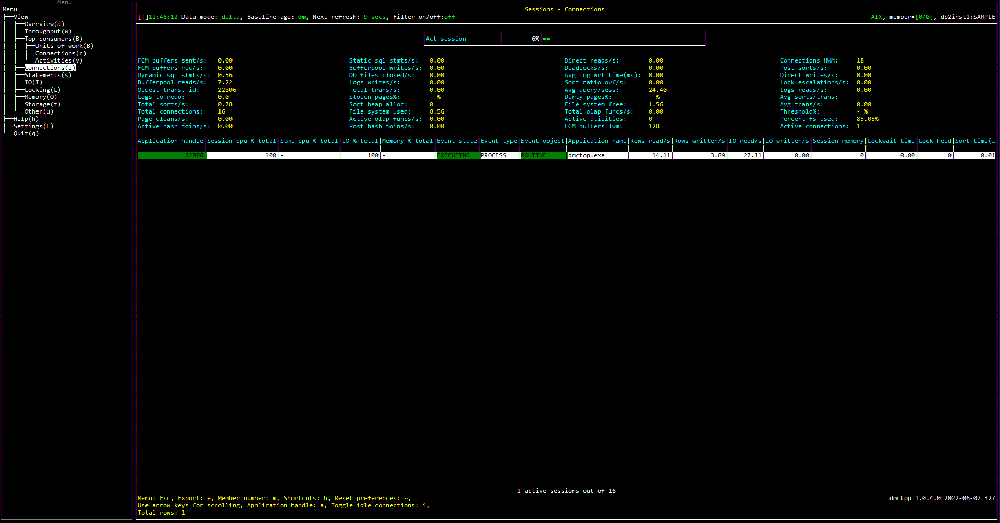

# Purpose

# Screenshot

# Metric shown

## Gauge

### Act session

The percentage of executing connections among all active connections.

= ACTIVE_CONN / TOTAL_CONN

TOTAL_CONN: The number of agents that have [AGENT_STATE ](https://www.ibm.com/docs/en/db2/11.5?topic=mpf-mon-get-agent-list-agents-fenced-mode-processes-system-entities-database) of `ACTIVE` and non-zero [APPLICATION_HANDLE](https://www.ibm.com/docs/en/db2/11.5?topic=reference-#r0054410).

ACTIVE_CONN: The number of agents that have [EVENT_STATE](https://www.ibm.com/docs/en/db2/11.5?topic=mpf-mon-get-agent-list-agents-fenced-mode-processes-system-entities-database) of `EXECUTING`, [EVENT_TYPE](https://www.ibm.com/docs/en/db2/11.5?topic=mpf-mon-get-agent-list-agents-fenced-mode-processes-system-entities-database) of `PROCESS` and idle duration ([CURRENT TIMESTAMP](https://www.ibm.com/docs/en/db2-for-zos/11?topic=registers-current-timestamp) - [AGENT_STATE_LAST_UPDATE_TIME](https://www.ibm.com/docs/en/db2/11.5?topic=mpf-mon-get-agent-list-agents-fenced-mode-processes-system-entities-database)) less than 15 seconds.

**Source:** [MON_GET_AGENT](https://www.ibm.com/docs/en/db2/11.5?topic=mpf-mon-get-agent-list-agents-fenced-mode-processes-system-entities-database)(NULL,NULL,NULL,#MEMBER#)

## Grid

### FCM buffers sent

The total number of FCM buffers sent from the current database member to a remote database member.

**Source:** [MON_GET_FCM_CONNECTION_LIST](https://www.ibm.com/docs/en/db2/11.5?topic=mpf-mon-get-fcm-connection-list-get-details-all-fcm-connections)(#MEMBER#).SUM([TOTAL_BUFFERS_SENT](https://www.ibm.com/docs/en/db2/11.5?topic=reference-t#r0001233))

### FCM buffers rec

The total number of FCM buffers received from a remote database member.

**Source:** [MON_GET_FCM_CONNECTION_LIST](https://www.ibm.com/docs/en/db2/11.5?topic=mpf-mon-get-fcm-connection-list-get-details-all-fcm-connections)(#MEMBER#).SUM([TOTAL_BUFFERS_RCVD](https://www.ibm.com/docs/en/db2/11.5?topic=reference-t#r0001234))

### Dynamic sql stmts

The number of dynamic SQL statements that were attempted.

**Source:** [MON_GET_DATABASE](https://www.ibm.com/docs/en/db2/11.5?topic=functions-mon-get-database-get-database-metrics)(#MEMBER#).SUM([DYNAMIC_SQL_STMTS](https://www.ibm.com/docs/en/db2/11.5?topic=reference-d#r0001330))

### Bufferpool reads

The number of pages read by agents from the buffer pool (logical).

**Source:** [MON_GET_DATABASE](https://www.ibm.com/docs/en/db2/11.5?topic=functions-mon-get-database-get-database-metrics)(#MEMBER#).SUM([POOL_DATA_L_READS](https://www.ibm.com/docs/en/db2/11.5?topic=reference-p#r0001235) + [POOL_INDEX_L_READS](https://www.ibm.com/docs/en/db2/11.5?topic=reference-p#r0001238) + [POOL_TEMP_DATA_L_READS](https://www.ibm.com/docs/en/db2/11.5?topic=reference-p#r0011302) + [POOL_TEMP_INDEX_L_READS](https://www.ibm.com/docs/en/db2/11.5?topic=reference-p#r0011303) + [POOL_XDA_L_READS](https://www.ibm.com/docs/en/db2/11.5?topic=reference-p#r0022731) + [POOL_TEMP_XDA_L_READS](https://www.ibm.com/docs/en/db2/11.5?topic=reference-p#r0022738) + [POOL_COL_L_READS](https://www.ibm.com/docs/en/db2/11.5?topic=reference-p#r0060763) + [POOL_TEMP_COL_L_READS](https://www.ibm.com/docs/en/db2/11.5?topic=reference-p#r0060873))

### Oldest trans. id

The application ID of the oldest units of work appeared in the list.

**Source:** [MON_GET_UNIT_OF_WORK](https://www.ibm.com/docs/en/db2/11.5?topic=mpf-mon-get-unit-work-get-unit-work-metrics)(NULL, #MEMBER#).[APPLICATION_HANDLE](https://www.ibm.com/docs/en/db2/11.5?topic=reference-#r0054410)

### Logs to redo

The total amount of log (in bytes) that will have to be redone for crash recovery.

**Source:** [MON_GET_TRANSACTION_LOG](https://www.ibm.com/docs/en/db2/11.5?topic=mpf-mon-get-transaction-log-table-function-get-log-information)(#MEMBER#).SUM([LOG_TO_REDO_FOR_RECOVERY](https://www.ibm.com/docs/en/db2/11.5?topic=reference-l#r0011312))

### Total sorts

The total number of sorts that have been executed.

**Source:** [MON_GET_DATABASE](https://www.ibm.com/docs/en/db2/11.5?topic=functions-mon-get-database-get-database-metrics)(#MEMBER#).SUM([TOTAL_SORTS](https://www.ibm.com/docs/en/db2/11.5?topic=reference-t#r0001219))

### Total connections

The number of agents that have [AGENT_STATE ](https://www.ibm.com/docs/en/db2/11.5?topic=mpf-mon-get-agent-list-agents-fenced-mode-processes-system-entities-database) of `ACTIVE` and non-zero [APPLICATION_HANDLE](https://www.ibm.com/docs/en/db2/11.5?topic=reference-#r0054410).

**Source:** [MON_GET_AGENT](https://www.ibm.com/docs/en/db2/11.5?topic=mpf-mon-get-agent-list-agents-fenced-mode-processes-system-entities-database)(NULL,NULL,NULL,#MEMBER#)

### Page cleans

The total number of times a page cleaner was invoked.

**Source:** [MON_GET_DATABASE](https://www.ibm.com/docs/en/db2/11.5?topic=functions-mon-get-database-get-database-metrics)(#MEMBER#).SUM([POOL_LSN_GAP_CLNS](https://www.ibm.com/docs/en/db2/11.5?topic=reference-p#r0001251) + [POOL_DRTY_PG_STEAL_CLNS](https://www.ibm.com/docs/en/db2/11.5?topic=reference-p#r0001252) + [POOL_DRTY_PG_THRSH_CLNS](https://www.ibm.com/docs/en/db2/11.5?topic=reference-p#r0001253))

### Active hash joins

The total number of hash joins that are currently running and consuming memory.

**Source:** [MON_GET_DATABASE](https://www.ibm.com/docs/en/db2/11.5?topic=functions-mon-get-database-get-database-metrics)(#MEMBER#).SUM([ACTIVE_HASH_JOINS](https://www.ibm.com/docs/en/db2/11.5?topic=reference-#r0021662))

### Static sql stmts

The number of static SQL statements that were attempted.

**Source:** [MON_GET_DATABASE](https://www.ibm.com/docs/en/db2/11.5?topic=functions-mon-get-database-get-database-metrics)(#MEMBER#).SUM([STATIC_SQL_STMTS](https://www.ibm.com/docs/en/db2/11.5?topic=reference-s#r0001329))

### Bufferpool writes

The number of times a buffer pool page was physically written to disk.

**Source:** [MON_GET_DATABASE](https://www.ibm.com/docs/en/db2/11.5?topic=functions-mon-get-database-get-database-metrics)(#MEMBER#).SUM([POOL_DATA_WRITES](https://www.ibm.com/docs/en/db2/11.5?topic=reference-p#r0001237) + [POOL_INDEX_WRITES](https://www.ibm.com/docs/en/db2/11.5?topic=reference-p#r0001240) + [POOL_XDA_WRITES](https://www.ibm.com/docs/en/db2/11.5?topic=reference-p#r0022732) + [POOL_COL_WRITES](https://www.ibm.com/docs/en/db2/11.5?topic=reference-p#r0060859))

### Db files closed

The total number of database files closed.

**Source:** [MON_GET_DATABASE](https://www.ibm.com/docs/en/db2/11.5?topic=functions-mon-get-database-get-database-metrics)(#MEMBER#).SUM([FILES_CLOSED](https://www.ibm.com/docs/en/db2/11.5?topic=reference-f#r0001243))

### Logs writes

The number of log pages written to disk by the logger.

**Source:** [MON_GET_TRANSACTION_LOG](https://www.ibm.com/docs/en/db2/11.5?topic=mpf-mon-get-transaction-log-table-function-get-log-information)(#MEMBER#).SUM([LOG_WRITES](https://www.ibm.com/docs/en/db2/11.5?topic=reference-l#r0001279))

### Total trans

Total number of statements issued by the client application.

**Source:** [MON_GET_DATABASE](https://www.ibm.com/docs/en/db2/11.5?topic=functions-mon-get-database-get-database-metrics)(#MEMBER#).SUM([TOTAL_APP_COMMITS](https://www.ibm.com/docs/en/db2/11.5?topic=reference-t#r0056527) + [TOTAL_APP_ROLLBACKS](https://www.ibm.com/docs/en/db2/11.5?topic=reference-t#r0056528))

### Stolen pages%

The percentage of times a page cleaner was invoked because the logging space used had reached a predefined criterion for the database.

 = POOL_LSN_GAP_CLNS / PAGE_CLEANS

**Source:** 

POOL_LSN_GAP_CLNS  = [MON_GET_DATABASE](https://www.ibm.com/docs/en/db2/11.5?topic=functions-mon-get-database-get-database-metrics)(#MEMBER#).SUM([POOL_LSN_GAP_CLNS](https://www.ibm.com/docs/en/db2/11.5?topic=reference-p#r0001251))

PAGE_CLEANS = [MON_GET_DATABASE](https://www.ibm.com/docs/en/db2/11.5?topic=functions-mon-get-database-get-database-metrics)(#MEMBER#).SUM([POOL_LSN_GAP_CLNS](https://www.ibm.com/docs/en/db2/11.5?topic=reference-p#r0001251) + [POOL_DRTY_PG_STEAL_CLNS](https://www.ibm.com/docs/en/db2/11.5?topic=reference-p#r0001252) + [POOL_DRTY_PG_THRSH_CLNS](https://www.ibm.com/docs/en/db2/11.5?topic=reference-p#r0001253))

### Sort heap alloc

The total number of allocated pages of sort heap space for all sorts at the level chosen and at the time the snapshot was taken.

**Source:** [MON_GET_DATABASE](https://www.ibm.com/docs/en/db2/11.5?topic=functions-mon-get-database-get-database-metrics)(#MEMBER#).SUM([SORT_HEAP_ALLOCATED](https://www.ibm.com/docs/en/db2/11.5?topic=reference-s#r0001215))

### File system used

The amount of space already used on a file system pointed to by a storage path or container.

**Source:** [MON_GET_CONTAINER](https://www.ibm.com/docs/en/db2/11.5?topic=mpf-mon-get-container-get-table-space-container-metrics)('',#MEMBER#).SUM([FS_USED_SIZE](https://www.ibm.com/docs/en/db2/11.5?topic=reference-f#r0022295))

### Active olap funcs

The total number of OLAP functions that are currently running and consuming sort heap memory.

**Source:** [MON_GET_DATABASE](https://www.ibm.com/docs/en/db2/11.5?topic=functions-mon-get-database-get-database-metrics)(#MEMBER#).SUM([ACTIVE_OLAP_FUNCS](https://www.ibm.com/docs/en/db2/11.5?topic=reference-#r0051900))

### Post hash joins

The total number of hashed GROUP BY sort memory requests that were limited because of a concurrent use of the shared or private sort heap space.

**Source:** [MON_GET_DATABASE](https://www.ibm.com/docs/en/db2/11.5?topic=functions-mon-get-database-get-database-metrics)(#MEMBER#).SUM([POST_THRESHOLD_HASH_JOINS](https://www.ibm.com/docs/en/db2/11.5?topic=reference-p#r0002284))

### Direct reads

The number of read operations that do not use the buffer pool.

**Source:** [MON_GET_DATABASE](https://www.ibm.com/docs/en/db2/11.5?topic=functions-mon-get-database-get-database-metrics)(#MEMBER#).SUM([DIRECT_READS](https://www.ibm.com/docs/en/db2/11.5?topic=reference-d#r0001260))

### Deadlocks

The total number of deadlocks that have occurred.

**Source:** [MON_GET_DATABASE](https://www.ibm.com/docs/en/db2/11.5?topic=functions-mon-get-database-get-database-metrics)(#MEMBER#).SUM([DEADLOCKS](https://www.ibm.com/docs/en/db2/11.5?topic=reference-d#r0001283))

### Avg log wrt time(ms)

The average elapsed time spent by the logger writing log data to the disk.

= LOG_WRITE_TIME / LOG_WRITES

**Source:**

LOG_WRITE_TIME  = [MON_GET_TRANSACTION_LOG](https://www.ibm.com/docs/en/db2/11.5?topic=mpf-mon-get-transaction-log-table-function-get-log-information)(#MEMBER#).SUM([LOG_WRITE_TIME](https://www.ibm.com/docs/en/db2/11.5?topic=reference-l#r0011679))

LOG_WRITES = [MON_GET_TRANSACTION_LOG](https://www.ibm.com/docs/en/db2/11.5?topic=mpf-mon-get-transaction-log-table-function-get-log-information)(#MEMBER#).SUM([LOG_WRITES](https://www.ibm.com/docs/en/db2/11.5?topic=reference-l#r0001279))

### Sort ratio ovf

The ratio of sorts that ran out of sort heap and may have required disk space for temporary storage.

= SORT_OVERFLOWS / TOTAL_SORTS

**Source:** 

SORT_OVERFLOWS = [MON_GET_DATABASE](https://www.ibm.com/docs/en/db2/11.5?topic=functions-mon-get-database-get-database-metrics)(#MEMBER#).SUM([SORT_OVERFLOWS](https://www.ibm.com/docs/en/db2/11.5?topic=reference-s#r0001221))

TOTAL_SORTS= [MON_GET_DATABASE](https://www.ibm.com/docs/en/db2/11.5?topic=functions-mon-get-database-get-database-metrics)(#MEMBER#).SUM([TOTAL_SORTS](https://www.ibm.com/docs/en/db2/11.5?topic=reference-t#r0001219))

### Avg query/sess

The average number of SQL statements that were attempted per connection.

= SQL_STMTS / TOTAL_CONS 

**Source:** 

SQL_STMTS = [MON_GET_DATABASE](https://www.ibm.com/docs/en/db2/11.5?topic=functions-mon-get-database-get-database-metrics)(#MEMBER#).SUM([DYNAMIC_SQL_STMTS](https://www.ibm.com/docs/en/db2/11.5?topic=reference-d#r0001330) + [STATIC_SQL_STMTS](https://www.ibm.com/docs/en/db2/11.5?topic=reference-s#r0001329))

TOTAL_CONS = [MON_GET_DATABASE](https://www.ibm.com/docs/en/db2/11.5?topic=functions-mon-get-database-get-database-metrics)(#MEMBER#).SUM([TOTAL_CONS](https://www.ibm.com/docs/en/db2/11.5?topic=reference-t#r0001200))

### Dirty pages%

The percentage of a page cleaner was invoked because a synchronous write was needed during the victim buffer replacement for the database.

= POOL_DRTY_PG_STEAL_CLNS / PAGE_CLEANS 

**Source:** 

POOL_DRTY_PG_STEAL_CLNS = [MON_GET_DATABASE](https://www.ibm.com/docs/en/db2/11.5?topic=functions-mon-get-database-get-database-metrics)(#MEMBER#).SUM([POOL_DRTY_PG_STEAL_CLNS](https://www.ibm.com/docs/en/db2/11.5?topic=reference-p#r0001252))

PAGE_CLEANS = [MON_GET_DATABASE](https://www.ibm.com/docs/en/db2/11.5?topic=functions-mon-get-database-get-database-metrics)(#MEMBER#).SUM([POOL_LSN_GAP_CLNS](https://www.ibm.com/docs/en/db2/11.5?topic=reference-p#r0001251) + [POOL_DRTY_PG_STEAL_CLNS](https://www.ibm.com/docs/en/db2/11.5?topic=reference-p#r0001252) + [POOL_DRTY_PG_THRSH_CLNS](https://www.ibm.com/docs/en/db2/11.5?topic=reference-p#r0001253))

### File system free

The amount of space is free on a file system pointed to by a storage path or container.

**Source:** [MON_GET_CONTAINER](https://www.ibm.com/docs/en/db2/11.5?topic=mpf-mon-get-container-get-table-space-container-metrics)('',#MEMBER#).SUM([FS_TOTAL_SIZE](https://www.ibm.com/docs/en/db2/11.5?topic=reference-f#r0022296) - [FS_USED_SIZE](https://www.ibm.com/docs/en/db2/11.5?topic=reference-f#r0022295))

### Total olap funcs

The total number of OLAP functions executed.

**Source:** [MON_GET_DATABASE](https://www.ibm.com/docs/en/db2/11.5?topic=functions-mon-get-database-get-database-metrics)(#MEMBER#).SUM([TOTAL_OLAP_FUNCS](https://www.ibm.com/docs/en/db2/11.5?topic=reference-t#r0051897))

### Active utilities

The total number of utilities currently running on the database. Number of rows in MON_GET_UTILITY is counted to get the value.

**Source:** [MON_GET_UTILITY](https://www.ibm.com/docs/en/db2oc?topic=functions-mon-get-utility-get-utilities-running-database)(#MEMBER#)

### FCM buffers lwm

The lowest number of free FCM buffers reached during processing.

**Source:** [MON_GET_FCM](https://www.ibm.com/docs/en/db2/11.5?topic=functions-mon-get-fcm-get-fcm-metrics)(#MEMBER#).SUM([BUFF_FREE_BOTTOM](https://www.ibm.com/docs/en/db2/11.5?topic=reference-b#r0001224))

### Connections HWM

The maximum number of coordinating agents working at one time.

**Source:** [MON_GET_DATABASE](https://www.ibm.com/docs/en/db2/11.5?topic=functions-mon-get-database-get-database-metrics)(#MEMBER#).SUM([COORD_AGENTS_TOP](https://www.ibm.com/docs/en/db2/11.5?topic=reference-c#r0001210))

### Post sorts

The number of times that partial early distinct operations received less memory than requested due to sort heap threshold being exceeded.

**Source:** [MON_GET_DATABASE](https://www.ibm.com/docs/en/db2/11.5?topic=functions-mon-get-database-get-database-metrics)(#MEMBER#).SUM([POST_THRESHOLD_SORTS](https://www.ibm.com/docs/en/db2/11.5?topic=reference-p#r0001216))

### Direct writes

The number of write operations that do not use the buffer pool.

**Source:** [MON_GET_DATABASE](https://www.ibm.com/docs/en/db2/11.5?topic=functions-mon-get-database-get-database-metrics)(#MEMBER#).SUM([DIRECT_WRITES](https://www.ibm.com/docs/en/db2/11.5?topic=reference-d#r0001261))

### Lock escalations

The number of times that locks have been escalated from several row locks to a table lock.

**Source:** [MON_GET_DATABASE](https://www.ibm.com/docs/en/db2/11.5?topic=functions-mon-get-database-get-database-metrics)(#MEMBER#).SUM([LOCK_ESCALS](https://www.ibm.com/docs/en/db2/11.5?topic=reference-l#r0001284))

### Logs reads

The number of log pages read from disk by the logger.

**Source:** [MON_GET_TRANSACTION_LOG](https://www.ibm.com/docs/en/db2/11.5?topic=mpf-mon-get-transaction-log-table-function-get-log-information)(#MEMBER#).SUM([LOG_READS](https://www.ibm.com/docs/en/db2/11.5?topic=reference-l#r0001278))

### Avg sorts/trans

Average sorts that have been executed per statement issued by the client application

= TOTAL_SORTS / TOTAL_TRANS

**Source:** 

TOTAL_SORTS = [MON_GET_DATABASE](https://www.ibm.com/docs/en/db2/11.5?topic=functions-mon-get-database-get-database-metrics)(#MEMBER#).SUM([TOTAL_SORTS](https://www.ibm.com/docs/en/db2/11.5?topic=reference-t#r0001219))

TOTAL_TRANS = [MON_GET_DATABASE](https://www.ibm.com/docs/en/db2/11.5?topic=functions-mon-get-database-get-database-metrics)(#MEMBER#).SUM([TOTAL_APP_COMMITS](https://www.ibm.com/docs/en/db2/11.5?topic=reference-t#r0056527) + [TOTAL_APP_ROLLBACKS](https://www.ibm.com/docs/en/db2/11.5?topic=reference-t#r0056528))

### Avg trans

Counter:

The total number of statements issued by the client application.

**Source:**  [MON_GET_DATABASE](https://www.ibm.com/docs/en/db2/11.5?topic=functions-mon-get-database-get-database-metrics)(#MEMBER#).SUM([TOTAL_APP_COMMITS](https://www.ibm.com/docs/en/db2/11.5?topic=reference-t#r0056527) + [TOTAL_APP_ROLLBACKS](https://www.ibm.com/docs/en/db2/11.5?topic=reference-t#r0056528))

Delta:

The average number of sorts that have been executed per second.

= TOTAL_SORTS / (CURRENT TIMESTAMP - DB_CONN_TIME)

**Source:**

TOTAL_SORTS = [MON_GET_DATABASE](https://www.ibm.com/docs/en/db2/11.5?topic=functions-mon-get-database-get-database-metrics)(#MEMBER#).SUM([TOTAL_SORTS](https://www.ibm.com/docs/en/db2/11.5?topic=reference-t#r0001219))

CURRENT TIMESTAMP = [CURRENT TIMESTAMP](https://www.ibm.com/docs/en/db2-for-zos/11?topic=registers-current-timestamp)

DB_CONN_TIME = [MON_GET_DATABASE](https://www.ibm.com/docs/en/db2/11.5?topic=functions-mon-get-database-get-database-metrics)(#MEMBER#).MIN([DB_CONN_TIME](https://www.ibm.com/docs/en/db2/11.5?topic=reference-d#r0001154))

### Threshold%

The percentage of times a page cleaner was invoked because a buffer pool had reached the dirty page threshold criterion for the database.

= POOL_DRTY_PG_THRSH_CLNS / PAGE_CLEANS 

**Source:**

POOL_DRTY_PG_THRSH_CLNS = [MON_GET_DATABASE](https://www.ibm.com/docs/en/db2/11.5?topic=functions-mon-get-database-get-database-metrics)(#MEMBER#).SUM([POOL_DRTY_PG_THRSH_CLNS](https://www.ibm.com/docs/en/db2/11.5?topic=reference-p#r0001253))

PAGE_CLEANS = [MON_GET_DATABASE](https://www.ibm.com/docs/en/db2/11.5?topic=functions-mon-get-database-get-database-metrics)(#MEMBER#).SUM([POOL_LSN_GAP_CLNS](https://www.ibm.com/docs/en/db2/11.5?topic=reference-p#r0001251) + [POOL_DRTY_PG_STEAL_CLNS](https://www.ibm.com/docs/en/db2/11.5?topic=reference-p#r0001252) + [POOL_DRTY_PG_THRSH_CLNS](https://www.ibm.com/docs/en/db2/11.5?topic=reference-p#r0001253))

### Percent fs used

The percentage of space that is used on a file system pointed to by a storage path or container.

= 1 - FS_FREE_SIZE_BYTES / (FS_FREE_SIZE_BYTES + FS_USED_SIZE)

**Source:**

FS_FREE_SIZE_BYTES = [MON_GET_CONTAINER](https://www.ibm.com/docs/en/db2/11.5?topic=mpf-mon-get-container-get-table-space-container-metrics)('',#MEMBER#).SUM([FS_TOTAL_SIZE](https://www.ibm.com/docs/en/db2/11.5?topic=reference-f#r0022296) - [FS_USED_SIZE](https://www.ibm.com/docs/en/db2/11.5?topic=reference-f#r0022295))

FS_USED_SIZE = [MON_GET_CONTAINER](https://www.ibm.com/docs/en/db2/11.5?topic=mpf-mon-get-container-get-table-space-container-metrics)('',#MEMBER#).SUM([FS_USED_SIZE](https://www.ibm.com/docs/en/db2/11.5?topic=reference-f#r0022295))

### Active connections

The number of active connections.

The number of agents that have [EVENT_STATE](https://www.ibm.com/docs/en/db2/11.5?topic=mpf-mon-get-agent-list-agents-fenced-mode-processes-system-entities-database) of `EXECUTING`, [EVENT_TYPE](https://www.ibm.com/docs/en/db2/11.5?topic=mpf-mon-get-agent-list-agents-fenced-mode-processes-system-entities-database) of `PROCESS` and idle duration ([CURRENT TIMESTAMP](https://www.ibm.com/docs/en/db2-for-zos/11?topic=registers-current-timestamp) - [AGENT_STATE_LAST_UPDATE_TIME](https://www.ibm.com/docs/en/db2/11.5?topic=mpf-mon-get-agent-list-agents-fenced-mode-processes-system-entities-database)) less than 15 seconds.

**Source:** [MON_GET_AGENT](https://www.ibm.com/docs/en/db2/11.5?topic=mpf-mon-get-agent-list-agents-fenced-mode-processes-system-entities-database)(NULL,NULL,NULL,#MEMBER#)

## Table

### Application handle

A system-wide unique ID for the application.

**Source:** [MON_GET_CONNECTION](https://www.ibm.com/docs/en/db2/11.5?topic=functions-mon-get-connection-get-connection-metrics)(NULL, #MEMBER#, 1).[APPLICATION_HANDLE](https://www.ibm.com/docs/en/db2oc?topic=reference-#r0054410)

### Session cpu % total

The percentage of CPU time usage of the session.

= TOTAL_CPU_TIME / SESSION_CPU_TOTAL

SESSION_CPU_TOTAL: The overall amount of CPU time used while within the database system over all sessions.

**Source:** 

TOTAL_CPU_TIME = [MON_GET_CONNECTION](https://www.ibm.com/docs/en/db2/11.5?topic=functions-mon-get-connection-get-connection-metrics)(NULL, #MEMBER#, 1).SUM([TOTAL_CPU_TIME](https://www.ibm.com/docs/en/db2oc?topic=reference-t#r0054057))

### Stmt cpu % total

The percentage of CPU time usage of the activity.

= STMT_TOTAL_CPU_TIME_US / STMT_CPU_TOTAL

STMT_CPU_TOTAL: The overall amount of CPU time used by activities over all session.

**Source:** 

STMT_TOTAL_CPU_TIME_US = [MON_GET_ACTIVITY](https://www.ibm.com/docs/en/db2oc?topic=functions-mon-get-activity-return-list-activities)(NULL, #MEMBER#).SUM([TOTAL_CPU_TIME](https://www.ibm.com/docs/en/db2oc?topic=reference-t#r0054057))

### IO % total

The percentage of pages written and read of the session.

= TOTAL_IO / IO_TOTAL

IO_TOTAL: The overall number of pages written and read over all sessions.

**Source:** 

TOTAL_IO = [MON_GET_CONNECTION](https://www.ibm.com/docs/en/db2/11.5?topic=functions-mon-get-connection-get-connection-metrics)(NULL, #MEMBER#, 1).SUM([POOL_DATA_L_READS](https://www.ibm.com/docs/en/db2/11.5?topic=reference-p#r0001235) + [POOL_INDEX_L_READS](https://www.ibm.com/docs/en/db2/11.5?topic=reference-p#r0001238) + [POOL_TEMP_DATA_L_READS](https://www.ibm.com/docs/en/db2/11.5?topic=reference-p#r0011302) + [POOL_TEMP_INDEX_L_READS](https://www.ibm.com/docs/en/db2/11.5?topic=reference-p#r0011303) + [POOL_DATA_WRITES](https://www.ibm.com/docs/en/db2/11.5?topic=reference-p#r0001237) + [POOL_INDEX_WRITES](https://www.ibm.com/docs/en/db2/11.5?topic=reference-p#r0001240) + [POOL_XDA_L_READS](https://www.ibm.com/docs/en/db2/11.5?topic=reference-p#r0022731) + [POOL_TEMP_XDA_L_READS](https://www.ibm.com/docs/en/db2/11.5?topic=reference-p#r0022738) + [POOL_XDA_WRITES](https://www.ibm.com/docs/en/db2/11.5?topic=reference-p#r0022732) + [POOL_COL_L_READS](https://www.ibm.com/docs/en/db2/11.5?topic=reference-p#r0060763) + [POOL_TEMP_COL_L_READS](https://www.ibm.com/docs/en/db2/11.5?topic=reference-p#r0060873) + [POOL_COL_WRITES](https://www.ibm.com/docs/en/db2/11.5?topic=reference-p#r0060859))

### Memory % total

The percentage of amount of committed memory in use.

= MEMORY_POOL_USED / MEMORY_TOTAL

MEMORY_TOTAL: The overall amount of committed memory in use overall all session.

**Source:** 

MEMORY_POOL_USED = [MON_GET_MEMORY_POOL](https://www.ibm.com/docs/en/db2/11.5?topic=mpf-mon-get-memory-pool-get-memory-pool-information)(NULL, [CURRENT_SERVER](https://www.ibm.com/docs/en/db2-warehouse?topic=registers-current-server), #MEMBER#).SUM([MEMORY_POOL_USED](https://www.ibm.com/docs/en/db2/11.5?topic=reference-m#r0059534))

### Event state

State of the event last processed by this agent. The possible values are as follows:
* EXECUTING
* IDLE

**Source:**  [WLM_GET_SERVICE_CLASS_AGENTS](https://www.ibm.com/docs/en/db2/11.5?topic=wmr-wlm-get-service-class-agents-table-function-list-agents-running-in-service-class)(NULL,NULL,NULL,#MEMBER#).[EVENT_STATE](https://www.ibm.com/docs/en/db2/11.5?topic=mpf-mon-get-agent-list-agents-fenced-mode-processes-system-entities-database#r0060767__PossibleCombinationsForEVENT_STATE)

### Event type

Type of event last processed by this agent. The possible values are as follows:
* ACQUIRE
* PROCESS
* WAIT

**Source:**  [WLM_GET_SERVICE_CLASS_AGENTS](https://www.ibm.com/docs/en/db2/11.5?topic=wmr-wlm-get-service-class-agents-table-function-list-agents-running-in-service-class)(NULL,NULL,NULL,#MEMBER#).[EVENT_TYPE](https://www.ibm.com/docs/en/db2/11.5?topic=mpf-mon-get-agent-list-agents-fenced-mode-processes-system-entities-database#r0060767__PossibleCombinationsForEVENT_STATE)

### Event object

Object of the event last processed by this agent. The possible values are as follows:
* COMPRESSION_DICTIONARY_BUILD
* IMPLICIT_REBIND
* INDEX_RECREATE
* LATCH
* LOCK
* LOCK_ESCALATION
* QP_QUEUE
* REMOTE_REQUEST
* REQUEST
* ROUTINE
* WLM_QUEUE
* TQ_SEND
* TQ_RECEIVE

**Source:**  [WLM_GET_SERVICE_CLASS_AGENTS](https://www.ibm.com/docs/en/db2/11.5?topic=wmr-wlm-get-service-class-agents-table-function-list-agents-running-in-service-class)(NULL,NULL,NULL,#MEMBER#).[EVENT_OBJECT](https://www.ibm.com/docs/en/db2/11.5?topic=mpf-mon-get-agent-list-agents-fenced-mode-processes-system-entities-database#r0060767__PossibleCombinationsForEVENT_STATE)

### Application name

The name of the application running at the client.

**Source:** [MON_GET_CONNECTION](https://www.ibm.com/docs/en/db2/11.5?topic=functions-mon-get-connection-get-connection-metrics)(NULL, #MEMBER#, 1).[APPLICATION_NAME](https://www.ibm.com/docs/en/db2/11.5?topic=reference-#r0001165)

### Rows read

The number of rows read from the table.

**Source:** [MON_GET_CONNECTION](https://www.ibm.com/docs/en/db2/11.5?topic=functions-mon-get-connection-get-connection-metrics)(NULL, #MEMBER#, 1).SUM([ROWS_READ](https://www.ibm.com/docs/en/db2/11.5?topic=reference-r#r0001317))

### Rows written

The number of rows inserted, updated, or deleted.

**Source:** [MON_GET_CONNECTION](https://www.ibm.com/docs/en/db2/11.5?topic=functions-mon-get-connection-get-connection-metrics)(NULL, #MEMBER#, 1).SUM([ROWS_MODIFIED](https://www.ibm.com/docs/en/db2/11.5?topic=reference-r#r0051568))

### IO read

The number of pages read by agents.

**Source:** [MON_GET_CONNECTION](https://www.ibm.com/docs/en/db2/11.5?topic=functions-mon-get-connection-get-connection-metrics)(NULL, #MEMBER#, 1).SUM([POOL_DATA_L_READS](https://www.ibm.com/docs/en/db2/11.5?topic=reference-p#r0001235) + [POOL_INDEX_L_READS](https://www.ibm.com/docs/en/db2/11.5?topic=reference-p#r0001238) + [POOL_TEMP_DATA_L_READS](https://www.ibm.com/docs/en/db2/11.5?topic=reference-p#r0011302) +  [POOL_TEMP_INDEX_L_READS](https://www.ibm.com/docs/en/db2/11.5?topic=reference-p#r0011303)  +  [POOL_XDA_L_READS](https://www.ibm.com/docs/en/db2/11.5?topic=reference-p#r0022731) + [POOL_TEMP_XDA_L_READS](https://www.ibm.com/docs/en/db2/11.5?topic=reference-p#r0022738) + [POOL_COL_L_READS](https://www.ibm.com/docs/en/db2/11.5?topic=reference-p#r0060763) +  [POOL_TEMP_COL_L_READS](https://www.ibm.com/docs/en/db2/11.5?topic=reference-p#r0060873))

### IO written

The number of times a page was physically written to disk.

**Source:** [MON_GET_CONNECTION](https://www.ibm.com/docs/en/db2/11.5?topic=functions-mon-get-connection-get-connection-metrics)(NULL, #MEMBER#, 1).SUM([POOL_DATA_WRITES](https://www.ibm.com/docs/en/db2/11.5?topic=reference-p#r0001237) + [POOL_INDEX_WRITES](https://www.ibm.com/docs/en/db2/11.5?topic=reference-p#r0001240) + [POOL_XDA_WRITES](https://www.ibm.com/docs/en/db2/11.5?topic=reference-p#r0022732) + [POOL_COL_WRITES](https://www.ibm.com/docs/en/db2/11.5?topic=reference-p#r0060859))

### Session memory

The amount of committed memory in use by this memory pool of the session.

**Source:** [MON_GET_MEMORY_POOL](https://www.ibm.com/docs/en/db2/11.5?topic=mpf-mon-get-memory-pool-get-memory-pool-information)(NULL, [CURRENT_SERVER](https://www.ibm.com/docs/en/db2-warehouse?topic=registers-current-server), #MEMBER#).SUM([MEMORY_POOL_USED](https://www.ibm.com/docs/en/db2/11.5?topic=reference-m#r0059534))

### Lockwait time

The total elapsed time spent waiting for locks.

**Source:** [MON_GET_CONNECTION](https://www.ibm.com/docs/en/db2/11.5?topic=functions-mon-get-connection-get-connection-metrics)(NULL, #MEMBER#, 1).SUM([LOCK_WAIT_TIME](https://www.ibm.com/docs/en/db2/11.5?topic=reference-l#r0001294))

### Lock held

The number of locks currently held.

**Source:** [MON_GET_CONNECTION](https://www.ibm.com/docs/en/db2/11.5?topic=functions-mon-get-connection-get-connection-metrics)(NULL, #MEMBER#, 1).SUM([NUM_LOCKS_HELD](https://www.ibm.com/docs/en/db2/11.5?topic=reference-l#r0001281))

### Sort time(s)

The total amount of time spent performing sorts while executing a section.

**Source:** [MON_GET_CONNECTION](https://www.ibm.com/docs/en/db2/11.5?topic=functions-mon-get-connection-get-connection-metrics)(NULL, #MEMBER#, 1).SUM([TOTAL_SECTION_SORT_TIME](https://www.ibm.com/docs/en/db2/11.5?topic=reference-t#r0054154))

### Rows returned

### OS user

The ID that the user specified when logging in to the operating system. 

**Source:** [MON_GET_CONNECTION](https://www.ibm.com/docs/en/db2/11.5?topic=functions-mon-get-connection-get-connection-metrics)(NULL, #MEMBER#, 1).[EXECUTION_ID](https://www.ibm.com/docs/en/db2/11.5?topic=reference-e#r0001175)

### Db user

The system authorization id for the connection.

**Source:** [MON_GET_CONNECTION](https://www.ibm.com/docs/en/db2/11.5?topic=functions-mon-get-connection-get-connection-metrics)(NULL, #MEMBER#, 1).[SYSTEM_AUTH_ID](https://www.ibm.com/docs/en/db2/11.5?topic=reference-s#r0056526)

### Client hostname

The hostname of the machine the client application is connecting from.

**Source:** [MON_GET_CONNECTION](https://www.ibm.com/docs/en/db2/11.5?topic=functions-mon-get-connection-get-connection-metrics)(NULL, #MEMBER#, 1).[CLIENT_HOSTNAME](https://www.ibm.com/docs/en/db2/11.5?topic=reference-c#r0056522)

### Connection start time

The time at which the connection was established with the database server.

**Source:** [MON_GET_CONNECTION](https://www.ibm.com/docs/en/db2/11.5?topic=functions-mon-get-connection-get-connection-metrics)(NULL, #MEMBER#, 1).MIN([CONNECTION_START_TIME](https://www.ibm.com/docs/en/db2/11.5?topic=reference-c#r0056524))

### Status enter time

The date and time that the unit of work first required database resources.

**Source:** [MON_GET_CONNECTION](https://www.ibm.com/docs/en/db2/11.5?topic=functions-mon-get-connection-get-connection-metrics)(NULL, #MEMBER#, 1).[UOW_START_TIME](https://www.ibm.com/docs/en/db2/11.5?topic=reference-u#r0001189)

### Timein status(s)

The elapsed time from the unit of work first required database resources.

= CURRENT TIMESTAMP - UOW_START_TIME

**Source:** 

[CURRENT TIMESTAMP](https://www.ibm.com/docs/en/db2-for-zos/11?topic=registers-current-timestamp)

UOW_START_TIME = [MON_GET_CONNECTION](https://www.ibm.com/docs/en/db2/11.5?topic=functions-mon-get-connection-get-connection-metrics)(NULL, #MEMBER#, 1).[UOW_START_TIME](https://www.ibm.com/docs/en/db2/11.5?topic=reference-u#r0001189)

### Io type(data/index/temp)

The ratio of different type of pages read by agents.

= dReads /(dReads + iReads + tReads) + "d | " + iReads /(dReads + iReads + tReads) + "i | " + tReads /(dReads + iReads + tReads) + "t"

**Source:** 

dReads = [MON_GET_CONNECTION](https://www.ibm.com/docs/en/db2/11.5?topic=functions-mon-get-connection-get-connection-metrics)(NULL, #MEMBER#, 1).SUM([POOL_DATA_L_READS](https://www.ibm.com/docs/en/db2/11.5?topic=reference-p#r0001235))

iReads= [MON_GET_CONNECTION](https://www.ibm.com/docs/en/db2/11.5?topic=functions-mon-get-connection-get-connection-metrics)(NULL, #MEMBER#, 1).SUM([POOL_INDEX_L_READS](https://www.ibm.com/docs/en/db2/11.5?topic=reference-p#r0001238))

tReads = [MON_GET_CONNECTION](https://www.ibm.com/docs/en/db2/11.5?topic=functions-mon-get-connection-get-connection-metrics)(NULL, #MEMBER#, 1).SUM([POOL_TEMP_DATA_L_READS](https://www.ibm.com/docs/en/db2/11.5?topic=reference-p#r0011302) + [POOL_TEMP_INDEX_L_READS](https://www.ibm.com/docs/en/db2/11.5?topic=reference-p#r0011303) + [POOL_XDA_L_READS](https://www.ibm.com/docs/en/db2/11.5?topic=reference-p#r0022731) + [POOL_TEMP_XDA_L_READS](https://www.ibm.com/docs/en/db2/11.5?topic=reference-p#r0022738) + [POOL_COL_L_READS](https://www.ibm.com/docs/en/db2/11.5?topic=reference-p#r0060763) + [POOL_TEMP_COL_L_READS](https://www.ibm.com/docs/en/db2/11.5?topic=reference-p#r0060873))

### Sort overflow

The total number of sorts that ran out of sort heap and may have required disk space for temporary storage.

**Source:** [MON_GET_CONNECTION](https://www.ibm.com/docs/en/db2/11.5?topic=functions-mon-get-connection-get-connection-metrics)(NULL, #MEMBER#, 1).SUM([SORT_OVERFLOWS](https://www.ibm.com/docs/en/db2/11.5?topic=reference-s#r0001221))

### Hash join overflow

The number of times that hash join data exceeded the available sort heap space.

**Source:** [MON_GET_CONNECTION](https://www.ibm.com/docs/en/db2/11.5?topic=functions-mon-get-connection-get-connection-metrics)(NULL, #MEMBER#, 1).SUM([HASH_JOIN_OVERFLOWS](https://www.ibm.com/docs/en/db2/11.5?topic=reference-h#r0002286))

### Coordinator number

The coordinating member for an application.

**Source:** [MON_GET_CONNECTION](https://www.ibm.com/docs/en/db2/11.5?topic=functions-mon-get-connection-get-connection-metrics)(NULL, #MEMBER#, 1).MIN([COORD_MEMBER](https://www.ibm.com/docs/en/db2/11.5?topic=reference-c#r0055426))

### Last operation

The type of the last request completed by the application.

**Source:** [MON_GET_CONNECTION](https://www.ibm.com/docs/en/db2/11.5?topic=functions-mon-get-connection-get-connection-metrics)(NULL, #MEMBER#, 1).[LAST_REQUEST_TYPE](https://www.ibm.com/docs/en/db2/11.5?topic=reference-l#r0056665))

### Max cost estimate

The total max estimated cost of a session.

**Source:** SUM([MON_GET_ACTIVITY](https://www.ibm.com/docs/en/db2oc?topic=functions-mon-get-activity-return-list-activities)(NULL, #MEMBER#).MAX([QUERY_COST_ESTIMATE](https://www.ibm.com/docs/en/db2oc?topic=reference-q#r0001357)))

### Internal application

Indicates whether the application is a system application.

If IS_SYSTEM_APPL is 0 then value is `NO` else `YES`.

**Source:** [MON_GET_CONNECTION](https://www.ibm.com/docs/en/db2/11.5?topic=functions-mon-get-connection-get-connection-metrics)(NULL, #MEMBER#, 1).[IS_SYSTEM_APPL](https://www.ibm.com/docs/en/db2/11.5?topic=reference-i#r0051792)

### Assoc. agents

The number of subagents associated with an application. 

**Source:** [MON_GET_CONNECTION](https://www.ibm.com/docs/en/db2/11.5?topic=functions-mon-get-connection-get-connection-metrics)(NULL, #MEMBER#, 1).SUM([NUM_ASSOC_AGENTS](https://www.ibm.com/docs/en/db2/11.5?topic=reference-n#r0002523))

### Paral. degree

The overall max actual runtime degree of intrapartition parallelism reported at the statement, activity, transaction, or workload level.

**Source:** SUM([MON_GET_ACTIVITY](https://www.ibm.com/docs/en/db2oc?topic=functions-mon-get-activity-return-list-activities)(NULL, #MEMBER#).MAX([QUERY_ACTUAL_DEGREE](https://www.ibm.com/docs/en/db2oc?topic=reference-q#r0058916)))

### Fetch count (stmt)

The total number of rows that have been selected and returned to the application.

**Source:** SUM([MON_GET_ACTIVITY](https://www.ibm.com/docs/en/db2oc?topic=functions-mon-get-activity-return-list-activities)(NULL, #MEMBER#).SUM([FETCH_COUNT](https://www.ibm.com/docs/en/db2oc?topic=reference-r#r0051569)))

### Dynamic sql stmts

The number of dynamic SQL statements that were attempted.

**Source:** [MON_GET_CONNECTION](https://www.ibm.com/docs/en/db2/11.5?topic=functions-mon-get-connection-get-connection-metrics)(NULL, #MEMBER#, 1).SUM([DYNAMIC_SQL_STMTS](https://www.ibm.com/docs/en/db2/11.5?topic=reference-d#r0001330))

### Static sql stmts

The number of static SQL statements that were attempted.

**Source:** [MON_GET_CONNECTION](https://www.ibm.com/docs/en/db2/11.5?topic=functions-mon-get-connection-get-connection-metrics)(NULL, #MEMBER#, 1).SUM([STATIC_SQL_STMTS](https://www.ibm.com/docs/en/db2/11.5?topic=reference-s#r0001329))

### # of xqueries

The number of XQuery statements executed.

**Source:** [MON_GET_CONNECTION](https://www.ibm.com/docs/en/db2/11.5?topic=functions-mon-get-connection-get-connection-metrics)(NULL, #MEMBER#, 1).SUM([XQUERY_STMTS](https://www.ibm.com/docs/en/db2/11.5?topic=reference-x#r0023875))

### Client platform

The operating system on which the client application is running.

**Source:** [MON_GET_CONNECTION](https://www.ibm.com/docs/en/db2/11.5?topic=functions-mon-get-connection-get-connection-metrics)(NULL, #MEMBER#, 1).[CLIENT_PLATFORM](https://www.ibm.com/docs/en/db2/11.5?topic=reference-c#r0001178)

### Client pid

The process ID of the client application that made the connection to the database.

**Source:** [MON_GET_CONNECTION](https://www.ibm.com/docs/en/db2/11.5?topic=functions-mon-get-connection-get-connection-metrics)(NULL, #MEMBER#, 1).[CLIENT_PID](https://www.ibm.com/docs/en/db2/11.5?topic=reference-c#r0001177)

### Timeto connect(ms)

The total amount of time spent performing a connection or switch user authentication or request.

**Source:** [MON_GET_CONNECTION](https://www.ibm.com/docs/en/db2/11.5?topic=functions-mon-get-connection-get-connection-metrics)(NULL, #MEMBER#, 1).SUM([TOTAL_CONNECT_REQUEST_TIME](https://www.ibm.com/docs/en/db2/11.5?topic=reference-t#r0059279) + [TOTAL_CONNECT_AUTHENTICATION_TIME](https://www.ibm.com/docs/en/db2/11.5?topic=reference-t#r0059277))

### Session cpu

The total amount of CPU time used for the session.

**Source:**  [MON_GET_CONNECTION](https://www.ibm.com/docs/en/db2/11.5?topic=functions-mon-get-connection-get-connection-metrics)(NULL, #MEMBER#, 1).SUM([TOTAL_CPU_TIME](https://www.ibm.com/docs/en/db2oc?topic=reference-t#r0054057))

### Statement cpu(us)

The total amount of CPU time used for the statement activity.

**Source:**  [MON_GET_ACTIVITY](https://www.ibm.com/docs/en/db2oc?topic=functions-mon-get-activity-return-list-activities)(NULL, #MEMBER#).SUM([TOTAL_CPU_TIME](https://www.ibm.com/docs/en/db2oc?topic=reference-t#r0054057))

