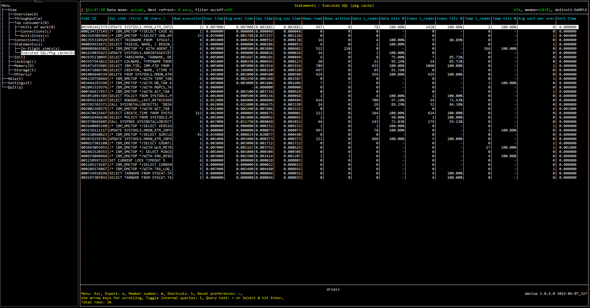

# Purpose

Executed statements view shows a list of dynamic SQL statements that are recently run. This is useful for identifying statemnts that are costly or long running.

Drill down is provided to see the full SQL text or run explain on a statement.

# Screenshot

# Metric shown

### Stmt ID

An opaque binary token generated on the data server that uniquely identifies the section of the database package cache. 

**Source:** [MON_GET_PKG_CACHE_STMT](https://www.ibm.com/docs/en/db2/11.5?topic=mpf-mon-get-pkg-cache-stmt-table-function-get-package-cache-statement-metrics)('D', NULL, NULL, #MEMBER#).[EXECUTABLE_ID](https://www.ibm.com/docs/en/db2/11.5?topic=reference-e#r0054409)

### Sql stmt (first 30 chars.)

The first 30 characters of the SQL statement.

**Source:** [MON_GET_PKG_CACHE_STMT](https://www.ibm.com/docs/en/db2/11.5?topic=mpf-mon-get-pkg-cache-stmt-table-function-get-package-cache-statement-metrics)('D', NULL, NULL, #MEMBER#).[STMT_TEXT](https://www.ibm.com/docs/en/db2/11.5?topic=reference-s#r0001352)

### Num execution

The total number of times that an SQL statement has been executed.

**Source:** [MON_GET_PKG_CACHE_STMT](https://www.ibm.com/docs/en/db2/11.5?topic=mpf-mon-get-pkg-cache-stmt-table-function-get-package-cache-statement-metrics)('D', NULL, NULL, #MEMBER#).SUM([NUM_EXECUTIONS](https://www.ibm.com/docs/en/db2/11.5?topic=reference-n#r0002515))

### Exec time

The total time spent executing the statements.

**Source:** [MON_GET_PKG_CACHE_STMT](https://www.ibm.com/docs/en/db2/11.5?topic=mpf-mon-get-pkg-cache-stmt-table-function-get-package-cache-statement-metrics)('D', NULL, NULL, #MEMBER#).SUM([STMT_EXEC_TIME](https://www.ibm.com/docs/en/db2/11.5?topic=reference-s#r0056454))

### Avg exec time

The average time spent executing a statement.

= STMT_EXEC_TIME / NUM_EXEC_WITH_METRICS

**Source:** 

STMT_EXEC_TIME = [MON_GET_PKG_CACHE_STMT](https://www.ibm.com/docs/en/db2/11.5?topic=mpf-mon-get-pkg-cache-stmt-table-function-get-package-cache-statement-metrics)('D', NULL, NULL, #MEMBER#).SUM([STMT_EXEC_TIME](https://www.ibm.com/docs/en/db2/11.5?topic=reference-s#r0056454))

NUM_EXEC_WITH_METRICS= [MON_GET_PKG_CACHE_STMT](https://www.ibm.com/docs/en/db2/11.5?topic=mpf-mon-get-pkg-cache-stmt-table-function-get-package-cache-statement-metrics)('D', NULL, NULL, #MEMBER#).SUM([NUM_EXEC_WITH_METRICS](https://www.ibm.com/docs/en/db2/11.5?topic=reference-n#r0054155))

### Cpu time

The total amount of CPU time used while within the database system.

**Source:** [MON_GET_PKG_CACHE_STMT](https://www.ibm.com/docs/en/db2/11.5?topic=mpf-mon-get-pkg-cache-stmt-table-function-get-package-cache-statement-metrics)('D', NULL, NULL, #MEMBER#).SUM([TOTAL_CPU_TIME](https://www.ibm.com/docs/en/db2/11.5?topic=reference-t#r0054057))

### Avg cpu time

The average amount of CPU time used executing a statement.

= TOTAL_CPU_TIME / NUM_EXEC_WITH_METRICS

**Source:** 

TOTAL_CPU_TIME = [MON_GET_PKG_CACHE_STMT](https://www.ibm.com/docs/en/db2/11.5?topic=mpf-mon-get-pkg-cache-stmt-table-function-get-package-cache-statement-metrics)('D', NULL, NULL, #MEMBER#).SUM([TOTAL_CPU_TIME](https://www.ibm.com/docs/en/db2/11.5?topic=reference-t#r0054057))

NUM_EXEC_WITH_METRICS= [MON_GET_PKG_CACHE_STMT](https://www.ibm.com/docs/en/db2/11.5?topic=mpf-mon-get-pkg-cache-stmt-table-function-get-package-cache-statement-metrics)('D', NULL, NULL, #MEMBER#).SUM([NUM_EXEC_WITH_METRICS](https://www.ibm.com/docs/en/db2/11.5?topic=reference-n#r0054155))

### Rows read

The number of rows read from the table.

**Source:** [MON_GET_PKG_CACHE_STMT](https://www.ibm.com/docs/en/db2/11.5?topic=mpf-mon-get-pkg-cache-stmt-table-function-get-package-cache-statement-metrics)('D', NULL, NULL, #MEMBER#).SUM([ROWS_READ](https://www.ibm.com/docs/en/db2/11.5?topic=reference-r#r0001317))

### Rows written

The number of rows inserted, updated, or deleted.

**Source:** [MON_GET_PKG_CACHE_STMT](https://www.ibm.com/docs/en/db2/11.5?topic=mpf-mon-get-pkg-cache-stmt-table-function-get-package-cache-statement-metrics)('D', NULL, NULL, #MEMBER#).SUM([ROWS_MODIFIED](https://www.ibm.com/docs/en/db2/11.5?topic=reference-r#r0051568))

### Data l_reads

The number of data pages which have been synchronously read by agents from the buffer pool (logical) for regular and large table spaces.

**Source:** [MON_GET_PKG_CACHE_STMT](https://www.ibm.com/docs/en/db2/11.5?topic=mpf-mon-get-pkg-cache-stmt-table-function-get-package-cache-statement-metrics)('D', NULL, NULL, #MEMBER#).SUM([POOL_DATA_L_READS](https://www.ibm.com/docs/en/db2/11.5?topic=reference-p#r0001235))

### Data hits

Data page hit ratio. [ Formulas for calculating buffer pool hit ratios](https://www.ibm.com/docs/en/db2/11.5?topic=management-formulas-calculating-buffer-pool-hit-ratios).

= 1 - POOL_DATA_P_READS / POOL_DATA_L_READS 

**Source:**

POOL_DATA_P_READS = [MON_GET_PKG_CACHE_STMT](https://www.ibm.com/docs/en/db2/11.5?topic=mpf-mon-get-pkg-cache-stmt-table-function-get-package-cache-statement-metrics)('D', NULL, NULL, #MEMBER#).SUM([POOL_DATA_P_READS](https://www.ibm.com/docs/en/db2/11.5?topic=reference-p#r0001236))

POOL_DATA_L_READS = [MON_GET_PKG_CACHE_STMT](https://www.ibm.com/docs/en/db2/11.5?topic=mpf-mon-get-pkg-cache-stmt-table-function-get-package-cache-statement-metrics)('D', NULL, NULL, #MEMBER#).SUM([POOL_DATA_L_READS](https://www.ibm.com/docs/en/db2/11.5?topic=reference-p#r0001235))

### Index l_reads

The number of index pages which have been synchronously read by agents from the buffer pool (logical) for regular and large table spaces.

**Source:** [MON_GET_PKG_CACHE_STMT](https://www.ibm.com/docs/en/db2/11.5?topic=mpf-mon-get-pkg-cache-stmt-table-function-get-package-cache-statement-metrics)('D', NULL, NULL, #MEMBER#).SUM([POOL_INDEX_L_READS](https://www.ibm.com/docs/en/db2/11.5?topic=reference-p#r0001238))

### Index hits

 Index page hit ratio. [Formulas for calculating buffer pool hit ratios](https://www.ibm.com/docs/en/db2/11.5?topic=management-formulas-calculating-buffer-pool-hit-ratios).

= 1 - POOL_INDEX_P_READS / POOL_INDEX_L_READS 

**Source:** 

POOL_INDEX_P_READS = [MON_GET_PKG_CACHE_STMT](https://www.ibm.com/docs/en/db2/11.5?topic=mpf-mon-get-pkg-cache-stmt-table-function-get-package-cache-statement-metrics)('D', NULL, NULL, #MEMBER#).SUM([POOL_INDEX_P_READS](https://www.ibm.com/docs/en/db2/11.5?topic=reference-p#r0001239))

POOL_INDEX_L_READS = [MON_GET_PKG_CACHE_STMT](https://www.ibm.com/docs/en/db2/11.5?topic=mpf-mon-get-pkg-cache-stmt-table-function-get-package-cache-statement-metrics)('D', NULL, NULL, #MEMBER#).SUM([POOL_INDEX_L_READS](https://www.ibm.com/docs/en/db2/11.5?topic=reference-p#r0001238))

### Temp l_reads

The number of data pages read in for temporary table spaces.

= POOL_TEMP_DATA_L_READS + POOL_TEMP_INDEX_L_READS 

**Source:** 

POOL_TEMP_DATA_L_READS = [MON_GET_PKG_CACHE_STMT](https://www.ibm.com/docs/en/db2/11.5?topic=mpf-mon-get-pkg-cache-stmt-table-function-get-package-cache-statement-metrics)('D', NULL, NULL, #MEMBER#).SUM([POOL_TEMP_DATA_L_READS](https://www.ibm.com/docs/en/db2/11.5?topic=reference-p#r0011302))

POOL_TEMP_INDEX_L_READS = [MON_GET_PKG_CACHE_STMT](https://www.ibm.com/docs/en/db2/11.5?topic=mpf-mon-get-pkg-cache-stmt-table-function-get-package-cache-statement-metrics)('D', NULL, NULL, #MEMBER#).SUM[POOL_TEMP_INDEX_L_READS](https://www.ibm.com/docs/en/db2/11.5?topic=reference-p#r0011303))

### Temp hits

Page hit ratio in temporary table spaces.

= 1 - (POOL_TEMP_DATA_P_READS + POOL_TEMP_INDEX_P_READS) / (POOL_TEMP_DATA_L_READS + POOL_TEMP_INDEX_L_READS)

**Source:** 

POOL_TEMP_DATA_P_READS = [MON_GET_PKG_CACHE_STMT](https://www.ibm.com/docs/en/db2/11.5?topic=mpf-mon-get-pkg-cache-stmt-table-function-get-package-cache-statement-metrics)('D', NULL, NULL, #MEMBER#).SUM([POOL_TEMP_DATA_P_READS](https://www.ibm.com/docs/en/db2/11.5?topic=reference-p#r0011300))

POOL_TEMP_INDEX_P_READS = [MON_GET_PKG_CACHE_STMT](https://www.ibm.com/docs/en/db2/11.5?topic=mpf-mon-get-pkg-cache-stmt-table-function-get-package-cache-statement-metrics)('D', NULL, NULL, #MEMBER#).SUM([POOL_TEMP_INDEX_P_READS](https://www.ibm.com/docs/en/db2/11.5?topic=reference-p#r0011301))

POOL_TEMP_DATA_L_READS = [MON_GET_PKG_CACHE_STMT](https://www.ibm.com/docs/en/db2/11.5?topic=mpf-mon-get-pkg-cache-stmt-table-function-get-package-cache-statement-metrics)('D', NULL, NULL, #MEMBER#).SUM([POOL_TEMP_DATA_L_READS](https://www.ibm.com/docs/en/db2/11.5?topic=reference-p#r0011302))

POOL_TEMP_INDEX_L_READS = [MON_GET_PKG_CACHE_STMT](https://www.ibm.com/docs/en/db2/11.5?topic=mpf-mon-get-pkg-cache-stmt-table-function-get-package-cache-statement-metrics)('D', NULL, NULL, #MEMBER#).SUM[POOL_TEMP_INDEX_L_READS](https://www.ibm.com/docs/en/db2/11.5?topic=reference-p#r0011303))

### Avg sort per exec

The average number of sorts performed for each statement execution.

= TOTAL_SECTION_SORTS / NUM_EXEC_WITH_METRICS

**Source:** 

TOTAL_SECTION_SORTS = [MON_GET_PKG_CACHE_STMT](https://www.ibm.com/docs/en/db2/11.5?topic=mpf-mon-get-pkg-cache-stmt-table-function-get-package-cache-statement-metrics)('D', NULL, NULL, #MEMBER#).SUM([TOTAL_SECTION_SORTS ](https://www.ibm.com/docs/en/db2/11.5?topic=reference-t#r0054149))

NUM_EXEC_WITH_METRICS= [MON_GET_PKG_CACHE_STMT](https://www.ibm.com/docs/en/db2/11.5?topic=mpf-mon-get-pkg-cache-stmt-table-function-get-package-cache-statement-metrics)('D', NULL, NULL, #MEMBER#).SUM([NUM_EXEC_WITH_METRICS](https://www.ibm.com/docs/en/db2/11.5?topic=reference-n#r0054155))

### Sort time

The total amount of time spent performing sorts while executing a section.

**Source:** [MON_GET_PKG_CACHE_STMT](https://www.ibm.com/docs/en/db2/11.5?topic=mpf-mon-get-pkg-cache-stmt-table-function-get-package-cache-statement-metrics)('D', NULL, NULL, #MEMBER#).SUM([TOTAL_SECTION_SORT_TIME](https://www.ibm.com/docs/en/db2/11.5?topic=reference-t#r0054154))

