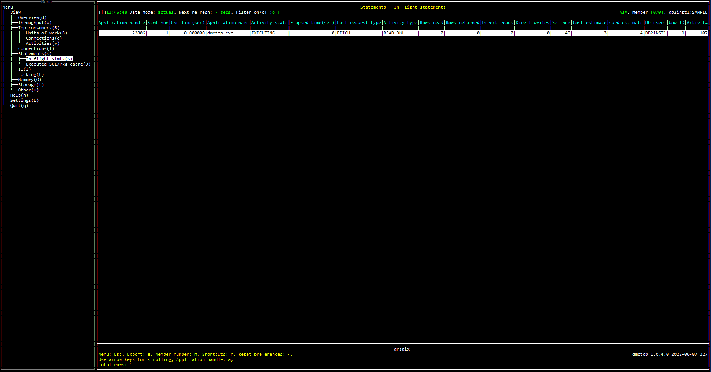

# Purpose

# Screenshot

# Metric shown

### Application handle

A system-wide unique ID for the application.

**Source:** [MON_GET_CONNECTION](https://www.ibm.com/docs/en/db2/11.5?topic=functions-mon-get-connection-get-connection-metrics)(NULL, #MEMBER#, 1).[APPLICATION_HANDLE](https://www.ibm.com/docs/en/db2/11.5?topic=reference-#r0054410)

### Stmt num

Statement number within a package for a static SQL statement.

**Source:** [MON_GET_ACTIVITY](https://www.ibm.com/docs/en/db2oc?topic=functions-mon-get-activity-return-list-activities)(NULL, #MEMBER#).[STMTNO](https://www.ibm.com/docs/en/db2oc?topic=reference-s#r0060716)

### Cpu time

The total amount of CPU time used while within the database system.

**Source:** [MON_GET_ACTIVITY](https://www.ibm.com/docs/en/db2oc?topic=functions-mon-get-activity-return-list-activities)(NULL, #MEMBER#).SUM([TOTAL_CPU_TIME](https://www.ibm.com/docs/en/db2oc?topic=reference-t#r0054057))

### Application name

The name of the application running at the client.

*Source:** [MON_GET_CONNECTION](https://www.ibm.com/docs/en/db2/11.5?topic=functions-mon-get-connection-get-connection-metrics)(NULL, #MEMBER#, 1).[APPLICATION_NAME](https://www.ibm.com/docs/en/db2/11.5?topic=reference-#r0001165)

### Activity state

The current state of the activity or workload occurrence.

If there is no ACTIVITY_STATE from  MON_GET_ACTIVITY, WORKLOAD_OCCURRENCE_STATE in MON_GET_CONNECTION will be used instead.

*Source:** 

[MON_GET_CONNECTION](https://www.ibm.com/docs/en/db2/11.5?topic=functions-mon-get-connection-get-connection-metrics)(NULL, #MEMBER#, 1).[WORKLOAD_OCCURRENCE_STATE](https://www.ibm.com/docs/en/db2/11.5?topic=reference-w#r0054064)

[MON_GET_ACTIVITY](https://www.ibm.com/docs/en/db2oc?topic=functions-mon-get-activity-return-list-activities)(NULL, #MEMBER#).[ACTIVITY_STATE](https://www.ibm.com/docs/en/db2oc?topic=reference-#r0054138)

### Elapsed time

The elapsed time from the activity began doing work on the member.

*Source:** 

[CURRENT TIMESTAMP](https://www.ibm.com/docs/en/db2-for-zos/11?topic=registers-current-timestamp)

[MON_GET_ACTIVITY](https://www.ibm.com/docs/en/db2oc?topic=functions-mon-get-activity-return-list-activities)(NULL, #MEMBER#).[LOCAL_START_TIME](https://www.ibm.com/docs/en/db2oc?topic=reference-l#r0054194)

### Last request type

The type of the last request completed by the application.

*Source:** [MON_GET_CONNECTION](https://www.ibm.com/docs/en/db2/11.5?topic=functions-mon-get-connection-get-connection-metrics)(NULL, #MEMBER#, 1).[LAST_REQUEST_TYPE](https://www.ibm.com/docs/en/db2/11.5?topic=reference-l#r0056665)

### Activity type

Possible values are as follows:
* CALL
* DDL
* LOAD
* OTHER
* READ_DML
* WRITE_DML

**Source:** [MON_GET_ACTIVITY](https://www.ibm.com/docs/en/db2oc?topic=functions-mon-get-activity-return-list-activities)(NULL, #MEMBER#).[ACTIVITY_TYPE](https://www.ibm.com/docs/en/db2oc?topic=functions-mon-get-activity-return-list-activities)

### Rows read

The number of rows read from the table.

**Source:** [MON_GET_ACTIVITY](https://www.ibm.com/docs/en/db2oc?topic=functions-mon-get-activity-return-list-activities)(NULL, #MEMBER#).SUM([ROWS_READ](https://www.ibm.com/docs/en/db2oc?topic=reference-r#r0001317))

### Rows returned

The number of rows that have been selected and returned to the application. 

**Source:** [MON_GET_ACTIVITY](https://www.ibm.com/docs/en/db2oc?topic=functions-mon-get-activity-return-list-activities)(NULL, #MEMBER#).SUM([ROWS_RETURNED](https://www.ibm.com/docs/en/db2oc?topic=reference-r#r0051569))

### Direct reads

The number of read operations that do not use the buffer pool.

**Source:** [MON_GET_ACTIVITY](https://www.ibm.com/docs/en/db2oc?topic=functions-mon-get-activity-return-list-activities)(NULL, #MEMBER#).SUM([DIRECT_READS](https://www.ibm.com/docs/en/db2oc?topic=reference-d#r0001260))

### Direct writes

The number of write operations that do not use the buffer pool.

**Source:** [MON_GET_ACTIVITY](https://www.ibm.com/docs/en/db2oc?topic=functions-mon-get-activity-return-list-activities)(NULL, #MEMBER#).SUM([DIRECT_WRITES](https://www.ibm.com/docs/en/db2oc?topic=reference-d#r0001261))

### Sec num

The internal section number in the package for a static SQL statement.

**Source:** [MON_GET_ACTIVITY](https://www.ibm.com/docs/en/db2oc?topic=functions-mon-get-activity-return-list-activities)(NULL, #MEMBER#).[SECTION_NUMBER](https://www.ibm.com/docs/en/db2oc?topic=reference-s#r0001347)

### Cost estimate

Estimated cost for a query, as determined by the SQL compiler.

**Source:** [MON_GET_ACTIVITY](https://www.ibm.com/docs/en/db2oc?topic=functions-mon-get-activity-return-list-activities)(NULL, #MEMBER#).[QUERY_COST_ESTIMATE](https://www.ibm.com/docs/en/db2oc?topic=reference-q#r0001357)

### Card estimate

An estimate of the number of rows that will be returned by a query.

**Source:** [MON_GET_ACTIVITY](https://www.ibm.com/docs/en/db2oc?topic=functions-mon-get-activity-return-list-activities)(NULL, #MEMBER#).[QUERY_CARD_ESTIMATE](https://www.ibm.com/docs/en/db2oc?topic=reference-q#r0001356)

### Db user

The current authorization ID for the session being used by this application.

*Source:** [MON_GET_CONNECTION](https://www.ibm.com/docs/en/db2/11.5?topic=functions-mon-get-connection-get-connection-metrics)(NULL, #MEMBER#, 1).[SESSION_AUTH_ID](https://www.ibm.com/docs/en/db2/11.5?topic=reference-s#r0010880)

### Uow ID

The unit of work identifier. The unit of work ID is unique within an application handle.

**Source:** [MON_GET_ACTIVITY](https://www.ibm.com/docs/en/db2oc?topic=functions-mon-get-activity-return-list-activities)(NULL, #MEMBER#).[UOW_ID](https://www.ibm.com/docs/en/db2oc?topic=reference-u#r0051592)

### Activity ID

Counter which uniquely identifies an activity for an application within a given unit of work.

**Source:** [MON_GET_ACTIVITY](https://www.ibm.com/docs/en/db2oc?topic=functions-mon-get-activity-return-list-activities)(NULL, #MEMBER#).[ACTIVITY_ID](https://www.ibm.com/docs/en/db2oc?topic=reference-#r0051533)

### Stmt text

The first 18 character of SQL statement.

**Source:** [MON_GET_ACTIVITY](https://www.ibm.com/docs/en/db2oc?topic=functions-mon-get-activity-return-list-activities)(NULL, #MEMBER#).[STMT_TEXT](https://www.ibm.com/docs/en/db2oc?topic=reference-s#r0001352)

### Complete text

Complete text if SQL statement.

**Source:** [MON_GET_ACTIVITY](https://www.ibm.com/docs/en/db2oc?topic=functions-mon-get-activity-return-list-activities)(NULL, #MEMBER#).[STMT_TEXT](https://www.ibm.com/docs/en/db2oc?topic=reference-s#r0001352)

