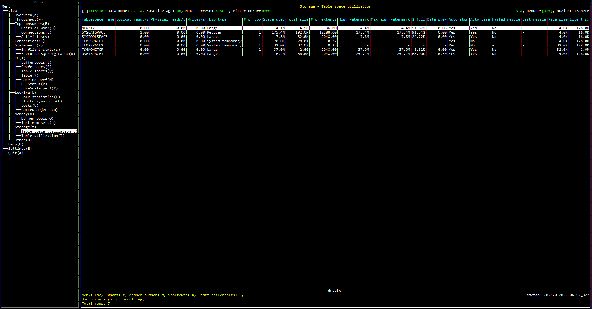

# Purpose

Table space utiliazation view shows the space utilization for each table space including the current size, percentage free space, and size of free space.

# Screenshot

# Metric shown

### Tablespace name

The name of a table space. If  TBSP_STATE does not equal `NORMAL`, then `!` will be appended before the name. 

**Source:** 

[MON_GET_TABLESPACE](https://www.ibm.com/docs/en/db2oc?topic=functions-mon-get-tablespace-get-table-space-metrics)(NULL, #MEMBER#).[TBSP_NAME](https://www.ibm.com/docs/en/db2oc?topic=reference-t#r0001295)

[MON_GET_TABLESPACE](https://www.ibm.com/docs/en/db2oc?topic=functions-mon-get-tablespace-get-table-space-metrics)(NULL, #MEMBER#).[TBSP_STATE](https://www.ibm.com/docs/en/db2oc?topic=reference-t#r0007533)

### Logical reads

Indicates the number of pages read from the buffer pool (logical).

**Source:**  [MON_GET_TABLESPACE](https://www.ibm.com/docs/en/db2oc?topic=functions-mon-get-tablespace-get-table-space-metrics)(NULL, #MEMBER#).SUM([POOL_DATA_L_READS](https://www.ibm.com/docs/en/db2oc?topic=reference-p#r0001235) + [POOL_TEMP_DATA_L_READS](https://www.ibm.com/docs/en/db2oc?topic=reference-p#r0011302) + [POOL_XDA_L_READS](https://www.ibm.com/docs/en/db2oc?topic=reference-p#r0022731) + [POOL_TEMP_XDA_L_READS](https://www.ibm.com/docs/en/db2oc?topic=reference-p#r0022738) + [POOL_INDEX_L_READS](https://www.ibm.com/docs/en/db2oc?topic=reference-p#r0001238) + [POOL_TEMP_INDEX_L_READS](https://www.ibm.com/docs/en/db2oc?topic=reference-p#r0011303) + [POOL_COL_L_READS](https://www.ibm.com/docs/en/db2oc?topic=reference-p#r0060763) + [POOL_TEMP_COL_L_READS](https://www.ibm.com/docs/en/db2oc?topic=reference-p#r0060873))

### Physical reads

Indicates the number of pages read in from the table space containers (physical).

**Source:**  [MON_GET_TABLESPACE](https://www.ibm.com/docs/en/db2oc?topic=functions-mon-get-tablespace-get-table-space-metrics)(NULL, #MEMBER#).SUM([POOL_DATA_P_READS](https://www.ibm.com/docs/en/db2oc?topic=reference-p#r0001236) + [POOL_INDEX_P_READS](https://www.ibm.com/docs/en/db2oc?topic=reference-p#r0001239) + [POOL_XDA_P_READS](https://www.ibm.com/docs/en/db2oc?topic=reference-p#r0022730) + [POOL_TEMP_DATA_P_READS](https://www.ibm.com/docs/en/db2oc?topic=reference-p#r0011300) + [POOL_TEMP_INDEX_P_READS](https://www.ibm.com/docs/en/db2oc?topic=reference-p#r0011301) + [POOL_TEMP_XDA_P_READS](https://www.ibm.com/docs/en/db2oc?topic=reference-p#r0022739) + [POOL_COL_P_READS](https://www.ibm.com/docs/en/db2oc?topic=reference-p#r0060858) + [POOL_TEMP_COL_P_READS](https://www.ibm.com/docs/en/db2oc?topic=reference-p#r0060874))

### Writes

The number of write operations.

**Source:**  [MON_GET_TABLESPACE](https://www.ibm.com/docs/en/db2oc?topic=functions-mon-get-tablespace-get-table-space-metrics)(NULL, #MEMBER#).SUM([POOL_DATA_WRITES](https://www.ibm.com/docs/en/db2oc?topic=reference-p#r0001237) + [POOL_INDEX_WRITES](https://www.ibm.com/docs/en/db2oc?topic=reference-p#r0001240) + [POOL_XDA_WRITES](https://www.ibm.com/docs/en/db2oc?topic=reference-p#r0022732) + [POOL_COL_WRITES](https://www.ibm.com/docs/en/db2oc?topic=reference-p#r0060859) + [DIRECT_WRITES](https://www.ibm.com/docs/en/db2oc?topic=reference-d#r0001261))

### Tbsp type

Table space content type.

When TBSP_CONTENT_TYPE equals to 'ANY', value is 'REGULAR'.

When TBSP_CONTENT_TYPE equals to 'LARGE', value is /LARGE'.

When TBSP_CONTENT_TYPE equals to 'SYSTEMP', value is 'SYSTEM TEMPORARY'.

For the rest cases, value is 'UNKNOWN'.

**Source:**  [MON_GET_TABLESPACE](https://www.ibm.com/docs/en/db2oc?topic=functions-mon-get-tablespace-get-table-space-metrics)(NULL, #MEMBER#).[TBSP_CONTENT_TYPE](https://www.ibm.com/docs/en/db2oc?topic=reference-t#r0007532)

### # of dbp

The number of buffer pool that is being monitored.

### Space used

The total amount page space that are currently used in a table space.

**Source:**

TBSP_USED_PAGES = [MON_GET_TABLESPACE](https://www.ibm.com/docs/en/db2oc?topic=functions-mon-get-tablespace-get-table-space-metrics)(NULL, #MEMBER#).SUM([TBSP_USED_PAGES](https://www.ibm.com/docs/en/db2oc?topic=reference-t#r0007541) * [TBSP_PAGE_SIZE](https://www.ibm.com/docs/en/db2oc?topic=reference-t#r0007534))

### Total size 

The total amount page space in a table space.

**Source:**

TBSP_USED_PAGES = [MON_GET_TABLESPACE](https://www.ibm.com/docs/en/db2oc?topic=functions-mon-get-tablespace-get-table-space-metrics)(NULL, #MEMBER#).SUM([TBSP_TOTAL_PAGES](https://www.ibm.com/docs/en/db2oc?topic=reference-t#r0007539) * [TBSP_PAGE_SIZE](https://www.ibm.com/docs/en/db2oc?topic=reference-t#r0007534))

### # of extents 

The average number of page per extent size.

= TBSP_TOTAL_PAGES / TBSP_EXTENT_SIZE 

**Source:**

TBSP_TOTAL_PAGES = [MON_GET_TABLESPACE](https://www.ibm.com/docs/en/db2oc?topic=functions-mon-get-tablespace-get-table-space-metrics)(NULL, #MEMBER#).SUM([TBSP_TOTAL_PAGES](https://www.ibm.com/docs/en/db2oc?topic=reference-t#r0007539))

TBSP_EXTENT_SIZE = [MON_GET_TABLESPACE](https://www.ibm.com/docs/en/db2oc?topic=functions-mon-get-tablespace-get-table-space-metrics)(NULL, #MEMBER#).SUM([TBSP_EXTENT_SIZE](https://www.ibm.com/docs/en/db2oc?topic=reference-t#r0007535))

### High watermark

The total size used by page in a table space that is holding the high watermark.

The value of TOP_SPACE, when equals to 'DMS'

**Source:**

TBSP_TYPE = [MON_GET_TABLESPACE](https://www.ibm.com/docs/en/db2oc?topic=functions-mon-get-tablespace-get-table-space-metrics)(NULL, #MEMBER#).[TBSP_TYPE](https://www.ibm.com/docs/en/db2oc?topic=reference-t#r0007527)

TOP_SPACE = [MON_GET_TABLESPACE](https://www.ibm.com/docs/en/db2oc?topic=functions-mon-get-tablespace-get-table-space-metrics)(NULL, #MEMBER#).SUM([TBSP_PAGE_TOP](https://www.ibm.com/docs/en/db2oc?topic=reference-t#r0007545) * [TBSP_PAGE_SIZE](https://www.ibm.com/docs/en/db2oc?topic=reference-t#r0007534))

### Max high watermark

The total size used by highest allocated page for a DMS table space since the database was activated.

The value of MAX_TOP_SPACE, when equals to 'DMS'

**Source:**

TBSP_TYPE = [MON_GET_TABLESPACE](https://www.ibm.com/docs/en/db2oc?topic=functions-mon-get-tablespace-get-table-space-metrics)(NULL, #MEMBER#).[TBSP_TYPE](https://www.ibm.com/docs/en/db2oc?topic=reference-t#r0007527)

MAX_TOP_SPACE = [MON_GET_TABLESPACE](https://www.ibm.com/docs/en/db2oc?topic=functions-mon-get-tablespace-get-table-space-metrics)(NULL, #MEMBER#).SUM([TBSP_MAX_PAGE_TOP](https://www.ibm.com/docs/en/db2oc?topic=reference-t#r0054433) * [TBSP_PAGE_SIZE](https://www.ibm.com/docs/en/db2oc?topic=reference-t#r0007534))

### % full

The percentage of pages that are currently used (not free) in a table space.

= TBSP_USED_PAGES / TBSP_TOTAL_PAGES 

**Source:**

TBSP_USED_PAGES = [MON_GET_TABLESPACE](https://www.ibm.com/docs/en/db2oc?topic=functions-mon-get-tablespace-get-table-space-metrics)(NULL, #MEMBER#).SUM([TBSP_USED_PAGES](https://www.ibm.com/docs/en/db2oc?topic=reference-t#r0007541))

TBSP_TOTAL_PAGES = [MON_GET_TABLESPACE](https://www.ibm.com/docs/en/db2oc?topic=functions-mon-get-tablespace-get-table-space-metrics)(NULL, #MEMBER#).SUM([TBSP_TOTAL_PAGES](https://www.ibm.com/docs/en/db2oc?topic=reference-t#r0007539))

### Data skew

The data skew of page number that are currently used (not free) in a table space from the highest allocated page number for a DMS table space since the database was activated.

= 1 - AVG(TBSP_USED_PAGES)/MAX(TBSP_MAX_PAGE_TOP)

**Source:**

TBSP_USED_PAGES = [MON_GET_TABLESPACE](https://www.ibm.com/docs/en/db2oc?topic=functions-mon-get-tablespace-get-table-space-metrics)(NULL, #MEMBER#).[TBSP_USED_PAGES](https://www.ibm.com/docs/en/db2oc?topic=reference-t#r0007541)

TBSP_MAX_PAGE_TOP = [MON_GET_TABLESPACE](https://www.ibm.com/docs/en/db2oc?topic=functions-mon-get-tablespace-get-table-space-metrics)(NULL, #MEMBER#).[TBSP_MAX_PAGE_TOP](https://www.ibm.com/docs/en/db2oc?topic=reference-t#r0054433)

### Auto stor

Indicate whether the table space was created as an automatic storage table space.

When MAX(TBSP_USING_AUTO_STORAGE) equals to 1, the value is 'YES';
The value is 'NO' for the rest cases.

**Source:**

TBSP_USING_AUTO_STORAGE = [MON_GET_TABLESPACE](https://www.ibm.com/docs/en/db2oc?topic=functions-mon-get-tablespace-get-table-space-metrics)(NULL, #MEMBER#).[TBSP_USING_AUTO_STORAGE](https://www.ibm.com/docs/en/db2oc?topic=reference-t#r0012174)

### Auto size

Indicate whether automatic resizing is enabled for the table space.

When MAX(TBSP_AUTO_RESIZE_ENABLED) equals to 1, the value is 'YES'; 
The value is 'NO' for the rest cases.

**Source:**

TBSP_AUTO_RESIZE_ENABLED = [MON_GET_TABLESPACE](https://www.ibm.com/docs/en/db2oc?topic=functions-mon-get-tablespace-get-table-space-metrics)(NULL, #MEMBER#).[TBSP_AUTO_RESIZE_ENABLED](https://www.ibm.com/docs/en/db2oc?topic=reference-t#r0012175)

### Failed resize

 Indicate whether or not the last attempt to automatically increase the size of the table space failed.

When MAX(TBSP_AUTO_RESIZE_ENABLED) equals to 1 and MAX(TBSP_LAST_RESIZE_FAILED) equals to 1, the value is 'YES';
When MAX(TBSP_AUTO_RESIZE_ENABLED) equals to 1 and MAX(TBSP_LAST_RESIZE_FAILED) does not equal to 1, the value is 'NO';
The value is NULL for the rest cases.

**Source:**

TBSP_AUTO_RESIZE_ENABLED = [MON_GET_TABLESPACE](https://www.ibm.com/docs/en/db2oc?topic=functions-mon-get-tablespace-get-table-space-metrics)(NULL, #MEMBER#).[TBSP_AUTO_RESIZE_ENABLED](https://www.ibm.com/docs/en/db2oc?topic=reference-t#r0012175)

TBSP_LAST_RESIZE_FAILED = [MON_GET_TABLESPACE](https://www.ibm.com/docs/en/db2oc?topic=functions-mon-get-tablespace-get-table-space-metrics)(NULL, #MEMBER#).[TBSP_LAST_RESIZE_FAILED ](https://www.ibm.com/docs/en/db2oc?topic=reference-t#r0012535)

### Last resize

This element shows a timestamp representing the last time that the size of the table space was successfully increased.

**Source:** [MON_GET_TABLESPACE](https://www.ibm.com/docs/en/db2oc?topic=functions-mon-get-tablespace-get-table-space-metrics)(NULL, #MEMBER#).MIN([TBSP_LAST_RESIZE_TIME](https://www.ibm.com/docs/en/db2oc?topic=reference-t#r0012173))

### Page size

The page size used by a table space.

**Source:** [MON_GET_TABLESPACE](https://www.ibm.com/docs/en/db2oc?topic=functions-mon-get-tablespace-get-table-space-metrics)(NULL, #MEMBER#).SUM([TBSP_PAGE_SIZE](https://www.ibm.com/docs/en/db2oc?topic=reference-t#r0007534))

### Extent size

The size of pages that will be written to a container before writing to the next container.

**Source:** [MON_GET_TABLESPACE](https://www.ibm.com/docs/en/db2oc?topic=functions-mon-get-tablespace-get-table-space-metrics)(NULL, #MEMBER#).SUM([TBSP_PAGE_SIZE](https://www.ibm.com/docs/en/db2oc?topic=reference-t#r0007534) * [TBSP_EXTENT_SIZE](https://www.ibm.com/docs/en/db2oc?topic=reference-t#r0007535))

### Prefetch size

The maximum size of pages that the prefetcher gets from the disk at a time.

**Source:** [MON_GET_TABLESPACE](https://www.ibm.com/docs/en/db2oc?topic=functions-mon-get-tablespace-get-table-space-metrics)(NULL, #MEMBER#).SUM([TBSP_PAGE_SIZE](https://www.ibm.com/docs/en/db2oc?topic=reference-t#r0007534) * [TBSP_PREFETCH_SIZE](https://www.ibm.com/docs/en/db2oc?topic=reference-t#r0007536))

### Minimum recovery time

A timestamp showing the earliest point in time to which a table space can be rolled forward.

**Source:** [MON_GET_TABLESPACE](https://www.ibm.com/docs/en/db2oc?topic=functions-mon-get-tablespace-get-table-space-metrics)(NULL, #MEMBER#).MIN([TABLESPACE_MIN_RECOVERY_TIME](https://www.ibm.com/docs/en/db2oc?topic=reference-t#r0007787))

