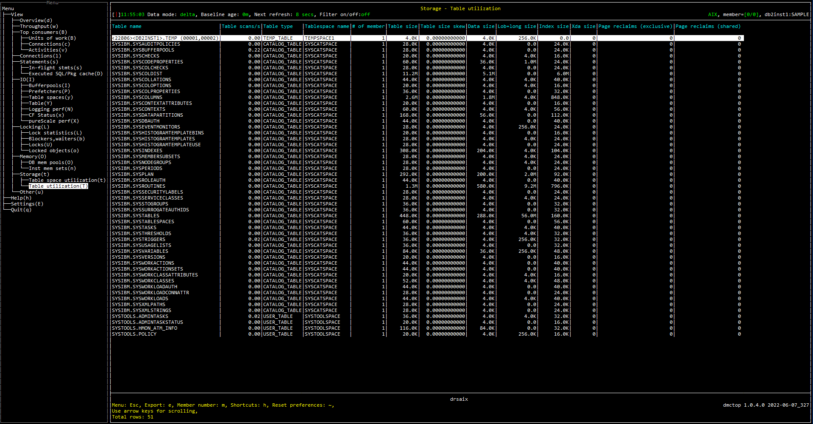

# Purpose

Table utilization view shows the utilization for each table including size of different types of pages used in the table.

# Screenshot

# Metric shown

### Table name

The name of the table.

**Source:** [MON_GET_TABLE](https://www.ibm.com/docs/en/db2/11.5?topic=functions-mon-get-table-get-table-metrics)(NULL, NULL, #MEMBER#).[TABNAME](https://www.ibm.com/docs/en/db2/11.5?topic=reference-t#r0001310)

### Table scans

The number of scans on this table.

**Source:** [MON_GET_TABLE](https://www.ibm.com/docs/en/db2/11.5?topic=functions-mon-get-table-get-table-metrics)(NULL, NULL, #MEMBER#).SUM([TABLE_SCANS](https://www.ibm.com/docs/en/db2/11.5?topic=reference-t#r0054222))

### Table type

The type of table for which information is returned.

**Source:** [MON_GET_TABLE](https://www.ibm.com/docs/en/db2/11.5?topic=functions-mon-get-table-get-table-metrics)(NULL, NULL, #MEMBER#).[TAB_TYPE](https://www.ibm.com/docs/en/db2/11.5?topic=reference-t#r0001309)

### Tablespace name

The name of a table space.

**Source:** [MON_GET_TABLESPACE](https://www.ibm.com/docs/en/db2oc?topic=functions-mon-get-tablespace-get-table-space-metrics)(NULL, #MEMBER#).[TBSP_NAME](https://www.ibm.com/docs/en/db2oc?topic=reference-t#r0001295)

### # of member

The number of distinct member in the table.

### Table size

The size of logical pages used in this table.

= SUM((DATA_OBJECT_L_PAGES  + COL_OBJEC_L_PAGES + INDEX_OBJECT_L_PAGES) * TBSP_PAGE_SIZE)

**Source:**

DATA_OBJECT_L_PAGES = [MON_GET_TABLE](https://www.ibm.com/docs/en/db2/11.5?topic=functions-mon-get-table-get-table-metrics)(NULL, NULL, #MEMBER#).SUM([DATA_OBJECT_L_PAGES](https://www.ibm.com/docs/en/db2/11.5?topic=reference-d#r0059958))

COL_OBJEC_L_PAGES = [MON_GET_TABLE](https://www.ibm.com/docs/en/db2/11.5?topic=functions-mon-get-table-get-table-metrics)(NULL, NULL, #MEMBER#).SUM([COL_OBJECT_L_PAGES](https://www.ibm.com/docs/en/db2/11.5?topic=reference-c#r0060831))

INDEX_OBJECT_L_PAGES = [MON_GET_TABLE](https://www.ibm.com/docs/en/db2/11.5?topic=functions-mon-get-table-get-table-metrics)(NULL, NULL, #MEMBER#).SUM([INDEX_OBJECT_L_PAGES](https://www.ibm.com/docs/en/db2/11.5?topic=reference-i#r0059961))

TBSP_PAGE_SIZE = [MON_GET_TABLESPACE](https://www.ibm.com/docs/en/db2oc?topic=functions-mon-get-tablespace-get-table-space-metrics)(NULL, #MEMBER#).[TBSP_PAGE_SIZE](https://www.ibm.com/docs/en/db2oc?topic=reference-t#r0007534)

### Table size skew 

The size skew of logical pages used in this table.

= 1 - AVG((DATA_OBJECT_L_PAGES  + COL_OBJEC_L_PAGES + INDEX_OBJECT_L_PAGES) * TBSP_PAGE_SIZE) / MAX((DATA_OBJECT_L_PAGES  + COL_OBJEC_L_PAGES + INDEX_OBJECT_L_PAGES) * TBSP_PAGE_SIZE)

**Source:**

DATA_OBJECT_L_PAGES = [MON_GET_TABLE](https://www.ibm.com/docs/en/db2/11.5?topic=functions-mon-get-table-get-table-metrics)(NULL, NULL, #MEMBER#).SUM([DATA_OBJECT_L_PAGES](https://www.ibm.com/docs/en/db2/11.5?topic=reference-d#r0059958))

COL_OBJEC_L_PAGES = [MON_GET_TABLE](https://www.ibm.com/docs/en/db2/11.5?topic=functions-mon-get-table-get-table-metrics)(NULL, NULL, #MEMBER#).SUM([COL_OBJECT_L_PAGES](https://www.ibm.com/docs/en/db2/11.5?topic=reference-c#r0060831))

INDEX_OBJECT_L_PAGES = [MON_GET_TABLE](https://www.ibm.com/docs/en/db2/11.5?topic=functions-mon-get-table-get-table-metrics)(NULL, NULL, #MEMBER#).SUM([INDEX_OBJECT_L_PAGES](https://www.ibm.com/docs/en/db2/11.5?topic=reference-i#r0059961))

TBSP_PAGE_SIZE = [MON_GET_TABLESPACE](https://www.ibm.com/docs/en/db2oc?topic=functions-mon-get-tablespace-get-table-space-metrics)(NULL, #MEMBER#).[TBSP_PAGE_SIZE](https://www.ibm.com/docs/en/db2oc?topic=reference-t#r0007534)

### Data size

The size of logical pages used on disk by data contained in this table.

=  SUM((DATA_OBJECT_L_PAGES  + COL_OBJEC_L_PAGES) * TBSP_PAGE_SIZE)

**Source:**

DATA_OBJECT_L_PAGES = [MON_GET_TABLE](https://www.ibm.com/docs/en/db2/11.5?topic=functions-mon-get-table-get-table-metrics)(NULL, NULL, #MEMBER#).SUM([DATA_OBJECT_L_PAGES](https://www.ibm.com/docs/en/db2/11.5?topic=reference-d#r0059958))

COL_OBJEC_L_PAGES = [MON_GET_TABLE](https://www.ibm.com/docs/en/db2/11.5?topic=functions-mon-get-table-get-table-metrics)(NULL, NULL, #MEMBER#).SUM([COL_OBJECT_L_PAGES](https://www.ibm.com/docs/en/db2/11.5?topic=reference-c#r0060831))

TBSP_PAGE_SIZE = [MON_GET_TABLESPACE](https://www.ibm.com/docs/en/db2oc?topic=functions-mon-get-tablespace-get-table-space-metrics)(NULL, #MEMBER#).[TBSP_PAGE_SIZE](https://www.ibm.com/docs/en/db2oc?topic=reference-t#r0007534)

### Lob+long size

The size of logical pages used on disk by long data contained in this table or LOBs associated with this table.

= SUM((LOB_OBJECT_L_PAGES + LONG_OBJECT_L_PAGES) * TBSP_PAGE_SIZE)

**Source:**

LOB_OBJECT_L_PAGES = [MON_GET_TABLE](https://www.ibm.com/docs/en/db2/11.5?topic=functions-mon-get-table-get-table-metrics)(NULL, NULL, #MEMBER#).SUM([LOB_OBJECT_L_PAGES](https://www.ibm.com/docs/en/db2/11.5?topic=reference-l#r0059959))

LONG_OBJECT_L_PAGES = [MON_GET_TABLE](https://www.ibm.com/docs/en/db2/11.5?topic=functions-mon-get-table-get-table-metrics)(NULL, NULL, #MEMBER#).SUM([LONG_OBJECT_L_PAGES](https://www.ibm.com/docs/en/db2/11.5?topic=reference-l#r0059960))

TBSP_PAGE_SIZE = [MON_GET_TABLESPACE](https://www.ibm.com/docs/en/db2oc?topic=functions-mon-get-tablespace-get-table-space-metrics)(NULL, #MEMBER#).[TBSP_PAGE_SIZE](https://www.ibm.com/docs/en/db2oc?topic=reference-t#r0007534)

### Index size

The size of logical pages used on disk by all indexes associated with this table. 

= SUM(INDEX_OBJECT_L_PAGES * TBSP_PAGE_SIZE)

**Source:**

INDEX_OBJECT_L_PAGES = [MON_GET_TABLE](https://www.ibm.com/docs/en/db2/11.5?topic=functions-mon-get-table-get-table-metrics)(NULL, NULL, #MEMBER#).SUM([INDEX_OBJECT_L_PAGES](https://www.ibm.com/docs/en/db2/11.5?topic=reference-i#r0059961))

TBSP_PAGE_SIZE = [MON_GET_TABLESPACE](https://www.ibm.com/docs/en/db2oc?topic=functions-mon-get-tablespace-get-table-space-metrics)(NULL, #MEMBER#).[TBSP_PAGE_SIZE](https://www.ibm.com/docs/en/db2oc?topic=reference-t#r0007534)

### Xda size

The size of logical pages used on disk by XML storage object (XDA) data.

= SUM(INDEX_OBJECT_L_PAGES * TBSP_PAGE_SIZE)

**Source:**

INDEX_OBJECT_L_PAGES = [MON_GET_TABLE](https://www.ibm.com/docs/en/db2/11.5?topic=functions-mon-get-table-get-table-metrics)(NULL, NULL, #MEMBER#).SUM([XDA_OBJECT_L_PAGES](https://www.ibm.com/docs/en/db2/11.5?topic=reference-x#r0059962))

TBSP_PAGE_SIZE = [MON_GET_TABLESPACE](https://www.ibm.com/docs/en/db2oc?topic=functions-mon-get-tablespace-get-table-space-metrics)(NULL, #MEMBER#).[TBSP_PAGE_SIZE](https://www.ibm.com/docs/en/db2oc?topic=reference-t#r0007534)

### Page reclaims (exclusive)

The number of times a page related to the object was reclaimed by another member in the Db2® pureScale® instance before its planned release, where the member that reclaimed the page required exclusive access.

**Source:** [MON_GET_PAGE_ACCESS_INFO](https://www.ibm.com/docs/en/db2/11.5?topic=mpf-mon-get-page-access-info-get-bufferpool-page-waiting-information).SUM([PAGE_RECLAIMS_X](https://www.ibm.com/docs/en/db2/11.5?topic=reference-p#r0056223))

### Page reclaims (shared)

The number of times a page related to the object was reclaimed by another member in the Db2 pureScale instance before its planned release, where the member that reclaimed the page required shared access.

**Source:** [MON_GET_PAGE_ACCESS_INFO](https://www.ibm.com/docs/en/db2/11.5?topic=mpf-mon-get-page-access-info-get-bufferpool-page-waiting-information).SUM([PAGE_RECLAIMS_S](https://www.ibm.com/docs/en/db2/11.5?topic=reference-p#r0056224))

