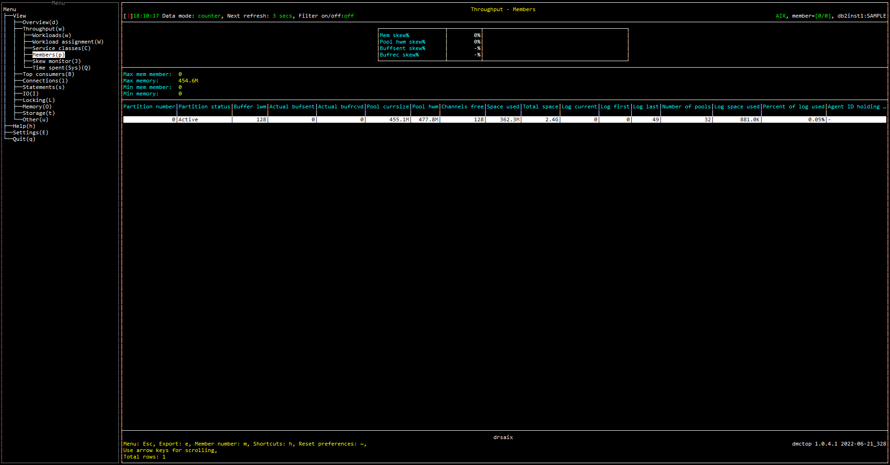

# Purpose

Members view shows some basic statistics about individual members.  Member specific memory and transaction log usage are found here.

# Screenshot


# Metrics Shown
##  In Grid

Followings are the temporary data set created and used in this section:

MEM_TAB =
```
SELECT   MEMBER, 
         SUM(MEMORY_POOL_USED)     AS MEM_POOL_USED, 
         SUM(MEMORY_POOL_USED_HWM) AS MEM_POOL_USED_HWM 
FROM     TABLE(MON_GET_MEMORY_POOL(NULL,CURRENT_SERVER,#MEMBER#))
GROUP BY MEMBER 
```
CONN_TAB =
```
SELECT   MEMBER , 
         SUM(TOTAL_BUFFERS_SENT) AS TOTAL_BUFFERS_SENT , 
         SUM(TOTAL_BUFFERS_RCVD) AS TOTAL_BUFFERS_RCVD 
FROM     TABLE(MON_GET_FCM_CONNECTION_LIST(#MEMBER#)) 
GROUP BY MEMBER
```

**Source:** 

[CURRENT_SERVER](https://www.ibm.com/docs/en/db2-for-zos/11?topic=registers-current-server)

[MON_GET_MEMORY_POOL](https://www.ibm.com/docs/en/db2/11.5?topic=mpf-mon-get-memory-pool-get-memory-pool-information).[MEMORY_POOL_USED](https://www.ibm.com/docs/en/db2/11.5?topic=reference-m#r0059534)

[MON_GET_MEMORY_POOL](https://www.ibm.com/docs/en/db2/11.5?topic=mpf-mon-get-memory-pool-get-memory-pool-information).[MEMORY_POOL_USED_HWM](https://www.ibm.com/docs/en/db2/11.5?topic=reference-m#r0059453)

[MON_GET_MEMORY_POOL](https://www.ibm.com/docs/en/db2/11.5?topic=mpf-mon-get-memory-pool-get-memory-pool-information).[MEMBER](https://www.ibm.com/docs/en/db2/11.5?topic=reference-m#r0054432)

[MON_GET_FCM_CONNECTION_LIST](https://www.ibm.com/docs/en/db2/11.5?topic=mpf-mon-get-fcm-connection-list-get-details-all-fcm-connections).[TOTAL_BUFFERS_SENT](https://www.ibm.com/docs/en/db2/11.5?topic=reference-t#r0001233)

[MON_GET_FCM_CONNECTION_LIST](https://www.ibm.com/docs/en/db2/11.5?topic=mpf-mon-get-fcm-connection-list-get-details-all-fcm-connections).[TOTAL_BUFFERS_RCVD](https://www.ibm.com/docs/en/db2/11.5?topic=reference-t#r0001234)


[MON_GET_FCM_CONNECTION_LIST](https://www.ibm.com/docs/en/db2/11.5?topic=mpf-mon-get-fcm-connection-list-get-details-all-fcm-connections).[MEMBER](https://www.ibm.com/docs/en/db2/11.5?topic=reference-m#r0054432)


<hr />

### Mem skew%

The percentage of amount of committed memory in use by this memory pool skewed from the average.

= SKEW_MEM_POOL_USED / MAX_MEM_POOL_USED

SKEW_MEM_POOL_USED =
```
 SELECT   (MAX(MEM_POOL_USED) - SUM(MEM_POOL_USED) / (SELECT COUNT(*) FROM   MEM_TAB))
 FROM            CONN_TAB 
 LEFT OUTER JOIN MEM_TAB 
 ON              MEM_TAB.MEMBER=CONN_TAB.MEMBER
```

MAX_MEM_POOL_USED = 

```
 SELECT    MAX(MEM_POOL_USED)
 FROM            CONN_TAB 
 LEFT OUTER JOIN MEM_TAB 
 ON              MEM_TAB.MEMBER=CONN_TAB.MEMBER
```


<hr />

### Pool hwm skew%

The percentage of the highest amount of memory assigned to this pool since it was created skewed from the average.

= SKEW_MEM_POOL_USED_HWM/ MAX_MEM_POOL_USED_HWM

SKEW_MEM_POOL_USED_HWM=
```
 SELECT   (MAX(MEM_POOL_USED_HWM) - SUM(MEM_POOL_USED_HWM) / (SELECT COUNT(*) FROM   MEM_TAB))
 FROM            CONN_TAB 
 LEFT OUTER JOIN MEM_TAB 
 ON              MEM_TAB.MEMBER=CONN_TAB.MEMBER
```

MAX_MEM_POOL_USED_HWM= 

```
 SELECT    MAX(MEM_POOL_USED_HWM)
 FROM            CONN_TAB 
 LEFT OUTER JOIN MEM_TAB 
 ON              MEM_TAB.MEMBER=CONN_TAB.MEMBER
```

<hr />

### Buffsent skew%

The percentage of the total number of FCM buffers sent from the current database member to a remote database member skewed from the average.

= SKEW_TOTAL_BUFFERS_SENT/ MAX_TOTAL_BUFFERS_SENT

SKEW_TOTAL_BUFFERS_SENT=
```
 SELECT   (MAX(TOTAL_BUFFERS_SENT) - SUM(TOTAL_BUFFERS_SENT) / (SELECT COUNT(*) FROM  CONN_TAB))
 FROM            CONN_TAB 
 LEFT OUTER JOIN MEM_TAB 
 ON              MEM_TAB.MEMBER=CONN_TAB.MEMBER
```

MAX_TOTAL_BUFFERS_SENT= 

```
 SELECT    MAX(TOTAL_BUFFERS_SENT)
 FROM            CONN_TAB 
 LEFT OUTER JOIN MEM_TAB 
 ON              MEM_TAB.MEMBER=CONN_TAB.MEMBER
```


<hr />

### Bufrec skew%

The percentage of the total number of FCM buffers received from a remote database member skewed from the average.

= SKEW_TOTAL_BUFFERS_RCVD/ MAX_TOTAL_BUFFERS_RCVD

SKEW_TOTAL_BUFFERS_RCVD=
```
 SELECT   (MAX(TOTAL_BUFFERS_RCVD) - SUM(TOTAL_BUFFERS_RCVD) / (SELECT COUNT(*) FROM  CONN_TAB))
 FROM            CONN_TAB 
 LEFT OUTER JOIN MEM_TAB 
 ON              MEM_TAB.MEMBER=CONN_TAB.MEMBER
```

MAX_TOTAL_BUFFERS_RCVD= 

```
 SELECT    MAX(TOTAL_BUFFERS_RCVD)
 FROM            CONN_TAB 
 LEFT OUTER JOIN MEM_TAB 
 ON              MEM_TAB.MEMBER=CONN_TAB.MEMBER
```

## In List


<hr />

### Max mem member

The member of max amount of committed memory in use.


**Source:** [MON_GET_MEMORY_POOL](https://www.ibm.com/docs/en/db2/11.5?topic=mpf-mon-get-memory-pool-get-memory-pool-information)(NULL, [CURRENT_SERVER](https://www.ibm.com/docs/en/db2-for-zos/11?topic=registers-current-server), #MEMBER#).SUM([MEMORY_POOL_USED](https://www.ibm.com/docs/en/db2/11.5?topic=reference-m#r0059534))


<hr />

### Max memory

The max amount of committed memory in use.

**Source:** [MON_GET_MEMORY_POOL](https://www.ibm.com/docs/en/db2/11.5?topic=mpf-mon-get-memory-pool-get-memory-pool-information)(NULL, [CURRENT_SERVER](https://www.ibm.com/docs/en/db2-for-zos/11?topic=registers-current-server), #MEMBER#).SUM([MEMORY_POOL_USED](https://www.ibm.com/docs/en/db2/11.5?topic=reference-m#r0059534))


<hr />

### Min mem member

The member of min amount of committed memory in use.


**Source:** [MON_GET_MEMORY_POOL](https://www.ibm.com/docs/en/db2/11.5?topic=mpf-mon-get-memory-pool-get-memory-pool-information)(NULL, [CURRENT_SERVER](https://www.ibm.com/docs/en/db2-for-zos/11?topic=registers-current-server), #MEMBER#).SUM([MEMORY_POOL_USED](https://www.ibm.com/docs/en/db2/11.5?topic=reference-m#r0059534))


<hr />

### Min memory


The min amount of committed memory in use.

**Source:** [MON_GET_MEMORY_POOL](https://www.ibm.com/docs/en/db2/11.5?topic=mpf-mon-get-memory-pool-get-memory-pool-information)(NULL, [CURRENT_SERVER](https://www.ibm.com/docs/en/db2-for-zos/11?topic=registers-current-server), #MEMBER#).SUM([MEMORY_POOL_USED](https://www.ibm.com/docs/en/db2/11.5?topic=reference-m#r0059534))


## In Table


Followings are the temporary data set created and used in this section:

CONN_TAB =
```
SELECT MEMBER, 
       SUBSTR(CONNECTION_STATUS, 1, 10) AS CONNECTION_STATUS, 
       SUM(TOTAL_BUFFERS_SENT)          AS TOTAL_BUFFERS_SENT, 
       SUM(TOTAL_BUFFERS_RCVD)          AS TOTAL_BUFFERS_RCVD 
FROM   TABLE(MON_GET_FCM_CONNECTION_LIST(#MEMBER#)) 
GROUP  BY MEMBER, CONNECTION_STATUS
```
MEM_TAB1 =
```
SELECT MEMBER, 
       SUM(MEMORY_POOL_USED) * 1024     AS MEM_POOL_USED, 
       SUM(MEMORY_POOL_USED_HWM) * 1024 AS MEM_POOL_USED_HWM 
FROM   TABLE(MON_GET_MEMORY_POOL(NULL, CURRENT_SERVER, #MEMBER#)) 
WHERE  MEMORY_SET_TYPE NOT IN( 'PRIVATE' ) 
GROUP  BY MEMBER
``` 
MEM_TAB2 =
``` 
SELECT MEMBER, 
       COUNT(*) AS NUM_MEM_POOL 
FROM   TABLE(MON_GET_MEMORY_POOL(NULL, CURRENT_SERVER, #MEMBER#)) 
WHERE  MEMORY_SET_TYPE IN( 'APPLICATION', 'DATABASE' ) 
GROUP  BY MEMBER
``` 
TSP_TAB =
```
SELECT MEMBER, 
       SUM(TBSP_USED_PAGES * TBSP_PAGE_SIZE)  AS SPACE_USED, 
       SUM(TBSP_TOTAL_PAGES * TBSP_PAGE_SIZE) AS TOTAL_SPACE 
FROM   TABLE(MON_GET_TABLESPACE('', #MEMBER#)) 
GROUP  BY MEMBER
``` 
LOG_TAB =
``` 
SELECT MEMBER, 
       CURRENT_ACTIVE_LOG, 
       FIRST_ACTIVE_LOG, 
       LAST_ACTIVE_LOG, 
       TOTAL_LOG_USED, 
       CAST(CASE ( TOTAL_LOG_USED + TOTAL_LOG_AVAILABLE ) 
	         WHEN 0 THEN NULL 
                ELSE DEC(CAST(TOTAL_LOG_USED AS DOUBLE) / 
                     (TOTAL_LOG_USED + TOTAL_LOG_AVAILABLE ) + 
	             0.00005, 6, 5) 
		END AS DOUBLE) AS LOG_USED_PCT, 
       APPLID_HOLDING_OLDEST_XACT 
FROM   TABLE(MON_GET_TRANSACTION_LOG(#MEMBER#))) 
```


**Source:** 

[CURRENT_SERVER](https://www.ibm.com/docs/en/db2-for-zos/11?topic=registers-current-server)

[MON_GET_FCM_CONNECTION_LIST](https://www.ibm.com/docs/en/db2/11.5?topic=mpf-mon-get-fcm-connection-list-get-details-all-fcm-connections).[MEMBER](https://www.ibm.com/docs/en/db2/11.5?topic=reference-m#r0054432)

[MON_GET_FCM_CONNECTION_LIST](https://www.ibm.com/docs/en/db2/11.5?topic=mpf-mon-get-fcm-connection-list-get-details-all-fcm-connections).[CONNECTION_STATUS](https://www.ibm.com/docs/en/db2/11.5?topic=reference-c#r0001232)


[MON_GET_FCM_CONNECTION_LIST](https://www.ibm.com/docs/en/db2/11.5?topic=mpf-mon-get-fcm-connection-list-get-details-all-fcm-connections).[TOTAL_BUFFERS_SENT](https://www.ibm.com/docs/en/db2/11.5?topic=reference-t#r0001233)

[MON_GET_FCM_CONNECTION_LIST](https://www.ibm.com/docs/en/db2/11.5?topic=mpf-mon-get-fcm-connection-list-get-details-all-fcm-connections).[TOTAL_BUFFERS_RCVD](https://www.ibm.com/docs/en/db2/11.5?topic=reference-t#r0001234)

[MON_GET_MEMORY_POOL](https://www.ibm.com/docs/en/db2/11.5?topic=mpf-mon-get-memory-pool-get-memory-pool-information).[MEMBER](https://www.ibm.com/docs/en/db2/11.5?topic=reference-m#r0054432)

[MON_GET_MEMORY_POOL](https://www.ibm.com/docs/en/db2/11.5?topic=mpf-mon-get-memory-pool-get-memory-pool-information).[MEMORY_POOL_USED](https://www.ibm.com/docs/en/db2/11.5?topic=reference-m#r0059534)

[MON_GET_MEMORY_POOL](https://www.ibm.com/docs/en/db2/11.5?topic=mpf-mon-get-memory-pool-get-memory-pool-information).[MEMORY_POOL_USED_HWM](https://www.ibm.com/docs/en/db2/11.5?topic=reference-m#r0059453)

[MON_GET_TABLESPACE](https://www.ibm.com/docs/en/db2/11.5?topic=functions-mon-get-tablespace-get-table-space-metrics).[MEMBER](https://www.ibm.com/docs/en/db2/11.5?topic=reference-m#r0054432)

[MON_GET_TABLESPACE](https://www.ibm.com/docs/en/db2/11.5?topic=functions-mon-get-tablespace-get-table-space-metrics).[TBSP_USED_PAGES](https://www.ibm.com/docs/en/db2/11.5?topic=reference-t#r0007541)

[MON_GET_TABLESPACE](https://www.ibm.com/docs/en/db2/11.5?topic=functions-mon-get-tablespace-get-table-space-metrics).[TBSP_TOTAL_PAGES](https://www.ibm.com/docs/en/db2/11.5?topic=reference-t#r0007539)

[MON_GET_TABLESPACE](https://www.ibm.com/docs/en/db2/11.5?topic=functions-mon-get-tablespace-get-table-space-metrics).[TBSP_PAGE_SIZE](https://www.ibm.com/docs/en/db2/11.5?topic=reference-t#r0007534)

[MON_GET_TRANSACTION_LOG](https://www.ibm.com/docs/en/db2/11.5?topic=mpf-mon-get-transaction-log-table-function-get-log-information).[MEMBER](https://www.ibm.com/docs/en/db2/11.5?topic=reference-m#r0054432)

[MON_GET_TRANSACTION_LOG](https://www.ibm.com/docs/en/db2/11.5?topic=mpf-mon-get-transaction-log-table-function-get-log-information).[CURRENT_ACTIVE_LOG](https://www.ibm.com/docs/en/db2/11.5?topic=reference-c#r0011688)

[MON_GET_TRANSACTION_LOG](https://www.ibm.com/docs/en/db2/11.5?topic=mpf-mon-get-transaction-log-table-function-get-log-information).[FIRST_ACTIVE_LOG](https://www.ibm.com/docs/en/db2/11.5?topic=reference-f#r0011686)

[MON_GET_TRANSACTION_LOG](https://www.ibm.com/docs/en/db2/11.5?topic=mpf-mon-get-transaction-log-table-function-get-log-information).[LAST_ACTIVE_LOG](https://www.ibm.com/docs/en/db2/11.5?topic=reference-l#r0011687)

[MON_GET_TRANSACTION_LOG](https://www.ibm.com/docs/en/db2/11.5?topic=mpf-mon-get-transaction-log-table-function-get-log-information).[TOTAL_LOG_USED](https://www.ibm.com/docs/en/db2/11.5?topic=reference-t#r0002530)

[MON_GET_TRANSACTION_LOG](https://www.ibm.com/docs/en/db2/11.5?topic=mpf-mon-get-transaction-log-table-function-get-log-information).[TOTAL_LOG_AVAILABLE](https://www.ibm.com/docs/en/db2/11.5?topic=reference-t#r0002531)

[MON_GET_TRANSACTION_LOG](https://www.ibm.com/docs/en/db2/11.5?topic=mpf-mon-get-transaction-log-table-function-get-log-information).[APPLID_HOLDING_OLDEST_XACT](https://www.ibm.com/docs/en/db2/11.5?topic=mpf-mon-get-transaction-log-table-function-get-log-information)


<hr />

### Partition number

The member name of the connection.

```
SELECT CONN_TAB.MEMBER
FROM   CONN_TAB 
```


<hr />

### Partition status

The connection status

```
SELECT CONN_TAB.CONNECTION_STATUS
FROM   CONN_TAB 
```


<hr />

### Buffer lwm

The lowest number of free FCM buffers reached during processing. 

```
SELECT FCM.BUFF_FREE_BOTTOM
FROM   CONN_TAB 
LEFT OUTER JOIN TABLE(MON_GET_FCM (#MEMBER#)) AS FCM ON CONN_TAB.MEMBER = FCM.MEMBER 
```
**Source:** [MON_GET_FCM](https://www.ibm.com/docs/en/db2/11.5?topic=functions-mon-get-fcm-get-fcm-metrics).[BUFF_FREE_BOTTOM](https://www.ibm.com/docs/en/db2/11.5?topic=reference-b#r0001224)


<hr />

### Actual bufsent

The total FCM buffers sent.

```
SELECT CONN_TAB.TOTAL_BUFFERS_SENT
FROM   CONN_TAB 
```


<hr />

### Actual bufrcvd

The total FCM buffers received

```
SELECT CONN_TAB.TOTAL_BUFFERS_RCVD
FROM   CONN_TAB 
```


<hr />

### Pool currsize

The total amount of memory pool in use. 

```
SELECT MEM_TAB1.MEM_POOL_USED
FROM   CONN_TAB
LEFT OUTER JOIN MEM_TAB1 ON CONN_TAB.MEMBER = MEM_TAB1.MEMBER 
```


<hr />

### Pool hwm

The sum of the highest amount of memory assigned to this pool since it was created.

```
SELECT MEM_TAB1.MEM_POOL_USED_HWM
FROM   CONN_TAB
LEFT OUTER JOIN MEM_TAB1 ON CONN_TAB.MEMBER = MEM_TAB1.MEMBER 
```


<hr />

### Channels free

The number of FCM communication channels that are currently free.

```
SELECT FCM.CH_FREE
FROM   CONN_TAB 
LEFT OUTER JOIN TABLE(MON_GET_FCM (#MEMBER#)) AS FCM ON CONN_TAB.MEMBER = FCM.MEMBER 
```
**Source:** [MON_GET_FCM](https://www.ibm.com/docs/en/db2/11.5?topic=functions-mon-get-fcm-get-fcm-metrics).[CH_FREE](https://www.ibm.com/docs/en/db2/11.5?topic=reference-c#r0023394)


<hr />

### Space used

The total used space.

```
SELECT TSP_TAB.SPACE_USED
FROM   CONN_TAB 
LEFT OUTER JOIN TSP_TAB ON CONN_TAB.MEMBER = TSP_TAB.MEMBER 
```


<hr />

### Total space

The total space.

```
SELECT TSP_TAB.TOTAL_SPACE
FROM   CONN_TAB 
LEFT OUTER JOIN TSP_TAB ON CONN_TAB.MEMBER = TSP_TAB.MEMBER 
```


<hr />

### Log current

The current active Log File number.

```
SELECT LOG_TAB.CURRENT_ACTIVE_LOG
FROM   CONN_TAB 
LEFT OUTER JOIN LOG_TAB ON CONN_TAB.MEMBER = LOG_TAB.MEMBER 
```


<hr />

### Log first

The file number of the first active log file.

```
SELECT LOG_TAB.FIRST_ACTIVE_LOG
FROM   CONN_TAB 
LEFT OUTER JOIN LOG_TAB ON CONN_TAB.MEMBER = LOG_TAB.MEMBER 
```


<hr />

### Log last

The file number of the last active log file.

```
SELECT LOG_TAB.LAST_ACTIVE_LOG
FROM   CONN_TAB 
LEFT OUTER JOIN LOG_TAB ON CONN_TAB.MEMBER = LOG_TAB.MEMBER 
```


<hr />

### Number of pools

The total number of memory pools.

```
SELECT MEM_TAB2.NUM_MEM_POOL
FROM   CONN_TAB 
LEFT OUTER JOIN MEM_TAB2 ON CONN_TAB.MEMBER = MEM_TAB2.MEMBER 
```


<hr />

### Log space used

The total log space used.

```
SELECT LOG_TAB.TOTAL_LOG_USED
FROM   CONN_TAB 
LEFT OUTER JOIN LOG_TAB ON CONN_TAB.MEMBER = LOG_TAB.MEMBER 
```


<hr />

### Percent of log used

The percentage of log space used.

```
SELECT LOG_TAB.LOG_USED_PCT
FROM   CONN_TAB 
LEFT OUTER JOIN LOG_TAB ON CONN_TAB.MEMBER = LOG_TAB.MEMBER 
```


<hr />

### Agent ID holding 1st log

The application handle holding the oldest transaction.

```
SELECT LOG_TAB.APPLID_HOLDING_OLDEST_XACT 
FROM   CONN_TAB 
LEFT OUTER JOIN LOG_TAB ON CONN_TAB.MEMBER = LOG_TAB.MEMBER 
```


