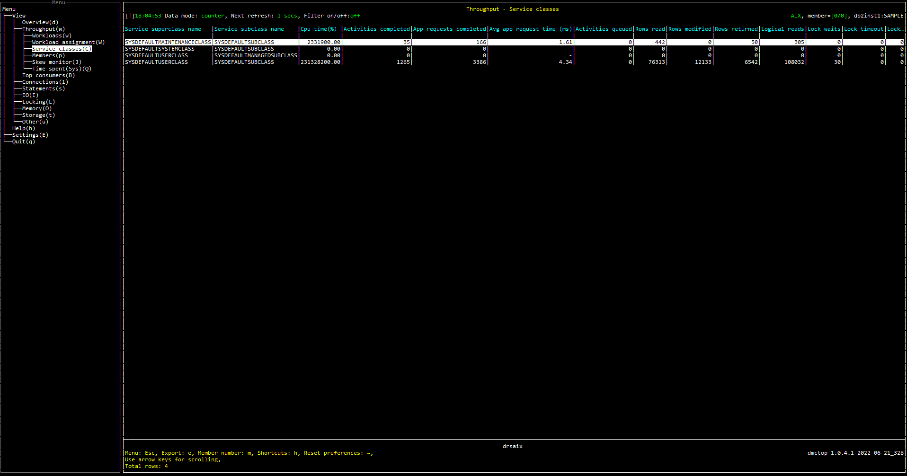

# Purpose
Service classes view shows how much work is happening in each WLM service class.

One of the main purposes of WLM service classes is to apply different priorities and or policies to different types of work.  For example, limiting the number of large queries allowed to run concurrently.  Service classes are also used to give higher priority to business critical applications.

Validating that service classes are serving their intended purpose requires monitoring the performance of activities that are running in them.

Each row in this view shows a service subclass.  You can use filtering or sorting to group the service subclasses by service superclass.

# Screenshot

# Metrics Shown

### Service superclass name

The name of a service superclass.

**Source:** [MON_GET_SERVICE_SUBCLASS](https://www.ibm.com/docs/en/db2/11.5?topic=mpf-mon-get-service-subclass-get-service-subclass-metrics)(NULL, NULL, #MEMBER#).[SERVICE_SUPERCLASS_NAME](https://www.ibm.com/docs/en/db2/11.5?topic=reference-s#r0051576) 

### Service subclass name

The name of a service subclass.

**Source:** [MON_GET_SERVICE_SUBCLASS](https://www.ibm.com/docs/en/db2/11.5?topic=mpf-mon-get-service-subclass-get-service-subclass-metrics)(NULL, NULL, #MEMBER#).[SERVICE_SUBCLASS_NAME](https://www.ibm.com/docs/en/db2/11.5?topic=reference-s#r0051575)

### Cpu time

The total amount of CPU time used while within the database system.

**Source:** [MON_GET_SERVICE_SUBCLASS](https://www.ibm.com/docs/en/db2/11.5?topic=mpf-mon-get-service-subclass-get-service-subclass-metrics)(NULL, NULL, #MEMBER#).SUM([TOTAL_CPU_TIME](https://www.ibm.com/docs/en/db2/11.5?topic=reference-t#r0054057))

### Activities completed

The total number of coordinator activities that completed successfully.

**Source:** [MON_GET_SERVICE_SUBCLASS](https://www.ibm.com/docs/en/db2/11.5?topic=mpf-mon-get-service-subclass-get-service-subclass-metrics)(NULL, NULL, #MEMBER#).SUM([ACT_COMPLETED_TOTAL](https://www.ibm.com/docs/en/db2/11.5?topic=reference-#r0054007))

### App requests completed

The total number of external (application) requests executed by the coordinator.

**Source:** [MON_GET_SERVICE_SUBCLASS](https://www.ibm.com/docs/en/db2/11.5?topic=mpf-mon-get-service-subclass-get-service-subclass-metrics)(NULL, NULL, #MEMBER#).SUM([APP_RQSTS_COMPLETED_TOTAL](https://www.ibm.com/docs/en/db2/11.5?topic=reference-#r0054011))

### Avg app request time

The total elapsed time spent on application requests.

**Source:** [MON_GET_SERVICE_SUBCLASS](https://www.ibm.com/docs/en/db2/11.5?topic=mpf-mon-get-service-subclass-get-service-subclass-metrics)(NULL, NULL, #MEMBER#).SUM([TOTAL_APP_RQST_TIME](https://www.ibm.com/docs/en/db2/11.5?topic=reference-t#r0054056))

### Activities queued

The total number of times that activities or connections have been queued by a WLM threshold.

**Source:** [MON_GET_SERVICE_SUBCLASS](https://www.ibm.com/docs/en/db2/11.5?topic=mpf-mon-get-service-subclass-get-service-subclass-metrics)(NULL, NULL, #MEMBER#).SUM([WLM_QUEUE_ASSIGNMENTS_TOTAL](https://www.ibm.com/docs/en/db2/11.5?topic=reference-w#r0054062))

### Rows read

The total number of rows read from the table.

**Source:** [MON_GET_SERVICE_SUBCLASS](https://www.ibm.com/docs/en/db2/11.5?topic=mpf-mon-get-service-subclass-get-service-subclass-metrics)(NULL, NULL, #MEMBER#).SUM([ROWS_READ](https://www.ibm.com/docs/en/db2/11.5?topic=reference-r#r0001317))

### Row modified

The total number of rows inserted, updated, or deleted.

**Source:** [MON_GET_SERVICE_SUBCLASS](https://www.ibm.com/docs/en/db2/11.5?topic=mpf-mon-get-service-subclass-get-service-subclass-metrics)(NULL, NULL, #MEMBER#).SUM([ROWS_MODIFIED](https://www.ibm.com/docs/en/db2/11.5?topic=reference-r#r0051568))

### Rows returned

The total number of rows that have been selected and returned to the application. 

**Source:** [MON_GET_SERVICE_SUBCLASS](https://www.ibm.com/docs/en/db2/11.5?topic=mpf-mon-get-service-subclass-get-service-subclass-metrics)(NULL, NULL, #MEMBER#).SUM([ROWS_RETURNED](https://www.ibm.com/docs/en/db2/11.5?topic=reference-r#r0051569))

### Logical reads

The total number of pages read from the local buffer pool (logical) for regular and large table spaces.

**Source:** [MON_GET_SERVICE_SUBCLASS](https://www.ibm.com/docs/en/db2/11.5?topic=mpf-mon-get-service-subclass-get-service-subclass-metrics)(NULL, NULL, #MEMBER#).(SUM([POOL_DATA_L_READS](https://www.ibm.com/docs/en/db2/11.5?topic=reference-p#r0001235)) + SUM([POOL_INDEX_L_READS](https://www.ibm.com/docs/en/db2/11.5?topic=reference-p#r0001238)) + SUM([POOL_XDA_L_READS](https://www.ibm.com/docs/en/db2/11.5?topic=reference-p#r0022731)) + SUM([POOL_COL_L_READS](https://www.ibm.com/docs/en/db2/11.5?topic=reference-p#r0060763)) + SUM([POOL_TEMP_DATA_L_READS](https://www.ibm.com/docs/en/db2/11.5?topic=reference-p#r0011302)) + SUM([POOL_TEMP_INDEX_L_READS](https://www.ibm.com/docs/en/db2/11.5?topic=reference-p#r0011303)) + SUM([POOL_TEMP_XDA_L_READS](https://www.ibm.com/docs/en/db2/11.5?topic=reference-p#r0022738)) + SUM([POOL_TEMP_COL_L_READS](https://www.ibm.com/docs/en/db2/11.5?topic=reference-p#r0060873)))

### Lock waits

The total number of times that applications or connections waited for locks.

**Source:** [MON_GET_SERVICE_SUBCLASS](https://www.ibm.com/docs/en/db2/11.5?topic=mpf-mon-get-service-subclass-get-service-subclass-metrics)(NULL, NULL, #MEMBER#).SUM([LOCK_WAITS](https://www.ibm.com/docs/en/db2/11.5?topic=reference-l#r0001293))

### Lock timeout

The number of times that a request to lock an object timed out instead of being granted.

**Source:** [MON_GET_SERVICE_SUBCLASS](https://www.ibm.com/docs/en/db2/11.5?topic=mpf-mon-get-service-subclass-get-service-subclass-metrics)(NULL, NULL, #MEMBER#).SUM([LOCK_TIMEOUTS](https://www.ibm.com/docs/en/db2/11.5?topic=reference-l#r0001290))

### Lock escal

The number of times that locks have been escalated from several row locks to a table lock.

**Source:** [MON_GET_SERVICE_SUBCLASS](https://www.ibm.com/docs/en/db2/11.5?topic=mpf-mon-get-service-subclass-get-service-subclass-metrics)(NULL, NULL, #MEMBER#).SUM([LOCK_ESCALS](https://www.ibm.com/docs/en/db2/11.5?topic=reference-l#r0001284))

### Deadlock

The total number of deadlocks that have occurred.

**Source:** [MON_GET_SERVICE_SUBCLASS](https://www.ibm.com/docs/en/db2/11.5?topic=mpf-mon-get-service-subclass-get-service-subclass-metrics)(NULL, NULL, #MEMBER#).SUM([DEADLOCKS](https://www.ibm.com/docs/en/db2/11.5?topic=reference-d#r0001283))

### Threshold violation

The total number of times a threshold was violated.

**Source:** [MON_GET_SERVICE_SUBCLASS](https://www.ibm.com/docs/en/db2/11.5?topic=mpf-mon-get-service-subclass-get-service-subclass-metrics)(NULL, NULL, #MEMBER#).SUM([THRESH_VIOLATIONS](https://www.ibm.com/docs/en/db2/11.5?topic=reference-t#r0056501))

### Sort

The total number of sorts that have been executed.

**Source:** [MON_GET_SERVICE_SUBCLASS](https://www.ibm.com/docs/en/db2/11.5?topic=mpf-mon-get-service-subclass-get-service-subclass-metrics)(NULL, NULL, #MEMBER#).SUM([TOTAL_SORTS](https://www.ibm.com/docs/en/db2/11.5?topic=reference-t#r0001219))

### Sort overflow

The total number of sorts that ran out of sort heap and may have required disk space for temporary storage.

**Source:** [MON_GET_SERVICE_SUBCLASS](https://www.ibm.com/docs/en/db2/11.5?topic=mpf-mon-get-service-subclass-get-service-subclass-metrics)(NULL, NULL, #MEMBER#).SUM([SORT_OVERFLOWS](https://www.ibm.com/docs/en/db2/11.5?topic=reference-s#r0001221))

### Hash group by op

The total number of hashed GROUP BY operations.

**Source:** [MON_GET_SERVICE_SUBCLASS](https://www.ibm.com/docs/en/db2/11.5?topic=mpf-mon-get-service-subclass-get-service-subclass-metrics)(NULL, NULL, #MEMBER#).SUM([TOTAL_HASH_GRPBYS](https://www.ibm.com/docs/en/db2/11.5?topic=reference-t#r0061038))

### Hash group overflow

The number of times that GROUP BY operations using hashing as their grouping method exceeded the available sort heap memory.

**Source:** [MON_GET_SERVICE_SUBCLASS](https://www.ibm.com/docs/en/db2/11.5?topic=mpf-mon-get-service-subclass-get-service-subclass-metrics)(NULL, NULL, #MEMBER#).SUM([HASH_GRPBY_OVERFLOWS](https://www.ibm.com/docs/en/db2/11.5?topic=reference-h#r0061039))

### Activities aborted

The total number of coordinator activities at any nesting level that completed with errors. 

**Source:** [MON_GET_SERVICE_SUBCLASS](https://www.ibm.com/docs/en/db2/11.5?topic=mpf-mon-get-service-subclass-get-service-subclass-metrics)(NULL, NULL, #MEMBER#).SUM([ACT_ABORTED_TOTAL](https://www.ibm.com/docs/en/db2/11.5?topic=reference-#r0054006))

### Activities rejected

The total number of coordinator activities at any nesting level that were rejected instead of being allowed to execute.

**Source:** [MON_GET_SERVICE_SUBCLASS](https://www.ibm.com/docs/en/db2/11.5?topic=mpf-mon-get-service-subclass-get-service-subclass-metrics)(NULL, NULL, #MEMBER#).SUM([ACT_REJECTED_TOTAL](https://www.ibm.com/docs/en/db2/11.5?topic=reference-#r0054008))

### Direct reads

The number of read operations that do not use the buffer pool.

**Source:** [MON_GET_SERVICE_SUBCLASS](https://www.ibm.com/docs/en/db2/11.5?topic=mpf-mon-get-service-subclass-get-service-subclass-metrics)(NULL, NULL, #MEMBER#).SUM([DIRECT_READS](https://www.ibm.com/docs/en/db2/11.5?topic=reference-d#r0001260))

### Direct writes

The number of write operations that do not use the buffer pool.

**Source:** [MON_GET_SERVICE_SUBCLASS](https://www.ibm.com/docs/en/db2/11.5?topic=mpf-mon-get-service-subclass-get-service-subclass-metrics)(NULL, NULL, #MEMBER#).SUM([DIRECT_WRITES](https://www.ibm.com/docs/en/db2/11.5?topic=reference-d#r0001261))

