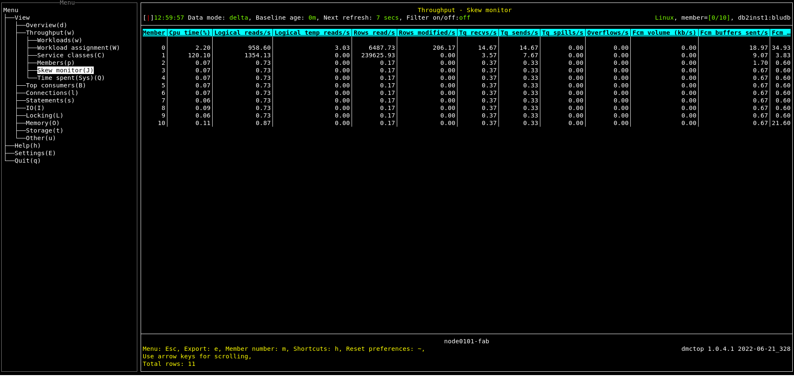

# Purpose

Skew monitor view presents data useful in assessing skew in access patterns.  When a query accesses more data on some members than on others, the more heavily loaded members become bottlenecks, making the whole query take longer.

# Screenshot

# Metric shown

### Member

The numeric identifier for the database member from which the data was retrieved for this result record.

**Source:** [MON_GET_SERVICE_SUBCLASS](https://www.ibm.com/docs/en/db2/11.5?topic=mpf-mon-get-service-subclass-get-service-subclass-metrics)(NULL, NULL, #MEMBER#).[MEMBER](https://www.ibm.com/docs/en/db2/11.5?topic=reference-m#r0054432)

### Cpu time

The total amount of CPU time used while within the database system.

**Source:** [MON_GET_SERVICE_SUBCLASS](https://www.ibm.com/docs/en/db2/11.5?topic=mpf-mon-get-service-subclass-get-service-subclass-metrics)(NULL, NULL, #MEMBER#).SUM([TOTAL_CPU_TIME](https://www.ibm.com/docs/en/db2/11.5?topic=reference-t#r0054057))

### Logical reads

Indicates the number of data, index, and column-organized pages which have been requested from the buffer pool (logical) for regular, large and temporary table spaces.

**Source:** [MON_GET_SERVICE_SUBCLASS](https://www.ibm.com/docs/en/db2/11.5?topic=mpf-mon-get-service-subclass-get-service-subclass-metrics)(NULL, NULL, #MEMBER#).(SUM([POOL_DATA_L_READS](https://www.ibm.com/docs/en/db2/11.5?topic=reference-p#r0001235)) + SUM([POOL_INDEX_L_READS](https://www.ibm.com/docs/en/db2/11.5?topic=reference-p#r0001238)) + SUM([POOL_XDA_L_READS](https://www.ibm.com/docs/en/db2/11.5?topic=reference-p#r0022731)) + SUM([POOL_COL_L_READS](https://www.ibm.com/docs/en/db2/11.5?topic=reference-p#r0060763)) + SUM([POOL_TEMP_DATA_L_READS](https://www.ibm.com/docs/en/db2/11.5?topic=reference-p#r0011302)) + SUM([POOL_TEMP_INDEX_L_READS](https://www.ibm.com/docs/en/db2/11.5?topic=reference-p#r0011303)) + SUM([POOL_TEMP_XDA_L_READS](https://www.ibm.com/docs/en/db2/11.5?topic=reference-p#r0022738)) + SUM([POOL_TEMP_COL_L_READS](https://www.ibm.com/docs/en/db2/11.5?topic=reference-p#r0060873)))

### Logical temp reads

Indicates the number of data, index, and column-organized pages which have been requested from the buffer pool (logical) for temporary table spaces.

**Source:** [MON_GET_SERVICE_SUBCLASS](https://www.ibm.com/docs/en/db2/11.5?topic=mpf-mon-get-service-subclass-get-service-subclass-metrics)(NULL, NULL, #MEMBER#).(SUM([POOL_TEMP_DATA_L_READS](https://www.ibm.com/docs/en/db2/11.5?topic=reference-p#r0011302)) + SUM([POOL_TEMP_INDEX_L_READS](https://www.ibm.com/docs/en/db2/11.5?topic=reference-p#r0011303)) + SUM([POOL_TEMP_XDA_L_READS](https://www.ibm.com/docs/en/db2/11.5?topic=reference-p#r0022738)) +  SUM([POOL_TEMP_COL_L_READS](https://www.ibm.com/docs/en/db2/11.5?topic=reference-p#r0060873)))

### Rows read

The number of rows read from the table.

**Source:** [MON_GET_SERVICE_SUBCLASS](https://www.ibm.com/docs/en/db2/11.5?topic=mpf-mon-get-service-subclass-get-service-subclass-metrics)(NULL, NULL, #MEMBER#).SUM([ROWS_READ](https://www.ibm.com/docs/en/db2/11.5?topic=reference-r#r0001317))

### Rows modified

The number of rows inserted, updated, or deleted.

**Source:** [MON_GET_SERVICE_SUBCLASS](https://www.ibm.com/docs/en/db2/11.5?topic=mpf-mon-get-service-subclass-get-service-subclass-metrics)(NULL, NULL, #MEMBER#).SUM([ROWS_MODIFIED](https://www.ibm.com/docs/en/db2/11.5?topic=reference-r#r0051568))

### Tq recvs

The total number of buffers received from table queues using the internal FCM communications mechanism.

**Source:** [MON_GET_SERVICE_SUBCLASS](https://www.ibm.com/docs/en/db2/11.5?topic=mpf-mon-get-service-subclass-get-service-subclass-metrics)(NULL, NULL, #MEMBER#).SUM([FCM_TQ_RECVS_TOTAL](https://www.ibm.com/docs/en/db2/11.5?topic=reference-f#r0054034))

### Tq sends

The total number of buffers containing table queue data sent using the internal FCM communications mechanism.

**Source:** [MON_GET_SERVICE_SUBCLASS](https://www.ibm.com/docs/en/db2/11.5?topic=mpf-mon-get-service-subclass-get-service-subclass-metrics)(NULL, NULL, #MEMBER#).SUM([FCM_TQ_SENDS_TOTAL](https://www.ibm.com/docs/en/db2/11.5?topic=reference-f#r0054037))

### Tq spills

Total number of table queue buffers overflowed to a temporary table.

**Source:** [MON_GET_SERVICE_SUBCLASS](https://www.ibm.com/docs/en/db2/11.5?topic=mpf-mon-get-service-subclass-get-service-subclass-metrics)(NULL, NULL, #MEMBER#).SUM([TQ_TOT_SEND_SPILLS](https://www.ibm.com/docs/en/db2/11.5?topic=reference-t#r0001365))

### Overflows

The number of times that operations exceeded the available sort heap memory.

**Source:** [MON_GET_SERVICE_SUBCLASS](https://www.ibm.com/docs/en/db2/11.5?topic=mpf-mon-get-service-subclass-get-service-subclass-metrics)(NULL, NULL, #MEMBER#).(SUM([SORT_OVERFLOWS](https://www.ibm.com/docs/en/db2/11.5?topic=reference-s#r0001221)) + SUM([HASH_JOIN_OVERFLOWS](https://www.ibm.com/docs/en/db2/11.5?topic=reference-h#r0002286)) + SUM([OLAP_FUNC_OVERFLOWS](https://www.ibm.com/docs/en/db2/11.5?topic=reference-o#r0051898)) + SUM([HASH_GRPBY_OVERFLOWS](https://www.ibm.com/docs/en/db2/11.5?topic=reference-h#r0061039)))

### Fcm volume

The total amount of data received and distributed via the FCM communications layer. 

**Source:** [MON_GET_SERVICE_SUBCLASS](https://www.ibm.com/docs/en/db2/11.5?topic=mpf-mon-get-service-subclass-get-service-subclass-metrics)(NULL, NULL, #MEMBER#).SUM([FCM_RECV_VOLUME](https://www.ibm.com/docs/en/db2/11.5?topic=reference-f#r0054026) + [FCM_SEND_VOLUME](https://www.ibm.com/docs/en/db2/11.5?topic=reference-f#r0054029))

### Fcm buffers sent

The total number of buffers sent using the internal FCM communications layer.

**Source:** [MON_GET_SERVICE_SUBCLASS](https://www.ibm.com/docs/en/db2/11.5?topic=mpf-mon-get-service-subclass-get-service-subclass-metrics)(NULL, NULL, #MEMBER#).SUM([FCM_SENDS_TOTAL](https://www.ibm.com/docs/en/db2/11.5?topic=reference-f#r0054031))

### Fcm buffers recvd

The total number of buffers received for internal requests using the FCM communications mechanism.

**Source:** [MON_GET_SERVICE_SUBCLASS](https://www.ibm.com/docs/en/db2/11.5?topic=mpf-mon-get-service-subclass-get-service-subclass-metrics)(NULL, NULL, #MEMBER#).SUM([FCM_RECVS_TOTAL](https://www.ibm.com/docs/en/db2/11.5?topic=reference-f#r0054028))

### Activities completed

The total number of coordinator activities at any nesting level that completed successfully.

**Source:** [MON_GET_SERVICE_SUBCLASS](https://www.ibm.com/docs/en/db2/11.5?topic=mpf-mon-get-service-subclass-get-service-subclass-metrics)(NULL, NULL, #MEMBER#).SUM([ACT_COMPLETED_TOTAL](https://www.ibm.com/docs/en/db2/11.5?topic=reference-#r0054007))

### Requests

The total number of requests executed, including both application and internal requests. 

**Source:** [MON_GET_SERVICE_SUBCLASS](https://www.ibm.com/docs/en/db2/11.5?topic=mpf-mon-get-service-subclass-get-service-subclass-metrics)(NULL, NULL, #MEMBER#).SUM([RQSTS_COMPLETED_TOTAL](https://www.ibm.com/docs/en/db2/11.5?topic=reference-r#r0054049))

### In-flight activities

The activities that were submitted by the application on the specified member and have not yet been completed.

[WLM_GET_WORKLOAD_OCCURRENCE_ACTIVITIES](https://www.ibm.com/docs/en/db2/11.5?topic=wmr-wlm-get-workload-occurrence-activities-table-function-return-list-activities)(NULL, #MEMBER#)

