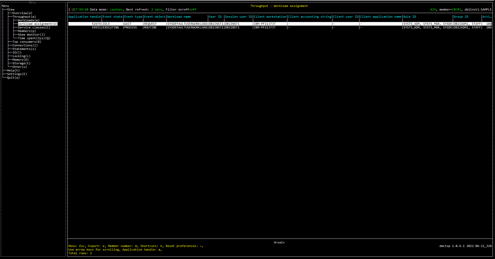

# Purpose
Work assignment view shows what workload each connection is mapped to, and the client info fields.  This is useful for debugging connections that are not being mapped as expected.  This view also shows some WLM specific metrics related to connections.

The primary fields shown are the application handle (identifies the connection), the workload it is currently mapped to and the connection attributes (aka client info fields) for the connection.

# Screenshot


# Metrics Shown

<hr />

### Application handle

A system-wide unique ID for the application.
 
**Source:** [WLM_GET_SERVICE_CLASS_WORKLOAD_OCCURRENCES](https://www.ibm.com/docs/en/db2woc?topic=wmr-wlm-get-service-class-workload-occurrences-table-function-list-workload-occurrences)('', '', #MEMBER#).[APPLICATION_HANDLE](https://www.ibm.com/docs/en/db2/11.5?topic=reference-#r0054410)


<hr />

### Event state
State of the event last processed by this agent. The possible values are as follows:
* EXECUTING
* IDLE

**Source:** [MON_GET_AGENT](https://www.ibm.com/docs/en/db2/11.5?topic=mpf-mon-get-agent-list-agents-fenced-mode-processes-system-entities-database)(NULL,NULL,NULL,#MEMBER#).[EVENT_STATE](https://www.ibm.com/docs/en/db2/11.5?topic=mpf-mon-get-agent-list-agents-fenced-mode-processes-system-entities-database)


<hr />

### Event type

Type of event last processed by this agent. The possible values are as follows:
* ACQUIRE
* PROCESS
* WAIT

**Source:** [MON_GET_AGENT](https://www.ibm.com/docs/en/db2/11.5?topic=mpf-mon-get-agent-list-agents-fenced-mode-processes-system-entities-database)(NULL,NULL,NULL,#MEMBER#).[EVENT_TYPE](https://www.ibm.com/docs/en/db2/11.5?topic=mpf-mon-get-agent-list-agents-fenced-mode-processes-system-entities-database)


<hr />

### Event object

Object of the event last processed by this agent. The possible values are as follows:
* COMPRESSION_DICTIONARY_BUILD
* IMPLICIT_REBIND
* INDEX_RECREATE
* LOCK
* LOCK_ESCALATION
* QP_QUEUE
* REMOTE_REQUEST
* REQUEST
* ROUTINE
* WLM_QUEUE

**Source:** [MON_GET_AGENT](https://www.ibm.com/docs/en/db2/11.5?topic=mpf-mon-get-agent-list-agents-fenced-mode-processes-system-entities-database)(NULL,NULL,NULL,#MEMBER#).[EVENT_OBJECT](https://www.ibm.com/docs/en/db2/11.5?topic=mpf-mon-get-agent-list-agents-fenced-mode-processes-system-entities-database)


<hr />

### Workload name

Name of the workload.

**Source:** [WLM_GET_SERVICE_CLASS_WORKLOAD_OCCURRENCES](https://www.ibm.com/docs/en/db2woc?topic=wmr-wlm-get-service-class-workload-occurrences-table-function-list-workload-occurrences).[WORKLOAD_NAME](https://www.ibm.com/docs/en/db2woc?topic=reference-w#r0051600)


<hr />

### User ID

The system authorization id for the connection.

**Source:** [WLM_GET_SERVICE_CLASS_WORKLOAD_OCCURRENCES](https://www.ibm.com/docs/en/db2woc?topic=wmr-wlm-get-service-class-workload-occurrences-table-function-list-workload-occurrences)('', '', #MEMBER#).[SYSTEM_AUTH_ID](https://www.ibm.com/docs/en/db2woc?topic=reference-s#r0056526)


<hr />

### Session user ID

The current authorization ID for the session being used by this application.

**Source:** [WLM_GET_SERVICE_CLASS_WORKLOAD_OCCURRENCES](https://www.ibm.com/docs/en/db2woc?topic=wmr-wlm-get-service-class-workload-occurrences-table-function-list-workload-occurrences)('', '', #MEMBER#).[SESSION_AUTH_ID](https://www.ibm.com/docs/en/db2woc?topic=reference-s#r0010880)


<hr />

### Client workstation

Client workstation name

**Source:** [WLM_GET_SERVICE_CLASS_WORKLOAD_OCCURRENCES](https://www.ibm.com/docs/en/db2woc?topic=wmr-wlm-get-service-class-workload-occurrences-table-function-list-workload-occurrences)('', '', #MEMBER#).[CLIENT_WRKSTNNAME](https://www.ibm.com/docs/en/db2woc?topic=reference-c#r0055513)


<hr />

### Client accounting string

The data passed to the target database for logging and diagnostic purposes.

**Source:** [WLM_GET_SERVICE_CLASS_WORKLOAD_OCCURRENCES](https://www.ibm.com/docs/en/db2woc?topic=wmr-wlm-get-service-class-workload-occurrences-table-function-list-workload-occurrences)('', '', #MEMBER#).[CLIENT_ACCTNG](https://www.ibm.com/docs/en/db2woc?topic=reference-c#r0055510)


<hr />

### Client user ID

Current value of the CLIENT_USERID special register for this workload occurrence.

**Source:** [WLM_GET_SERVICE_CLASS_WORKLOAD_OCCURRENCES](https://www.ibm.com/docs/en/db2woc?topic=wmr-wlm-get-service-class-workload-occurrences-table-function-list-workload-occurrences)('', '', #MEMBER#).[CLIENT_USER](https://www.ibm.com/docs/en/db2woc?topic=wmr-wlm-get-service-class-workload-occurrences-table-function-list-workload-occurrences)


<hr />

### Client application name

Identifies the server transaction program performing the transaction.

**Source:** [WLM_GET_SERVICE_CLASS_WORKLOAD_OCCURRENCES](https://www.ibm.com/docs/en/db2woc?topic=wmr-wlm-get-service-class-workload-occurrences-table-function-list-workload-occurrences)('', '', #MEMBER#).[CLIENT_APPLNAME](https://www.ibm.com/docs/en/db2woc?topic=reference-c#r0055512)


<hr />

### Role ID

All rolename's where the GRANTEE matches WLM_GET_SERVICE_CLASS_WORKLOAD_OCCURRENCES.SYSTEM_AUTH_ID and present them as a comma separated list. 


**Source:** 

[SYSCAT.ROLEAUTH](https://www.ibm.com/docs/en/db2/11.5?topic=views-syscatroleauth).[ROLENAME](https://www.ibm.com/docs/en/db2/11.5?topic=views-syscatroleauth)

[SYSCAT.ROLEAUTH](https://www.ibm.com/docs/en/db2/11.5?topic=views-syscatroleauth).[GRANTEE](https://www.ibm.com/docs/en/db2/11.5?topic=views-syscatroleauth)

[WLM_GET_SERVICE_CLASS_WORKLOAD_OCCURRENCES](https://www.ibm.com/docs/en/db2woc?topic=wmr-wlm-get-service-class-workload-occurrences-table-function-list-workload-occurrences)('', '', #MEMBER#).[SYSTEM_AUTH_ID](https://www.ibm.com/docs/en/db2woc?topic=reference-s#r0056526)


<hr />

### Group ID

The group for the connection.

**Source:**  [AUTH_LIST_GROUPS_FOR_AUTHID](https://www.ibm.com/docs/en/db2oc?topic=srv-auth-list-groups-authid-group-membership-authorization-ids)([SYSTEM_AUTH_ID](https://www.ibm.com/docs/en/db2woc?topic=reference-s#r0056526)).[GROUP](https://www.ibm.com/docs/en/db2oc?topic=srv-auth-list-groups-authid-group-membership-authorization-ids)


<hr />

### Activities completed

The total number of coordinator activities that completed successfully.

**Source:** [MON_GET_CONNECTION](https://www.ibm.com/docs/en/db2/11.5?topic=functions-mon-get-connection-get-connection-metrics)(NULL, #MEMBER#, 1).SUM([ACT_COMPLETED_TOTAL](https://www.ibm.com/docs/en/db2/11.5?topic=reference-#r0054007))


<hr />

### Wlm queue assignment

The total number of times that activities or connections have been queued by a WLM threshold.

**Source:** [MON_GET_CONNECTION](https://www.ibm.com/docs/en/db2/11.5?topic=functions-mon-get-connection-get-connection-metrics)(NULL, #MEMBER#, 1).SUM([WLM_QUEUE_ASSIGNMENTS_TOTAL](https://www.ibm.com/docs/en/db2/11.5?topic=reference-w#r0054062))


<hr />

### Threshold violations

The total number of times a threshold was violated.

**Source:** [MON_GET_CONNECTION](https://www.ibm.com/docs/en/db2/11.5?topic=functions-mon-get-connection-get-connection-metrics)(NULL, #MEMBER#, 1).SUM([THRESH_VIOLATIONS](https://www.ibm.com/docs/en/db2/11.5?topic=reference-t#r0056501))


<hr />

### Activities aborted

The total number of coordinator activities that completed with errors.

**Source:** [MON_GET_CONNECTION](https://www.ibm.com/docs/en/db2/11.5?topic=functions-mon-get-connection-get-connection-metrics)(NULL, #MEMBER#, 1).SUM([ACT_ABORTED_TOTAL](https://www.ibm.com/docs/en/db2/11.5?topic=reference-#r0054006))


<hr />

### Activities rejected

The total number of coordinator activities that were rejected instead of being allowed to execute.

**Source:** [MON_GET_CONNECTION](https://www.ibm.com/docs/en/db2/11.5?topic=functions-mon-get-connection-get-connection-metrics)(NULL, #MEMBER#, 1).SUM([ACT_REJECTED_TOTAL](https://www.ibm.com/docs/en/db2/11.5?topic=reference-#r0054008))


<hr />

### Recent sql

It takes long time to get all the sql text, so it only returns `-` currently.


<hr />

### Address

The IP address from which the activity connection was initiated.

**Source:** [WLM_GET_SERVICE_CLASS_WORKLOAD_OCCURRENCES](https://www.ibm.com/docs/en/db2woc?topic=wmr-wlm-get-service-class-workload-occurrences-table-function-list-workload-occurrences)('', '', #MEMBER#).[ADDRESS](https://www.ibm.com/docs/en/db2woc?topic=reference-#r0054686)


<hr />

### Internal application

Indicates whether the application is a system application.

```
SELECT CASE 
          WHEN IS_SYSTEM_APPL = 0 THEN VARCHAR('NO', 3) 
          ELSE                         VARCHAR('YES', 3) 
       END AS INTERNAL_APPL
FROM   TABLE(MON_GET_AGENT(NULL,NULL,NULL,#MEMBER#)
```

**Source:** [MON_GET_AGENT](https://www.ibm.com/docs/en/db2/11.5?topic=mpf-mon-get-agent-list-agents-fenced-mode-processes-system-entities-database)(NULL,NULL,NULL,#MEMBER#).[IS_SYSTEM_APPL](https://www.ibm.com/docs/en/db2/11.5?topic=reference-i#r0051792)


<hr />

### Coordinator member

Coordinating member for an application.

**Source:** [WLM_GET_SERVICE_CLASS_WORKLOAD_OCCURRENCES](https://www.ibm.com/docs/en/db2woc?topic=wmr-wlm-get-service-class-workload-occurrences-table-function-list-workload-occurrences)('', '', #MEMBER#).[COORD_MEMBER](https://www.ibm.com/docs/en/db2woc?topic=reference-c#r0055426)


<hr />

### Connection start time

The time at which the connection was established with the database server. 

**Source:** [MON_GET_CONNECTION](https://www.ibm.com/docs/en/db2/11.5?topic=functions-mon-get-connection-get-connection-metrics)(NULL, #MEMBER#, 1).MIN([CONNECTION_START_TIME](https://www.ibm.com/docs/en/db2/11.5?topic=reference-c#r0056524))

