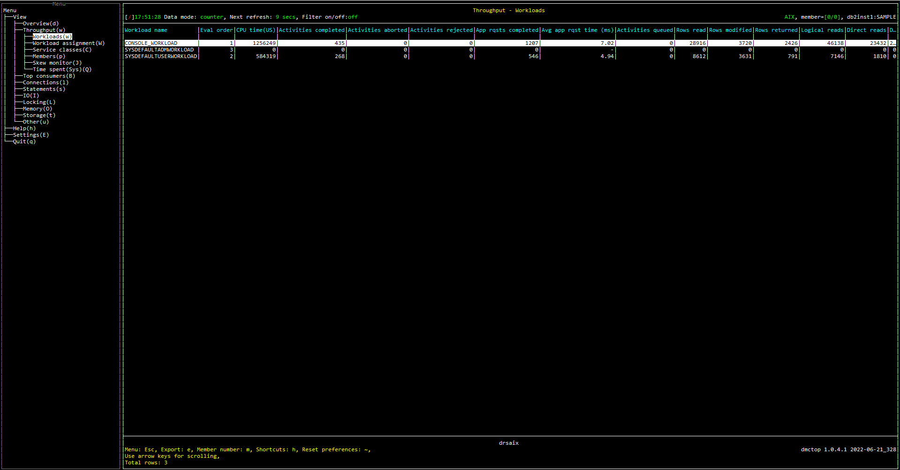

# Purpose
Workloads view shows how much work is happening in each WLM workload. 

One of the intended purposes of workloads in WLM is to split particular users or applications into separate categories for monitoring and reporting purposes.  For example, you might create a workload where all Cognos reports will run so that you can track the impact of Cognos on your production database.

# Screenshot


# Metrics shown


<hr />

### Workload name

Name of the workload.

**Source:** [MON_GET_WORKLOAD](https://www.ibm.com/docs/en/db2/11.5?topic=functions-mon-get-workload-get-workload-metrics)(NULL, #MEMBER#).[WORKLOAD_NAME](https://www.ibm.com/docs/en/db2/11.5?topic=reference-w#r0051600)


<hr />

### Eval order

Evaluation order used for choosing a workload.

**Source:** [SYSCAT.WORKLOADS](https://www.ibm.com/docs/en/ias?topic=views-syscatworkloads).[EVALUATIONORDER](https://www.ibm.com/docs/en/ias?topic=views-syscatworkloads)


<hr />

### CPU time

The total amount  or percentage of CPU time used of the workload while within the database system. 

```
SELECT SUM(TOTAL_CPU_TIME)
FROM   TABLE(MON_GET_WORKLOAD(NULL, #MEMBER#)) MGW, 
SYSCAT.WORKLOADS WKLD 
WHERE  MGW.WORKLOAD_ID = WKLD.WORKLOADID 
GROUP  BY MGW.WORKLOAD_NAME, WKLD.EVALUATIONORDER 
```


**Source:** 

[MON_GET_WORKLOAD](https://www.ibm.com/docs/en/db2/11.5?topic=functions-mon-get-workload-get-workload-metrics)(NULL, #MEMBER#).[TOTAL_CPU_TIME](https://www.ibm.com/docs/en/db2/11.5?topic=reference-t#r0054057)

[SYSCAT.WORKLOADS](https://www.ibm.com/docs/en/ias?topic=views-syscatworkloads)


<hr />

### Activities completed

The total number of external, non-nested coordinator activities that completed successfully of the workload. 


```
SELECT SUM(ACT_COMPLETED_TOTAL)
FROM   TABLE(MON_GET_WORKLOAD(NULL, #MEMBER#)) MGW, 
SYSCAT.WORKLOADS WKLD 
WHERE  MGW.WORKLOAD_ID = WKLD.WORKLOADID 
GROUP  BY MGW.WORKLOAD_NAME, WKLD.EVALUATIONORDER 
```

**Source:** 

[MON_GET_WORKLOAD](https://www.ibm.com/docs/en/db2/11.5?topic=functions-mon-get-workload-get-workload-metrics)(NULL, #MEMBER#).[ACT_COMPLETED_TOTAL](https://www.ibm.com/docs/en/db2/11.5?topic=reference-#r0059566)

[SYSCAT.WORKLOADS](https://www.ibm.com/docs/en/ias?topic=views-syscatworkloads)


<hr />

### Activities aborted

The total number of coordinator activities at any nesting level that completed with errors of the workload. 

```
SELECT SUM(ACT_ABORTED_TOTAL)
FROM   TABLE(MON_GET_WORKLOAD(NULL, #MEMBER#)) MGW, 
SYSCAT.WORKLOADS WKLD 
WHERE  MGW.WORKLOAD_ID = WKLD.WORKLOADID 
GROUP  BY MGW.WORKLOAD_NAME, WKLD.EVALUATIONORDER 
```

**Source:** 

[MON_GET_WORKLOAD](https://www.ibm.com/docs/en/db2/11.5?topic=functions-mon-get-workload-get-workload-metrics)(NULL, #MEMBER#).[ACT_ABORTED_TOTAL](https://www.ibm.com/docs/en/db2/11.5?topic=reference-#r0054006)

[SYSCAT.WORKLOADS](https://www.ibm.com/docs/en/ias?topic=views-syscatworkloads)


<hr />

### Activities rejected

The total number of coordinator activities of the workload at any nesting level that were rejected instead of being allowed to execute.

```
SELECT SUM(ACT_REJECTED_TOTAL)
FROM   TABLE(MON_GET_WORKLOAD(NULL, #MEMBER#)) MGW, 
SYSCAT.WORKLOADS WKLD 
WHERE  MGW.WORKLOAD_ID = WKLD.WORKLOADID 
GROUP  BY MGW.WORKLOAD_NAME, WKLD.EVALUATIONORDER 
```

**Source:** 

[MON_GET_WORKLOAD](https://www.ibm.com/docs/en/db2/11.5?topic=functions-mon-get-workload-get-workload-metrics)(NULL, #MEMBER#).[ACT_REJECTED_TOTAL](https://www.ibm.com/docs/en/db2/11.5?topic=reference-#r0054008)

[SYSCAT.WORKLOADS](https://www.ibm.com/docs/en/ias?topic=views-syscatworkloads)


<hr />

### App rqsts completed

Total number of external (application) requests executed by the coordinator of the workload. 

```
SELECT SUM(APP_RQSTS_COMPLETED_TOTAL)
FROM   TABLE(MON_GET_WORKLOAD(NULL, #MEMBER#)) MGW, 
SYSCAT.WORKLOADS WKLD 
WHERE  MGW.WORKLOAD_ID = WKLD.WORKLOADID 
GROUP  BY MGW.WORKLOAD_NAME, WKLD.EVALUATIONORDER 
```

**Source:** 

[MON_GET_WORKLOAD](https://www.ibm.com/docs/en/db2/11.5?topic=functions-mon-get-workload-get-workload-metrics)(NULL, #MEMBER#).[APP_RQSTS_COMPLETED_TOTAL](https://www.ibm.com/docs/en/db2/11.5?topic=reference-#r0054011)

[SYSCAT.WORKLOADS](https://www.ibm.com/docs/en/ias?topic=views-syscatworkloads)

* Avg app rqst time

The average time spent on workload requests

= TOTAL_APP_RQST_TIME / APP_RQSTS_COMPLETED_TOTAL


TOTAL_APP_RQST_TIME = 
```
SELECT SUM(TOTAL_APP_RQST_TIME)
FROM   TABLE(MON_GET_WORKLOAD(NULL, #MEMBER#)) MGW, 
SYSCAT.WORKLOADS WKLD 
WHERE  MGW.WORKLOAD_ID = WKLD.WORKLOADID 
GROUP  BY MGW.WORKLOAD_NAME, WKLD.EVALUATIONORDER 
```

APP_RQSTS_COMPLETED_TOTAL = 
```
SELECT SUM(APP_RQSTS_COMPLETED_TOTAL)
FROM   TABLE(MON_GET_WORKLOAD(NULL, #MEMBER#)) MGW, 
SYSCAT.WORKLOADS WKLD 
WHERE  MGW.WORKLOAD_ID = WKLD.WORKLOADID 
GROUP  BY MGW.WORKLOAD_NAME, WKLD.EVALUATIONORDER 
```


**Source:** 

[MON_GET_WORKLOAD](https://www.ibm.com/docs/en/db2/11.5?topic=functions-mon-get-workload-get-workload-metrics)(NULL, #MEMBER#).[TOTAL_APP_RQST_TIME](https://www.ibm.com/docs/en/db2/11.5?topic=reference-t#r0054056)

[MON_GET_WORKLOAD](https://www.ibm.com/docs/en/db2/11.5?topic=functions-mon-get-workload-get-workload-metrics)(NULL, #MEMBER#).[APP_RQSTS_COMPLETED_TOTAL](https://www.ibm.com/docs/en/db2/11.5?topic=reference-#r0054011)


[SYSCAT.WORKLOADS](https://www.ibm.com/docs/en/ias?topic=views-syscatworkloads)


<hr />

### Activities queued

The number of times that workload have been queued by a WLM threshold.

```
SELECT SUM(WLM_QUEUE_ASSIGNMENTS_TOTAL)
FROM   TABLE(MON_GET_WORKLOAD(NULL, #MEMBER#)) MGW, 
SYSCAT.WORKLOADS WKLD 
WHERE  MGW.WORKLOAD_ID = WKLD.WORKLOADID 
GROUP  BY MGW.WORKLOAD_NAME, WKLD.EVALUATIONORDER 
```

**Source:** 

[MON_GET_WORKLOAD](https://www.ibm.com/docs/en/db2/11.5?topic=functions-mon-get-workload-get-workload-metrics)(NULL, #MEMBER#).[WLM_QUEUE_ASSIGNMENTS_TOTAL](https://www.ibm.com/docs/en/db2/11.5?topic=reference-w#r0054062)

[SYSCAT.WORKLOADS](https://www.ibm.com/docs/en/ias?topic=views-syscatworkloads)


<hr />

### Rows read


The number of rows read from the table of the workload.

```
SELECT SUM(ROWS_READ)
FROM   TABLE(MON_GET_WORKLOAD(NULL, #MEMBER#)) MGW, 
SYSCAT.WORKLOADS WKLD 
WHERE  MGW.WORKLOAD_ID = WKLD.WORKLOADID 
GROUP  BY MGW.WORKLOAD_NAME, WKLD.EVALUATIONORDER 
```

**Source:** 

[MON_GET_WORKLOAD](https://www.ibm.com/docs/en/db2/11.5?topic=functions-mon-get-workload-get-workload-metrics)(NULL, #MEMBER#).[ROWS_READ](https://www.ibm.com/docs/en/db2/11.5?topic=reference-r#r0001317)

[SYSCAT.WORKLOADS](https://www.ibm.com/docs/en/ias?topic=views-syscatworkloads)


<hr />

### Rows modified

The number of rows inserted, updated, or deleted of the workload.

```
SELECT SUM(ROWS_MODIFIED)
FROM   TABLE(MON_GET_WORKLOAD(NULL, #MEMBER#)) MGW, 
SYSCAT.WORKLOADS WKLD 
WHERE  MGW.WORKLOAD_ID = WKLD.WORKLOADID 
GROUP  BY MGW.WORKLOAD_NAME, WKLD.EVALUATIONORDER 
```

**Source:** 

[MON_GET_WORKLOAD](https://www.ibm.com/docs/en/db2/11.5?topic=functions-mon-get-workload-get-workload-metrics)(NULL, #MEMBER#).[ROWS_MODIFIED](https://www.ibm.com/docs/en/db2/11.5?topic=reference-r#r0051568)

[SYSCAT.WORKLOADS](https://www.ibm.com/docs/en/ias?topic=views-syscatworkloads)


<hr />

### Rows returned

The number of rows that have been selected and returned of the workload.

```
SELECT SUM(ROWS_RETURNED)
FROM   TABLE(MON_GET_WORKLOAD(NULL, #MEMBER#)) MGW, 
SYSCAT.WORKLOADS WKLD 
WHERE  MGW.WORKLOAD_ID = WKLD.WORKLOADID 
GROUP  BY MGW.WORKLOAD_NAME, WKLD.EVALUATIONORDER 
```

**Source:** 

[MON_GET_WORKLOAD](https://www.ibm.com/docs/en/db2/11.5?topic=functions-mon-get-workload-get-workload-metrics)(NULL, #MEMBER#).[ROWS_RETURNED](https://www.ibm.com/docs/en/db2/11.5?topic=reference-r#r0051569)

[SYSCAT.WORKLOADS](https://www.ibm.com/docs/en/ias?topic=views-syscatworkloads)


<hr />

### Logical reads

The number of pages which have been requested from the buffer pool (logical) for regular, large and temporary table spaces of the workload.

```
SELECT SUM(POOL_DATA_L_READS) 
+ SUM(POOL_INDEX_L_READS) 
+ SUM(POOL_XDA_L_READS) 
+ SUM(POOL_COL_L_READS) 
+ SUM(POOL_TEMP_DATA_L_READS) 
+ SUM(POOL_TEMP_INDEX_L_READS) 
+ SUM(POOL_TEMP_XDA_L_READS) 
+ SUM(POOL_TEMP_COL_L_READS)              AS LOGICAL_READS
FROM   TABLE(MON_GET_WORKLOAD(NULL, #MEMBER#)) MGW, 
SYSCAT.WORKLOADS WKLD 
WHERE  MGW.WORKLOAD_ID = WKLD.WORKLOADID 
GROUP  BY MGW.WORKLOAD_NAME, WKLD.EVALUATIONORDER 
```

**Source:** 

[MON_GET_WORKLOAD](https://www.ibm.com/docs/en/db2/11.5?topic=functions-mon-get-workload-get-workload-metrics)(NULL, #MEMBER#).[POOL_DATA_L_READS](https://www.ibm.com/docs/en/db2/11.5?topic=reference-p#r0001235)

[MON_GET_WORKLOAD](https://www.ibm.com/docs/en/db2/11.5?topic=functions-mon-get-workload-get-workload-metrics)(NULL, #MEMBER#).[POOL_INDEX_L_READS](https://www.ibm.com/docs/en/db2/11.5?topic=reference-p#r0001238)

[MON_GET_WORKLOAD](https://www.ibm.com/docs/en/db2/11.5?topic=functions-mon-get-workload-get-workload-metrics)(NULL, #MEMBER#).[POOL_XDA_L_READS](https://www.ibm.com/docs/en/db2/11.5?topic=reference-p#r0022731)

[MON_GET_WORKLOAD](https://www.ibm.com/docs/en/db2/11.5?topic=functions-mon-get-workload-get-workload-metrics)(NULL, #MEMBER#).[POOL_COL_L_READS](https://www.ibm.com/docs/en/db2/11.5?topic=reference-p#r0060763)

[MON_GET_WORKLOAD](https://www.ibm.com/docs/en/db2/11.5?topic=functions-mon-get-workload-get-workload-metrics)(NULL, #MEMBER#).[POOL_TEMP_DATA_L_READS](https://www.ibm.com/docs/en/db2/11.5?topic=reference-p#r0011302)

[MON_GET_WORKLOAD](https://www.ibm.com/docs/en/db2/11.5?topic=functions-mon-get-workload-get-workload-metrics)(NULL, #MEMBER#).[POOL_TEMP_INDEX_L_READS](https://www.ibm.com/docs/en/db2/11.5?topic=reference-p#r0011303)

[MON_GET_WORKLOAD](https://www.ibm.com/docs/en/db2/11.5?topic=functions-mon-get-workload-get-workload-metrics)(NULL, #MEMBER#).[POOL_TEMP_XDA_L_READS](https://www.ibm.com/docs/en/db2/11.5?topic=reference-p#r0022738)

[MON_GET_WORKLOAD](https://www.ibm.com/docs/en/db2/11.5?topic=functions-mon-get-workload-get-workload-metrics)(NULL, #MEMBER#).[POOL_TEMP_COL_L_READS](https://www.ibm.com/docs/en/db2/11.5?topic=reference-p#r0060873)

[SYSCAT.WORKLOADS](https://www.ibm.com/docs/en/ias?topic=views-syscatworkloads)


<hr />

### Direct reads

The number of read operations of the workload that do not use the buffer pool. 

```
SELECT SUM(DIRECT_READS)
FROM   TABLE(MON_GET_WORKLOAD(NULL, #MEMBER#)) MGW, 
SYSCAT.WORKLOADS WKLD 
WHERE  MGW.WORKLOAD_ID = WKLD.WORKLOADID 
GROUP  BY MGW.WORKLOAD_NAME, WKLD.EVALUATIONORDER 
```

**Source:** 

[MON_GET_WORKLOAD](https://www.ibm.com/docs/en/db2/11.5?topic=functions-mon-get-workload-get-workload-metrics)(NULL, #MEMBER#).[DIRECT_READS](https://www.ibm.com/docs/en/db2/11.5?topic=reference-d#r0001260)

[SYSCAT.WORKLOADS](https://www.ibm.com/docs/en/ias?topic=views-syscatworkloads)


<hr />

### Direct writes

The number of write operations of the workload that do not use the buffer pool. 

```
SELECT SUM(DIRECT_WRITES)
FROM   TABLE(MON_GET_WORKLOAD(NULL, #MEMBER#)) MGW, 
SYSCAT.WORKLOADS WKLD 
WHERE  MGW.WORKLOAD_ID = WKLD.WORKLOADID 
GROUP  BY MGW.WORKLOAD_NAME, WKLD.EVALUATIONORDER 
```

**Source:** 

[MON_GET_WORKLOAD](https://www.ibm.com/docs/en/db2/11.5?topic=functions-mon-get-workload-get-workload-metrics)(NULL, #MEMBER#).[DIRECT_WRITES](https://www.ibm.com/docs/en/db2/11.5?topic=reference-d#r0001261)

[SYSCAT.WORKLOADS](https://www.ibm.com/docs/en/ias?topic=views-syscatworkloads)


<hr />

### Lock waits

The total number of times that applications or connections of the workload waited for locks. 

```
SELECT SUM(LOCK_WAITS)
FROM   TABLE(MON_GET_WORKLOAD(NULL, #MEMBER#)) MGW, 
SYSCAT.WORKLOADS WKLD 
WHERE  MGW.WORKLOAD_ID = WKLD.WORKLOADID 
GROUP  BY MGW.WORKLOAD_NAME, WKLD.EVALUATIONORDER 
```

**Source:** 

[MON_GET_WORKLOAD](https://www.ibm.com/docs/en/db2/11.5?topic=functions-mon-get-workload-get-workload-metrics)(NULL, #MEMBER#).[LOCK_WAITS](https://www.ibm.com/docs/en/db2/11.5?topic=reference-l#r0001293)

[SYSCAT.WORKLOADS](https://www.ibm.com/docs/en/ias?topic=views-syscatworkloads)


<hr />

### Lock timeout

The number of times that a request of the workload to lock an object timed out instead of being granted. 

```
SELECT SUM(LOCK_TIMEOUTS)
FROM   TABLE(MON_GET_WORKLOAD(NULL, #MEMBER#)) MGW, 
SYSCAT.WORKLOADS WKLD 
WHERE  MGW.WORKLOAD_ID = WKLD.WORKLOADID 
GROUP  BY MGW.WORKLOAD_NAME, WKLD.EVALUATIONORDER 
```

**Source:** 

[MON_GET_WORKLOAD](https://www.ibm.com/docs/en/db2/11.5?topic=functions-mon-get-workload-get-workload-metrics)(NULL, #MEMBER#).[LOCK_TIMEOUTS](https://www.ibm.com/docs/en/db2/11.5?topic=reference-l#r0001290)

[SYSCAT.WORKLOADS](https://www.ibm.com/docs/en/ias?topic=views-syscatworkloads)


<hr />

### Lock escal

The number of times that locks of the workload have been escalated from several row locks to a table lock. 

```
SELECT SUM(LOCK_ESCALS)
FROM   TABLE(MON_GET_WORKLOAD(NULL, #MEMBER#)) MGW, 
SYSCAT.WORKLOADS WKLD 
WHERE  MGW.WORKLOAD_ID = WKLD.WORKLOADID 
GROUP  BY MGW.WORKLOAD_NAME, WKLD.EVALUATIONORDER 
```

**Source:** 

[MON_GET_WORKLOAD](https://www.ibm.com/docs/en/db2/11.5?topic=functions-mon-get-workload-get-workload-metrics)(NULL, #MEMBER#).[LOCK_ESCALS](https://www.ibm.com/docs/en/db2/11.5?topic=reference-l#r0001284)

[SYSCAT.WORKLOADS](https://www.ibm.com/docs/en/ias?topic=views-syscatworkloads)


<hr />

### Deadlock

The total number of deadlocks that have occurred in the workload. 

```
SELECT SUM(DEADLOCKS)
FROM   TABLE(MON_GET_WORKLOAD(NULL, #MEMBER#)) MGW, 
SYSCAT.WORKLOADS WKLD 
WHERE  MGW.WORKLOAD_ID = WKLD.WORKLOADID 
GROUP  BY MGW.WORKLOAD_NAME, WKLD.EVALUATIONORDER 
```

**Source:** 

[MON_GET_WORKLOAD](https://www.ibm.com/docs/en/db2/11.5?topic=functions-mon-get-workload-get-workload-metrics)(NULL, #MEMBER#).[DEADLOCKS](https://www.ibm.com/docs/en/db2/11.5?topic=reference-d#r0001283)

[SYSCAT.WORKLOADS](https://www.ibm.com/docs/en/ias?topic=views-syscatworkloads)


<hr />

### Threshold violation

The number of times a threshold of the workload was violated.

```
SELECT SUM(THRESH_VIOLATIONS)
FROM   TABLE(MON_GET_WORKLOAD(NULL, #MEMBER#)) MGW, 
SYSCAT.WORKLOADS WKLD 
WHERE  MGW.WORKLOAD_ID = WKLD.WORKLOADID 
GROUP  BY MGW.WORKLOAD_NAME, WKLD.EVALUATIONORDER 
```

**Source:** 

[MON_GET_WORKLOAD](https://www.ibm.com/docs/en/db2/11.5?topic=functions-mon-get-workload-get-workload-metrics)(NULL, #MEMBER#).[THRESH_VIOLATIONS](https://www.ibm.com/docs/en/db2/11.5?topic=reference-t#r0056501)

[SYSCAT.WORKLOADS](https://www.ibm.com/docs/en/ias?topic=views-syscatworkloads)


<hr />

### Sort

The total number of sorts of the workload that have been executed. 

```
SELECT SUM(TOTAL_SORTS)
FROM   TABLE(MON_GET_WORKLOAD(NULL, #MEMBER#)) MGW, 
SYSCAT.WORKLOADS WKLD 
WHERE  MGW.WORKLOAD_ID = WKLD.WORKLOADID 
GROUP  BY MGW.WORKLOAD_NAME, WKLD.EVALUATIONORDER 
```

**Source:** 

[MON_GET_WORKLOAD](https://www.ibm.com/docs/en/db2/11.5?topic=functions-mon-get-workload-get-workload-metrics)(NULL, #MEMBER#).[TOTAL_SORTS](https://www.ibm.com/docs/en/db2/11.5?topic=reference-t#r0001219)

[SYSCAT.WORKLOADS](https://www.ibm.com/docs/en/ias?topic=views-syscatworkloads)


<hr />

### Sort overflow

The total number of sorts of the workload that ran out of sort heap and may have required disk space for temporary storage. 

```
SELECT SUM(SORT_OVERFLOWS)
FROM   TABLE(MON_GET_WORKLOAD(NULL, #MEMBER#)) MGW, 
SYSCAT.WORKLOADS WKLD 
WHERE  MGW.WORKLOAD_ID = WKLD.WORKLOADID 
GROUP  BY MGW.WORKLOAD_NAME, WKLD.EVALUATIONORDER 
```

**Source:** 

[MON_GET_WORKLOAD](https://www.ibm.com/docs/en/db2/11.5?topic=functions-mon-get-workload-get-workload-metrics)(NULL, #MEMBER#).[SORT_OVERFLOWS](https://www.ibm.com/docs/en/db2/11.5?topic=reference-s#r0001221)

[SYSCAT.WORKLOADS](https://www.ibm.com/docs/en/ias?topic=views-syscatworkloads)


<hr />

### Hash group by op

The total number of hashed GROUP BY operations of the workload.

```
SELECT SUM(TOTAL_HASH_GRPBYS)
FROM   TABLE(MON_GET_WORKLOAD(NULL, #MEMBER#)) MGW, 
SYSCAT.WORKLOADS WKLD 
WHERE  MGW.WORKLOAD_ID = WKLD.WORKLOADID 
GROUP  BY MGW.WORKLOAD_NAME, WKLD.EVALUATIONORDER 
```

**Source:** 

[MON_GET_WORKLOAD](https://www.ibm.com/docs/en/db2/11.5?topic=functions-mon-get-workload-get-workload-metrics)(NULL, #MEMBER#).[TOTAL_HASH_GRPBYS](https://www.ibm.com/docs/en/db2/11.5?topic=reference-t#r0061038)

[SYSCAT.WORKLOADS](https://www.ibm.com/docs/en/ias?topic=views-syscatworkloads)


<hr />

### Hash group overflow

The number of times that GROUP BY operations using hashing as their grouping method exceeded the available sort heap memory in the workload.

```
SELECT SUM(HASH_GRPBY_OVERFLOWS)
FROM   TABLE(MON_GET_WORKLOAD(NULL, #MEMBER#)) MGW, 
SYSCAT.WORKLOADS WKLD 
WHERE  MGW.WORKLOAD_ID = WKLD.WORKLOADID 
GROUP  BY MGW.WORKLOAD_NAME, WKLD.EVALUATIONORDER 
```

**Source:** 

[MON_GET_WORKLOAD](https://www.ibm.com/docs/en/db2/11.5?topic=functions-mon-get-workload-get-workload-metrics)(NULL, #MEMBER#).[HASH_GRPBY_OVERFLOWS](https://www.ibm.com/docs/en/db2/11.5?topic=reference-h#r0061039)

[SYSCAT.WORKLOADS](https://www.ibm.com/docs/en/ias?topic=views-syscatworkloads)


<hr />

### Application commits

The total number of commit statements of the workload issued by the client application.

```
SELECT SUM(TOTAL_APP_COMMITS)
FROM   TABLE(MON_GET_WORKLOAD(NULL, #MEMBER#)) MGW, 
SYSCAT.WORKLOADS WKLD 
WHERE  MGW.WORKLOAD_ID = WKLD.WORKLOADID 
GROUP  BY MGW.WORKLOAD_NAME, WKLD.EVALUATIONORDER 
```

**Source:** 

[MON_GET_WORKLOAD](https://www.ibm.com/docs/en/db2/11.5?topic=functions-mon-get-workload-get-workload-metrics)(NULL, #MEMBER#).[TOTAL_APP_COMMITS](https://www.ibm.com/docs/en/db2/11.5?topic=reference-t#r0056527)

[SYSCAT.WORKLOADS](https://www.ibm.com/docs/en/ias?topic=views-syscatworkloads)


<hr />

### Commit time

The total amount of time spent performing commit processing on the database server of the workload.

```
SELECT SUM(TOTAL_COMMIT_TIME)
FROM   TABLE(MON_GET_WORKLOAD(NULL, #MEMBER#)) MGW, 
SYSCAT.WORKLOADS WKLD 
WHERE  MGW.WORKLOAD_ID = WKLD.WORKLOADID 
GROUP  BY MGW.WORKLOAD_NAME, WKLD.EVALUATIONORDER 
```

**Source:** 

[MON_GET_WORKLOAD](https://www.ibm.com/docs/en/db2/11.5?topic=functions-mon-get-workload-get-workload-metrics)(NULL, #MEMBER#).[TOTAL_COMMIT_TIME](https://www.ibm.com/docs/en/db2/11.5?topic=reference-t#r0056530)

[SYSCAT.WORKLOADS](https://www.ibm.com/docs/en/ias?topic=views-syscatworkloads)


