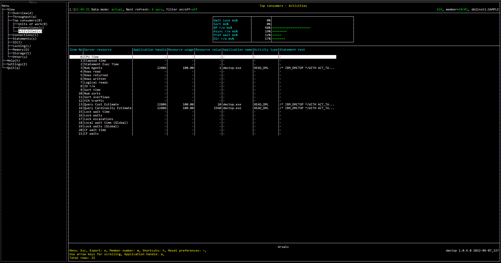

# Purpose

Activities view shows the user which activities consume the most resources.  Activities are generally queries, but long running DDL and LOAD activities are also included here.

# Screenshot

# Metric shown

## Gauge

Following is the variable used as denominator in this section:

TOTAL_TIME = [MON_GET_DATABASE](https://www.ibm.com/docs/en/db2/11.5?topic=functions-mon-get-database-get-database-metrics)(#MEMBER#).SUM([LOCK_WAIT_TIME](https://www.ibm.com/docs/en/db2/11.5?topic=reference-l#r0001294) + [TOTAL_SECTION_SORT_TIME](https://www.ibm.com/docs/en/db2/11.5?topic=reference-t#r0054154) + [POOL_READ_TIME](https://www.ibm.com/docs/en/db2/11.5?topic=reference-p#r0001241) + [POOL_WRITE_TIME](https://www.ibm.com/docs/en/db2/11.5?topic=reference-p#r0001242) + [POOL_ASYNC_READ_TIME](https://www.ibm.com/docs/en/db2/11.5?topic=reference-p#r0001248) + [POOL_ASYNC_WRITE_TIME](https://www.ibm.com/docs/en/db2/11.5?topic=reference-p#r0001249) + [PREFETCH_WAIT_TIME](https://www.ibm.com/docs/en/db2/11.5?topic=reference-p#r0001255) + [DIRECT_READ_TIME](https://www.ibm.com/docs/en/db2/11.5?topic=reference-d#r0001264) + [DIRECT_WRITE_TIME](https://www.ibm.com/docs/en/db2/11.5?topic=reference-d#r0001265))

### Wait lock ms%

The percentage of time spent waiting for locks.

= LOCK_WAIT_TIME / TOTAL_TIME 

**Source:** 

LOCK_WAIT_TIME = [MON_GET_DATABASE](https://www.ibm.com/docs/en/db2/11.5?topic=functions-mon-get-database-get-database-metrics)(#MEMBER#).SUM([LOCK_WAIT_TIME](https://www.ibm.com/docs/en/db2/11.5?topic=reference-l#r0001294))

### Sort ms%

The percentage of time spent performing sorts while executing a section, which is the execution of the compiled query plan generated by the SQL statement that was issued by the client application.

= TOTAL_SECTION_SORT_TIME / TOTAL_TIME 

**Source:** 

TOTAL_SECTION_SORT_TIME = [MON_GET_DATABASE](https://www.ibm.com/docs/en/db2/11.5?topic=functions-mon-get-database-get-database-metrics)(#MEMBER#).SUM([TOTAL_SECTION_SORT_TIME](https://www.ibm.com/docs/en/db2/11.5?topic=reference-t#r0054154))

### BP r/w ms%

The percentage of time spent reading and writing in data and index pages from the table space containers (physical) for all types of table spaces. 

= BP_IO_TIME / TOTAL_TIME 

**Source:** 

BP_IO_TIME = [MON_GET_DATABASE](https://www.ibm.com/docs/en/db2/11.5?topic=functions-mon-get-database-get-database-metrics)(#MEMBER#).SUM([POOL_READ_TIME](https://www.ibm.com/docs/en/db2/11.5?topic=reference-p#r0001241) + [POOL_WRITE_TIME](https://www.ibm.com/docs/en/db2/11.5?topic=reference-p#r0001242))

### Async r/w ms%

The percentage of time for asynchronous writes and reads to complete.

= BP_ASYNC_IO_TIME / TOTAL_TIME 

**Source:** 

BP_ASYNC_IO_TIME = [MON_GET_DATABASE](https://www.ibm.com/docs/en/db2/11.5?topic=functions-mon-get-database-get-database-metrics)(#MEMBER#).SUM([POOL_ASYNC_READ_TIME](https://www.ibm.com/docs/en/db2/11.5?topic=reference-p#r0001248) + [POOL_ASYNC_WRITE_TIME](https://www.ibm.com/docs/en/db2/11.5?topic=reference-p#r0001249))

### Pref wait ms%

The percentage of time an application spent waiting for an I/O server (prefetcher) to finish loading pages into the buffer pool. 

= PREFETCH_WAIT_TIME / TOTAL_TIME 

**Source:** 

PREFETCH_WAIT_TIME = [MON_GET_DATABASE](https://www.ibm.com/docs/en/db2/11.5?topic=functions-mon-get-database-get-database-metrics)(#MEMBER#).SUM([PREFETCH_WAIT_TIME](https://www.ibm.com/docs/en/db2/11.5?topic=reference-p#r0001255))

### Dir r/w ms%

The percentage of time required to perform the direct reads and writes.

= DIRECT_IO_TIME / TOTAL_TIME 

**Source:** 

DIRECT_IO_TIME = [MON_GET_DATABASE](https://www.ibm.com/docs/en/db2/11.5?topic=functions-mon-get-database-get-database-metrics)(#MEMBER#).SUM([DIRECT_READ_TIME](https://www.ibm.com/docs/en/db2/11.5?topic=reference-d#r0001264) + [DIRECT_WRITE_TIME](https://www.ibm.com/docs/en/db2/11.5?topic=reference-d#r0001265))

## Table

### 0 CPU Time

The activity with maximum amount of CPU time used while within the database system.

**Source:**  [MON_GET_ACTIVITY](https://www.ibm.com/docs/en/db2/11.5?topic=functions-mon-get-activity-return-list-activities)(NULL, #MEMBER#).SUM([TOTAL_CPU_TIME](https://www.ibm.com/docs/en/db2/11.5?topic=reference-t#r0054057))

### 1 Elapsed time

The activity with maximum elapsed time from the time that this activity began doing work on the member. 

= CURRENT TIMESTAMP - LOCAL_START_TIME

**Source:**  

[CURRENT TIMESTAMP](https://www.ibm.com/docs/en/db2-for-zos/11?topic=registers-current-timestamp)

[MON_GET_ACTIVITY](https://www.ibm.com/docs/en/db2/11.5?topic=functions-mon-get-activity-return-list-activities)(NULL, #MEMBER#).[LOCAL_START_TIME](https://www.ibm.com/docs/en/db2/11.5?topic=reference-l#r0054194)

### 2 Statement Exec Time

The activity with maximum time spent executing the statement.

**Source:** [MON_GET_ACTIVITY](https://www.ibm.com/docs/en/db2/11.5?topic=functions-mon-get-activity-return-list-activities)(NULL, #MEMBER#).SUM([STMT_EXEC_TIME](https://www.ibm.com/docs/en/db2/11.5?topic=reference-s#r0056454))

### 3 Num Agents

The activity with maximum number of concurrent agents currently executing a statement or subsection.

**Source:** [MON_GET_ACTIVITY](https://www.ibm.com/docs/en/db2/11.5?topic=functions-mon-get-activity-return-list-activities)(NULL, #MEMBER#).SUM([NUM_AGENTS](https://www.ibm.com/docs/en/db2/11.5?topic=reference-n#r0001369))

### 4 Rows read

The activity with maximum number of rows read from the table.

**Source:** [MON_GET_ACTIVITY](https://www.ibm.com/docs/en/db2/11.5?topic=functions-mon-get-activity-return-list-activities)(NULL, #MEMBER#).SUM([ROWS_READ](https://www.ibm.com/docs/en/db2/11.5?topic=reference-r#r0001317))

### 5 Rows returned

The activity with maximum number of rows that have been selected and returned to the application.

**Source:** [MON_GET_ACTIVITY](https://www.ibm.com/docs/en/db2/11.5?topic=functions-mon-get-activity-return-list-activities)(NULL, #MEMBER#).SUM([ROWS_RETURNED](https://www.ibm.com/docs/en/db2/11.5?topic=reference-r#r0051569))

### 6 Rows written

The activity with maximum number of rows inserted, updated, or deleted. 

**Source:** [MON_GET_ACTIVITY](https://www.ibm.com/docs/en/db2/11.5?topic=functions-mon-get-activity-return-list-activities)(NULL, #MEMBER#).SUM([ROWS_MODIFIED](https://www.ibm.com/docs/en/db2/11.5?topic=reference-r#r0051568))

### 7 Logical reads

The activity with maximum number of pages which have been requested from the buffer pool (logical).

**Source:** [MON_GET_ACTIVITY](https://www.ibm.com/docs/en/db2/11.5?topic=functions-mon-get-activity-return-list-activities)(NULL, #MEMBER#).SUM([POOL_DATA_L_READS](https://www.ibm.com/docs/en/db2/11.5?topic=reference-p#r0001235) + [POOL_TEMP_DATA_L_READS](https://www.ibm.com/docs/en/db2/11.5?topic=reference-p#r0011302) + [POOL_XDA_L_READS](https://www.ibm.com/docs/en/db2/11.5?topic=reference-p#r0022731) + [POOL_TEMP_XDA_L_READS](https://www.ibm.com/docs/en/db2/11.5?topic=reference-p#r0022738) + [POOL_INDEX_L_READS](https://www.ibm.com/docs/en/db2/11.5?topic=reference-p#r0001238) + [POOL_TEMP_INDEX_L_READS](https://www.ibm.com/docs/en/db2/11.5?topic=reference-p#r0011303) + [POOL_COL_L_READS](https://www.ibm.com/docs/en/db2/11.5?topic=reference-p#r0060763) + [POOL_TEMP_COL_L_READS](https://www.ibm.com/docs/en/db2/11.5?topic=reference-p#r0060873))

### 8 IO r/w

The activity with maximum number of pages which have been requested from the buffer pool (logical) or been written to disk.

**Source:** [MON_GET_ACTIVITY](https://www.ibm.com/docs/en/db2/11.5?topic=functions-mon-get-activity-return-list-activities)(NULL, #MEMBER#).SUM([POOL_DATA_L_READS](https://www.ibm.com/docs/en/db2/11.5?topic=reference-p#r0001235) + [POOL_TEMP_DATA_L_READS](https://www.ibm.com/docs/en/db2/11.5?topic=reference-p#r0011302) + [POOL_XDA_L_READS](https://www.ibm.com/docs/en/db2/11.5?topic=reference-p#r0022731) + [POOL_TEMP_XDA_L_READS](https://www.ibm.com/docs/en/db2/11.5?topic=reference-p#r0022738) + [POOL_INDEX_L_READS](https://www.ibm.com/docs/en/db2/11.5?topic=reference-p#r0001238) + [POOL_TEMP_INDEX_L_READS](https://www.ibm.com/docs/en/db2/11.5?topic=reference-p#r0011303) + [POOL_COL_L_READS](https://www.ibm.com/docs/en/db2/11.5?topic=reference-p#r0060763) + [POOL_TEMP_COL_L_READS](https://www.ibm.com/docs/en/db2/11.5?topic=reference-p#r0060873) + [POOL_DATA_WRITES](https://www.ibm.com/docs/en/db2/11.5?topic=reference-p#r0001237) + [POOL_INDEX_WRITES](https://www.ibm.com/docs/en/db2/11.5?topic=reference-p#r0001240) + [POOL_XDA_WRITES](https://www.ibm.com/docs/en/db2/11.5?topic=reference-p#r0022732) + [POOL_COL_WRITES](https://www.ibm.com/docs/en/db2/11.5?topic=reference-p#r0060859))

### 9 Sort time

The activity with maximum amount of time spent performing sorts while executing a section.

**Source:** [MON_GET_ACTIVITY](https://www.ibm.com/docs/en/db2/11.5?topic=functions-mon-get-activity-return-list-activities)(NULL, #MEMBER#).SUM([TOTAL_SECTION_SORT_TIME](https://www.ibm.com/docs/en/db2/11.5?topic=reference-t#r0054154))

### 10 Num sorts

The activity with maximum number of sorts that have been executed.

**Source:** [MON_GET_ACTIVITY](https://www.ibm.com/docs/en/db2/11.5?topic=functions-mon-get-activity-return-list-activities)(NULL, #MEMBER#).SUM([TOTAL_SORTS](https://www.ibm.com/docs/en/db2/11.5?topic=reference-t#r0001219))

### 11 Sort overflows

The activity with maximum number of sorts that ran out of sort heap and may have required disk space for temporary storage.

**Source:** [MON_GET_ACTIVITY](https://www.ibm.com/docs/en/db2/11.5?topic=functions-mon-get-activity-return-list-activities)(NULL, #MEMBER#).SUM([SORT_OVERFLOWS](https://www.ibm.com/docs/en/db2/11.5?topic=reference-s#r0001221))

### 12 FCM traffic

The activity with maximum amount of data received via or distributed by the FCM communications layer.

**Source:** [MON_GET_ACTIVITY](https://www.ibm.com/docs/en/db2/11.5?topic=functions-mon-get-activity-return-list-activities)(NULL, #MEMBER#).SUM([FCM_SEND_VOLUME](https://www.ibm.com/docs/en/db2/11.5?topic=reference-f#r0054029) + [FCM_RECV_VOLUME](https://www.ibm.com/docs/en/db2/11.5?topic=reference-f#r0054026))

### 13 Query Cost Estimate

The activity with maximum estimated cost for a query.

**Source:** [MON_GET_ACTIVITY](https://www.ibm.com/docs/en/db2/11.5?topic=functions-mon-get-activity-return-list-activities)(NULL, #MEMBER#).MAX([QUERY_COST_ESTIMATE](https://www.ibm.com/docs/en/db2/11.5?topic=reference-q#r0001357))

### 14 Query Cardinality Estimate

The activity with maximum estimated number of rows that will be returned by a query.

**Source:** [MON_GET_ACTIVITY](https://www.ibm.com/docs/en/db2/11.5?topic=functions-mon-get-activity-return-list-activities)(NULL, #MEMBER#).MAX([QUERY_CARD_ESTIMATE](https://www.ibm.com/docs/en/db2/11.5?topic=reference-q#r0001356))

### 15 Lock wait time

The activity with maximum elapsed time spent waiting for locks. 

**Source:** [MON_GET_ACTIVITY](https://www.ibm.com/docs/en/db2/11.5?topic=functions-mon-get-activity-return-list-activities)(NULL, #MEMBER#).SUM([LOCK_WAIT_TIME](https://www.ibm.com/docs/en/db2/11.5?topic=reference-l#r0001294))

### 16 Lock waits

The activity with maximum number of times that applications or connections waited for locks.

**Source:** [MON_GET_ACTIVITY](https://www.ibm.com/docs/en/db2/11.5?topic=functions-mon-get-activity-return-list-activities)(NULL, #MEMBER#).SUM([LOCK_WAITS](https://www.ibm.com/docs/en/db2/11.5?topic=reference-l#r0001293))

### 17 Lock escalations

The activity with maximum number of times that locks have been escalated from several row locks to a table lock.

**Source:** [MON_GET_ACTIVITY](https://www.ibm.com/docs/en/db2/11.5?topic=functions-mon-get-activity-return-list-activities)(NULL, #MEMBER#).SUM([LOCK_ESCALS](https://www.ibm.com/docs/en/db2/11.5?topic=reference-l#r0001284))

### 18 Local wait time (Global)

The activity with maximum time spent on global lock waits.

**Source:** [MON_GET_ACTIVITY](https://www.ibm.com/docs/en/db2/11.5?topic=functions-mon-get-activity-return-list-activities)(NULL, #MEMBER#).SUM([LOCK_WAIT_TIME_GLOBAL](https://www.ibm.com/docs/en/db2/11.5?topic=reference-l#r0056234))

### 19 Lock waits (Global)

The activity with maximum number of lock waits due to the application holding the lock being on a remote member.

**Source:** [MON_GET_ACTIVITY](https://www.ibm.com/docs/en/db2/11.5?topic=functions-mon-get-activity-return-list-activities)(NULL, #MEMBER#).SUM([LOCK_WAITS_GLOBAL](https://www.ibm.com/docs/en/db2/11.5?topic=reference-l#r0056233))

### 20 CF wait time

The activity with maximum amount of time spent communicating with the cluster caching facility. 

**Source:** [MON_GET_ACTIVITY](https://www.ibm.com/docs/en/db2/11.5?topic=functions-mon-get-activity-return-list-activities)(NULL, #MEMBER#).SUM([CF_WAIT_TIME](https://www.ibm.com/docs/en/db2/11.5?topic=reference-c#r0056240))

### 21 CF waits

The activity with maximum number of times that the database system waited while it communicated with a cluster caching facility.

**Source:** [MON_GET_ACTIVITY](https://www.ibm.com/docs/en/db2/11.5?topic=functions-mon-get-activity-return-list-activities)(NULL, #MEMBER#).SUM([CF_WAITS](https://www.ibm.com/docs/en/db2/11.5?topic=reference-c#r0056239))

### Application handle

A system-wide unique ID for the application. 

**Source:** [MON_GET_ACTIVITY](https://www.ibm.com/docs/en/db2/11.5?topic=functions-mon-get-activity-return-list-activities)(NULL, #MEMBER#).[APPLICATION_HANDLE](https://www.ibm.com/docs/en/db2/11.5?topic=reference-#r0054410)

### Resource usage

The percentage of application resource usage.

### Resource value

The corresponding resource value.

### Application name

The name of the application running at the client, as known to the database or Db2 Connect server.

**Source:** [MON_GET_CONNECTION](https://www.ibm.com/docs/en/db2/11.5?topic=functions-mon-get-connection-get-connection-metrics).[APPLICATION_NAME](https://www.ibm.com/docs/en/db2/11.5?topic=reference-#r0001165)

### Activity type

The type of the activity.

Possible values are as follows:
* CALL
* DDL
* LOAD
* OTHER
* READ_DML
* WRITE_DML

**Source:** [MON_GET_ACTIVITY](https://www.ibm.com/docs/en/db2/11.5?topic=functions-mon-get-activity-return-list-activities)(NULL, #MEMBER#).[ACTIVITY_TYPE](https://www.ibm.com/docs/en/db2/11.5?topic=reference-#r0051834)

### Statement text 

The first 30 characters of the SQL statement of activity.

**Source:** [MON_GET_ACTIVITY](https://www.ibm.com/docs/en/db2/11.5?topic=functions-mon-get-activity-return-list-activities)(NULL, #MEMBER#).[STMT_TEXT](https://www.ibm.com/docs/en/db2/11.5?topic=reference-s#r0001352)

