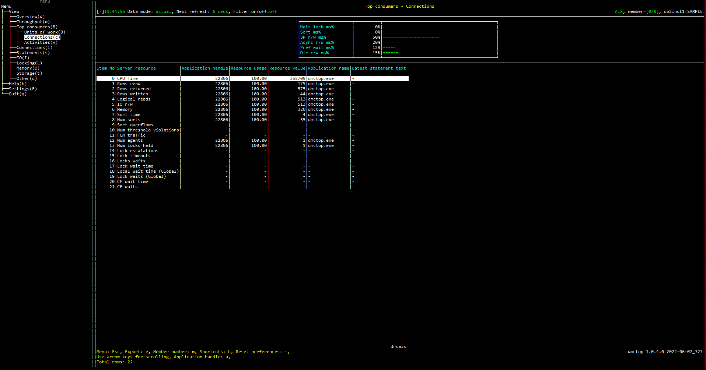

# Purpose

Find the connections (sessions) that have consumed the most resources over their lifetime.  This view is helpful for diagnosing problems where large numbers of small activities in aggregate are consuming excessive resources.  A common scenario of this type is applications loading data one row at a time using singleton inserts.  This can be very disruptive but each individual insert is tiny and so is the singleton transaction associated with it.  This view will highlight connections engaged in these sort of activities.

Note that this overlaps somewhat in functionality with the [Sessions (connections)](/Sessions/connections) view.  If you go to the connections view, in counter mode, you could select various columns one at a time and sort by them to find the connections that have consumed the most CPU, read the most rows, etc.  This view provides a convenient way to get similar information in one step.

# Screenshot

# Metric shown

## Gauge

Following is the variable used as denominator in this section:

TOTAL_TIME = [MON_GET_DATABASE](https://www.ibm.com/docs/en/db2/11.5?topic=functions-mon-get-database-get-database-metrics)(#MEMBER#).SUM([LOCK_WAIT_TIME](https://www.ibm.com/docs/en/db2/11.5?topic=reference-l#r0001294) + [TOTAL_SECTION_SORT_TIME](https://www.ibm.com/docs/en/db2/11.5?topic=reference-t#r0054154) + [POOL_READ_TIME](https://www.ibm.com/docs/en/db2/11.5?topic=reference-p#r0001241) + [POOL_WRITE_TIME](https://www.ibm.com/docs/en/db2/11.5?topic=reference-p#r0001242) + [POOL_ASYNC_READ_TIME](https://www.ibm.com/docs/en/db2/11.5?topic=reference-p#r0001248) + [POOL_ASYNC_WRITE_TIME](https://www.ibm.com/docs/en/db2/11.5?topic=reference-p#r0001249) + [PREFETCH_WAIT_TIME](https://www.ibm.com/docs/en/db2/11.5?topic=reference-p#r0001255) + [DIRECT_READ_TIME](https://www.ibm.com/docs/en/db2/11.5?topic=reference-d#r0001264) + [DIRECT_WRITE_TIME](https://www.ibm.com/docs/en/db2/11.5?topic=reference-d#r0001265))

### Wait lock ms%

The percentage of time spent waiting for locks.

= LOCK_WAIT_TIME / TOTAL_TIME 

**Source:** 

LOCK_WAIT_TIME = [MON_GET_DATABASE](https://www.ibm.com/docs/en/db2/11.5?topic=functions-mon-get-database-get-database-metrics)(#MEMBER#).SUM([LOCK_WAIT_TIME](https://www.ibm.com/docs/en/db2/11.5?topic=reference-l#r0001294))

### Sort ms%

The percentage of time spent performing sorts while executing a section, which is the execution of the compiled query plan generated by the SQL statement that was issued by the client application.

= TOTAL_SECTION_SORT_TIME / TOTAL_TIME 

**Source:** 

TOTAL_SECTION_SORT_TIME = [MON_GET_DATABASE](https://www.ibm.com/docs/en/db2/11.5?topic=functions-mon-get-database-get-database-metrics)(#MEMBER#).SUM([TOTAL_SECTION_SORT_TIME](https://www.ibm.com/docs/en/db2/11.5?topic=reference-t#r0054154))

### BP r/w ms%

The percentage of time spent reading and writing in data and index pages from the table space containers (physical) for all types of table spaces. 

= BP_IO_TIME / TOTAL_TIME 

**Source:** 

BP_IO_TIME = [MON_GET_DATABASE](https://www.ibm.com/docs/en/db2/11.5?topic=functions-mon-get-database-get-database-metrics)(#MEMBER#).SUM([POOL_READ_TIME](https://www.ibm.com/docs/en/db2/11.5?topic=reference-p#r0001241) + [POOL_WRITE_TIME](https://www.ibm.com/docs/en/db2/11.5?topic=reference-p#r0001242))

### Async r/w ms%

The percentage of time for asynchronous writes and reads to complete.

= BP_ASYNC_IO_TIME / TOTAL_TIME 

**Source:** 

BP_ASYNC_IO_TIME = [MON_GET_DATABASE](https://www.ibm.com/docs/en/db2/11.5?topic=functions-mon-get-database-get-database-metrics)(#MEMBER#).SUM([POOL_ASYNC_READ_TIME](https://www.ibm.com/docs/en/db2/11.5?topic=reference-p#r0001248) + [POOL_ASYNC_WRITE_TIME](https://www.ibm.com/docs/en/db2/11.5?topic=reference-p#r0001249))

### Pref wait ms%

The percentage of time an application spent waiting for an I/O server (prefetcher) to finish loading pages into the buffer pool. 

= PREFETCH_WAIT_TIME / TOTAL_TIME 

**Source:** 

PREFETCH_WAIT_TIME = [MON_GET_DATABASE](https://www.ibm.com/docs/en/db2/11.5?topic=functions-mon-get-database-get-database-metrics)(#MEMBER#).SUM([PREFETCH_WAIT_TIME](https://www.ibm.com/docs/en/db2/11.5?topic=reference-p#r0001255))

### Dir r/w ms%

The percentage of time required to perform the direct reads and writes.

= DIRECT_IO_TIME / TOTAL_TIME 

**Source:** 

DIRECT_IO_TIME = [MON_GET_DATABASE](https://www.ibm.com/docs/en/db2/11.5?topic=functions-mon-get-database-get-database-metrics)(#MEMBER#).SUM([DIRECT_READ_TIME](https://www.ibm.com/docs/en/db2/11.5?topic=reference-d#r0001264) + [DIRECT_WRITE_TIME](https://www.ibm.com/docs/en/db2/11.5?topic=reference-d#r0001265))

## Table

### 0 CPU Time

The connection with maximum amount of CPU time used while within the database system.

**Source:** [MON_GET_CONNECTION](https://www.ibm.com/docs/en/db2/11.5?topic=functions-mon-get-connection-get-connection-metrics)(NULL, #MEMBER#).SUM([TOTAL_CPU_TIME](https://www.ibm.com/docs/en/db2/11.5?topic=reference-t#r0054057))

### 1 Rows read

The connection with maximum number of rows read from the table.

**Source:** [MON_GET_CONNECTION](https://www.ibm.com/docs/en/db2/11.5?topic=functions-mon-get-connection-get-connection-metrics)(NULL, #MEMBER#).SUM([ROWS_READ](https://www.ibm.com/docs/en/db2/11.5?topic=reference-r#r0001317))

### 2 Rows returned

The connection with maximum number of rows that have been selected and returned to the application.

**Source:** [MON_GET_CONNECTION](https://www.ibm.com/docs/en/db2/11.5?topic=functions-mon-get-connection-get-connection-metrics)(NULL, #MEMBER#).SUM([ROWS_RETURNED](https://www.ibm.com/docs/en/db2/11.5?topic=reference-r#r0051569))

### 3 Rows written

The connection with maximum number of rows inserted, updated, or deleted. 

**Source:** [MON_GET_CONNECTION](https://www.ibm.com/docs/en/db2/11.5?topic=functions-mon-get-connection-get-connection-metrics)(NULL, #MEMBER#).SUM([ROWS_MODIFIED](https://www.ibm.com/docs/en/db2/11.5?topic=reference-r#r0051568))

### 4 Logical reads

The connection with maximum number of pages which have been requested from the buffer pool (logical).

**Source:** [MON_GET_CONNECTION](https://www.ibm.com/docs/en/db2/11.5?topic=functions-mon-get-connection-get-connection-metrics)(NULL, #MEMBER#).SUM([POOL_DATA_L_READS](https://www.ibm.com/docs/en/db2/11.5?topic=reference-p#r0001235) + [POOL_TEMP_DATA_L_READS](https://www.ibm.com/docs/en/db2/11.5?topic=reference-p#r0011302) + [POOL_XDA_L_READS](https://www.ibm.com/docs/en/db2/11.5?topic=reference-p#r0022731) + [POOL_TEMP_XDA_L_READS](https://www.ibm.com/docs/en/db2/11.5?topic=reference-p#r0022738) + [POOL_INDEX_L_READS](https://www.ibm.com/docs/en/db2/11.5?topic=reference-p#r0001238) + [POOL_TEMP_INDEX_L_READS](https://www.ibm.com/docs/en/db2/11.5?topic=reference-p#r0011303) + [POOL_COL_L_READS](https://www.ibm.com/docs/en/db2/11.5?topic=reference-p#r0060763) + [POOL_TEMP_COL_L_READS](https://www.ibm.com/docs/en/db2/11.5?topic=reference-p#r0060873))

### 5 IO r/w

The connection with maximum number of pages which have been requested from the buffer pool (logical) or been written to disk.

**Source:** [MON_GET_CONNECTION](https://www.ibm.com/docs/en/db2/11.5?topic=functions-mon-get-connection-get-connection-metrics)(NULL, #MEMBER#).SUM([POOL_DATA_L_READS](https://www.ibm.com/docs/en/db2/11.5?topic=reference-p#r0001235) + [POOL_TEMP_DATA_L_READS](https://www.ibm.com/docs/en/db2/11.5?topic=reference-p#r0011302) + [POOL_XDA_L_READS](https://www.ibm.com/docs/en/db2/11.5?topic=reference-p#r0022731) + [POOL_TEMP_XDA_L_READS](https://www.ibm.com/docs/en/db2/11.5?topic=reference-p#r0022738) + [POOL_INDEX_L_READS](https://www.ibm.com/docs/en/db2/11.5?topic=reference-p#r0001238) + [POOL_TEMP_INDEX_L_READS](https://www.ibm.com/docs/en/db2/11.5?topic=reference-p#r0011303) + [POOL_COL_L_READS](https://www.ibm.com/docs/en/db2/11.5?topic=reference-p#r0060763) + [POOL_TEMP_COL_L_READS](https://www.ibm.com/docs/en/db2/11.5?topic=reference-p#r0060873) + [POOL_DATA_WRITES](https://www.ibm.com/docs/en/db2/11.5?topic=reference-p#r0001237) + [POOL_INDEX_WRITES](https://www.ibm.com/docs/en/db2/11.5?topic=reference-p#r0001240) + [POOL_XDA_WRITES](https://www.ibm.com/docs/en/db2/11.5?topic=reference-p#r0022732) + [POOL_COL_WRITES](https://www.ibm.com/docs/en/db2/11.5?topic=reference-p#r0060859))

### 6 Memory

The connection with maximum amount of committed memory in use by this memory pool.

**Source:** [MON_GET_MEMORY_POOL](https://www.ibm.com/docs/en/db2/11.5?topic=mpf-mon-get-memory-pool-get-memory-pool-information)(NULL, [CURRENT_SERVER](https://www.ibm.com/docs/en/db2-for-zos/11?topic=registers-current-server), #MEMBER#).SUM([MEMORY_POOL_USED](https://www.ibm.com/docs/en/db2/11.5?topic=reference-m#r0059534))

### 7 Sort time

The connection with maximum amount of time spent performing sorts while executing a section.

**Source:** [MON_GET_CONNECTION](https://www.ibm.com/docs/en/db2/11.5?topic=functions-mon-get-connection-get-connection-metrics)(NULL, #MEMBER#).SUM([TOTAL_SECTION_SORT_TIME](https://www.ibm.com/docs/en/db2/11.5?topic=reference-t#r0054154))

### 8 Num sorts

The connection with maximum number of sorts that have been executed.

**Source:** [MON_GET_CONNECTION](https://www.ibm.com/docs/en/db2/11.5?topic=functions-mon-get-connection-get-connection-metrics)(NULL, #MEMBER#).SUM([TOTAL_SORTS](https://www.ibm.com/docs/en/db2/11.5?topic=reference-t#r0001219))

### 9 Sort overflows

The connection with maximum number of sorts that ran out of sort heap and may have required disk space for temporary storage.

**Source:** [MON_GET_CONNECTION](https://www.ibm.com/docs/en/db2/11.5?topic=functions-mon-get-connection-get-connection-metrics)(NULL, #MEMBER#).SUM([SORT_OVERFLOWS](https://www.ibm.com/docs/en/db2/11.5?topic=reference-s#r0001221))

### 10 Num threshold violations

The connection with maximum number of times a threshold was violated. 

**Source:** [MON_GET_CONNECTION](https://www.ibm.com/docs/en/db2/11.5?topic=functions-mon-get-connection-get-connection-metrics)(NULL, #MEMBER#).SUM([THRESH_VIOLATIONS](https://www.ibm.com/docs/en/db2/11.5?topic=reference-t#r0056501))

### 11 FCM traffic

The connection with maximum amount of data received via or distributed by the FCM communications layer.

**Source:** [MON_GET_CONNECTION](https://www.ibm.com/docs/en/db2/11.5?topic=functions-mon-get-connection-get-connection-metrics)(NULL, #MEMBER#).SUM([FCM_SEND_VOLUME](https://www.ibm.com/docs/en/db2/11.5?topic=reference-f#r0054029) + [FCM_RECV_VOLUME](https://www.ibm.com/docs/en/db2/11.5?topic=reference-f#r0054026))

### 12 Num agents

The connection with maximum number of subagents associated with an application.

**Source:** [MON_GET_CONNECTION](https://www.ibm.com/docs/en/db2/11.5?topic=functions-mon-get-connection-get-connection-metrics)(NULL, #MEMBER#).SUM([NUM_ASSOC_AGENTS](https://www.ibm.com/docs/en/db2/11.5?topic=reference-n#r0002523))

### 13 Num locks held

The connection with maximum number of locks currently held.

**Source:** [MON_GET_CONNECTION](https://www.ibm.com/docs/en/db2/11.5?topic=functions-mon-get-connection-get-connection-metrics)(NULL, #MEMBER#).SUM([NUM_LOCKS_HELD](https://www.ibm.com/docs/en/db2/11.5?topic=reference-l#r0001281))

### 14 Lock escalations

The connection with maximum number of times that locks have been escalated from several row locks to a table lock.

**Source:** [MON_GET_CONNECTION](https://www.ibm.com/docs/en/db2/11.5?topic=functions-mon-get-connection-get-connection-metrics)(NULL, #MEMBER#).SUM([LOCK_ESCALS](https://www.ibm.com/docs/en/db2/11.5?topic=reference-l#r0001284))

### 15 Lock timeouts

The connection with maximum number of times that a request to lock an object timed out instead of being granted.

**Source:** [MON_GET_CONNECTION](https://www.ibm.com/docs/en/db2/11.5?topic=functions-mon-get-connection-get-connection-metrics)(NULL, #MEMBER#).SUM([LOCK_TIMEOUTS](https://www.ibm.com/docs/en/db2/11.5?topic=reference-l#r0001290))

### 16 Locks waits

The connection with maximum number of times that applications or connections waited for locks.

**Source:** [MON_GET_CONNECTION](https://www.ibm.com/docs/en/db2/11.5?topic=functions-mon-get-connection-get-connection-metrics)(NULL, #MEMBER#).SUM([LOCK_WAITS](https://www.ibm.com/docs/en/db2/11.5?topic=reference-l#r0001293))

### 17 Lock wait time

The connection with maximum elapsed time spent waiting for locks. 

**Source:** [MON_GET_CONNECTION](https://www.ibm.com/docs/en/db2/11.5?topic=functions-mon-get-connection-get-connection-metrics)(NULL, #MEMBER#).SUM([LOCK_WAIT_TIME](https://www.ibm.com/docs/en/db2/11.5?topic=reference-l#r0001294))

### 18 Local wait time (Global)

The connection with maximum time spent on global lock waits.

**Source:** [MON_GET_CONNECTION](https://www.ibm.com/docs/en/db2/11.5?topic=functions-mon-get-connection-get-connection-metrics)(NULL, #MEMBER#).SUM([LOCK_WAIT_TIME_GLOBAL](https://www.ibm.com/docs/en/db2/11.5?topic=reference-l#r0056234))

### 19 Lock waits (Global)

The connection with maximum number of lock waits due to the application holding the lock being on a remote member.

**Source:** [MON_GET_CONNECTION](https://www.ibm.com/docs/en/db2/11.5?topic=functions-mon-get-connection-get-connection-metrics)(NULL, #MEMBER#).SUM([LOCK_WAITS_GLOBAL](https://www.ibm.com/docs/en/db2/11.5?topic=reference-l#r0056233))

### 20 CF wait time

The connection with maximum amount of time spent communicating with the cluster caching facility. 

**Source:** [MON_GET_CONNECTION](https://www.ibm.com/docs/en/db2/11.5?topic=functions-mon-get-connection-get-connection-metrics)(NULL, #MEMBER#).SUM([CF_WAIT_TIME](https://www.ibm.com/docs/en/db2/11.5?topic=reference-c#r0056240))

### 21 CF waits 

The connection with maximum number of times that the database system waited while it communicated with a cluster caching facility.

**Source:** [MON_GET_CONNECTION](https://www.ibm.com/docs/en/db2/11.5?topic=functions-mon-get-connection-get-connection-metrics)(NULL, #MEMBER#).SUM([CF_WAITS](https://www.ibm.com/docs/en/db2/11.5?topic=reference-c#r0056239))

### Application handle

A system-wide unique ID for the application. 

**Source:** [MON_GET_CONNECTION](https://www.ibm.com/docs/en/db2/11.5?topic=functions-mon-get-connection-get-connection-metrics)(NULL, #MEMBER#).[APPLICATION_HANDLE](https://www.ibm.com/docs/en/db2/11.5?topic=reference-#r0054410)

### Resource usage

The percentage of application resource usage.

### Resource value

The corresponding resource value.

### Application name

The name of the application running at the client, as known to the database or Db2 Connect server.

**Source:** [MON_GET_CONNECTION](https://www.ibm.com/docs/en/db2/11.5?topic=functions-mon-get-connection-get-connection-metrics).[APPLICATION_NAME](https://www.ibm.com/docs/en/db2/11.5?topic=reference-#r0001165)

### Latest statement text

`-`

