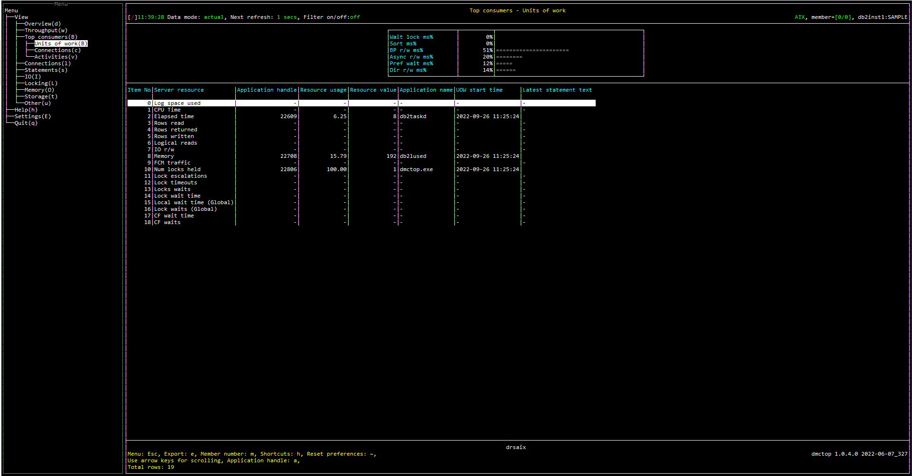

# Purpose

Units of work view shows the user which units of work are consuming the most resources.  There are some important scenarios that can be difficult to detect unless you look at metrics on transactions.

**Transaction left open**

If an application starts a transaction, does some work, and then never commits or rolls back, it will pin the log file where it started.  Backup will be unable to free the log file, and depending on how the database is configured a number of bad things can happen, such as filling all available disk space with new log files.

**Transaction holding excessive locks**

Applications that acquire many locks in a single transaction and are slow to release them impact other work in the database.

# Screenshot

# Metric shown

## Gauge

Following is the variable used as denominator in this section:

TOTAL_TIME = [MON_GET_DATABASE](https://www.ibm.com/docs/en/db2/11.5?topic=functions-mon-get-database-get-database-metrics)(#MEMBER#).SUM([LOCK_WAIT_TIME](https://www.ibm.com/docs/en/db2/11.5?topic=reference-l#r0001294) + [TOTAL_SECTION_SORT_TIME](https://www.ibm.com/docs/en/db2/11.5?topic=reference-t#r0054154) + [POOL_READ_TIME](https://www.ibm.com/docs/en/db2/11.5?topic=reference-p#r0001241) + [POOL_WRITE_TIME](https://www.ibm.com/docs/en/db2/11.5?topic=reference-p#r0001242) + [POOL_ASYNC_READ_TIME](https://www.ibm.com/docs/en/db2/11.5?topic=reference-p#r0001248) + [POOL_ASYNC_WRITE_TIME](https://www.ibm.com/docs/en/db2/11.5?topic=reference-p#r0001249) + [PREFETCH_WAIT_TIME](https://www.ibm.com/docs/en/db2/11.5?topic=reference-p#r0001255) + [DIRECT_READ_TIME](https://www.ibm.com/docs/en/db2/11.5?topic=reference-d#r0001264) + [DIRECT_WRITE_TIME](https://www.ibm.com/docs/en/db2/11.5?topic=reference-d#r0001265))

### Wait lock ms%

The percentage of time spent waiting for locks.

= LOCK_WAIT_TIME / TOTAL_TIME 

**Source:** 

LOCK_WAIT_TIME = [MON_GET_DATABASE](https://www.ibm.com/docs/en/db2/11.5?topic=functions-mon-get-database-get-database-metrics)(#MEMBER#).SUM([LOCK_WAIT_TIME](https://www.ibm.com/docs/en/db2/11.5?topic=reference-l#r0001294))

### Sort ms%

The percentage of time spent performing sorts while executing a section, which is the execution of the compiled query plan generated by the SQL statement that was issued by the client application.

= TOTAL_SECTION_SORT_TIME / TOTAL_TIME 

**Source:** 

TOTAL_SECTION_SORT_TIME = [MON_GET_DATABASE](https://www.ibm.com/docs/en/db2/11.5?topic=functions-mon-get-database-get-database-metrics)(#MEMBER#).SUM([TOTAL_SECTION_SORT_TIME](https://www.ibm.com/docs/en/db2/11.5?topic=reference-t#r0054154))

### BP r/w ms%

The percentage of time spent reading and writing in data and index pages from the table space containers (physical) for all types of table spaces. 

= BP_IO_TIME / TOTAL_TIME 

**Source:** 

BP_IO_TIME = [MON_GET_DATABASE](https://www.ibm.com/docs/en/db2/11.5?topic=functions-mon-get-database-get-database-metrics)(#MEMBER#).SUM([POOL_READ_TIME](https://www.ibm.com/docs/en/db2/11.5?topic=reference-p#r0001241) + [POOL_WRITE_TIME](https://www.ibm.com/docs/en/db2/11.5?topic=reference-p#r0001242))

### Async r/w ms%

The percentage of time for asynchronous writes and reads to complete.

= BP_ASYNC_IO_TIME / TOTAL_TIME 

**Source:** 

BP_ASYNC_IO_TIME = [MON_GET_DATABASE](https://www.ibm.com/docs/en/db2/11.5?topic=functions-mon-get-database-get-database-metrics)(#MEMBER#).SUM([POOL_ASYNC_READ_TIME](https://www.ibm.com/docs/en/db2/11.5?topic=reference-p#r0001248) + [POOL_ASYNC_WRITE_TIME](https://www.ibm.com/docs/en/db2/11.5?topic=reference-p#r0001249))

### Pref wait ms%

The percentage of time an application spent waiting for an I/O server (prefetcher) to finish loading pages into the buffer pool. 

= PREFETCH_WAIT_TIME / TOTAL_TIME 

**Source:** 

PREFETCH_WAIT_TIME = [MON_GET_DATABASE](https://www.ibm.com/docs/en/db2/11.5?topic=functions-mon-get-database-get-database-metrics)(#MEMBER#).SUM([PREFETCH_WAIT_TIME](https://www.ibm.com/docs/en/db2/11.5?topic=reference-p#r0001255))

### Dir r/w ms%

The percentage of time required to perform the direct reads and writes.

= DIRECT_IO_TIME / TOTAL_TIME 

**Source:** 

DIRECT_IO_TIME = [MON_GET_DATABASE](https://www.ibm.com/docs/en/db2/11.5?topic=functions-mon-get-database-get-database-metrics)(#MEMBER#).SUM([DIRECT_READ_TIME](https://www.ibm.com/docs/en/db2/11.5?topic=reference-d#r0001264) + [DIRECT_WRITE_TIME](https://www.ibm.com/docs/en/db2/11.5?topic=reference-d#r0001265))

## Table

### 0 Log space used

The units of work with max amount of log space used in the current unit of work.

**Source:** [MON_GET_UNIT_OF_WORK](https://www.ibm.com/docs/en/db2/11.5?topic=mpf-mon-get-unit-work-get-unit-work-metrics)(NULL, #MEMBER#, 1).SUM([UOW_LOG_SPACE_USED](https://www.ibm.com/docs/en/db2/11.5?topic=reference-u#r0001280))

### 1 CPU Time

The units of work with maximum amount of CPU time used while within the database system.

**Source:** [MON_GET_UNIT_OF_WORK](https://www.ibm.com/docs/en/db2/11.5?topic=mpf-mon-get-unit-work-get-unit-work-metrics)(NULL, #MEMBER#, 1).SUM([TOTAL_CPU_TIME](https://www.ibm.com/docs/en/db2/11.5?topic=reference-t#r0054057))

### 2 Elapsed time

The units of work with maximum elapsed time from the time it first required database resources.

= CURRENT TIMESTAMP - UOW_START_TIME

**Source:**

[CURRENT TIMESTAMP](https://www.ibm.com/docs/en/db2-for-zos/11?topic=registers-current-timestamp)

[MON_GET_UNIT_OF_WORK](https://www.ibm.com/docs/en/db2/11.5?topic=mpf-mon-get-unit-work-get-unit-work-metrics)(NULL, #MEMBER#, 1).[UOW_START_TIME](https://www.ibm.com/docs/en/db2/11.5?topic=reference-u#r0001189)

### 3 Rows read

The units of work with maximum number of rows read from the table.

**Source:** [MON_GET_UNIT_OF_WORK](https://www.ibm.com/docs/en/db2/11.5?topic=mpf-mon-get-unit-work-get-unit-work-metrics)(NULL, #MEMBER#, 1).SUM([ROWS_READ](https://www.ibm.com/docs/en/db2/11.5?topic=reference-r#r0001317))

### 4 Rows returned

The units of work with maximum number of rows that have been selected and returned to the application.

**Source:** [MON_GET_UNIT_OF_WORK](https://www.ibm.com/docs/en/db2/11.5?topic=mpf-mon-get-unit-work-get-unit-work-metrics)(NULL, #MEMBER#, 1).SUM([ROWS_RETURNED](https://www.ibm.com/docs/en/db2/11.5?topic=reference-r#r0051569))

### 5 Rows written

The units of work with maximum number of rows inserted, updated, or deleted.

**Source:** [MON_GET_UNIT_OF_WORK](https://www.ibm.com/docs/en/db2/11.5?topic=mpf-mon-get-unit-work-get-unit-work-metrics)(NULL, #MEMBER#, 1).SUM([ROWS_MODIFIED](https://www.ibm.com/docs/en/db2/11.5?topic=reference-r#r0051568))

### 6 Logical reads

The units of work with maximum number of pages which have been requested from the buffer pool (logical).

**Source:** [MON_GET_UNIT_OF_WORK](https://www.ibm.com/docs/en/db2/11.5?topic=mpf-mon-get-unit-work-get-unit-work-metrics)(NULL, #MEMBER#, 1).SUM([POOL_DATA_L_READS](https://www.ibm.com/docs/en/db2/11.5?topic=reference-p#r0001235) + [POOL_TEMP_DATA_L_READS](https://www.ibm.com/docs/en/db2/11.5?topic=reference-p#r0011302) + [POOL_XDA_L_READS](https://www.ibm.com/docs/en/db2/11.5?topic=reference-p#r0022731) + [POOL_TEMP_XDA_L_READS](https://www.ibm.com/docs/en/db2/11.5?topic=reference-p#r0022738) + [POOL_INDEX_L_READS](https://www.ibm.com/docs/en/db2/11.5?topic=reference-p#r0001238) + [POOL_TEMP_INDEX_L_READS](https://www.ibm.com/docs/en/db2/11.5?topic=reference-p#r0011303) + [POOL_COL_L_READS](https://www.ibm.com/docs/en/db2/11.5?topic=reference-p#r0060763) + [POOL_TEMP_COL_L_READS](https://www.ibm.com/docs/en/db2/11.5?topic=reference-p#r0060873))

### 7 IO r/w

The units of work with maximum number of pages which have been requested from the buffer pool (logical) or been written to disk.

**Source:** [MON_GET_UNIT_OF_WORK](https://www.ibm.com/docs/en/db2/11.5?topic=mpf-mon-get-unit-work-get-unit-work-metrics)(NULL, #MEMBER#, 1).SUM([POOL_DATA_L_READS](https://www.ibm.com/docs/en/db2/11.5?topic=reference-p#r0001235) + [POOL_TEMP_DATA_L_READS](https://www.ibm.com/docs/en/db2/11.5?topic=reference-p#r0011302) + [POOL_XDA_L_READS](https://www.ibm.com/docs/en/db2/11.5?topic=reference-p#r0022731) + [POOL_TEMP_XDA_L_READS](https://www.ibm.com/docs/en/db2/11.5?topic=reference-p#r0022738) + [POOL_INDEX_L_READS](https://www.ibm.com/docs/en/db2/11.5?topic=reference-p#r0001238) + [POOL_TEMP_INDEX_L_READS](https://www.ibm.com/docs/en/db2/11.5?topic=reference-p#r0011303) + [POOL_COL_L_READS](https://www.ibm.com/docs/en/db2/11.5?topic=reference-p#r0060763) + [POOL_TEMP_COL_L_READS](https://www.ibm.com/docs/en/db2/11.5?topic=reference-p#r0060873) + [POOL_DATA_WRITES](https://www.ibm.com/docs/en/db2/11.5?topic=reference-p#r0001237) + [POOL_INDEX_WRITES](https://www.ibm.com/docs/en/db2/11.5?topic=reference-p#r0001240) + [POOL_XDA_WRITES](https://www.ibm.com/docs/en/db2/11.5?topic=reference-p#r0022732) + [POOL_COL_WRITES](https://www.ibm.com/docs/en/db2/11.5?topic=reference-p#r0060859))

### 8 Memory

The units of work with maximum amount of committed memory in use by this memory pool.

**Source:** [MON_GET_MEMORY_POOL](https://www.ibm.com/docs/en/db2/11.5?topic=mpf-mon-get-memory-pool-get-memory-pool-information)(NULL, [CURRENT_SERVER](https://www.ibm.com/docs/en/db2-for-zos/11?topic=registers-current-server), #MEMBER#).SUM([MEMORY_POOL_USED](https://www.ibm.com/docs/en/db2/11.5?topic=reference-m#r0059534))

### 9 FCM traffic

The units of work with maximum amount of data received via or distributed by the FCM communications layer

**Source:** [MON_GET_UNIT_OF_WORK](https://www.ibm.com/docs/en/db2/11.5?topic=mpf-mon-get-unit-work-get-unit-work-metrics)(NULL, #MEMBER#, 1).SUM([FCM_SEND_VOLUME](https://www.ibm.com/docs/en/db2/11.5?topic=reference-f#r0054029) + [FCM_RECV_VOLUME](https://www.ibm.com/docs/en/db2/11.5?topic=reference-f#r0054026))

### 10 Num locks held

The units of work with maximum number of locks currently held.

**Source:** [MON_GET_UNIT_OF_WORK](https://www.ibm.com/docs/en/db2/11.5?topic=mpf-mon-get-unit-work-get-unit-work-metrics)(NULL, #MEMBER#, 1).SUM([NUM_LOCKS_HELD](https://www.ibm.com/docs/en/db2/11.5?topic=reference-l#r0001281))

### 11 Lock escalations

The units of work with maximum number of times that locks have been escalated from several row locks to a table lock.

**Source:** [MON_GET_UNIT_OF_WORK](https://www.ibm.com/docs/en/db2/11.5?topic=mpf-mon-get-unit-work-get-unit-work-metrics)(NULL, #MEMBER#, 1).SUM([LOCK_ESCALS](https://www.ibm.com/docs/en/db2/11.5?topic=reference-l#r0001284))

### 12 Lock timeouts

The units of work with maximum number of times that a request to lock an object timed out instead of being granted.

**Source:** [MON_GET_UNIT_OF_WORK](https://www.ibm.com/docs/en/db2/11.5?topic=mpf-mon-get-unit-work-get-unit-work-metrics)(NULL, #MEMBER#, 1).SUM([LOCK_TIMEOUTS](https://www.ibm.com/docs/en/db2/11.5?topic=reference-l#r0001290))

### 13 Locks waits

The units of work with maximum number of times that applications or connections waited for locks.

**Source:** [MON_GET_UNIT_OF_WORK](https://www.ibm.com/docs/en/db2/11.5?topic=mpf-mon-get-unit-work-get-unit-work-metrics)(NULL, #MEMBER#, 1).SUM([LOCK_WAITS](https://www.ibm.com/docs/en/db2/11.5?topic=reference-l#r0001293))

### 14 Lock wait time

The units of work with maximum elapsed time spent waiting for locks. 

**Source:** [MON_GET_UNIT_OF_WORK](https://www.ibm.com/docs/en/db2/11.5?topic=mpf-mon-get-unit-work-get-unit-work-metrics)(NULL, #MEMBER#, 1).SUM([LOCK_WAIT_TIME](https://www.ibm.com/docs/en/db2/11.5?topic=reference-l#r0001294))

### 15 Local wait time (Global)

The units of work with maximum time spent on global lock waits.

**Source:** [MON_GET_UNIT_OF_WORK](https://www.ibm.com/docs/en/db2/11.5?topic=mpf-mon-get-unit-work-get-unit-work-metrics)(NULL, #MEMBER#, 1).SUM([LOCK_WAIT_TIME_GLOBAL](https://www.ibm.com/docs/en/db2/11.5?topic=reference-l#r0056234))

### 16 Lock waits (Global)

The units of work with maximum number of lock waits due to the application holding the lock being on a remote member.

**Source:** [MON_GET_UNIT_OF_WORK](https://www.ibm.com/docs/en/db2/11.5?topic=mpf-mon-get-unit-work-get-unit-work-metrics)(NULL, #MEMBER#, 1).SUM([LOCK_WAITS_GLOBAL](https://www.ibm.com/docs/en/db2/11.5?topic=reference-l#r0056233))

### 17 CF wait time

The units of work with maximum amount of time spent communicating with the cluster caching facility. 

**Source:** [MON_GET_UNIT_OF_WORK](https://www.ibm.com/docs/en/db2/11.5?topic=mpf-mon-get-unit-work-get-unit-work-metrics)(NULL, #MEMBER#, 1).SUM([CF_WAIT_TIME](https://www.ibm.com/docs/en/db2/11.5?topic=reference-c#r0056240))

### 18 CF waits

The units of work with maximum number of times that the database system waited while it communicated with a cluster caching facility.

**Source:** [MON_GET_UNIT_OF_WORK](https://www.ibm.com/docs/en/db2/11.5?topic=mpf-mon-get-unit-work-get-unit-work-metrics)(NULL, #MEMBER#, 1).SUM([CF_WAITS](https://www.ibm.com/docs/en/db2/11.5?topic=reference-c#r0056239))

### Application handle

A system-wide unique ID for the application. 

**Source:** [MON_GET_UNIT_OF_WORK](https://www.ibm.com/docs/en/db2/11.5?topic=mpf-mon-get-unit-work-get-unit-work-metrics)(NULL, #MEMBER#, 1).[APPLICATION_HANDLE](https://www.ibm.com/docs/en/db2/11.5?topic=reference-#r0054410)

### Resource usage

The percentage of application resource usage.

### Resource value

The corresponding resource value.

### Application name

The name of the application running at the client, as known to the database or Db2 Connect server.

**Source:** [MON_GET_CONNECTION](https://www.ibm.com/docs/en/db2/11.5?topic=functions-mon-get-connection-get-connection-metrics).[APPLICATION_NAME](https://www.ibm.com/docs/en/db2/11.5?topic=reference-#r0001165)

### UOW start time

The date and time that the unit of work first required database resources.

**Source:** [MON_GET_UNIT_OF_WORK](https://www.ibm.com/docs/en/db2/11.5?topic=mpf-mon-get-unit-work-get-unit-work-metrics)(NULL, #MEMBER#, 1).[UOW_START_TIME](https://www.ibm.com/docs/en/db2/11.5?topic=reference-u#r0001189)

### Latest statement text

NULL

